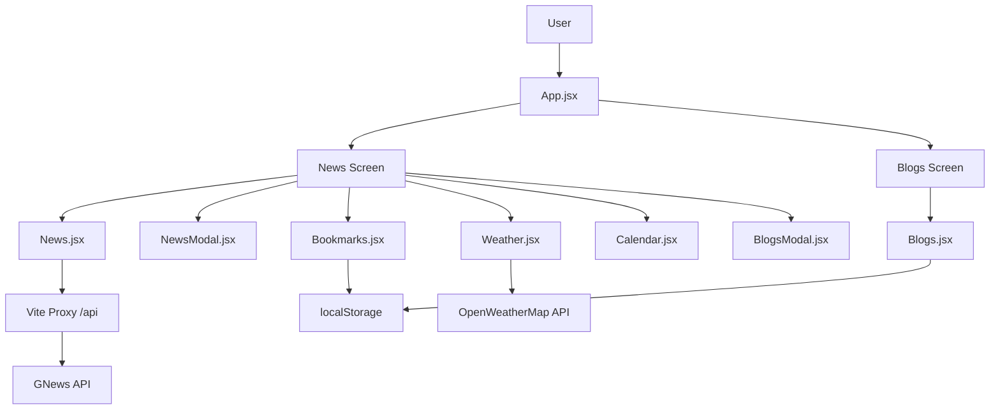

# News & Blogs App


## Professional Overview

News & Blogs App is a polished React-based content dashboard that combines live news discovery, personal blogging, bookmarking, weather lookup, and a calendar widget in a single responsive interface. It is designed as a portfolio-ready frontend project that demonstrates practical API integration, local persistence, modular component design, and user-centric UI state management.

The application uses the GNews API for real-time headlines and category browsing, OpenWeatherMap for weather data, and browser `localStorage` for saved blogs and bookmarks. In development, Vite proxies `/api` requests to the news provider; in production, the project is structured to work with a serverless endpoint for news fetching.

## Key Features

- Live news feed with categories such as general, business, technology, sports, science, and health.
- Search experience for discovering news by keyword.
- Bookmark toggle for saving and revisiting articles.
- Detailed article modal with source, date, content, and external read-more link.
- Personal blog creator with image upload, validation, editing, and deletion.
- Blog persistence through browser `localStorage`.
- Embedded weather panel with location search and condition icons.
- Interactive monthly calendar with current-day highlighting.
- Responsive single-page layout with a clean split-view dashboard.

## Project Architecture

The application follows a simple but effective component-driven architecture:



### How the app is organized

- `App.jsx` controls the top-level navigation between the news dashboard and blog editor.
- `News.jsx` handles news fetching, category switching, search, bookmark management, and modal state.
- `Blogs.jsx` handles blog creation, editing, validation, and image upload.
- Modal components keep content previews isolated and reusable.
- Weather and calendar widgets are rendered alongside the main content to make the dashboard feel complete.

## Tech Stack

| Layer | Technology | Purpose |
| --- | --- | --- |
| Frontend | React 18 | Component-based UI and state management |
| Build Tool | Vite | Fast development server and optimized builds |
| HTTP Client | Axios | API requests |
| Styling | CSS Modules by file + global CSS | Visual design and responsive layout |
| Persistence | localStorage | Saved blogs and bookmarks |
| News API | GNews | Live headlines and search |
| Weather API | OpenWeatherMap | Weather lookup by city |
| Icons | Font Awesome, Boxicons, React Icons | UI icons and visual polish |

## Workflow

1. The user opens the dashboard and lands on the news view.
2. News data is fetched from GNews based on the selected category or search term.
3. Users can open article modals, bookmark stories, or jump into their personal blog area.
4. Blogs are created, edited, and deleted locally in the browser.
5. Bookmarked stories and blog posts are persisted with `localStorage`.
6. Weather and calendar widgets provide utility alongside the content experience.

## Folder Structure

```text
News and Blog App/
├── api/
│   └── news.js
├── src/
│   ├── App.jsx
│   ├── index.css
│   ├── main.jsx
│   ├── assets/
│   │   └── images/
│   └── Components/
│       ├── Blogs.jsx
│       ├── Blogs.css
│       ├── BlogsModal.jsx
│       ├── BlogsModal.css
│       ├── Bookmarks.jsx
│       ├── Bookmarks.css
│       ├── Calendar.jsx
│       ├── Calendar.css
│       ├── Modal.css
│       ├── News.jsx
│       ├── News.css
│       ├── NewsModal.jsx
│       ├── NewsModal.css
│       ├── Weather.jsx
│       └── Weather.css
├── index.html
├── package.json
├── vite.config.js
└── README.md
```

## Installation Guide

### Prerequisites

- Node.js 18 or newer
- npm
- A GNews API key

### Install dependencies

```bash
npm install
```

### Environment setup

Create a `.env` file in the project root:

```env
VITE_GNEWS_API_KEY=your_gnews_api_key
GNEWS_API_KEY=your_gnews_api_key
```

Notes:

- `VITE_GNEWS_API_KEY` is used by the frontend during development.
- `GNEWS_API_KEY` is used by the serverless news route in production deployments.

## Running the Project

### Start the development server

```bash
npm run dev
```

### Create a production build

```bash
npm run build
```

### Preview the production build

```bash
npm run preview
```

### Run lint checks

```bash
npm run lint
```

## API Endpoints

### GNews-backed news route

The project supports a serverless news endpoint that forwards requests to GNews.

| Endpoint | Method | Description |
| --- | --- | --- |
| `/api/news` | GET | Fetches news from GNews in production |

Supported query parameters:

| Query | Example | Purpose |
| --- | --- | --- |
| `endpoint` | `top-headlines` | Selects the GNews route |
| `category` | `technology` | Filters by category |
| `q` | `react` | Searches by keyword |
| `lang` | `en` | Sets the language |

### Development proxy behavior

During local development, Vite proxies `/api` traffic to GNews so the app can request articles without extra backend wiring.

## Screenshots

Screenshots here to showcase the UI for recruiters and hiring managers.

### Main Dashboard


### News Modal


### Blog Editor


## Future Improvements

- Add authentication so users can save blogs and bookmarks per account.
- Move all API keys into environment variables, including the weather provider key.
- Add pagination or infinite scroll for larger news result sets.
- Introduce richer filtering and sorting for saved blogs.
- Persist content to a backend database instead of browser storage.
- Add automated tests for the main content flows.

## Challenges Solved

- Coordinating multiple content experiences inside one dashboard without making the UI feel cluttered.
- Handling news, bookmarks, and blog content with separate states while keeping the navigation intuitive.
- Persisting user-generated content locally so the app remains functional without a backend database.
- Combining third-party APIs with graceful fallbacks for missing images and invalid weather searches.
- Keeping the layout responsive across desktop and smaller screens.

## Learning Outcomes

- Managing cross-screen state in React without overengineering the architecture.
- Integrating external APIs and handling production versus development request paths.
- Using `localStorage` effectively for lightweight persistence.
- Designing reusable modal and content card patterns.
- Building a feature-rich frontend that still feels cohesive and approachable.

## Why This Project Stands Out

- It demonstrates real API integration rather than a static demo.
- It blends utility and storytelling: news consumption, personal publishing, and productivity tools in one product.
- It shows thoughtful frontend engineering through component separation, reusable modals, and persistent user state.
- It looks and behaves like a finished portfolio project rather than a classroom exercise.

## License

This repository does not currently declare an open-source license. 

---

Built with React, Vite, and a focus on practical frontend craftsmanship.
