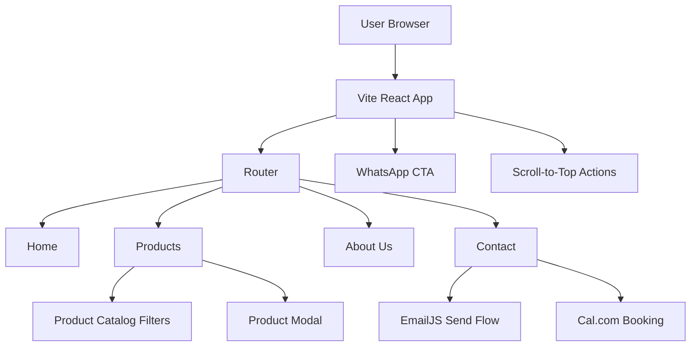
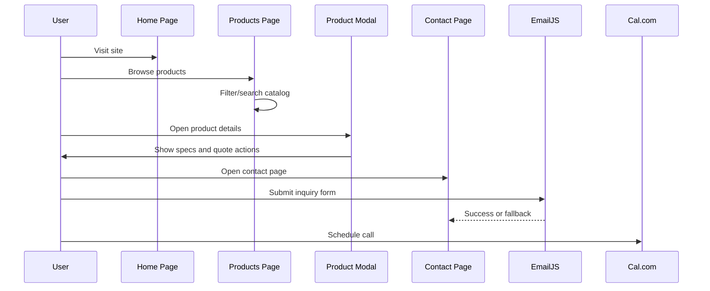

# Purple Bean Agro Website


A polished, responsive, and conversion-focused B2B coffee and chicory brand website built with React and Vite. The experience is designed to present Purple Bean Agro as a premium manufacturing partner for importers, wholesalers, private-label brands, cafes, and distributors.

---

## Professional Project Overview

Purple Bean Agro Website is a modern single-page style multi-route frontend that showcases the brand, product catalog, company story, and contact channels for bulk and partnership inquiries. The application combines a premium visual identity with practical buyer journeys such as product discovery, product filtering, quotation requests, direct email workflows, WhatsApp access, and call scheduling.

The site is optimized for:

- B2B lead generation
- Product discovery and filtering
- Brand storytelling
- Fast contact conversion
- Mobile-first browsing

---

## Key Features

- Responsive landing page with strong hero messaging and clear calls to action
- Route-based navigation across Home, Products, About Us, and Contact pages
- Searchable product catalog with category, subcategory, and sub-subcategory filtering
- Product detail modal with specifications, features, pricing, and quote actions
- Contact form with EmailJS-backed sending and mailto fallback
- WhatsApp quick-contact button for instant outreach
- Calendar booking integration via Cal.com
- Smooth animations and motion-driven UI using Framer Motion
- Scroll-to-top controls on long pages
- Export-oriented brand positioning and sales workflow presentation

---

## Project Architecture

The application is built as a client-side React SPA with a simple, maintainable structure:



### High-level flow

1. The browser loads the Vite entry point in `src/main.jsx`.
2. `src/App.jsx` mounts the router and the shared layout.
3. Page components render the marketing story and conversion paths.
4. Product data is filtered on the client using local state.
5. Contact requests use EmailJS first, then fall back to email links if needed.

---

## Tech Stack

| Layer | Technology | Purpose |
|---|---|---|
| Frontend Framework | React 18 | Component-based UI |
| Build Tool | Vite | Fast local development and production builds |
| Styling | Tailwind CSS | Utility-first styling system |
| Animation | Framer Motion | Page and component motion |
| Routing | React Router DOM | Multi-page navigation |
| Icons | Lucide React | Consistent iconography |
| Email | EmailJS | Client-side contact form delivery |
| Scheduling | Cal.com Embed | Booking workflow |
| Deployment Ready | Vercel | Static hosting and SPA-friendly deployment |

---

## System Design / Workflow

### User Journey

1. A visitor lands on the homepage and sees the brand proposition immediately.
2. The user explores product categories or jumps to contact actions.
3. The products page allows filtering by category hierarchy and keyword search.
4. Clicking a product opens a modal with a richer description and quote options.
5. The contact page offers form submission, email fallback, scheduling, and catalogue download.
6. Persistent WhatsApp and scroll-to-top controls improve accessibility and conversion.

### Workflow Diagram



---

## Folder Structure

```text
src/
  App.jsx                # App shell, shared layout, and routes
  main.jsx               # React root entry point
  index.css              # Global styles and Tailwind imports
  data.js                # Category tree and product catalog data
  assets/                # Brand assets and images
  components/            # Shared UI sections and reusable blocks
    Navbar.jsx
    HeroSection.jsx
    AboutUs.jsx
    CTA.jsx
    SalesProcess.jsx
    Product.jsx
    ProductModal.jsx
    Footer.jsx
  pages/                 # Route-level pages
    Home.jsx
    Products.jsx
    About.jsx
    Contact.jsx
  utils/                 # Service helpers
    emailService.js
public/                  # Static assets such as images and catalogue PDF
```

---

## Installation Guide

### Prerequisites

- Node.js 18+ recommended
- npm 9+ recommended

### Install dependencies

```bash
npm install
```

### Local setup

1. Clone the repository.
2. Install dependencies with `npm install`.
3. Review `src/utils/emailService.js` if you want to externalize service credentials.
4. Start the app with the development command below.

---

## Environment Variables

The current codebase does not require environment variables to run locally.

For production hardening, consider externalizing service-specific values into variables such as:

| Variable | Purpose |
|---|---|
| `VITE_EMAILJS_SERVICE_ID` | EmailJS service identifier |
| `VITE_EMAILJS_TEMPLATE_ID` | EmailJS main template identifier |
| `VITE_EMAILJS_AUTOREPLY_TEMPLATE_ID` | EmailJS reply template identifier |
| `VITE_EMAILJS_PUBLIC_KEY` | EmailJS public key |
| `VITE_CALCOM_NAMESPACE` | Cal.com namespace configuration |

If you adopt environment variables, access them through `import.meta.env`.

---

## Running the Project

### Development

```bash
npm run dev
```

### Production build

```bash
npm run build
```

### Preview production build

```bash
npm run preview
```

### Linting

```bash
npm run lint
```

---

## API Endpoints

There are no backend API endpoints in this repository.

The application is a frontend-only experience that integrates with external services:

- EmailJS for form submission
- Cal.com for call scheduling
- WhatsApp deep links for instant communication

---

## Screenshots

### Homepage


### Products Page


### Contact Page


### Product Modal


---

## Future Improvements

- Move EmailJS and scheduling identifiers into environment variables
- Add backend persistence for lead submissions and enquiry tracking
- Introduce CMS-driven product management for easier catalog updates
- Add image optimization and lazy loading for large media assets
- Expand analytics and conversion tracking
- Add tests for filtering, contact flows, and modal behavior
- Provide downloadable brochures and region-specific catalogues

---

## Challenges Solved

- Built a deep product catalog UI with nested category and subcategory filtering
- Kept search and category filtering synchronized across the Products page
- Added graceful contact fallbacks so users can still reach the business if email delivery fails
- Designed a conversion-focused layout with multiple contact entry points
- Balanced premium visuals with practical B2B information density
- Implemented motion and responsiveness without compromising readability

---

## Learning Outcomes

- Practical use of React Router for a marketing site with multiple routes
- Client-side state management for filtering complex product datasets
- Framer Motion patterns for polished page transitions and UI feedback
- Integrating third-party services in a frontend-only project
- Structuring a maintainable product website around business outcomes
- Turning business requirements into a recruiter-friendly digital presence

---

## Why This Project Stands Out

- It is not just visually polished; it is conversion-oriented and business-aware.
- It demonstrates product storytelling, catalog UX, and lead generation in one cohesive experience.
- It includes real-world integrations such as email submission, scheduling, and instant messaging.
- It shows attention to detail in responsiveness, motion, and content hierarchy.
- It presents a credible B2B brand presence suitable for stakeholders, buyers, and recruiters alike.

---

## License

No explicit license is included in the repository.
