# CACHE — DETAILED SYSTEM DESIGN INTERVIEW NOTES

---

# 1. WHAT IS A CACHE?

A **cache** is a fast storage layer that keeps data that is likely to be requested again, so that the application can serve future requests without repeatedly performing an expensive operation such as querying a database or calling another remote service.

In most backend systems, cache is implemented using **in-memory storage**, because RAM is much faster to access than persistent storage such as a database or disk.

The basic idea is:

```text
                 Frequently requested data
                           |
                           v
                    +-------------+
                    |    CACHE    |
                    |   (RAM)     |
                    +-------------+
                           |
                           v
                    Fast retrieval
```

Instead of:

```text
Client → Application Server → Database → Application Server → Client
```

we try to serve the request as:

```text
Client → Application Server → Cache → Application Server → Client
```

The database is used when the requested data is not available in the cache.

---

# 2. WHY DO WE NEED CACHE?

Suppose a user opens an application and repeatedly requests their profile.

Without caching, every request can result in a database query.

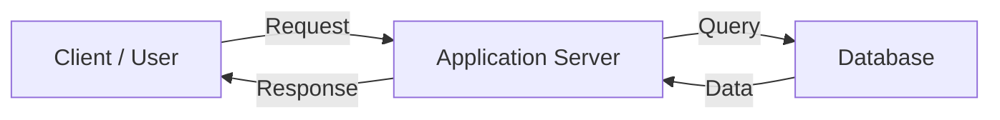

If the application has thousands or millions of users, repeatedly retrieving the same frequently accessed information can create unnecessary work for the database.

## Problems without caching

### 1. Higher database load

Every repeated request reaches the database.

```text
10,000 requests
      |
      v
10,000 database operations
```

If many requests ask for the same data, a large amount of database work may be unnecessary.

### 2. Higher latency

A database is normally a remote service from the application server.

The request therefore involves:

```text
Client
  ↓
Application
  ↓
Database
  ↓
Application
  ↓
Client
```

A cache hit can remove the database portion of the request path.

### 3. Reduced database scalability

The database is often one of the most expensive components to scale.

If we can serve a large fraction of reads from cache, the database can handle fewer requests.

### 4. Higher infrastructure cost

More database CPU, memory, I/O and replicas may be required when the database is handling requests that could have been served from cache.

### 5. Repeated computation

Caching is not limited to database records.

We can cache:

- API responses
- Computed results
- User sessions
- Product information
- Configuration
- Authentication data
- Expensive calculations
- Frequently accessed files
- Static assets

---

# 3. BASIC CACHE ARCHITECTURE

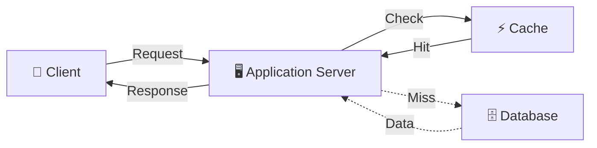

The application generally follows:

```text
1. Receive request
2. Check cache
3. If data exists → return cached data
4. If data does not exist → query database
5. Store useful result in cache
6. Return response
```

This pattern is often called **Cache-Aside / Lazy Loading** when the application itself manages cache population.

---

# 4. CACHE HIT

A **cache hit** occurs when the requested data is already present in the cache.

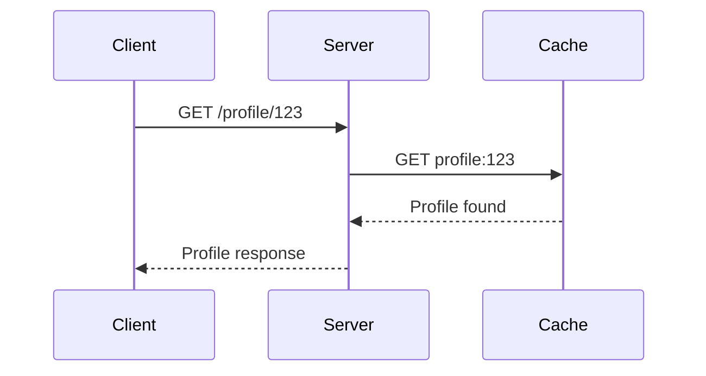

Example:

```text
User requests profile 123

Server → Cache
        |
        | profile:123 exists
        v
      HIT ✅
        |
        v
   Return data
```

### Why is a cache hit useful?

The application can avoid:

- Database query
- Database network round trip
- Database CPU/I/O work
- Potentially expensive computation

---

# 5. CACHE MISS

A **cache miss** occurs when the requested data is not present in the cache.

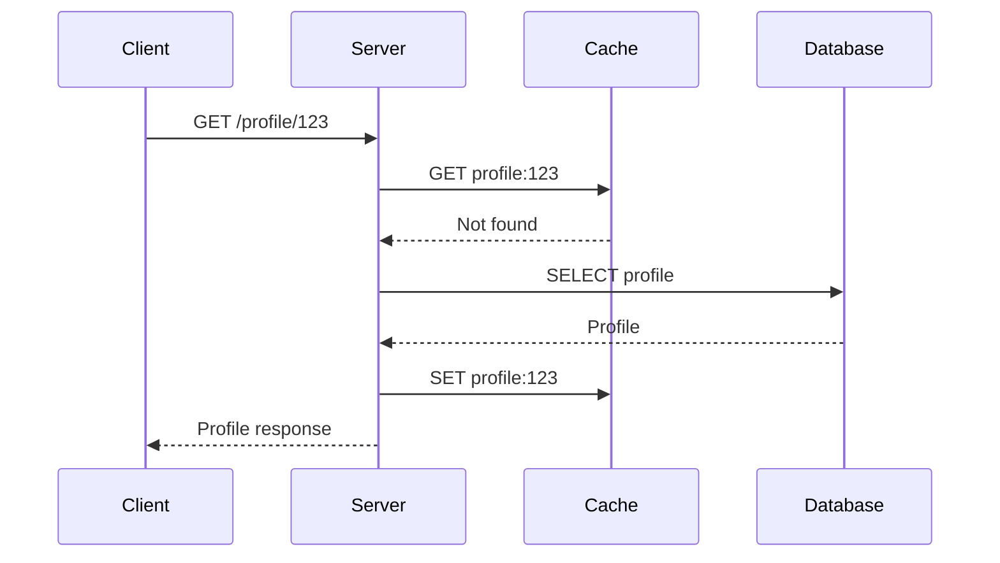

The flow is:

```text
Request
   ↓
Check Cache
   ↓
Miss ❌
   ↓
Query Database
   ↓
Get Data
   ↓
Store in Cache
   ↓
Return Response
```

The next request can then become a cache hit.

---

# 6. WHY NOT STORE THE ENTIRE DATABASE IN CACHE?

This is an important interview question.

Cache is generally:

- Faster
- More expensive per GB than persistent storage
- Limited in capacity
- Usually temporary
- Vulnerable to eviction/restarts depending on architecture

Therefore, keeping the entire database in cache may be unnecessary or economically inefficient.

We generally cache data that has high value, such as:

```text
Frequently accessed
        +
Expensive to retrieve
        +
Acceptable to cache
        ↓
      CACHE
```

Examples:

```text
Product catalog
Popular products
User sessions
Frequently accessed profiles
Frequently requested API results
Configuration
```

---

# 7. CACHEABLE DATA VS NON-CACHEABLE DATA

Not every piece of data should be cached.

## Good candidates

Data that is:

- Frequently read
- Relatively expensive to retrieve
- Relatively stable
- Safe to reuse between requests
- Not highly sensitive to staleness

Example:

```text
Product details
```

A product description may remain unchanged for hours.

## Poor candidates

Data that:

- Changes every second
- Must always be strongly consistent
- Is highly user-specific and improperly shared
- Has security/privacy implications
- Is rarely requested

Example:

```text
Bank account balance
```

Caching such information requires careful consistency and security design.

---

# 8. CACHE KEY

A cache normally stores data using a **key-value** model.

Example:

```text
Key                         Value

user:123              →    {name: "Ayush", age: 21}

product:456           →    {name: "Laptop", price: 70000}

session:abc123        →    {userId: 123}
```

A good cache key should be:

- Unique
- Deterministic
- Easy to construct
- Versionable when necessary
- Scoped appropriately

Example:

```text
user:123
product:456
product:456:reviews
```

---

# 9. TTL — TIME TO LIVE

**TTL (Time To Live)** defines how long a cached item should remain valid before it expires.

Example:

```text
SET product:123 value
TTL = 300 seconds
```

After 300 seconds:

```text
product:123
      ↓
Expired
      ↓
Cache miss
      ↓
Fetch fresh data
```

TTL is one of the most important mechanisms for controlling stale data.

## Why use TTL?

Because cache data can become outdated.

Example:

```text
Database:
Price = ₹100

Cache:
Price = ₹100

Product price changes:

Database:
Price = ₹120

Cache:
Price = ₹100
```

Without expiration or invalidation, users may receive stale information.

---

# 10. CACHE-ASIDE PATTERN

The **Cache-Aside** pattern is one of the most common application caching patterns.

The application explicitly checks and populates the cache.

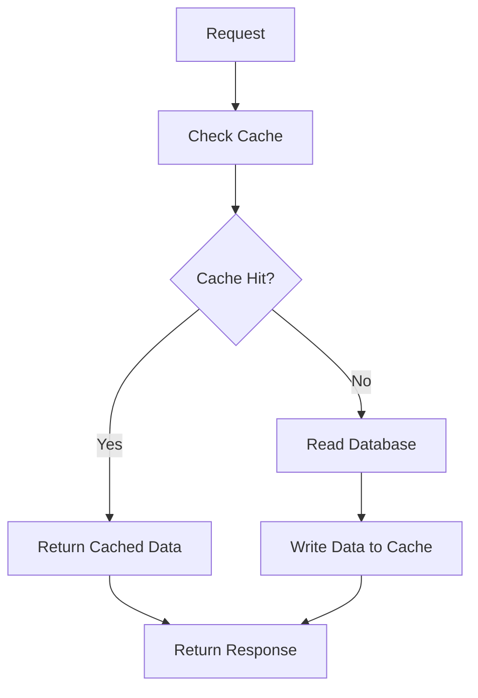

## Step-by-step

### Read

```text
1. Application checks cache.
2. If hit → return value.
3. If miss → read database.
4. Put database result into cache.
5. Return result.
```

### Advantages

- Simple
- Application controls what is cached
- Database remains source of truth

### Disadvantages

- Cache miss causes extra latency
- Application must implement cache logic
- Cache invalidation must be handled carefully

---

# 11. LOCAL CACHE

A **local cache** is stored inside the memory of an individual application server.

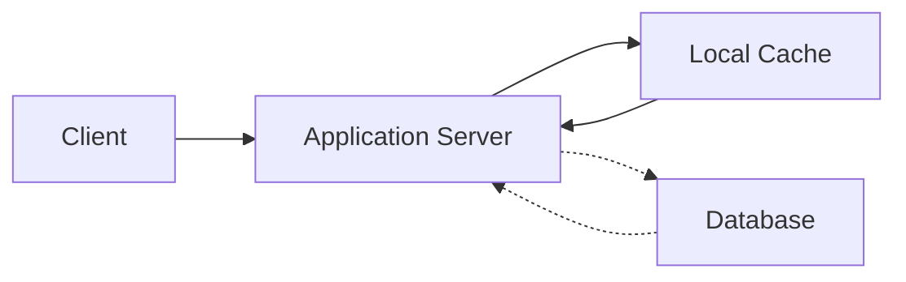

For a single server, this is very simple.

```text
Application Server
+-------------------------+
|                         |
|   Application           |
|                         |
|   Local Cache           |
|                         |
+-------------------------+
```

The cache and application are on the same machine/process environment.

## Why is local cache fast?

There is no network hop to another cache server.

```text
Application
     ↓
Local memory
```

Instead of:

```text
Application
     ↓
Network
     ↓
Remote cache
```

---

# 12. PROBLEM WITH LOCAL CACHE IN A DISTRIBUTED APPLICATION

Suppose the application grows and we add three application servers.

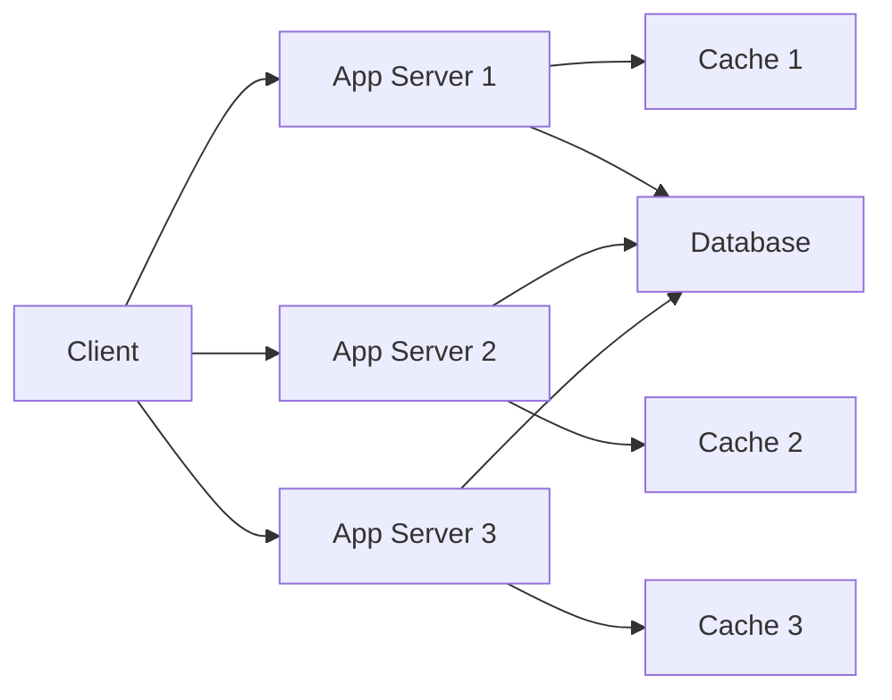

Now there are three independent caches.

```text
Server 1 → Cache 1
Server 2 → Cache 2
Server 3 → Cache 3
```

These caches do not automatically share state.

---

# 13. LOCAL CACHE DATA INCONSISTENCY

Suppose User X's profile is cached in Server 1.

```text
Cache 1:
User X → Age 20
```

Later User X updates the profile through Server 2.

```text
Database:
Age = 21

Cache 2:
Age = 21

Cache 1:
Age = 20
```

Now:

```text
Request → Server 1 → Cache 1 → Age 20 ❌
Request → Server 2 → Cache 2 → Age 21 ✅
```

The user may get different results depending on which server receives the request.

This is one of the main problems with independent local caches in horizontally scaled applications.

---

# 14. STICKY SESSIONS DO NOT COMPLETELY SOLVE THE PROBLEM

An interviewer may ask:

> Why not simply use sticky sessions?

Sticky sessions can keep a user routed to the same server, for example:

```text
User X
  ↓
Load Balancer
  ↓
Server 1
```

But this creates other problems:

- Server failure can break the user's affinity.
- Traffic may become uneven.
- Scaling becomes less flexible.
- Cache state is still tied to one server.
- Other services may still need the same data.

Therefore, shared/distributed state is often preferred for data that must be accessible across application servers.

---

# 15. DISTRIBUTED CACHE

A **distributed cache** is a shared caching layer that multiple application servers can access.

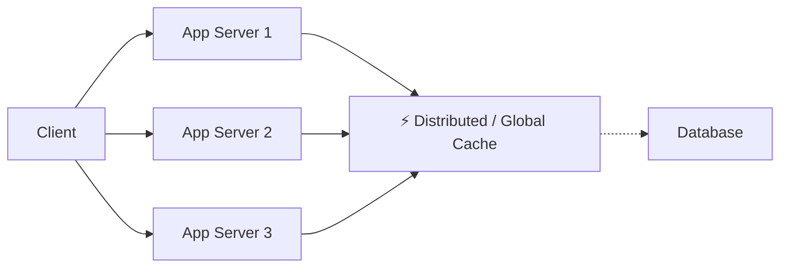

Now:

```text
Server 1 ─┐
Server 2 ─┼──→ Shared Cache
Server 3 ─┘
```

All application servers can access the same logical cache.

A common technology used for this type of architecture is **Redis**.

---

# 16. WHY DISTRIBUTED CACHE?

The main reason is **shared cache state**.

Suppose:

```text
User X → Age 21
```

is stored in the shared cache.

All application servers can access:

```text
Distributed Cache
       |
       +-- Server 1
       +-- Server 2
       +-- Server 3
```

If Server 2 updates the cached value, Server 1 can read the updated value from the same shared cache.

This is much easier to reason about than three independent local caches.

---

# 17. LOCAL CACHE VS DISTRIBUTED CACHE

| Feature | Local Cache | Distributed Cache |
|---|---|---|
| Location | App server memory | Separate/shared cache infrastructure |
| Network call | Usually no | Usually yes |
| Latency | Very low | Higher than local memory |
| Shared across servers | No | Yes |
| Consistency across app servers | Harder | Easier |
| Independent scaling | Limited | Possible |
| Failure scope | Server-local | Cache infrastructure needs HA |
| Common use | Small/local data | Shared application state |

### Interview answer

> Local cache is faster because it avoids a network hop, but it is tied to a particular application server. In a horizontally scaled system, different servers can have different cache states. A distributed cache provides shared state across servers, at the cost of network latency and additional infrastructure.

---

# 18. DISTRIBUTED CACHE SCALING

A distributed cache can itself become a bottleneck.

Suppose:

```text
10 App Servers
       ↓
One Cache Server
       ↓
Millions of requests
```

The cache server can become overloaded.

Therefore, the cache layer can be scaled horizontally.

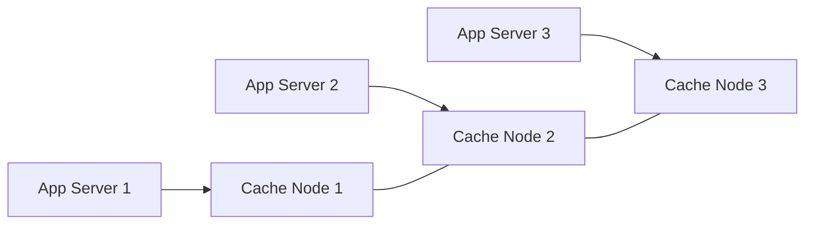

Depending on the technology, data may be partitioned/sharded across cache nodes.

---

# 19. CACHE SHARDING / PARTITIONING

When a cache becomes large, data can be distributed across multiple nodes.

Conceptually:

```text
Key
 ↓
Hash(key)
 ↓
Determine cache node
```

Example:

```text
user:101 → Node 1
user:102 → Node 3
user:103 → Node 2
user:104 → Node 1
```

A common approach is **consistent hashing**, which helps distribute keys across nodes while reducing the number of keys that must move when nodes are added or removed.

---

# 20. CACHE EVICTION

Cache memory is limited.

Suppose:

```text
Cache capacity = 100 GB

Current usage = 100 GB
```

A new item arrives:

```text
New item = 2 GB
```

The system needs to remove some existing data.

This process is called **cache eviction**.

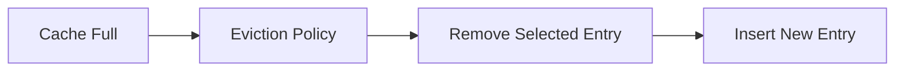

The eviction policy determines which item should be removed.

---

# 21. FIFO — FIRST IN, FIRST OUT

FIFO removes the item that entered the cache first.

Example:

```text
Cache capacity = 3

Insert A
[A]

Insert B
[A B]

Insert C
[A B C]

Insert D
```

A was inserted first.

Therefore:

```text
Evict A

[B C D]
```

### Important

FIFO considers:

```text
When did the item ENTER?
```

It does not care whether the item is frequently accessed.

---

# 22. FIFO EXAMPLE

Suppose:

```text
A → inserted at 10:00
B → inserted at 10:05
C → inserted at 10:10
```

Cache is full.

At 10:20:

```text
New item D
```

FIFO removes:

```text
A
```

even if A was accessed many times after insertion.

This is the major limitation of FIFO.

---

# 23. FIFO ADVANTAGES AND DISADVANTAGES

## Advantages

- Very simple
- Easy to implement
- Low bookkeeping overhead
- Predictable

## Disadvantages

- Ignores recent access
- Ignores access frequency
- Frequently used data can be evicted
- Not always aligned with real workload patterns

---

# 24. LRU — LEAST RECENTLY USED

LRU removes the item that has **not been accessed for the longest time**.

The key question is:

```text
When was this data LAST USED?
```

Example:

```text
A → used 5 days ago
B → used 2 days ago
C → used 1 hour ago
D → used 1 minute ago
```

If the cache is full:

```text
A is the least recently used
```

So:

```text
Evict A
```

---

# 25. LRU EXAMPLE WITH ACCESS ORDER

Cache:

```text
[A, B, C]
```

Assume:

```text
A = oldest
C = newest
```

User accesses A.

Now A becomes recently used:

```text
[B, C, A]
```

If a new item D arrives:

```text
Evict B

[C, A, D]
```

The important point is that **accessing an item changes its recency position**.

---

# 26. HOW IS LRU IMPLEMENTED?

A common implementation uses:

```text
Hash Map + Doubly Linked List
```

Why?

### Hash Map

Provides approximately:

```text
O(1)
```

lookup by key.

### Doubly Linked List

Maintains:

```text
Most Recently Used
        ↓
      ...
        ↓
Least Recently Used
```

On every access:

```text
1. Find node using hash map.
2. Remove it from current list position.
3. Move it to the front.
```

On eviction:

```text
Remove node from the tail.
```

Conceptually:

```text
HashMap
 key → node

Doubly Linked List

MRU                         LRU
 ↓                           ↓
[A] ↔ [B] ↔ [C] ↔ [D] ↔ [E]
                         ↑
                      Evict
```

This is a common interview implementation question.

---

# 27. LRU ADVANTAGES AND DISADVANTAGES

## Advantages

- Uses recency
- Good for workloads with temporal locality
- Frequently accessed recent data tends to remain cached
- Widely used concept

## Disadvantages

- Requires tracking access order
- More complex than FIFO
- A previously popular item can eventually be evicted if it stops being accessed

---

# 28. LFU — LEAST FREQUENTLY USED

LFU removes the item with the **lowest access frequency**.

The key question is:

```text
How many times has this item been accessed?
```

Example:

```text
A → 50 accesses
B → 10 accesses
C → 2 accesses
```

If eviction is required:

```text
C is the least frequently used
```

Therefore:

```text
Evict C
```

---

# 29. LFU EXAMPLE

Suppose:

```text
Cache capacity = 3

A → frequency 10
B → frequency 7
C → frequency 2
```

New item D arrives.

LFU chooses:

```text
C
```

because:

```text
2 < 7 < 10
```

Result:

```text
[A, B, D]
```

---

# 30. LFU TIE-BREAKING

Suppose two entries have the same frequency:

```text
A → 5 accesses
B → 5 accesses
C → 10 accesses
```

If A and B tie, the implementation needs a secondary rule.

A common approach is:

```text
Least frequently used
        +
Least recently used among tied entries
```

This avoids ambiguity.

---

# 31. LFU ADVANTAGES AND DISADVANTAGES

## Advantages

- Keeps frequently accessed/hot data
- Useful when popularity is important
- Can protect very popular entries from eviction

## Disadvantages

- Requires frequency tracking
- More complex than FIFO
- Historical frequency can become misleading

Example:

```text
Old viral product:
1,000,000 accesses

Current reality:
Nobody accesses it anymore
```

If frequency never decays, it may stay in cache longer than desirable.

This is why practical LFU systems often use frequency aging/decay or related techniques.

---

# 32. FIFO VS LRU VS LFU

| Policy | Question Asked | Evicts |
|---|---|---|
| FIFO | When did it enter? | Oldest inserted |
| LRU | When was it last used? | Least recently used |
| LFU | How often was it used? | Least frequently used |

### Memory trick

```text
FIFO → ENTER
LRU  → RECENT
LFU  → FREQUENCY
```

---

# 33. CACHE WRITE POLICIES

Reading from cache is only half of the problem.

We also need to decide:

> What happens when the application updates data?

For example:

```text
User changes profile:

Age 20 → Age 21
```

Should we:

```text
Update cache + database immediately?
```

or:

```text
Update cache first
Database later?
```

This leads to write policies.

Two important policies are:

1. Write Through
2. Write Back

---

# 34. WRITE THROUGH CACHE

In **Write Through**, data is written to the cache and the database as part of the write operation.

Conceptually:

```text
Application
    ↓
Cache
    ↓
Database
```

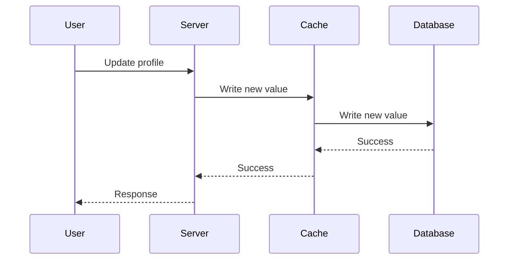

Example:

```text
Initial:
Cache = 20
DB    = 20

Update:
20 → 21

After successful write:
Cache = 21
DB    = 21
```

---

# 35. WRITE THROUGH — WHY USE IT?

The major benefit is **better synchronization between cache and database**.

The database is not intentionally left behind while the cache contains a new value.

This is useful when stale data is expensive or dangerous.

Examples may include:

- Important account state
- Inventory-related systems
- Data where consistency matters strongly

The exact consistency guarantees still depend on the overall architecture and failure handling.

---

# 36. WRITE THROUGH — TRADE-OFF

The database is part of the write path.

Therefore:

```text
Write request
    ↓
Cache
    ↓
Database
    ↓
Response
```

If the database is slow:

```text
Write latency ↑
```

So Write Through generally trades some write latency for stronger synchronization.

---

# 37. WRITE BACK CACHE

In **Write Back**, the application writes to cache first and the database is updated later.

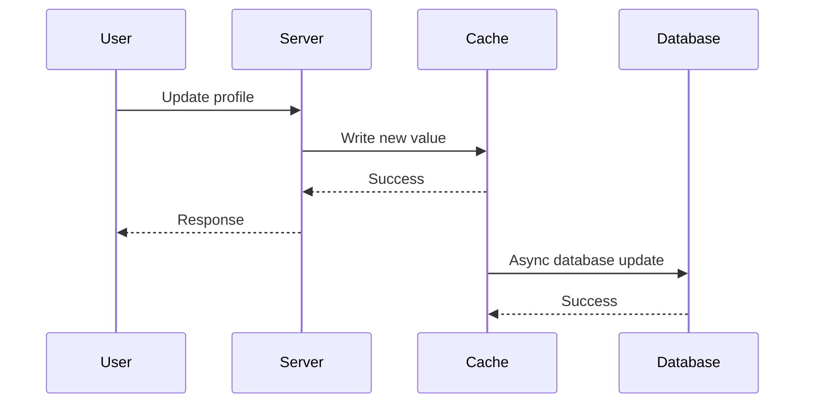

Example:

```text
Initial:
Cache = 20
DB    = 20

User updates:
Cache = 21
DB    = 20
```

Immediately:

```text
Cache = 21
DB = 20
```

Later:

```text
Database update completes

Cache = 21
DB = 21
```

---

# 38. WRITE BACK — WHY IS IT FAST?

The application does not have to wait for the database write to finish before responding, depending on the exact implementation and durability requirements.

Therefore:

```text
User
 ↓
Application
 ↓
Cache
 ↓
Response
```

The database update can happen asynchronously.

This can significantly reduce perceived write latency.

---

# 39. WRITE BACK — MAJOR PROBLEM

The cache and database can temporarily disagree.

```text
Cache:
Age = 21

Database:
Age = 20
```

This is **temporary inconsistency**.

There is also an important reliability concern:

```text
Cache updated
      ↓
Before DB persistence
      ↓
Cache/node failure
      ↓
What happens to the update?
```

A production system needs a reliable mechanism for persisting pending changes and recovering from failures.

---

# 40. WRITE THROUGH VS WRITE BACK

| Property | Write Through | Write Back |
|---|---|---|
| Cache updated | Yes | Yes |
| DB updated | Immediately/as part of write path | Later |
| Write latency | Usually higher | Usually lower |
| Temporary inconsistency | Reduced | Possible |
| DB dependency on write path | Yes | Deferred |
| Failure handling | Simpler conceptually | More complex |
| Main trade-off | Consistency vs latency | Latency vs persistence complexity |

### Interview answer

> Write Through writes the update to cache and database as part of the write path, so it favors synchronization but can increase write latency. Write Back writes to cache first and persists to the database asynchronously, which can make writes faster but introduces a period of inconsistency and requires reliable background persistence.

---

# 41. CACHE INVALIDATION

One of the hardest problems in caching is **cache invalidation**.

Suppose:

```text
Database:
Price = ₹100

Cache:
Price = ₹100
```

The database changes:

```text
Database:
Price = ₹120
```

But cache still contains:

```text
Cache:
Price = ₹100
```

If we do not invalidate or update the cache, users can receive stale data.

---

# 42. CACHE INVALIDATION STRATEGIES

Common approaches include:

### 1. TTL-based expiration

```text
Cache entry
    ↓
TTL expires
    ↓
Entry removed
```

### 2. Explicit invalidation

After updating the database:

```text
Update DB
   ↓
Delete cache key
```

### 3. Update cache

```text
Update DB
   ↓
Update cache with new value
```

### 4. Event-driven invalidation

```text
Database update
      ↓
Event / Message
      ↓
Cache invalidation
```

---

# 43. CACHE STAMPEDE / THUNDERING HERD

A **cache stampede** occurs when a popular cache entry expires or is unavailable and many requests simultaneously try to rebuild it.

Example:

```text
Popular key = product:123

Cache expires
     ↓
10,000 users request product
     ↓
10,000 cache misses
     ↓
10,000 database requests
     ↓
Database overloaded
```

This defeats the purpose of caching.

---

# 44. HOW TO PREVENT CACHE STAMPEDE?

Common techniques include:

## 1. Locking / request coalescing

Only one request rebuilds the cache.

```text
10,000 requests
      ↓
One request → Database
      ↓
Populate cache
      ↓
Other requests use result
```

## 2. Staggered TTL / jitter

Instead of letting many keys expire at exactly the same time, add randomness to expiration.

```text
TTL = 300 sec + random jitter
```

## 3. Refresh ahead

Refresh popular entries before they expire.

## 4. Serve stale data temporarily

For some workloads:

```text
Expired but usable value
        ↓
Serve stale
        +
Refresh in background
```

---

# 45. CACHE PENETRATION

Cache penetration occurs when requests repeatedly ask for data that does not exist.

Example:

```text
Request user:999999999
        ↓
Cache miss
        ↓
Database
        ↓
User not found
```

If an attacker repeatedly requests nonexistent IDs:

```text
Request
 ↓
Cache miss
 ↓
Database
 ↓
Not found
```

The database can still be overloaded.

## Common solution: negative caching

Store the fact that the item does not exist for a short TTL.

```text
user:999999999 → NOT_FOUND
TTL = 60 seconds
```

Then repeated requests can be rejected from cache.

---

# 46. CACHE BREAKDOWN

Cache breakdown commonly refers to a situation where a very popular key expires and a large number of requests simultaneously hit the backend.

It is closely related to cache stampede/thundering herd.

Example:

```text
Popular key
    ↓
Expires
    ↓
Many concurrent requests
    ↓
Database
```

Locking, single-flight/request coalescing, refresh-ahead and stale-while-revalidate strategies can reduce this problem.

---

# 47. CACHE CONSISTENCY

Caching introduces another important system-design question:

> What happens when cached data differs from the source of truth?

There are several possible consistency requirements.

### Stronger consistency

The system tries to ensure users do not observe stale data after a successful update.

### Eventual consistency

The cache may temporarily contain old data, but it eventually converges to the latest value.

Example:

```text
T0:
DB = 20
Cache = 20

T1:
DB = 21
Cache = 20

T2:
Cache updated

DB = 21
Cache = 21
```

Which model is appropriate depends on the application.

---

# 48. DATABASE AS SOURCE OF TRUTH

In many cache-aside architectures:

```text
Database = Source of Truth
Cache = Performance Layer
```

This distinction is extremely important.

If cache is lost:

```text
Cache failure
     ↓
Read from database
     ↓
Repopulate cache
```

The application should not necessarily lose the actual persistent data merely because cached copies disappear.

---

# 49. WHAT HAPPENS IF CACHE GOES DOWN?

Suppose:

```text
Application
    ↓
Redis
    X
```

A production system needs a fallback strategy.

For example:

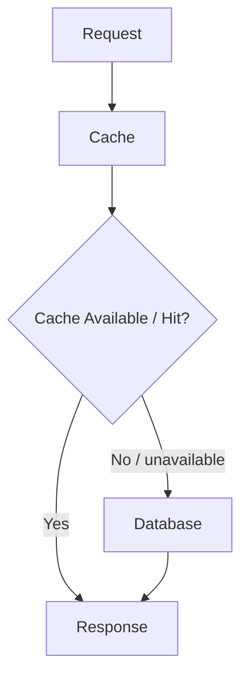

Possible consequences of cache failure:

- Higher latency
- Increased database load
- Cache misses
- Potential cascading failure

Therefore, a cache can improve performance but can also become an important dependency.

---

# 50. CACHE AS A SINGLE POINT OF FAILURE

If the entire application depends on one cache server:

```text
App Servers
     ↓
Single Cache
     ↓
FAILURE
```

then cache failure can affect the entire system.

Production distributed-cache architectures commonly use:

- Replication
- Multiple nodes
- Failover
- Cluster mode
- Monitoring
- Health checks
- Capacity management

The exact design depends on the cache technology.

---

# 51. CDN — CONTENT DELIVERY NETWORK

A **CDN (Content Delivery Network)** is a geographically distributed network of infrastructure used to deliver content closer to end users.

Typical content includes:

- Images
- CSS
- JavaScript
- Videos
- Fonts
- Static HTML
- Downloadable files
- Other cacheable content

Examples of CDN providers include:

- Cloudflare
- Amazon CloudFront
- Azure CDN

The key idea:

```text
Without CDN:

User
  ↓
Origin Server
```

With CDN:

```text
User
  ↓
Nearby CDN Edge
  ↓
Cached Content
```

---

# 52. WHY DO WE NEED A CDN?

Suppose the origin server is located in the United States and a user is in India.

A request must travel a relatively long network path.

```text
India
  ↓
Internet
  ↓
US Origin
```

With a CDN, content can be cached at an edge location closer to the user.

```text
India User
    ↓
Nearby CDN Edge
    ↓
Cached Content
```

This can reduce network distance and improve delivery latency.

---

# 53. CDN ARCHITECTURE

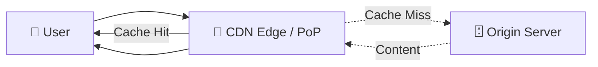

## Cache hit

```text
User
 ↓
CDN Edge
 ↓
Content already cached
 ↓
Return content
```

## Cache miss

```text
User
 ↓
CDN Edge
 ↓
Not cached
 ↓
Origin Server
 ↓
Content
 ↓
CDN caches it
 ↓
User
```

---

# 54. CDN VS APPLICATION CACHE

These two are related but solve different problems.

## Application cache

Usually caches application data.

```text
User
 ↓
App Server
 ↓
Redis / Cache
 ↓
Database
```

Examples:

```text
User profile
Product data
Session
Computed result
```

## CDN

Primarily accelerates delivery of content at the edge.

```text
User
 ↓
CDN Edge
 ↓
Origin
```

Examples:

```text
Images
CSS
JavaScript
Video
Static files
```

---

# 55. WHAT IS A PoP?

**PoP = Point of Presence.**

A PoP is a physical/network location where a CDN or network provider has infrastructure.

Think of it as:

```text
Geographic region
      ↓
Provider infrastructure
      ↓
PoP
```

A provider can have many PoPs:

```text
        CDN Network

   PoP A       PoP B       PoP C
  Region 1    Region 2    Region 3
```

Users can be routed toward appropriate infrastructure based on the provider's routing mechanisms.

---

# 56. WHAT IS AN EDGE SERVER?

An **edge server** is infrastructure located closer to end users that can serve cached content and, depending on the platform, perform processing at the edge.

```text
User
 ↓
Edge Server
 ↓
Cached content
```

Instead of every request travelling to the origin:

```text
User
 ↓
Edge
 ↓
Origin
```

a cache hit can be:

```text
User
 ↓
Edge
 ↓
Response
```

---

# 57. CDN CACHE HIT AND MISS

## CDN Cache Hit

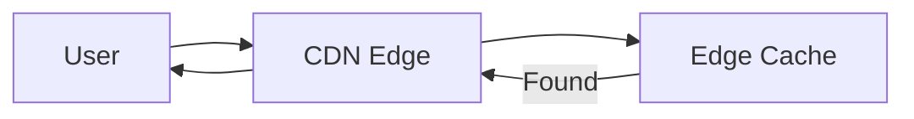

## CDN Cache Miss

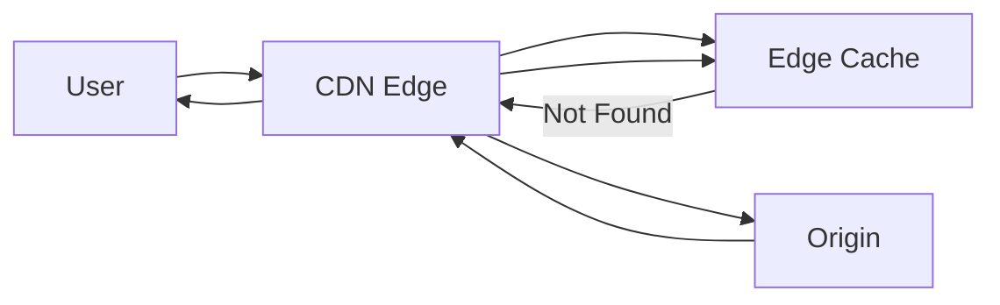

---

# 58. CDN COMPRESSION

CDNs can also compress content before sending it to the client when supported.

Example:

```text
Original response
       ↓
Compression
       ↓
Smaller response
       ↓
Network transfer
       ↓
User
```

For text-based content, compression can reduce the number of bytes transferred.

Examples:

- HTML
- CSS
- JavaScript
- JSON

Benefits:

- Lower bandwidth consumption
- Potentially faster transfer
- Better performance for users on slower networks

Compression does not mean the original content is permanently changed; the CDN can deliver an encoded/compressed representation while the origin retains its normal representation.

---

# 59. CDN REQUEST ROUTING

The user must be directed to an appropriate CDN location.

Two important concepts are:

1. DNS-based routing
2. Anycast

They operate at different layers.

---

# 60. DNS-BASED ROUTING

DNS translates domain names into IP addresses.

For example:

```text
example.com
     ↓
DNS
     ↓
IP address
```

A CDN can use DNS-based mechanisms to direct clients toward an appropriate CDN endpoint.

Conceptually:

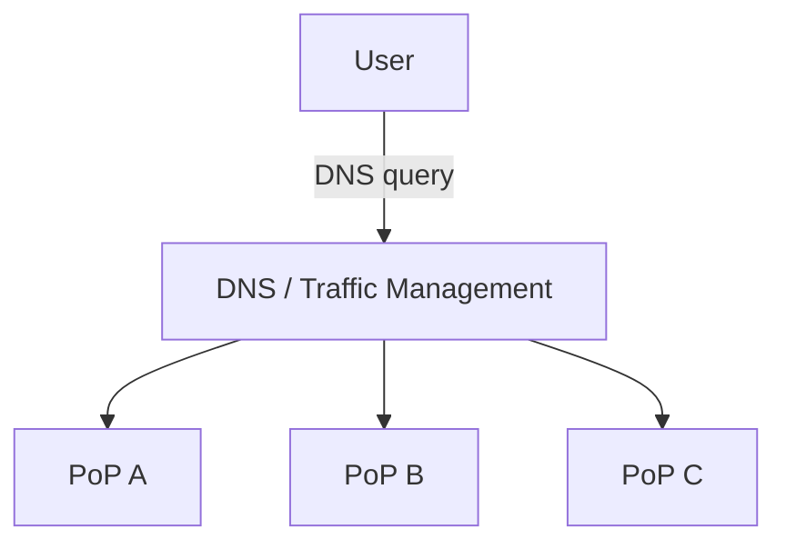

The actual decision can depend on provider-specific factors such as:

- Geographic location
- Network topology
- Server health
- Load
- Routing policy

DNS-based routing can return different addresses to different clients.

---

# 61. ANYCAST

Anycast is a network addressing/routing technique in which multiple locations advertise the same IP address.

Conceptually:

```text
             203.0.113.10
                    |
       +------------+------------+
       |            |            |
      PoP A        PoP B        PoP C
```

All three locations advertise the same IP.

The Internet's routing system determines where traffic is delivered based on routing information.

A simplified view is:

```text
User
 ↓
Same Anycast IP
 ↓
Network routing
 ↓
One appropriate PoP
```

---

# 62. DNS VS ANYCAST

| Aspect | DNS Routing | Anycast |
|---|---|---|
| Layer | DNS/application infrastructure | Network routing |
| Address selection | DNS can return an endpoint/IP | Same IP can be advertised from multiple locations |
| Decision | DNS/provider policy | Internet routing |
| Different clients can get different IPs | Yes | They can use the same IP |
| Main purpose | Direct clients to appropriate endpoints | Route traffic to an appropriate advertised location |

### Interview answer

> DNS-based routing chooses or returns an appropriate endpoint through DNS responses. Anycast allows multiple locations to advertise the same IP address, and network routing determines which location receives the traffic.

---

# 63. IS ANYCAST ALWAYS THE PHYSICALLY CLOSEST SERVER?

Not necessarily.

This is a common interview trap.

Anycast routing generally selects a route based on the Internet's routing system and network topology.

Therefore:

```text
Closest geographically
```

is not guaranteed to mean:

```text
Selected by routing
```

The selected location is better thought of as the appropriate/topologically preferred reachable destination according to routing policy.

---

# 64. DNS AND CDN — COMPLETE FLOW

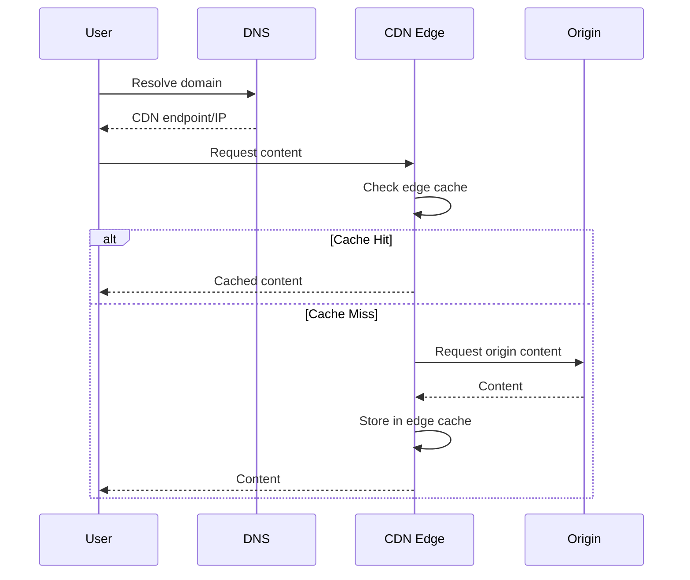

---

# 65. COMPLETE SYSTEM: CLIENT → CDN → APP → CACHE → DATABASE

A modern application can use several layers of caching.

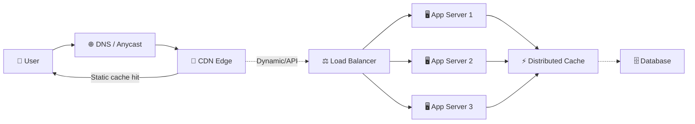

Different layers solve different problems:

```text
CDN
 ↓
Reduce distance for content delivery

Distributed Cache
 ↓
Reduce repeated application/database reads

Database
 ↓
Persistent source of truth
```

---

# 66. MULTI-LEVEL CACHING

Large systems may use multiple cache layers.

For example:

```text
Client
  ↓
CDN
  ↓
Application Server
  ↓
Local Cache
  ↓
Distributed Cache
  ↓
Database
```

Each layer can reduce work for the next layer.

Example:

```text
Level 1 → CDN
Level 2 → Local application cache
Level 3 → Distributed cache
Level 4 → Database
```

The more layers we add, the more carefully we must reason about:

- TTL
- Invalidation
- Consistency
- Failure
- Memory
- Cost

---

# 67. CACHE HIT RATIO

A very important metric is **cache hit ratio**.

Formula:

```text
Cache Hit Ratio = Cache Hits / Total Cache Requests
```

Example:

```text
Total requests = 10,000
Cache hits     = 9,000

Hit Ratio = 9000 / 10000
          = 90%
```

Therefore:

```text
Cache Hit Ratio = 90%
Cache Miss Ratio = 10%
```

A high hit ratio generally means the cache is successfully serving a large fraction of requests, but a high hit ratio alone does not guarantee good system performance.

---

# 68. WHY CACHE HIT RATIO MATTERS

Suppose:

```text
1,000,000 requests
```

### 90% hit ratio

```text
900,000 → Cache
100,000 → Backend
```

### 50% hit ratio

```text
500,000 → Cache
500,000 → Backend
```

The second system puts much more load on the backend/database.

However, engineers should also monitor:

- Cache latency
- Backend latency
- Error rate
- Evictions
- Memory usage
- CPU
- Network traffic

---

# 69. CACHE EVICTIONS VS CACHE EXPIRATIONS

These are not exactly the same.

## Expiration

The item reaches its TTL.

```text
TTL expires
   ↓
Entry expires
```

## Eviction

The cache removes an item because of a configured memory/capacity policy.

```text
Cache full
   ↓
Eviction policy
   ↓
Remove entry
```

An entry can therefore disappear because:

```text
TTL expired
OR
Memory pressure / eviction
OR
Explicit deletion
OR
Cache restart/failure
```

---

# 70. HOT KEYS

A **hot key** is a cache key that receives an unusually large amount of traffic.

Example:

```text
product:iphone
```

If millions of users request the same key:

```text
Millions of requests
       ↓
One cache key
```

That key/node can become a bottleneck.

Potential solutions include:

- Replicating hot data
- Local caching
- Request coalescing
- Better partitioning
- Read replicas where applicable
- CDN caching for suitable content

The correct solution depends on the workload.

---

# 71. CACHE WARMING

A newly started cache may be empty.

```text
Application starts
       ↓
Empty cache
       ↓
Many cache misses
       ↓
Database load increases
```

This is sometimes called a **cold cache**.

Cache warming means proactively loading frequently needed data.

```text
Application starts
       ↓
Load popular data
       ↓
Cache becomes warm
       ↓
Normal traffic
```

This can be useful after:

- Deployment
- Cache restart
- Disaster recovery
- Scaling events

---

# 72. CACHE COLD START

Suppose a cache cluster restarts.

```text
Before:
Cache = Warm

Restart

After:
Cache = Empty
```

Now:

```text
First request → Miss → Database
Second request → Miss/Hit depending on population
...
```

If traffic is high, many misses can hit the database simultaneously.

Therefore, cache restart planning is an important production concern.

---

# 73. CACHE KEY VERSIONING

Suppose the cached data format changes.

Old:

```text
user:123
```

New schema:

```text
user:v2:123
```

Versioning keys can help avoid conflicts between old and new representations.

Example:

```text
product:v1:123
product:v2:123
```

This can be useful during deployments where old and new application versions temporarily coexist.

---

# 74. CACHE SECURITY

Caching can introduce security risks.

Never blindly cache sensitive information where another user could receive it.

For example:

```text
User A private response
        ↓
Shared cache
        ↓
User B receives it ❌
```

For authenticated APIs, cache keys and cache-control rules must correctly account for:

- User identity
- Authorization
- Cookies
- Headers
- Tenant
- Permissions

Sensitive data may require private/non-shared caching or no caching at all.

---

# 75. WHAT SHOULD BE THE SOURCE OF TRUTH?

This is a very common system-design question.

Usually:

```text
Database → Source of Truth
Cache    → Performance Optimization
```

This means:

```text
Cache lost?
No permanent data loss.

Database still has data.
Cache can be rebuilt.
```

But some architectures intentionally use cache as part of the primary data path. If so, durability and recovery requirements must be designed explicitly.

---

# 76. CACHE FAILURE AND DATABASE OVERLOAD

One of the most important failure scenarios is:

```text
Normal:

Client
 ↓
Cache
 ↓
Database

Cache fails:

Client
 ↓
Database
```

If the cache normally handles:

```text
95% of reads
```

and suddenly all requests go to the database:

```text
Traffic increases dramatically
       ↓
Database overload
       ↓
Latency increases
       ↓
Timeouts
       ↓
Retries
       ↓
Even more traffic
```

This can become a **cascading failure**.

Therefore, cache failure handling is an important part of system design.

---

# 77. RETRIES CAN MAKE CACHE FAILURE WORSE

Suppose:

```text
Database is overloaded
       ↓
Request times out
       ↓
Client retries
       ↓
More database requests
       ↓
More overload
```

This is why production systems may use:

- Timeouts
- Bounded retries
- Exponential backoff
- Circuit breakers
- Load shedding
- Rate limiting

Caching is one component of a larger reliability architecture.

---

# 78. CACHE + RATE LIMITING

A distributed cache such as Redis can also store rate-limiting state.

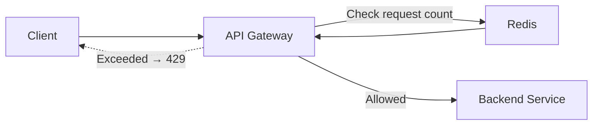

This works because multiple application servers need a shared counter.

---

# 79. CACHE + SESSION STORAGE

Distributed cache is also commonly used for sessions.

```text
User logs in
    ↓
Session created
    ↓
Distributed Cache
```

Then:

```text
Request → App Server 1 → Session Cache
Request → App Server 2 → Same Session Cache
Request → App Server 3 → Same Session Cache
```

This avoids tying a user's session to one particular application server.

---

# 80. CACHE + DATABASE READ PATH

A common production read architecture:

```mermaid
flowchart TD
    Request["GET Request"]
    Cache["Distributed Cache"]
    Hit{"Hit?"}
    DB["Database"]
    Set["Populate Cache"]
    Response["Response"]

    Request --> Cache
    Cache --> Hit

    Hit -->|"Yes"| Response
    Hit -->|"No"| DB
    DB --> Set
    Set --> Response
```

The database remains the fallback/source of persistent data.

---

# 81. CACHE + DATABASE WRITE PATH

For a cache-aside system, one common write approach is:

```text
1. Update database
2. Invalidate cache
```

Conceptually:

```mermaid
flowchart LR
    Request["Update Request"]
    DB["Database"]
    Delete["Delete / Invalidate Cache"]
    Cache["Cache"]

    Request --> DB
    DB --> Delete
    Delete --> Cache
```

Then the next read causes:

```text
Cache miss
   ↓
Read latest database value
   ↓
Populate cache
```

This avoids directly writing potentially incorrect data into cache before the database succeeds.

However, the exact ordering and failure handling must be designed carefully in production.

---

# 82. CACHE INVALIDATION FAILURE

Suppose:

```text
1. Database update succeeds
2. Cache invalidation fails
```

Then:

```text
Database = NEW
Cache = OLD
```

Users can see stale data.

This is why production designs may use:

- Retries
- Events
- Message queues
- CDC (Change Data Capture)
- Versioning
- Short TTLs
- Background reconciliation

The correct choice depends on consistency requirements.

---

# 83. INTERVIEW: WHY IS CACHE FASTER THAN DATABASE?

A good answer is:

> Cache is typically implemented using memory-based storage and is optimized for fast key-based access. A cache hit can also avoid a database network round trip, database query execution, disk I/O or other expensive processing. The exact latency depends on the cache technology, network topology, workload and implementation.

Avoid saying:

> "Cache is always 100 times faster."

That is too absolute.

---

# 84. INTERVIEW: WHY NOT USE ONLY REDIS AND REMOVE THE DATABASE?

Answer:

> A cache is generally designed as a performance layer, while the database provides durable persistent storage and richer query capabilities. Cache data can expire, be evicted, or be lost during failures depending on configuration. Therefore, for most architectures, the database remains the source of truth and the cache accelerates frequently accessed operations.

---

# 85. INTERVIEW: LOCAL CACHE OR DISTRIBUTED CACHE?

Answer:

> If data only needs to be used by one application instance and extremely low latency is important, a local cache can be useful. If multiple application servers need shared cache state, a distributed cache is more appropriate. The trade-off is that distributed cache introduces network latency and operational complexity.

---

# 86. INTERVIEW: FIFO VS LRU

### Question

Why would you choose LRU over FIFO?

### Answer

FIFO only considers insertion order.

LRU considers access recency.

If recently accessed data is likely to be requested again, LRU can preserve that data even if it entered the cache earlier than other entries.

Example:

```text
A inserted first
A accessed 1,000 times
```

FIFO may still evict A.

LRU keeps A if it continues to be accessed recently.

---

# 87. INTERVIEW: LRU VS LFU

### Question

Why might LFU keep an item that LRU would remove?

Example:

```text
A:
1000 total accesses
Last accessed 1 day ago

B:
10 total accesses
Last accessed 1 minute ago
```

LRU may prefer:

```text
B
```

because B was used more recently.

LFU may prefer:

```text
A
```

because A has a much higher historical access frequency.

Therefore:

```text
LRU → recency
LFU → frequency
```

---

# 88. INTERVIEW: WHAT IS CACHE STAMPEDE?

Answer:

> Cache stampede occurs when a popular cached item expires or becomes unavailable and many requests simultaneously try to regenerate it from the backend. This can cause a sudden database load spike. Common mitigations include request coalescing/locking, TTL jitter, refresh-ahead and serving stale data where acceptable.

---

# 89. INTERVIEW: WHAT IS CACHE PENETRATION?

Answer:

> Cache penetration occurs when requests repeatedly ask for data that does not exist. Because the data is never cached, every request can reach the database. Negative caching, validation and rate limiting can help reduce this problem.

---

# 90. INTERVIEW: WHAT IS CACHE WARMING?

Answer:

> Cache warming means proactively loading frequently needed data into cache before or around the time normal traffic starts, reducing cold-cache misses and protecting the database during startup or recovery.

---

# 91. INTERVIEW: WHAT IS CACHE INVALIDATION?

Answer:

> Cache invalidation is the process of removing or updating cached data when the underlying source of truth changes, so that stale data is not served beyond the acceptable consistency window.

---

# 92. INTERVIEW: WHAT IS TTL?

Answer:

> TTL, or Time To Live, is the duration for which a cache entry remains valid before it expires automatically. TTL provides a simple way to bound how long stale data can remain in cache.

---

# 93. INTERVIEW: WHAT HAPPENS WHEN CACHE IS FULL?

Answer:

> The cache applies its configured eviction policy. Depending on the implementation, it may remove entries using policies such as LRU, LFU or another policy, making space for new entries.

---

# 94. INTERVIEW: WHAT HAPPENS WHEN CACHE FAILS?

Answer:

A strong answer should discuss both performance and reliability:

```text
Cache failure
    ↓
Cache misses
    ↓
More backend/database traffic
    ↓
Potential overload
```

Mitigations can include:

- High availability
- Replication
- Failover
- Rate limiting
- Request coalescing
- Database protection
- Circuit breakers
- Graceful degradation

---

# 95. INTERVIEW: WHAT IS CDN?

Answer:

> A CDN is a geographically distributed network of edge infrastructure used to deliver content closer to users. It commonly caches static/cacheable content at edge locations, reducing the distance to the origin and improving delivery performance.

---

# 96. INTERVIEW: WHAT IS PoP?

Answer:

> PoP stands for Point of Presence. It is a network/physical location where a provider has infrastructure, such as CDN servers, to serve or route traffic.

---

# 97. INTERVIEW: WHAT IS AN EDGE SERVER?

Answer:

> An edge server is infrastructure positioned closer to end users that can serve cached content and, depending on the platform, perform processing closer to the user instead of sending every request to the origin.

---

# 98. INTERVIEW: DNS VS ANYCAST

### DNS

```text
Domain
  ↓
DNS
  ↓
IP / Endpoint
```

DNS-based traffic management can direct clients to different endpoints.

### Anycast

```text
Same IP
   ↓
Multiple PoPs advertise it
   ↓
Internet routing selects destination
```

### Short answer

> DNS can influence which endpoint/IP a client uses, while Anycast allows the same IP to be advertised from multiple locations and relies on network routing to select a destination.

---

# 99. SYSTEM DESIGN EXAMPLE — E-COMMERCE

Suppose we are designing an e-commerce application.

A user opens a product page.

```mermaid
flowchart LR
    User["👤 User"]
    CDN["📍 CDN"]
    LB["⚖️ Load Balancer"]
    App["🖥️ Application"]
    Redis["⚡ Redis Cache"]
    DB["🗄️ Database"]

    User --> CDN
    CDN -->|"Static assets"| User
    CDN -.->|"API request"| LB
    LB --> App
    App --> Redis
    Redis -.->|"Miss"| DB
    DB -.-> Redis
    Redis --> App
    App --> User
```

## Static content

Images/CSS/JS:

```text
User → CDN → Edge Cache
```

## Product API

```text
User
 ↓
Load Balancer
 ↓
Application
 ↓
Redis
 ↓
Database only on miss
```

This gives us multiple performance layers.

---

# 100. PRODUCT PRICE EXAMPLE

Suppose:

```text
Product ID = 101

Database:
Price = ₹1,000
```

Cache:

```text
product:101
{
    price: 1000
}
```

Read:

```text
GET product:101
       ↓
Redis
       ↓
HIT
       ↓
₹1,000
```

No database query is needed.

---

# 101. PRODUCT PRICE UPDATE

Suppose price changes:

```text
₹1,000 → ₹900
```

One possible cache-aside strategy:

```text
Update Database
       ↓
Invalidate product:101
       ↓
Next GET
       ↓
Cache miss
       ↓
Read DB = ₹900
       ↓
Populate cache
```

Now:

```text
Database = ₹900
Cache = ₹900
```

---

# 102. PRODUCT INVENTORY — WHY CONSISTENCY MATTERS

Suppose:

```text
Inventory = 1
```

If 100 users simultaneously see:

```text
Inventory = 1
```

because of stale cache, they might all attempt to buy.

Inventory is therefore a case where blindly caching values can create correctness problems.

A system may need:

- Stronger consistency
- Atomic database operations
- Distributed locking in some designs
- Reservations
- Carefully controlled cache usage

The correct architecture depends on business requirements.

---

# 103. CACHE DESIGN CHECKLIST

When designing a caching solution, ask:

### 1. What data are we caching?

```text
User?
Product?
Session?
API response?
Static file?
```

### 2. How frequently is it accessed?

High-frequency data is usually a better candidate.

### 3. How stale can it be?

```text
0 seconds?
1 second?
1 minute?
1 hour?
```

### 4. What is the TTL?

Choose based on data freshness requirements.

### 5. What is the cache key?

Make it unique and deterministic.

### 6. What happens on a cache miss?

Usually:

```text
Cache → Database
```

### 7. How is invalidation handled?

```text
TTL?
Delete?
Update?
Events?
```

### 8. What happens if cache fails?

Need a fallback.

### 9. What happens when cache is full?

Choose eviction policy.

### 10. Is the cache local or distributed?

Depends on whether state must be shared.

---

# 104. CACHE METRICS TO MONITOR

Important production metrics include:

## Hit ratio

```text
Hits / Total requests
```

## Miss ratio

```text
Misses / Total requests
```

## Cache latency

How long cache operations take.

## Eviction rate

How often entries are removed because of capacity pressure.

## Memory usage

How much cache memory is consumed.

## Key cardinality

Number of stored keys.

## Hot keys

Identify disproportionately popular keys.

## Error rate

Cache failures/timeouts.

## Backend/database load

Important for determining whether cache is actually protecting the backend.

---

# 105. CACHE DESIGN TRADE-OFFS

Caching is not simply:

```text
Cache = faster
```

It introduces trade-offs.

```text
                 CACHING
                    |
       +------------+------------+
       |            |            |
    Latency      Consistency   Complexity
       |            |            |
      ↓             ↓            ↓
   Faster       Possible       More
   reads        staleness      components
```

You gain:

- Lower latency
- Lower database load
- Higher throughput

But you introduce:

- Stale data
- Invalidation complexity
- Extra infrastructure
- Memory cost
- Failure scenarios
- Cache stampede/penetration issues

---

# 106. LOCAL CACHE VS DISTRIBUTED CACHE — DEEP TRADE-OFF

```text
LOCAL CACHE
Application
    ↓
Memory

Pros:
✓ Very low latency
✓ Simple
✓ No network hop

Cons:
✗ Not shared
✗ Per-server inconsistency
✗ Cache duplicated across servers
```

```text
DISTRIBUTED CACHE
Application
    ↓
Network
    ↓
Shared Cache

Pros:
✓ Shared state
✓ Multiple servers can access it
✓ Can scale independently

Cons:
✗ Network latency
✗ Extra infrastructure
✗ Distributed failure modes
✗ Requires HA/scaling strategy
```

---

# 107. FIFO, LRU, LFU — DEEP COMPARISON

| Property | FIFO | LRU | LFU |
|---|---|---|---|
| Based on | Insertion time | Recent access | Access count |
| Tracks recency | No | Yes | Usually separately/indirectly |
| Tracks frequency | No | No | Yes |
| Complexity | Low | Medium | Higher |
| Main advantage | Simplicity | Temporal locality | Popularity |
| Main weakness | Ignores usage | Ignores long-term frequency | Historical frequency can become stale |

---

# 108. WRITE THROUGH VS WRITE BACK — DEEP COMPARISON

```text
WRITE THROUGH

Application
    ↓
Cache
    ↓
Database
    ↓
Response
```

```text
WRITE BACK

Application
    ↓
Cache
    ↓
Response

Cache
    ↓
Async persistence
    ↓
Database
```

### Core trade-off

```text
Write Through:
Consistency / synchronization
        ↕
     latency

Write Back:
Low latency
        ↕
Persistence complexity / temporary inconsistency
```

---

# 109. CDN — DEEP CONCEPT MAP

```text
                         CDN
                          |
          +---------------+---------------+
          |               |               |
         PoP          Edge Server       Routing
          |               |               |
          |            Edge Cache      DNS / Anycast
          |
      Geographic
      distribution
```

CDN is therefore more than simply "a cache."

Caching is one of the major mechanisms used by CDNs, while routing and distributed edge infrastructure determine how requests reach the delivery layer.

---

# 110. COMPLETE INTERVIEW REVISION FLOW

```text
                    CACHE
                      |
        +-------------+-------------+
        |                           |
   Application Cache               CDN
        |                           |
   +----+----+                 Edge Cache
   |         |                      |
 Local    Distributed               |
   |         |                      |
   |       Redis                    |
   |         |                      |
   +----+----+                      |
        |                           |
     Policies                       |
     /      \                       |
 Eviction  Write                    |
 / | \      / \                     |
FIFO LRU LFU WT WB                  |
                                    |
                              PoP / Edge
                                    |
                              DNS / Anycast
```

---

# 111. 30-SECOND INTERVIEW SUMMARY

If the interviewer asks:

> **Explain caching.**

Say:

> Caching is a technique where frequently accessed data is stored in a faster storage layer, commonly memory, so future requests can be served without repeatedly querying the database or performing expensive operations. On a cache hit, the application returns cached data. On a miss, it fetches the data from the source, typically the database, and can populate the cache. In a horizontally scaled system, a local cache can cause inconsistent state across servers, so a distributed cache such as Redis can provide shared cache state. Since cache capacity is limited, eviction policies such as FIFO, LRU and LFU determine what gets removed. For writes, Write Through updates cache and database in the write path, while Write Back updates cache first and persists to the database later. CDNs apply similar caching ideas at geographically distributed edge locations to serve content closer to users. The major trade-off of caching is lower latency and database load versus stale data, invalidation complexity and additional infrastructure.

---

# 112. ONE-PAGE LAST-MINUTE REVISION

```text
CACHE
↓
Fast temporary storage
↓
Usually memory
↓
Reduces DB/backend work

CACHE HIT
↓
Data found
↓
Return immediately

CACHE MISS
↓
Data absent
↓
Read DB
↓
Populate cache
↓
Return

LOCAL CACHE
↓
Inside app server
↓
Fast
↓
Not shared

DISTRIBUTED CACHE
↓
Shared cache
↓
Multiple app servers
↓
More consistent shared state
↓
Network overhead

EVICTION
↓
Cache full
↓
FIFO / LRU / LFU

FIFO
↓
Oldest inserted

LRU
↓
Least recently used

LFU
↓
Least frequently used

WRITE THROUGH
↓
Cache + DB in write path
↓
Better synchronization
↓
Higher write latency

WRITE BACK
↓
Cache first
↓
DB later
↓
Fast write
↓
Temporary inconsistency possible

TTL
↓
Automatic expiration

INVALIDATION
↓
Remove/update stale cache

CACHE STAMPEDE
↓
Many requests rebuild same expired key

CACHE PENETRATION
↓
Repeated requests for nonexistent data

CDN
↓
Distributed edge infrastructure
↓
Content closer to users

PoP
↓
Point of Presence

EDGE SERVER
↓
Server near users

DNS ROUTING
↓
DNS directs client toward endpoint

ANYCAST
↓
Same IP advertised by multiple locations
↓
Network routing selects destination
```

---

# 113. MOST IMPORTANT INTERVIEW QUESTIONS TO PRACTICE

1. What is caching?
2. Why is cache faster than a database?
3. What is a cache hit?
4. What is a cache miss?
5. Why not cache the entire database?
6. What is TTL?
7. What is cache invalidation?
8. Explain Cache-Aside.
9. What is local cache?
10. What problems occur with local cache in multiple servers?
11. What is distributed cache?
12. Why use Redis as a distributed cache?
13. How would you scale a distributed cache?
14. What is cache sharding?
15. What is consistent hashing?
16. What is cache eviction?
17. Explain FIFO.
18. Explain LRU.
19. How would you implement LRU?
20. Explain LFU.
21. LRU vs LFU?
22. FIFO vs LRU?
23. What is Write Through?
24. What is Write Back?
25. Write Through vs Write Back?
26. What happens if cache fails?
27. What is cache stampede?
28. What is cache penetration?
29. What is cache breakdown?
30. How do you prevent cache stampede?
31. What is cache warming?
32. What is a hot key?
33. What is cache hit ratio?
34. What is a cold cache?
35. What is a CDN?
36. Why do we need a CDN?
37. What is a PoP?
38. What is an edge server?
39. How does CDN caching work?
40. What is CDN compression?
41. How does DNS-based routing work?
42. What is Anycast?
43. DNS vs Anycast?
44. Is Anycast always the geographically closest server?
45. CDN vs Redis/distributed cache?
46. How would you design caching for an e-commerce application?
47. How would you handle stale product data?
48. How would you cache user sessions?
49. How would you protect the database if Redis goes down?
50. What metrics would you monitor for a cache?

---

# 114. FINAL MENTAL MODEL

The easiest way to remember the whole topic is:

```text
                         USER
                           |
                           v
                  +----------------+
                  | DNS / ANYCAST  |
                  +----------------+
                           |
                           v
                  +----------------+
                  | CDN / EDGE     |
                  |    CACHE       |
                  +----------------+
                           |
                           v
                  +----------------+
                  | LOAD BALANCER  |
                  +----------------+
                           |
             +-------------+-------------+
             |             |             |
             v             v             v
          APP 1          APP 2         APP 3
             \             |             /
              \            |            /
               +-----------+-----------+
                           |
                           v
                  +----------------+
                  | DISTRIBUTED    |
                  | CACHE (Redis)  |
                  +----------------+
                           |
                     Cache Miss
                           |
                           v
                  +----------------+
                  |   DATABASE     |
                  | Source of Truth|
                  +----------------+
```

Think of caching as a series of questions:

```text
1. Can I serve this from the nearest edge?
             ↓ NO

2. Can I serve it from application cache?
             ↓ NO

3. Can I serve it from distributed cache?
             ↓ NO

4. Go to the database.
             ↓
5. Put useful result into cache.
             ↓
6. Return response.
```

And every cache design must answer:

```text
WHAT do we cache?
WHERE do we cache it?
HOW LONG do we cache it?
WHEN do we invalidate it?
WHAT happens on a miss?
WHAT happens when cache is full?
WHAT happens when cache fails?
HOW do we keep data sufficiently consistent?
HOW do we scale it?
```

That is the core of caching in system-design interviews.


