# INTRODUCTION TO SYSTEM DESIGN:
Modern applications such as Amazon, Netflix, Google, Uber, and Instagram serve millions of users every day. Designing systems that remain scalable, highly available, fault tolerant, and responsive under heavy traffic is the goal of System Design.

Before learning architectural patterns such as Monolithic and Microservices, it's important to understand the fundamental building blocks that power modern distributed systems.

# WHAT IS SYSTEM DESIGN AND WHY DO WE NEED IT?
System Design is the process of designing the architecture, components, communication, data storage, and infrastructure of a software system so that it can efficiently handle current and future user requirements.

A good system design focuses on:
* Scalability
* High Availability
* Fault Tolerance
* Reliability
* Low Latency
* Security
* Maintainability

Without proper system design, applications become slow, unreliable, and difficult to scale.

# WHAT ARE DISTRIBUTED SYSTEMS AND WHAT IS ITS PURPOSE?
A Distributed System is a collection of multiple independent computers (nodes) that work together over a network to function as a single system. Although the components are physically distributed, they cooperate to provide a unified experience to users.

Examples include:
* Amazon
* Netflix
* Google Search
* Uber
* WhatsApp

Instead of relying on one powerful machine, distributed systems distribute computation, storage, and traffic across multiple servers.

# WHY DO WE NEED DISTRIBUTED SYSTEMS?
Modern applications serve millions of users simultaneously. A single server cannot efficiently handle this scale while remaining highly available. Distributed Systems solve this problem by distributing work across multiple machines.
1. SCALABILITY - Scalability is the ability of a system to handle increasing numbers of users, requests, or data by adding more resources without significantly affecting performance.
EXAMPLE: During Amazon Prime Day, traffic increases from thousands to millions of users. Amazon adds more application servers behind a Load Balancer to handle the additional traffic without slowing down the website.

2. FAULT TOLERANCE - Fault Tolerance is the ability of a system to continue operating even when one or more components fail.
EXAMPLE: If one Netflix server crashes while you're watching a movie, the Load Balancer automatically redirects your request to another healthy server, allowing the video to continue playing without interruption.

3. LOW LATENCY - Low Latency refers to minimizing the time required for a request to travel from the client to the server and back.
EXAMPLE: Instead of downloading an image from a server in the US, a CDN serves it from an edge server in India, reducing the response time from hundreds of milliseconds to just a few milliseconds.

4. AGREEMENT - Agreement (Consensus) ensures that multiple servers in a distributed system agree on the same data or decision, even if some nodes fail or messages are delayed.
EXAMPLE: When you place an order on Amazon, multiple database replicas agree that the order has been successfully created before confirming it, ensuring every server stores the same information consistently.

# TYPES OF APPLICATIONS:

Different applications have different bottlenecks. Some applications spend most of their time storing and retrieving data, while others spend most of their time performing heavy computations. Understanding the type of application helps us choose the right architecture and scaling strategy.

1. DATA INTENSIVE APPLICATIONS - A Data Intensive Application is an application where the primary challenge is efficiently storing, reading, writing, transferring, and processing large amounts of data. These applications are usually database, storage, and network bound rather than CPU bound.

Examples:-
* Instagram Feed
* WhatsApp
* Banking Systems
* E-commerce Applications
* Analytics Dashboards
* Facebook Timeline

MAIN CHALLENGES:-
* Store huge amounts of data efficiently.
* Read data with low latency.
* Handle millions of concurrent users.
* Ensure data durability and consistency.
* Scale databases as data grows.
* Real World Example: Instagram Feed

# REAL LIFE EXAMPLE:
When you open Instagram, the application performs several data operations:
* Fetch posts from users you follow.
* Retrieve images and videos from storage.
* Sort posts by relevance or time.
* Load likes, comments, and shares.
* Display the feed with low latency.

Millions of users perform these operations simultaneously, making Instagram a classic Data Intensive Application.

Q. How Data Intensive Applications Scale:
* Multiple Databases
* Database Replication
* Database Sharding
* Redis Caching
* CDN for Static Content

2. COMPUTE INTENSIVE APPLICATIONS - A Compute Intensive Application is an application where the primary challenge is performing heavy computations. These applications are mainly CPU or GPU bound rather than database bound.

Examples:-
* AI Model Training
* Video Rendering
* Image Processing
* Scientific Simulations
* Cryptography
* Recommendation Systems

MAIN CHALLENGES:
* Execute complex computations quickly.
* Parallelize workloads across multiple machines.
* Reduce computation cost.
* Utilize GPUs for faster processing.
* Optimize algorithms for better performance.
* Real World Example: YouTube Recommendations

# REAL LIFE EXAMPLE:
When you watch videos on YouTube, the recommendation system continuously performs heavy computations to:

* Analyze your watch history.
* Predict your interests.
* Rank millions of videos.
* Generate personalized recommendations.

These operations involve Machine Learning models and large-scale computations, making the recommendation engine a Compute Intensive Application.

Q. How Compute Intensive Applications Scale
* GPU Clusters
* Distributed Computing
* Parallel Processing
* Machine Learning Pipelines
* Optimized Algorithms

# FUNCTIONAL REQUIREMENTS:-

Functional Requirements describe what the system should do. They define the features and business functionality that users expect from the application.

Example: (Instagram)
* User Registration
* Login / Logout
* Upload Posts
* Like Posts
* Comment on Posts
* Follow / Unfollow Users
* Send Messages
* View Feed

# NON-FUNCTIONAL REQUIREMENTS: 

Non-Functional Requirements describe how well the system should perform. They define quality attributes such as scalability, performance, reliability, and security.

Examples:- 
* Response Time < 200 ms
* 99.99% Availability
* Handle 50 Million Daily Users
* High Scalability
* Fault Tolerance
* Data Security
* Low Latency
* Disaster Recovery

# FUNCTIONAL VS NON-FUNCTIONAL REQUIREMENTS:

| Functional Requirements       | Non-Functional Requirements           |
| ----------------------------- | ------------------------------------- |
| Describe what the system does | Describe how well the system performs |
| Business Features             | Quality Attributes                    |
| User Login                    | Response Time                         |
| Upload Image                  | Scalability                           |
| Place Order                   | Availability                          |
| Send Message                  | Reliability                           |
| Search Products               | Security                              |
| Reset Password                | Fault Tolerance                       |

# HOW DOES A DNS WORK?
DNS (Domain Name System) translates a human-readable domain name such as www.example.com into an IP address that computers can use to locate the correct server. When you type a website into your browser, the browser does not normally know the server's IP address, so it needs DNS resolution. The lookup is handled through a hierarchy involving a DNS Resolver, Root DNS Servers, TLD Servers, and Authoritative DNS Servers.

ARCHITECTURE:
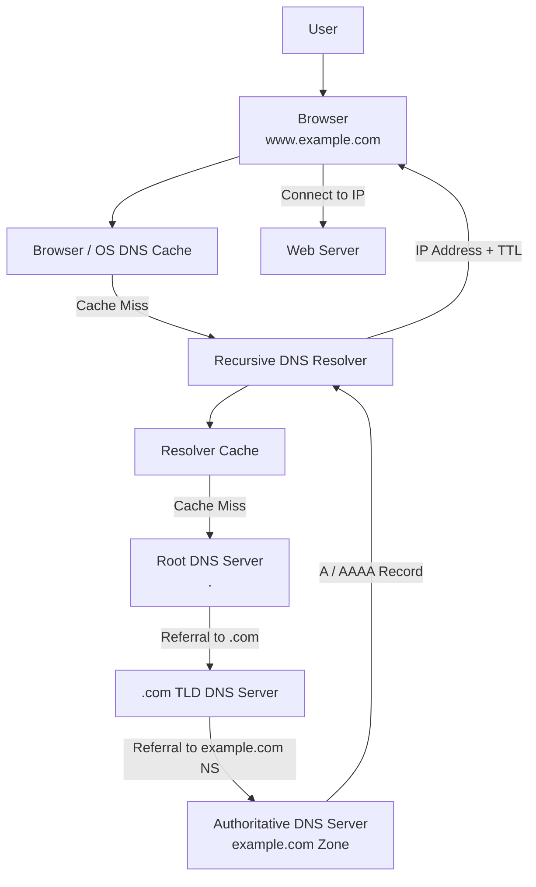

When you enter something like www.example.com into the browser, the first thing the system does is check whether the domain's IP address is already available in a local cache. The browser, operating system, and sometimes other local components can cache DNS information. If the required record is found and its TTL (Time To Live) has not expired, there is no need to perform the complete DNS lookup.

If the answer is not available locally, the query is sent to a Recursive DNS Resolver. This resolver may be provided by your ISP, organization, or a public DNS service. Its job is to find the final answer on behalf of the client. The resolver also maintains its own cache. If it already knows the IP address, it can immediately return the answer; otherwise, it starts querying the DNS hierarchy.

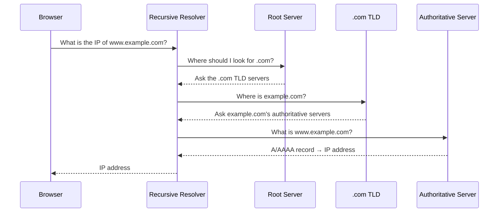

The resolver first contacts the Root DNS Server. The root of the DNS hierarchy is represented by .. The Root does not normally know the final IP address of www.example.com. Instead, it knows where the DNS servers for different Top-Level Domains (TLDs) are located. Since our domain ends in .com, the Root tells the resolver which .com TLD servers it should ask.

The resolver then contacts the TLD (Top-Level Domain) DNS Server responsible for .com. The TLD server also does not normally return the final IP address of www.example.com. Instead, it knows which Authoritative Name Servers are responsible for the example.com domain. It therefore gives the resolver a referral to those authoritative servers.

The resolver then reaches the Authoritative DNS Server for example.com. This is where the actual authoritative DNS information for that domain's zone is maintained. A DNS zone represents the portion of the DNS namespace managed by a particular authoritative DNS system. For example, the example.com zone can contain records for www.example.com, api.example.com, mail.example.com, and other names.

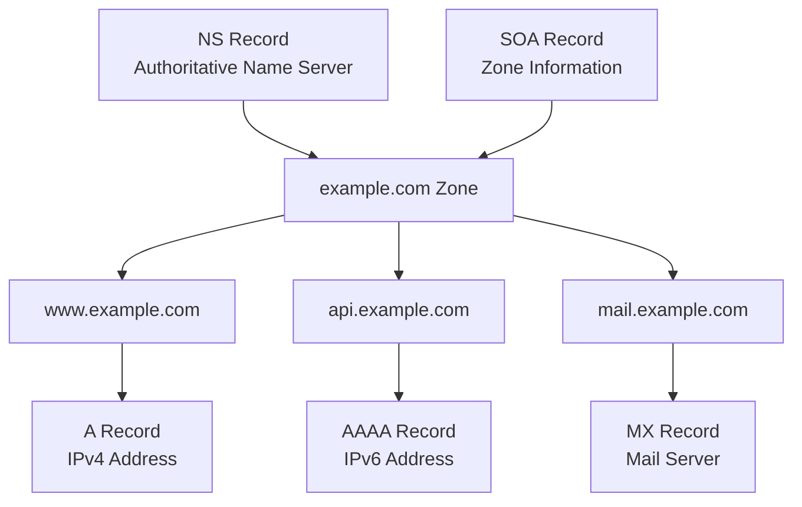

The authoritative server contains different types of DNS records. An A record maps a domain name to an IPv4 address, while an AAAA record maps it to an IPv6 address. An NS record identifies authoritative name servers, a CNAME provides an alias to another domain name, an MX record identifies mail servers, and an SOA record contains important administrative information about the zone.

For our example, the authoritative server may return something conceptually like:

www.example.com
       ↓
A Record
       ↓
93.184.216.x

The recursive resolver receives this answer and sends the IP address back to the browser. The resolver can also cache the DNS record according to its TTL, so future users asking the resolver for the same domain may receive the answer directly from the cache instead of requiring another Root → TLD → Authoritative lookup.

Once the browser receives the IP address, DNS's job is essentially complete. The browser can now connect to the server using that IP address. If the website uses HTTPS, the next stage is the TLS handshake, followed by the actual HTTP communication.

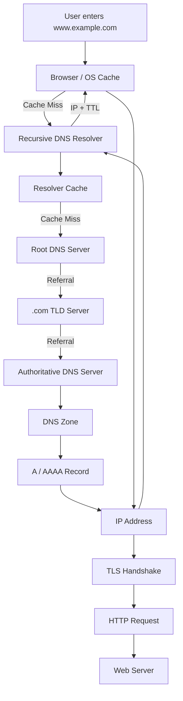

The mental model to remember:

Browser → Local Cache → Recursive Resolver → Root → TLD → Authoritative Server → DNS Record → IP Address → TLS → HTTP → Web Server

# HTTP AND ITS WORKING:
HTTP (HyperText Transfer Protocol) is the communication protocol used between a client (usually a browser) and a server. When a user opens a website or calls an API, the client sends an HTTP request containing information such as the method, URL/path, headers, and sometimes a body. The server processes the request and returns an HTTP response containing a status code, headers, and the requested data.

For example, a browser may send a GET request for /products, and the server may respond with 200 OK and the product data. HTTP follows a request-response model, meaning the client initiates communication and the server responds.

ARCHITECTURE:
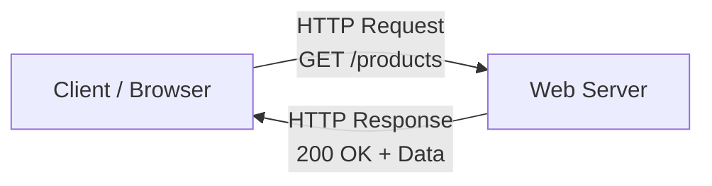

An HTTP request commonly contains method, URL/path, headers, and body, while an HTTP response contains a status code, headers, and response body. Common HTTP methods include GET for retrieving data, POST for creating/submitting data, PUT/PATCH for updating data, and DELETE for removing data. Status codes such as 200, 201, 400, 401, 404, and 500 tell the client what happened to the request.

The problem with normal HTTP is that the communication itself is not encrypted. If sensitive information travels over an insecure connection, an attacker positioned between the client and server could potentially observe or modify the communication. This is the basic Man-in-the-Middle (MITM) problem

# HTTP/1.0 vs HTTP/1.1 vs HTTP/2:

HTTP has evolved mainly to make communication more efficient and scalable. The important difference is how requests and responses are transported between the client and server.

* HTTP/1.0 :-

In HTTP/1.0, the basic model was that a connection was established for communication and, traditionally, closed after the response. If a webpage required many resources such as HTML, CSS, JavaScript, and images, repeatedly creating connections introduced additional overhead.

ARCHITECTURE:
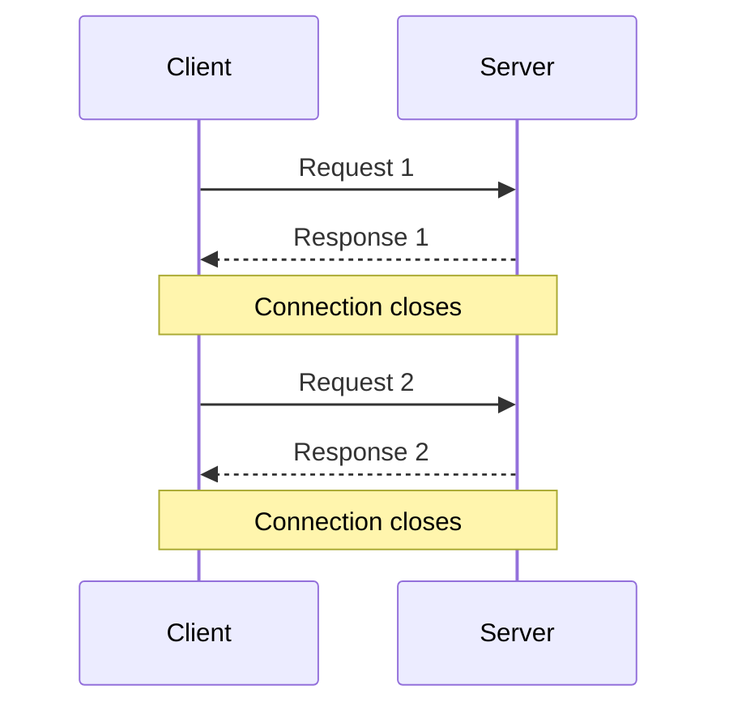

* HTTP/1.1 :-

HTTP/1.1 improved this using persistent connections. The same connection could remain open and be reused for multiple requests and responses instead of repeatedly establishing a new connection.

HTTP/1.1 also introduced important improvements such as the Host header, better caching controls, chunked transfer encoding, and support for persistent connections. However, its request/response model still limited how efficiently many resources could be transferred over a connection.

ARCHITECTURE:
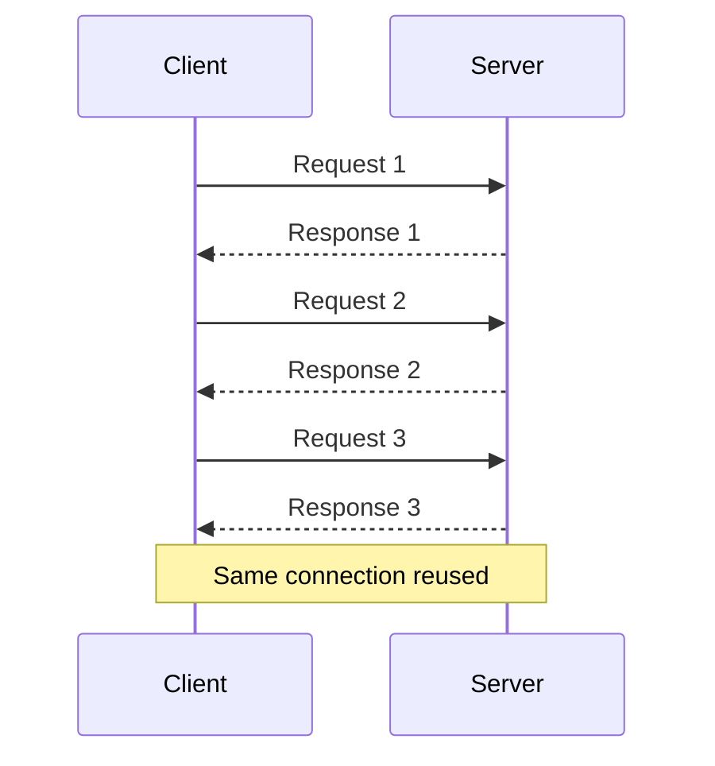

* HTTP/2 :-

HTTP/2 significantly improved performance through multiplexing. Instead of treating the connection as a sequence of independent request-response exchanges, HTTP/2 divides communication into multiple streams. Multiple streams can use the same connection and their data can be interleaved.

ARCHITECTURE:
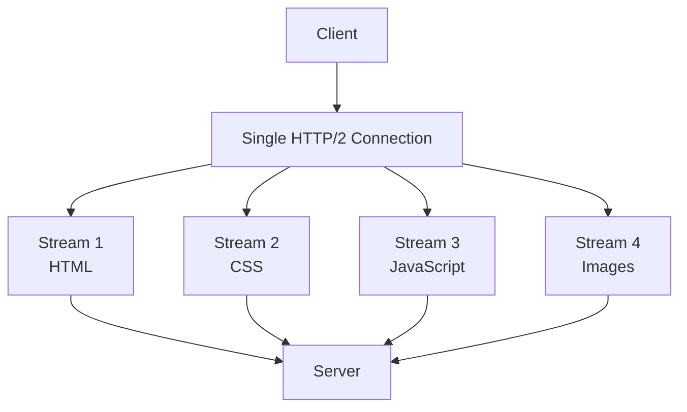

HTTP/2 also introduced binary framing and HPACK header compression, reducing unnecessary overhead when transferring data. The key idea to remember is:

FINAL SUMMARIZED POINTS:
* HTTP/1.0 → Basic communication
* HTTP/1.1 → Persistent connections
* HTTP/2 → Multiplexed streams over a connection

## SSL/TLS and How HTTPS Works:-
Now we have HTTP, but there is a security problem: normal HTTP does not encrypt the communication. We therefore use TLS (Transport Layer Security) to secure HTTP. People still commonly call this an SSL certificate, although modern websites use TLS rather than the old SSL protocol.

The overall architecture becomes:
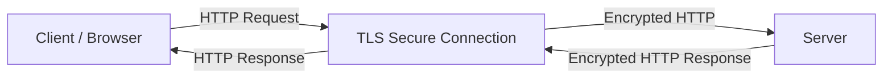

The first problem is encryption. With symmetric encryption, the same secret key is used to encrypt and decrypt data. This is efficient, but the client and server must somehow obtain the same secret key without allowing an attacker to steal it. Simply sending the key over an insecure connection would expose it to a MITM attacker.

This is where asymmetric cryptography helps. The server has a public key and private key. The public key can be shared openly, while the private key remains secret. Asymmetric cryptography can be used during the secure connection establishment process so that the parties can establish shared cryptographic secrets without directly exposing the secret to an attacker.

However, there is another problem: How does the browser know that the public key actually belongs to the real server? A hacker could theoretically intercept the server's public key and replace it with the hacker's own public key. This is another form of MITM attack. The uploaded material uses this exact problem to explain why a certificate is required.

This is where an SSL/TLS certificate comes in. A certificate acts like a digitally signed identity document for a website. It associates the domain name with the server's public key and is signed by a trusted Certificate Authority (CA) such as Let's Encrypt. The browser can verify the certificate and establish that the public key belongs to the expected domain.

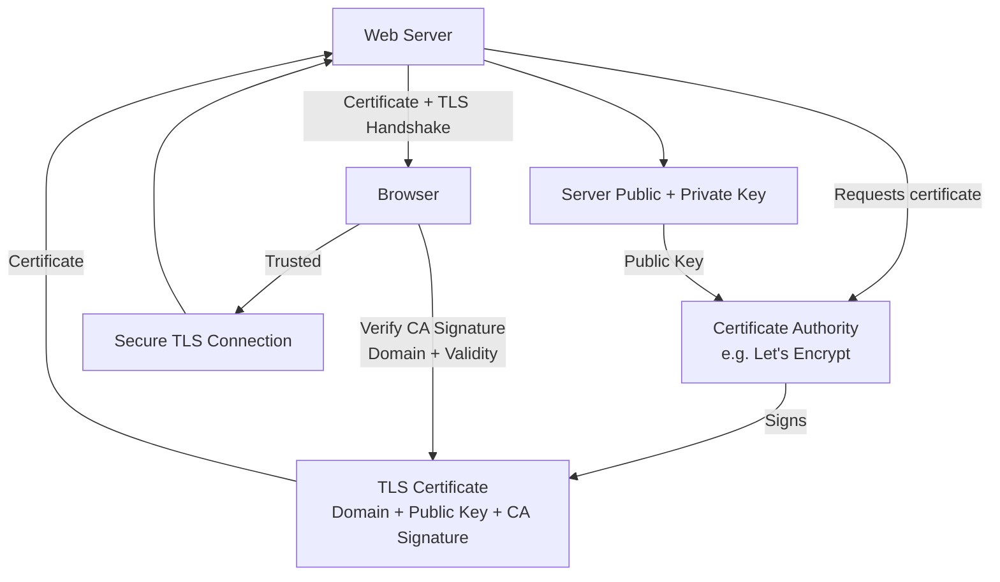

Once the certificate is verified, the client and server complete the TLS handshake and establish shared cryptographic secrets. After that, the actual application data is efficiently protected using symmetric encryption rather than repeatedly using expensive asymmetric operations.

So the complete flow can be remembered as:

ARCHITECTURE:
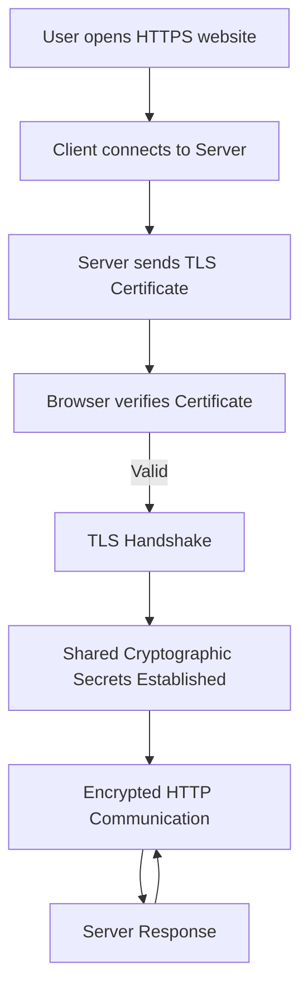

Therefore, HTTPS = HTTP + TLS. HTTP defines how the request and response work, while TLS provides encryption, server authentication, and integrity protection for that communication. The uploaded source specifically explains the progression from unencrypted HTTP, to symmetric encryption, to asymmetric encryption, the MITM problem, and finally certificates and certificate authorities as the trust mechanism.

Final mental model
HTTP
  ↓
Client ↔ Server communication
  ↓
HTTP/1.0 → HTTP/1.1 → HTTP/2
  ↓
Need security
  ↓
TLS
  ↓
Certificate + Authentication
  ↓
Secure key establishment
  ↓
Symmetric encryption
  ↓
HTTPS

