## TYPES OF ARCHITECTURE:-

Modern applications are built using different architectural styles depending on their scale, complexity, team size, and business requirements. The two most common architectural styles used in the industry are Monolithic Architecture and Microservices Architecture.

A startup usually begins with a Monolithic Architecture because it is simple to build and deploy. As the application grows and starts serving millions of users, companies gradually migrate towards a Microservices Architecture to improve scalability, fault tolerance, and independent deployments.

In this chapter, we'll understand both architectures in detail, compare them, and learn how companies migrate from one to the other.

## 1. MONOLITHIC ARCHITECTURE: - 
A Monolithic Architecture is a software architecture in which the entire application is developed as one single codebase, deployed as one deployable unit, and usually connected to one shared database.

Although the application may contain multiple business modules such as Authentication, Orders, Payments, Inventory, Products, and Notifications, all of them exist inside the same application and are deployed together.

You can think of it as one large application containing every feature of the system.

ARCHITECTURE:-
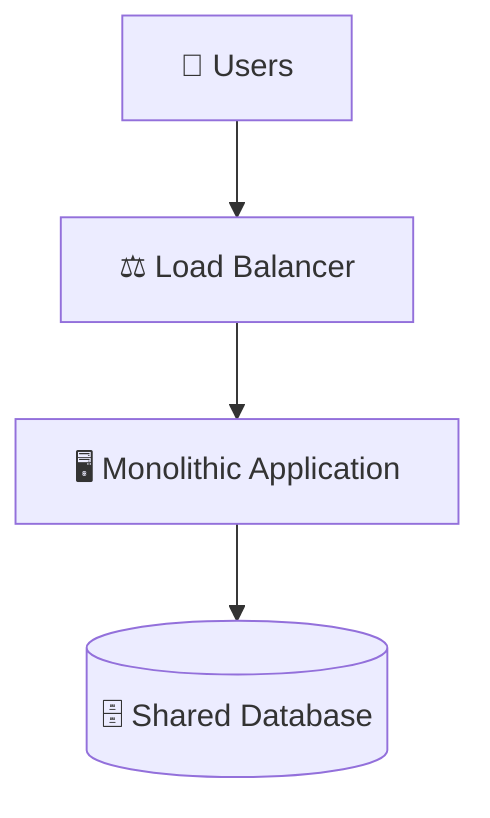

# How It Works:

Whenever a user sends a request, it reaches the Monolithic Application, where all business modules communicate with each other through internal function calls rather than network requests.

For example, when a customer purchases a product, the request flows through multiple modules inside the same application.

Login
   │
   ▼
Cart
   │
   ▼
Order
   │
   ▼
Payment
   │
   ▼
Inventory
   │
   ▼
Notification

Since every module exists within the same application, communication is extremely fast because it does not involve HTTP requests or message brokers.

* Real-World Example:

Imagine the first version of Flipkart.

Instead of having separate services for Login, Products, Cart, Orders, Payments, and Reviews, everything existed inside a single application.

Whenever a customer placed an order, all business modules communicated internally without leaving the application.

This approach is simple to develop and works well for startups because there are fewer components to manage.

# ADVANTAGES OF MONOLITHIC ARCHITECTURE:-

1. SIMPLE TO BUILD - Since the entire application exists in a single codebase, developers only need to build and deploy one application. There is no need to manage service-to-service communication, API gateways, or distributed deployments.

Frontend
    │
    ▼
Backend
    │
    ▼
Database

This simplicity makes monolithic architecture an excellent choice for startups and small teams.

2. EASY DEBUGGING - When something goes wrong, developers only need to debug one application. For example, if a payment fails, all logs, code, and stack traces are available in a single project, making troubleshooting much easier than in a distributed system.

3. EASY TESTING - Since all modules are part of one application, the entire system can usually be tested by running a single project locally.

Run Project
     │
     ▼
Everything Starts

4. BETTER PERFORMANCE - Modules inside a monolithic application communicate using function calls, which are significantly faster than network-based communication such as HTTP, gRPC, or Message Queues.

For example:

OrderService.placeOrder();
↓
PaymentService.processPayment();

This is simply a function call inside the same process, making communication extremely fast.

# DISADVANTAGES OF MONOLITHIC ARCHITECTURE:-

Although a Monolithic Architecture is simple to develop and deploy initially, it becomes increasingly difficult to maintain as the application grows. Since all business modules exist within a single application, problems in one module can affect the entire system. As the number of users, developers, and features increases, the limitations of a monolithic architecture become more apparent.

1. SINGLE POINT OF FAILURE - In a monolithic application, all modules run inside the same deployment. If one critical module crashes and destabilizes the application, it can bring down the entire system. Since every feature depends on the same application process, the failure of a single module may make all other modules unavailable.

Example: Imagine an e-commerce application containing the following modules:

* Authentication
* Products
* Orders
* Payment
* Notifications

Suppose the Payment Module crashes because of a memory leak. As a result, the entire application becomes unstable and may stop responding. 
Customers are no longer able to:
* Login
* Browse Products
* Place Orders
* Make Payments

Even though only the Payment module failed, every feature becomes unavailable because everything is deployed together.

Payment Bug
      │
      ▼
Application Crash
      │
      ▼
Entire Website Becomes Unavailable

2. DEPLOYMENT BOTTLENECK - A monolithic application is deployed as one deployable unit. Therefore, even a very small change in one module requires rebuilding, testing, and deploying the entire application.

Example: Suppose a developer changes only the Payment Logo.

Although the change affects only the Payment module, the entire application—including Login, Orders, Products, Cart, Reviews, and Notifications—must be rebuilt and redeployed.

Small Change
      │
      ▼
Build Entire Application
      │
      ▼
Deploy Entire Application

As the application grows larger, deployment becomes slower, more time-consuming, and riskier because even a tiny modification requires releasing the whole system.

3. INDIVIDUAL SCALING PROBLEMS - In a monolithic architecture, individual modules cannot be scaled independently. If one module experiences heavy traffic, the entire application must be replicated instead of scaling only the busy component.

Example: Consider Amazon during Prime Day.

* Payment        → 100,000 Requests/sec
* Authentication →     500 Requests/sec
* Inventory      →     700 Requests/sec

Only the Payment Module requires additional resources.

However, because the application is monolithic, the only option is to deploy another complete copy of the application.

Need More Payment Capacity
          │
          ▼
Deploy Another Monolith
          │
          ▼
Authentication
Orders
Products
Payment
Inventory
Notifications

As a result, modules such as Authentication and Inventory consume additional CPU, RAM, and Memory even though they don't require extra capacity.
This leads to unnecessary infrastructure costs and inefficient resource utilization.

4. TIGHT COUPLING - Modules inside a monolithic application are tightly coupled, meaning they depend heavily on one another. A change in one module can unintentionally impact several other modules, making development and maintenance increasingly difficult.

Example: Suppose a developer modifies the User Table.

User Table Changed
        │
        ▼
Orders Fail
        │
        ▼
Payments Fail
        │
        ▼
Notifications Fail

Although only one module was modified, the change propagates throughout the application because the modules are strongly dependent on each other.
This makes debugging more difficult and increases the likelihood of introducing unexpected bugs.

Q. Is a Monolithic Application Always Deployed on a Single Server?
Answer: No.

This is one of the most common misconceptions in system design interviews.
A Monolithic Application is a single deployable unit, but it can still run on multiple servers behind a Load Balancer.

Example Architecture:
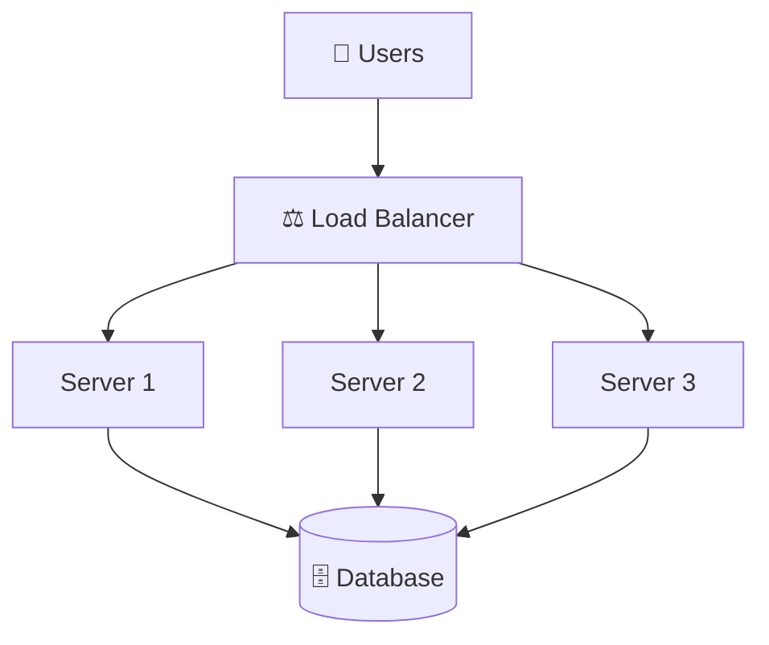

Each server runs the same complete Monolithic Application containing every business module.

For example, every server contains:
* Authentication
* Products
* Orders
* Payment
* Inventory
* Notifications

Now suppose the Payment Module receives significantly higher traffic than the other modules.

Q. Can we simply deploy another Payment Service?
ANS - No.

Since every server contains the entire application, the only option is to deploy another complete copy of the monolith.

Need More Payment Capacity
          │
          ▼
Deploy Another Monolithic Application
          │
          ▼
   Authentication
      Products
      Orders
      Payment
      Inventory
   Notifications

This approach is known as Horizontal Scaling of a Monolith. Although more servers are added, each server still contains every module, making it impossible to scale only the Payment functionality independently.

## 2. MICROSERVICES ARCHITECTURE:
A Microservices Architecture is an architectural style in which an application is divided into small, independent, and loosely coupled services, where each service is responsible for a single business capability.

Unlike a monolithic application, every microservice is developed, deployed, and scaled independently. Each service owns its own codebase, usually maintains its own database, and communicates with other services through APIs or Message Brokers.

This architecture enables organizations to build highly scalable, fault-tolerant, and maintainable distributed systems.

Each service:
* Has its own codebase
* Can be deployed independently
* Can be scaled independently
* Often owns its own database
* Communicates with other services using APIs or messaging

ARCHITECTURE:
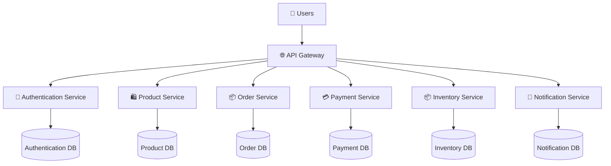

This architecture follows the Database-per-Service Pattern, where every microservice owns and manages its own database. Instead of sharing a single database, each service independently stores and controls its own data, reducing coupling between services.

# How It Works:

When a client sends a request, it first reaches the API Gateway. The API Gateway acts as the single entry point into the system and forwards the request to the appropriate microservice.

Suppose a customer places an order:

User
   │
   ▼
API Gateway
   │
   ▼
Order Service
   │
   ├────────► Payment Service
   │
   ├────────► Inventory Service
   │
   └────────► Notification Service

Each service performs only its own responsibility.
* Order Service creates the order.
* Payment Service processes the payment.
* Inventory Service reserves stock.
* Notification Service sends confirmation emails or SMS.

Instead of directly calling internal modules like a monolith, these services communicate over the network using REST APIs, gRPC, or Message Brokers such as Kafka or RabbitMQ.

# REAL WORLD EXAMPLE:
Consider an e-commerce platform such as Amazon.

Instead of one large application containing every feature, Amazon divides its platform into multiple independent services.

* Authentication Service
* Product Service
* Cart Service
* Order Service
* Payment Service
* Inventory Service
* Search Service
* Recommendation Service
* Notification Service

Each team owns its respective service and can develop, deploy, and scale it independently without affecting the rest of the system.

For example, if Amazon introduces a new payment gateway, only the Payment Service needs to be updated. The Order, Product, and Inventory services continue running without any changes.

# ADVANTAGES OF MICROSERVICES ARCHITECTURE: 
1. INDEPENDENT DEPLOYMENT - Each microservice can be deployed independently without redeploying the entire application.

For example, if only the Payment Service is updated, developers can deploy just that service while the rest of the application continues running normally.

Payment Service Updated
        │
        ▼
Deploy Payment Service
        │
        ▼
No Impact on Other Services

This significantly reduces deployment time and minimizes the risk of affecting unrelated functionality.

2. INDEPENDENT SCALING - Each service can be scaled based on its own traffic requirements.

Suppose the Payment Service experiences very high traffic during a sale.

Payment Service      → 10 Instances

Order Service        → 3 Instances

Notification Service → 2 Instances

Instead of replicating the entire application, only the Payment Service receives additional resources, leading to much more efficient infrastructure utilization.

3. FAULT ISOLATION - Failures remain isolated to individual services.Suppose the Payment Service crashes:

Payment Service ✗ 
      │
      ▼
Order Service ✓
      │
      ▼
Product Service ✓
      │
      ▼
Authentication ✓

Depending on the application's fallback strategy, customers may still browse products, log in, or even place orders while payments are temporarily unavailable.

Unlike a monolithic application, one service failure does not necessarily bring down the entire system.

4. SMALLER, INDEPENDENT TEAMS - Microservices enable organizations to organize teams around business capabilities rather than the entire application.

For example:
* Authentication Team
* Order Team
* Payment Team
* Inventory Team
* Recommendation Team

Each team owns its own service, making development faster, reducing merge conflicts, and allowing independent release cycles.

5. TECHNOLOGY FLEXIBILITY - Unlike a monolithic application, every service can use the technology stack best suited to its requirements.

For example:
* Payment Service         → Java + PostgreSQL
* Recommendation Service  → Python + Redis
* Search Service          → Elasticsearch
* Notification Service    → Go + RabbitMQ

This allows teams to choose the most appropriate language, framework, and database without affecting other services.

# Q. HOW TO MIGRATE FROM A MONOLITHIC ARCHITECTURE TO MICROSERVICES

Migrating from a Monolithic Architecture to Microservices is not a one-time activity or a complete rewrite of the application. Instead, it is a gradual, incremental process in which individual modules are extracted one at a time while the remaining application continues to run as a monolith.
Attempting to split every module at once significantly increases the risk of introducing bugs, causing downtime, and delaying development. Therefore, organizations typically adopt a phased migration strategy, where services are extracted, tested, deployed, and monitored independently before moving on to the next module.

The goal of migration is to minimize risk while gradually transforming the system into a scalable, loosely coupled, and highly available distributed architecture.

1. UNDERSTAND THE MONOLITHIC ARCHITECTURE - Before extracting any service, it is essential to understand how the existing monolithic application works. Developers need to identify all business modules, dependencies, shared libraries, databases, and request flows.

Without understanding these dependencies, extracting a service may unintentionally break other parts of the application.

Example: Consider an e-commerce application consisting of the following modules.

* Authentication
* Products
* Cart
* Orders
* Payments
* Inventory
* Notifications

Some modules communicate heavily with each other, while others are relatively independent.

The first step is to identify:
* Business Modules
* Module Dependencies
* Shared Database Tables
* External Integrations
* Request Flow
* Frequently Changing Modules

Understanding these relationships helps determine which modules can be safely extracted first.

ARCHITECTURE:-
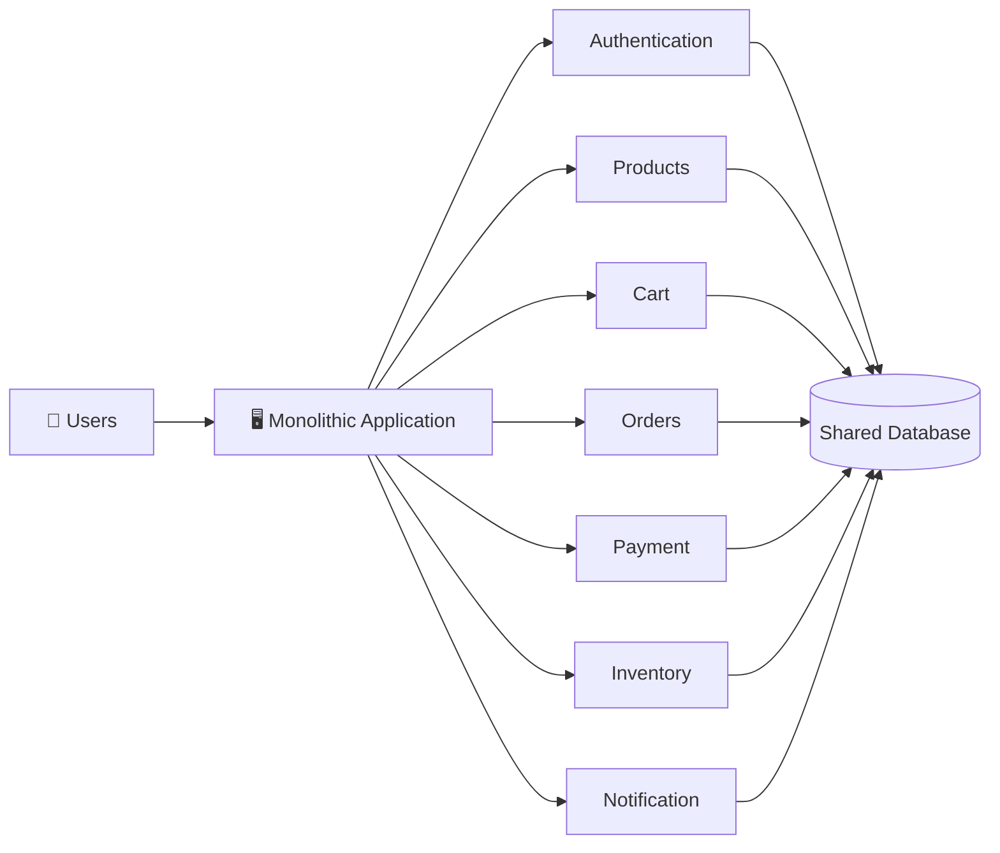

2. IDENTIFYING HIGH IMPACT MODULES - Instead of splitting the entire application immediately, begin with modules that provide the highest business value while having the fewest dependencies.

These modules are generally easier to extract and reduce migration risk.

# Good Candidates - 

Typical first microservices include:
* Notification Service
* Search Service
* Recommendation Service
* Payment Service

These services often have clear boundaries and can operate relatively independently.

# Poor Candidates -

Avoid extracting highly coupled modules initially.
Examples include:
* Authentication
* Orders
* Inventory

These services interact with many other modules and are usually migrated later.

ARCHITECTURE:-
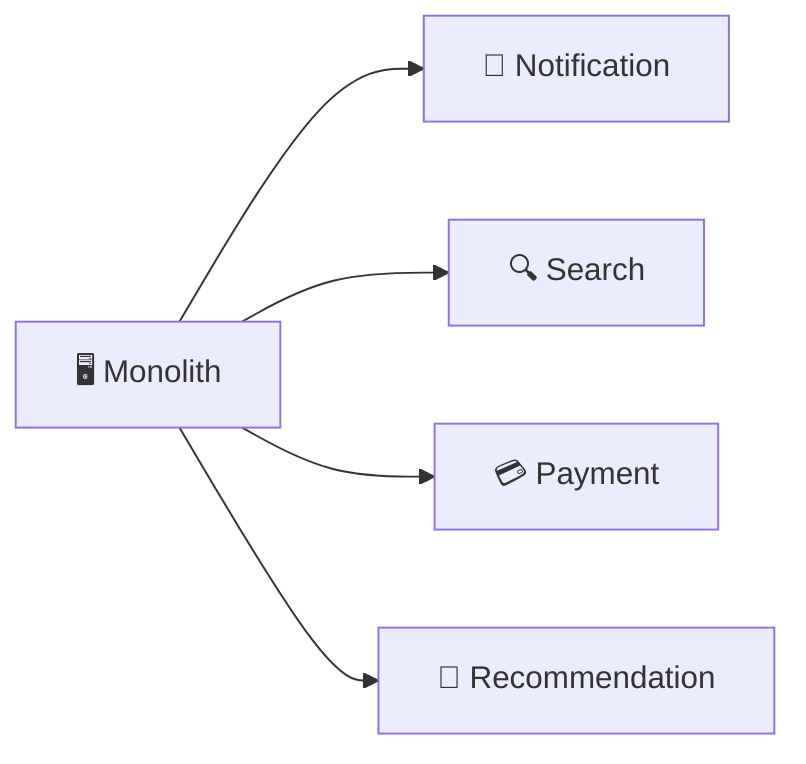

3. DESIGN SERVICE - After extracting a module into a microservice, it must communicate with the remaining monolith or other microservices. This communication is generally of two types:

* Synchronous Communication – The caller waits for an immediate response.
* Asynchronous Communication – The caller sends a message and continues processing without waiting.

i}. Synchronous Communication - In synchronous communication, one service directly calls another service and waits for its response before continuing.

ARCHITECTURE:-
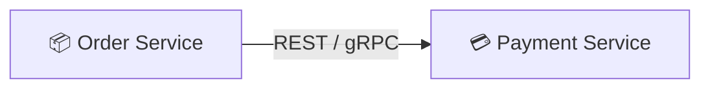

Common Technologies:
* REST API – Simple, HTTP-based communication using JSON.
* gRPC – High-performance communication using Protocol Buffers.
* GraphQL – Allows clients to request only the required data.

Best Used For:
* CRUD Operations
* Payment Processing
* Authentication
Client-Server Communication

ii}. Asynchronous Communication - In asynchronous communication, a service publishes a message to a Message Broker and continues its execution. Other services consume the message whenever they are ready.

ARCHITECTURE:-
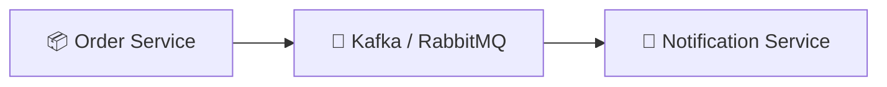

Common Technologies:
* Apache Kafka
* RabbitMQ
* Amazon SQS
* Google Pub/Sub

Best Used For:
* Notifications
* Email Processing
* Analytics
* Background Jobs
* Event-Driven Systems

4. EXTRACT ONE SERVICE AT A TIME - Migration should always be incremental. Rather than rewriting the entire application, extract a single module, convert it into a microservice, validate its behavior, and only then proceed to the next module.

Migration Flow:
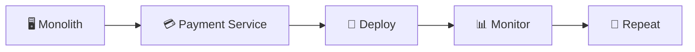

5. TEST, DEPLOY AND MONITOR - After deployment, continuously monitor the newly extracted service to ensure it behaves correctly under production traffic.

Typical metrics include:
* Latency
* Error Rate
* CPU Usage
* Memory Usage
* Request Throughput
* Logs
* Distributed Traces

Common Monitoring Tools
* Prometheus
* Grafana
* ELK Stack
* Jaeger
* Zipkin

Architecture
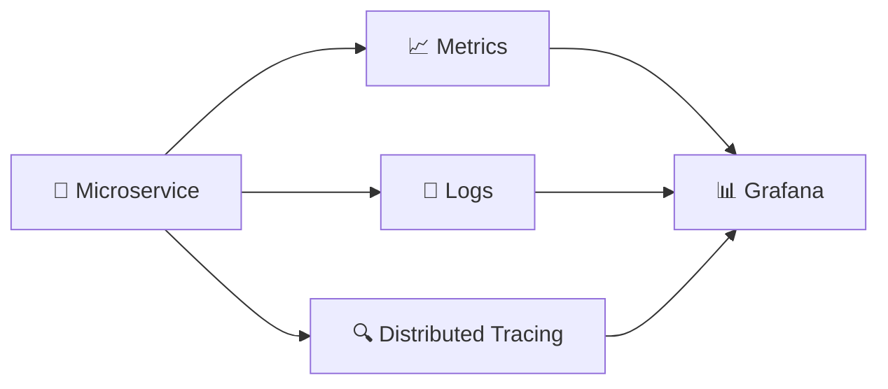

6. SCALE AND OPTIMIZE - Once the service has been validated, it can be scaled independently based on production traffic. Unlike a monolithic application, only the services experiencing high demand require additional resources.

Example:
* Payment Service        → 20 Instances
* Order Service          → 5 Instances
* Notification Service   → 2 Instances

This improves infrastructure utilization while reducing operational costs.

## MICROSERVICES DESIGN PATTERNS:- 

As applications grow into distributed systems, simply splitting a monolithic application into multiple microservices is not enough. Services must communicate reliably, maintain data consistency, recover from failures, and scale independently. To solve these challenges, software engineers use a set of proven Microservices Design Patterns.

In this section, we'll explore the most commonly used design patterns in modern distributed systems.

1. API GATEWAY PATTERN - The API Gateway Pattern introduces a single entry point through which all client requests pass before reaching the appropriate microservice. Instead of clients communicating directly with multiple services, they interact only with the API Gateway, which handles request routing, authentication, rate limiting, load balancing, and response aggregation.

ARCHITECTURE:-
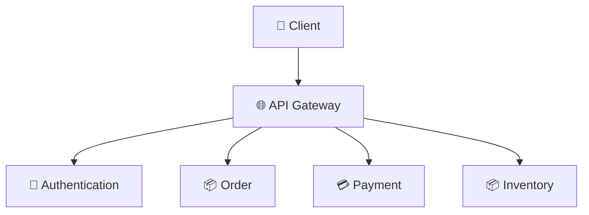

# ADVANTAGES: 
* Single Entry Point
* Request Routing
* Authentication & Authorization
* Rate Limiting
* Load Balancing
* Response Aggregation

2. DATABASE PER SERVICE PATTERN - Almost every microservice needs to store data. Instead of storing all data in one shared database, the Database per Service Pattern gives each microservice its own dedicated database.

A service is the only owner of its database. Other services cannot directly access its tables. If another service needs data, it must request it through the service's API or receive it through events/messages. This follows one of the core principles of microservices: Loose Coupling.

ARCHITECTURE:-
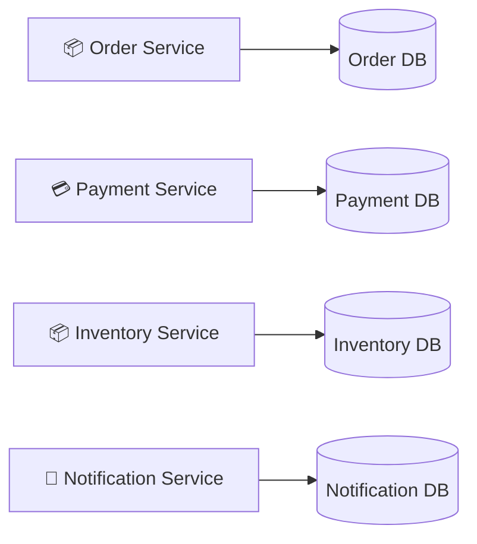

# Q. Why do we need this pattern?

Imagine an E-Commerce application.

If all services use a single shared database, then:

Shared Database: 
* Orders Table
* Payments Table
* Inventory Table
* Users Table
* Products Table

Problems:
* Every service depends on the same database.
* One schema change can break multiple services.
* Scaling becomes difficult.
* Database becomes a bottleneck.
* Teams cannot deploy independently.

Instead:-
Order Service
     │
 Order DB

Payment Service
      │
 Payment DB

Inventory Service
       │
 Inventory DB

Each team completely controls its own database.

# Real World Example (Amazon):
Service	                       Database
Order Service	                PostgreSQL
Payment Service	               MySQL
Recommendation Service	      Neo4j (Graph DB)
Search Service	               Elasticsearch
Analytics Service	         Redshift / Data Warehouse
Chat Service	                Cassandra

* Notice something?
Every service uses the database that best suits its needs. This is called Polyglot Persistence.

# RULES OF DATABASE PER SERVICE PATTERN:

* RULE 1 - A service owns its database.

Order Service
      │
Order Database

Only Order Service can read/write Order Database.

* RULE 2 - No direct database access.

❌ Wrong

Payment Service
        │
        ▼
 Order Database

Payment Service should never directly access Order DB.

✅ Correct

Payment Service
       │
 REST/gRPC/Event
       ▼
 Order Service
       │
 Order Database

The Payment Service requests information from the Order Service, which accesses its own database and returns the result.

# ADVANTAGES: 
* Loose Coupling - Each service is independent because it does not depend on another service's database. Services communicate only through APIs or asynchronous events, not by directly querying each other's tables. This separation allows every service to evolve, deploy, and scale independently without tightly coupling the internal database structures.

* Independent Scaling - Each service can scale its application and database independently according to its own workload, instead of scaling the entire system. Different services receive different traffic. Therefore, forcing every service to use the same database leads to wasted resources and bottlenecks.

* Independent Deployment - Each microservice can be developed, tested, deployed, and updated independently because it owns its own database and does not share database schemas with other services.

* Better Fault Isolation - If one service's database fails, only that service is affected. The rest of the system continues functioning because each service has its own isolated database.

3. STRANGLER FIG PATTERN - The Strangler Fig Pattern is a migration strategy where new functionality is gradually extracted from a monolithic application into microservices. Over time, the monolith shrinks until it can be completely removed.

ARCHITECTURE:-
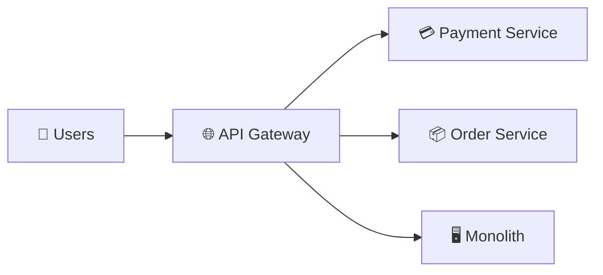

# ADVANTAGES: 
* Low-Risk Migration
* Incremental Modernization
* No Complete Rewrite

4. SAGA PATTERN - In a microservices architecture, there is no single database transaction across multiple services. The Saga Pattern maintains business consistency by executing a sequence of local transactions. If one step fails, previously completed steps are reversed using Compensating Transactions.

ARCHITECTURE:-
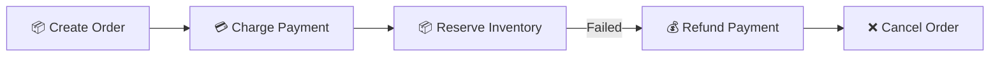

# ADVANTAGES: 
* No Distributed Transactions
* Better Scalability
* Maintains Business Consistency

Saga can be implemented in two ways.

* Choreography - Each service reacts to events independently without a central coordinator.

ARCHITECTURE:-
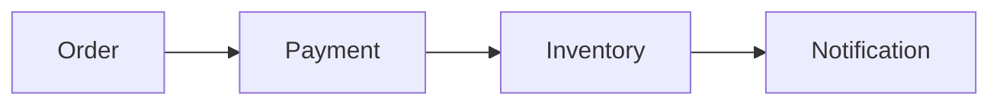

Advantages:
* No Central Coordinator
* Loosely Coupled
* Event Driven

* Orchestration - A central Saga Orchestrator coordinates every step of the workflow.

ARCHITECTURE:-
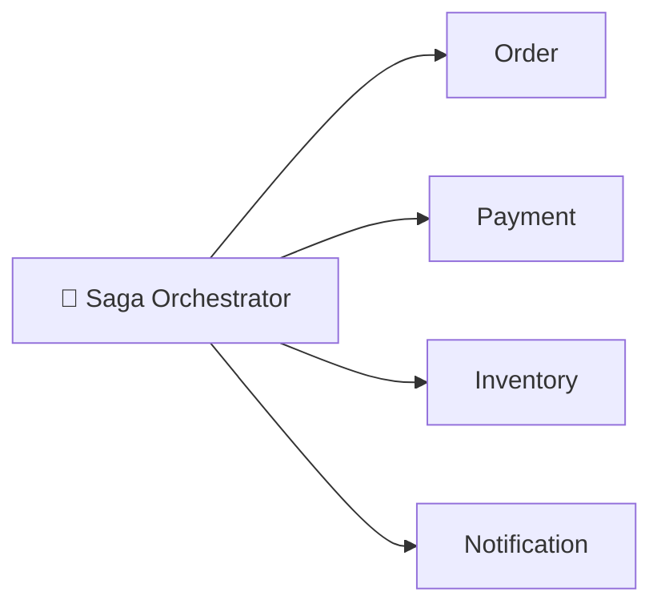

Advantages:
* Easier Monitoring
* Better Control
* Simpler Error Handling

5. OUTBOX PATTERN - The Outbox Pattern ensures that database updates and event publishing remain consistent. Instead of publishing events directly to a message broker, services first store events in an Outbox Table within the same database transaction. A background process later publishes these events to Kafka or RabbitMQ.

ARCHITECTURE:-
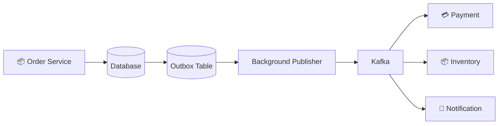

# ADVANTAGES:
* Reliable Event Delivery
* No Lost Events
* Data Consistency
* Eventual Consistency

