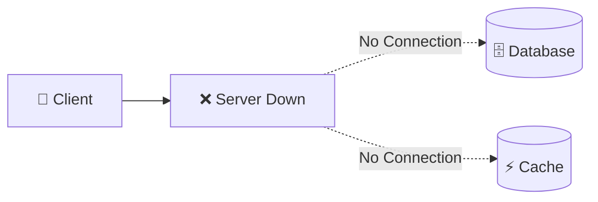
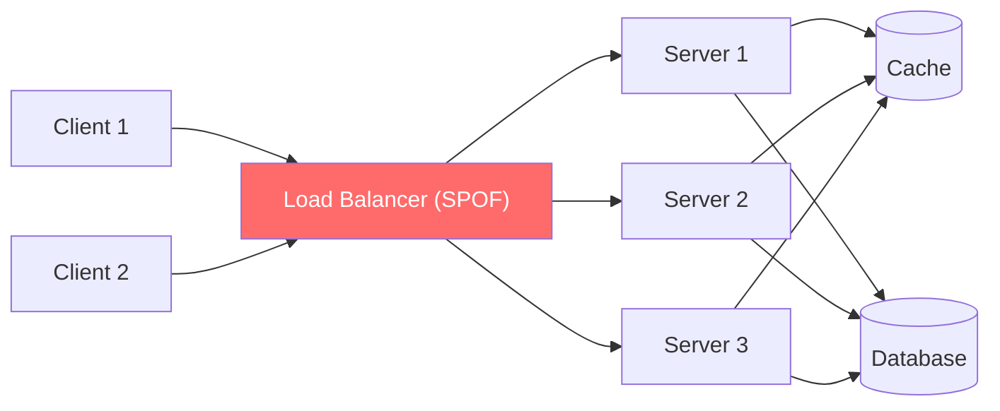
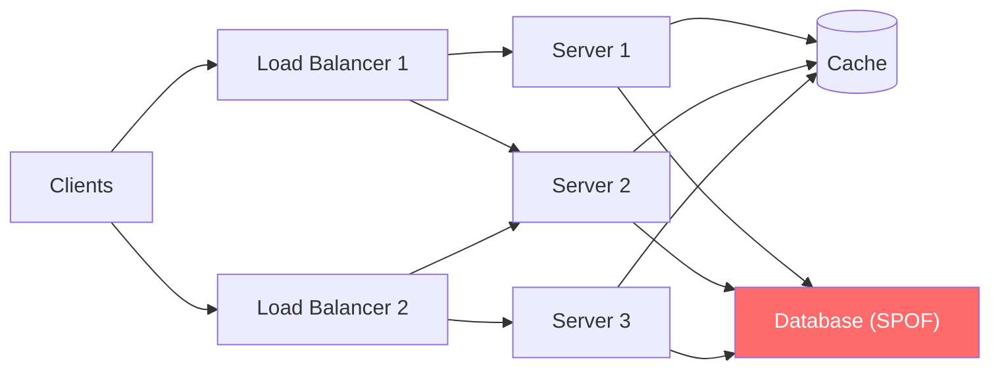
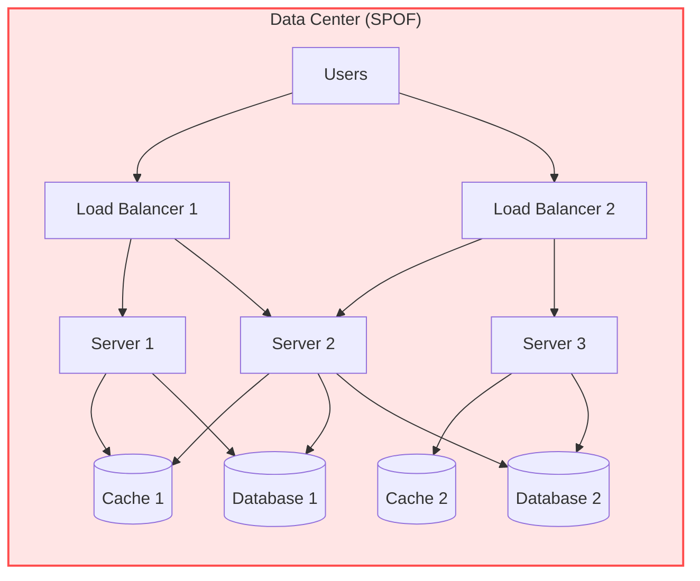
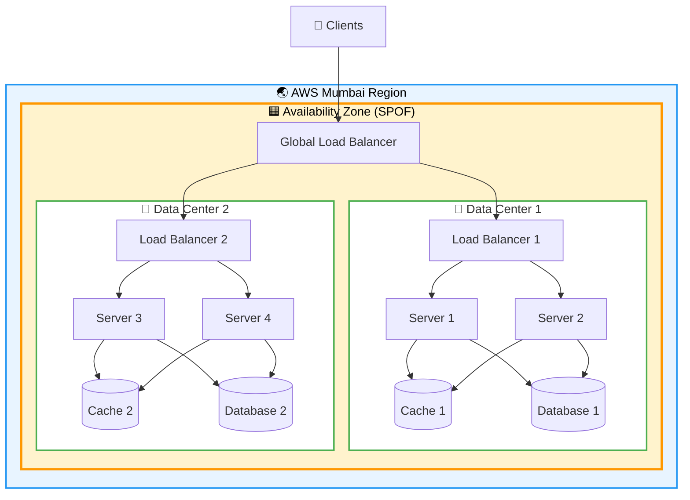
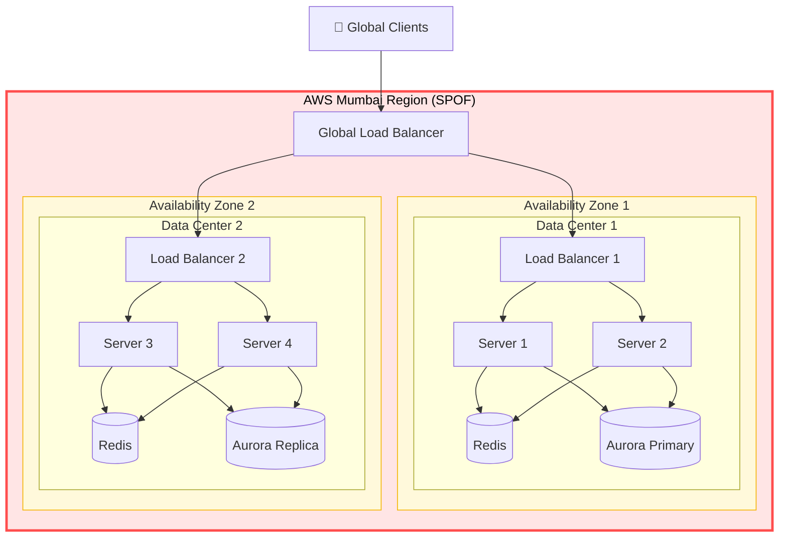
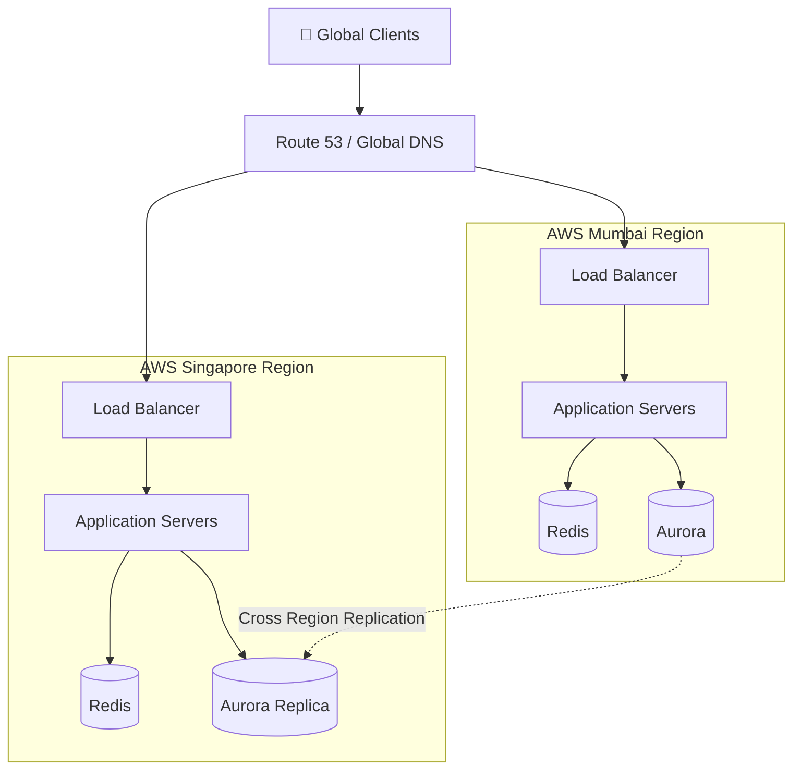
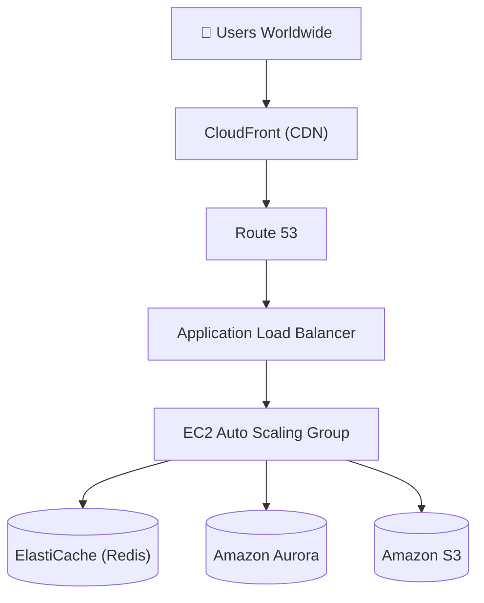

# Single Point of Failure (SPOF):-

A Single Point of Failure (SPOF) is any critical component in a system whose failure can cause the entire application or service to become unavailable. A SPOF reduces High Availability (HA), Fault Tolerance (FT), Reliability, and Resilience, making the system vulnerable to downtime, data loss, and poor user experience.

Imagine an application has only one server. If that server crashes, the entire application becomes unavailable.

That server was the Single Point of Failure.

The same can happen with
* Load Balancer
* Database
* Cache
* Data Center
* Availability Zone
* Region

Anything whose failure stops the whole application is a Single Point of Failure.

# Q. Why Does Single Point of Failure Occur?

A SPOF occurs when there is only one instance of a critical component and no backup (redundancy) to take over if it fails.

Common reasons include:
* Only one application server
* Only one database
* Only one cache server
* Only one load balancer
* Everything deployed in one data center
* Entire application hosted in one AWS region

# Q. Why Should We Remove Single Point of Failure?

Modern applications like Amazon, Netflix, Google, and Uber serve millions of users every second.

Even a few minutes of downtime can result in:
* Millions of dollars in losses
* Failed transactions
* Poor customer experience
* Loss of user trust
* SLA violations

Therefore, systems are designed to be:
* Highly Available
* Fault Tolerant
* Reliable
* Resilient
* Self-Healing

# Q. What Problems Can a SPOF Cause?

* Case 1: Single Server (Single Point of Failure):-

In this architecture, all client requests are sent to a single application server. The server processes every request, performs business logic, communicates with the Database to read/write persistent data, checks the Cache for faster data retrieval, and finally returns the response to the clients. Since there is only one application server, every request in the system depends on that single machine, making it the most critical component in the architecture.

Q. What Happens if the Server Fails?
When the only application server crashes due to hardware failure, software bugs, memory exhaustion, CPU overload, or network issues, no client request can be processed. Although the Database and Cache are still running, clients have no way to access them because every request must pass through the application server. As a result, the entire application becomes unavailable, leading to complete downtime. Since the failure of this single server brings down the whole system, it is called a Single Point of Failure (SPOF).

* Case 2: Single Load Balancer (Single Point of Failure):-

In this architecture, all client requests first reach a single Load Balancer, which distributes traffic among multiple application servers. The Load Balancer ensures requests are routed to healthy servers, preventing any one server from becoming overloaded. Although multiple application servers are available, every incoming request still depends on this single Load Balancer, making it the most critical networking component in the architecture.

Q. What Happens if the Load Balancer Fails?

When the only Load Balancer crashes because of hardware failure, software bugs, misconfiguration, or network issues, it can no longer distribute incoming traffic. Even though all application servers, the Cache, and the Database are healthy, clients cannot reach them because every request must first pass through the Load Balancer. As a result, the entire application becomes unavailable, making the Load Balancer a Single Point of Failure (SPOF).

* Case 3: Single Database (Single Point of Failure):-

In this architecture, incoming requests are distributed among multiple application servers through redundant Load Balancers. The application servers communicate with the Database to store and retrieve critical information such as users, orders, inventory, and payments, while frequently accessed data is served from the Cache. Since there is only one Database, every operation involving persistent data depends on it, making it the most critical storage component.

Q. What Happens if the Database Fails?

When the only Database crashes because of hardware failure, disk corruption, software bugs, or network issues, the application servers can no longer read or write data. Although the Load Balancers, Servers, and Cache are still running, users cannot log in, retrieve products, place orders, or process payments because all persistent data resides in the Database. As a result, the application becomes unavailable or unusable, making the Database a Single Point of Failure (SPOF).

* Case 4: Single Data Center (Single Point of Failure):-

In this architecture, all Load Balancers, application servers, Cache, and Database are deployed inside a single Data Center. Every client request is processed within this physical location. Since the complete infrastructure is hosted inside one Data Center, the entire application depends on its availability.

Q. What Happens if the Data Center Fails?

When the Data Center goes down because of power outages, cooling failures, natural disasters, or networking failures, every application component inside it becomes unavailable. Since there is no backup Data Center to take over, users completely lose access to the application. Therefore, the Data Center becomes a Single Point of Failure (SPOF).

* Case 5: Single Availability Zone (Single Point of Failure):-

In this architecture, every application component is deployed within a single Availability Zone (AZ) of a cloud provider. Although an Availability Zone contains multiple isolated Data Centers, the entire application still depends on that one Availability Zone.

Q. What Happens if the Availability Zone Fails?

If the Availability Zone becomes unavailable due to cloud infrastructure failures, networking problems, or large-scale power outages, every application component deployed inside that AZ becomes unreachable. Since no resources exist in another Availability Zone, the entire application becomes unavailable, making the Availability Zone a Single Point of Failure (SPOF).

* Case 6: Single Region (Single Point of Failure):-

In this architecture, the application has already eliminated the Server, Load Balancer, Database, Data Center, and Availability Zone Single Points of Failure by deploying redundant resources across multiple Data Centers and Availability Zones. However, all of these resources are still deployed inside a single cloud Region (AWS Mumbai). Therefore, the entire application still depends on the availability of that Region, making it the next Single Point of Failure (SPOF).

Q. What Happens if the Region Fails?

If the entire Region becomes unavailable due to a major cloud outage, natural disaster, or regional networking failure, every Availability Zone, Data Center, Load Balancer, Server, Cache, and Database within that Region becomes unreachable. Since there is no deployment in another Region, users across the world lose access to the application. Therefore, the single Region becomes the Single Point of Failure (SPOF).

* Case 7: Multi-Region Architecture (Solution to Region SPOF)

In this architecture, users from around the world access the application through a single cloud Region. Although the Region may internally contain multiple Availability Zones and Data Centers, there is no deployment in any other geographical Region. As a result, the entire global application depends on that single Region.

Q. What Happens if the Global Region Fails?

If the only deployed Region experiences a large-scale outage, disaster, or cloud infrastructure failure, users from every part of the world lose access to the application because there is no secondary Region to take over. This causes complete global downtime, making the single deployed Region the highest-level Single Point of Failure (SPOF).

# Real World Example: AMAZON ARCHITECTURE

# Q. How Amazon Eliminates SPOFs?

Amazon eliminates Single Points of Failure at every layer of its architecture by introducing redundancy and distributing resources across multiple infrastructure components.

CloudFront caches static content at edge locations worldwide, reducing latency and improving availability.
Route 53 performs health checks and routes users to the nearest healthy Region.
Application Load Balancers (ALBs) distribute traffic across multiple EC2 instances.
EC2 Auto Scaling Groups ensure that if one server fails, another automatically replaces it.
ElastiCache (Redis) stores frequently accessed data, reducing database load while being deployed in a highly available configuration.
Amazon Aurora replicates data across multiple Availability Zones, providing automatic failover if the primary database fails.
Amazon S3 stores static assets with extremely high durability and automatic replication across multiple Availability Zones.

As a result, Amazon does not rely on any single server, load balancer, database, data center, availability zone, or region. Instead, redundancy is built into every layer of the architecture, making the system Highly Available, Fault Tolerant, Reliable, and Resilient—the primary goal of eliminating Single Points of Failure (SPOFs).

# Summary: Evolution from Single Point of Failure to Highly Available Systems

Throughout this chapter, we explored different Single Points of Failure (SPOFs) and progressively eliminated them by introducing redundancy at every layer of the system. Each time one SPOF was removed, another dependency became visible, requiring the architecture to evolve further. This step-by-step evolution is how modern distributed systems transform from a simple single-server application into a Highly Available, Fault-Tolerant, Reliable, and Resilient production system.

Single Server
      │
      ▼
Multiple Servers
      │
      ▼
Multiple Load Balancers
      │
      ▼
Replicated / Partitioned Databases
      │
      ▼
Multiple Data Centers
      │
      ▼
Multiple Availability Zones
      │
      ▼
Multi-Region Deployment
      │
      ▼
CDN + Global Traffic Routing

As the architecture evolves, each improvement removes an existing Single Point of Failure, but also introduces new engineering challenges. For example, deploying multiple servers requires intelligent traffic distribution through Load Balancers. Introducing multiple databases improves availability, but now data must remain synchronized across all database instances. Similarly, deploying applications across multiple Data Centers, Availability Zones, and Regions improves fault tolerance but requires mechanisms for replication, failover, health monitoring, and traffic routing.

The ultimate objective is to ensure that no single server, load balancer, database, data center, availability zone, or cloud region can make the entire application unavailable. This layered approach forms the foundation of modern distributed systems used by companies such as Amazon, Netflix, Google, Uber, and Meta.

What's Next?

So far, we have focused on identifying Single Points of Failure and understanding how they affect system availability. The next logical question is:

How do we actually eliminate these Single Points of Failure in real-world production systems?

The answer lies in a set of architectural techniques that work together to build highly available distributed systems. In the next chapter, we'll study these techniques in detail:

Solution 1: Redundancy – Deploying multiple instances of critical components using Active-Active and Active-Passive architectures.
Solution 2: Replication – Maintaining multiple synchronized copies of data to improve availability, durability, and automatic failover.
Solution 3: Graceful Failure Handling – Ensuring the application continues operating during failures using Retries, Timeouts, Circuit Breakers, Fallbacks, and Health Checks.
Solution 4: Geographical Distribution – Deploying infrastructure across multiple Data Centers, Availability Zones, Regions, and CDNs to maximize availability while reducing latency for users around the world.

Together, these techniques enable organizations to build Highly Available, Fault-Tolerant, and Resilient distributed systems capable of serving millions of users with minimal downtime.