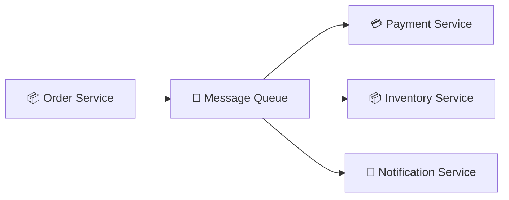
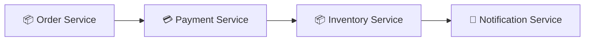
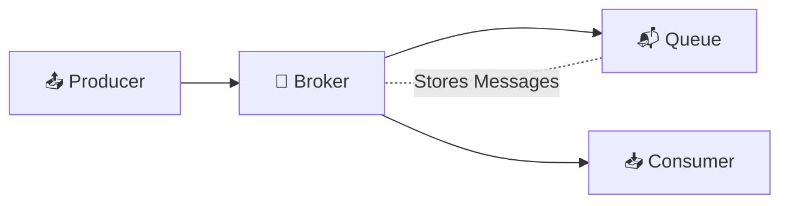
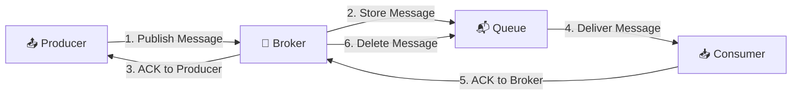
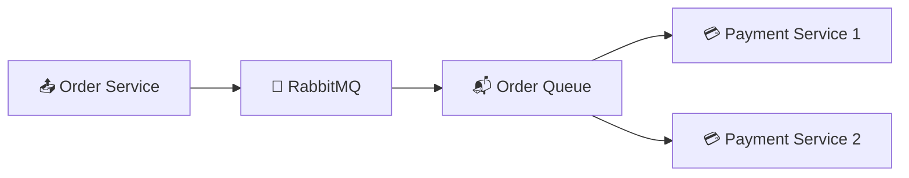
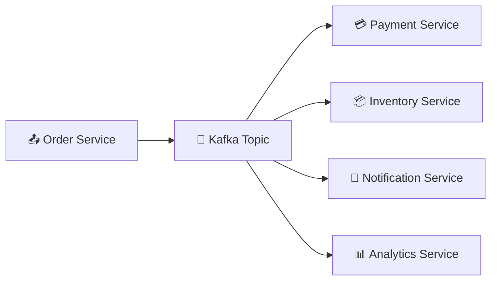
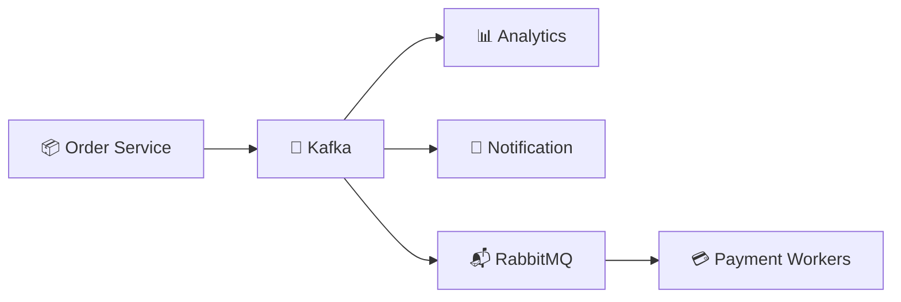
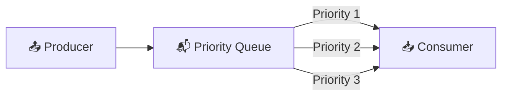
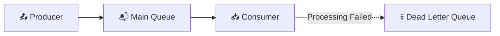

# INTRODUCTION: 
Modern applications such as Amazon, Netflix, Uber, WhatsApp, Swiggy, Zomato, Instagram, and YouTube are built using hundreds or even thousands of independent microservices.

For example, when you place an order on Amazon, a single user action triggers multiple services such as Order Service, Payment Service, Inventory Service, Notification Service, Shipping Service, Invoice Service, Recommendation Service, and Analytics Service.

The biggest challenge is deciding how these services should communicate with each other.

There are two primary communication methods:
* Synchronous Communication
* Asynchronous Communication

While synchronous communication is simple to implement, it becomes difficult to scale as the number of services increases. Modern distributed systems therefore rely heavily on Messaging Queues for asynchronous communication, allowing services to work independently while improving scalability, reliability, and fault tolerance.

## What is a Messaging Queue?

A Messaging Queue is an intermediary communication system that enables different services to exchange messages asynchronously. Instead of communicating directly with one another, a producer sends a message to the queue, where it is temporarily stored until one or more consumers process it.

The queue acts as a reliable buffer between services, ensuring that messages are delivered even if the receiving service is temporarily unavailable.

ARCHITECTURE:

# Real World Example:
Suppose you place an order on Amazon.

Once the order is confirmed:
* Payment Service processes the payment.
* Inventory Service updates product stock.
* Notification Service sends confirmation emails and SMS.
* Shipping Service prepares the shipment.
* Analytics Service records user activity.

Instead of the Order Service calling every service directly, it simply places an event into the Message Queue. Each service independently consumes the message and performs its own task without blocking the others.

## Q. Why Do We Need Messaging Queues?

Initially, most microservices communicate directly using synchronous protocols such as REST APIs or gRPC.

For example, when a customer places an order, the Order Service directly calls the Payment Service, which then calls the Inventory Service, followed by the Notification Service.

ARCHITECTURE: (Synchronous Communication)

This approach is simple and works well for small applications with low traffic.

However, as the number of users and requests increases, direct service-to-service communication starts creating scalability and reliability problems.

1. SYNCHRONOUS COMMUNICATION - Synchronous Communication is a communication model in which one service directly calls another service and waits for a response before continuing its own execution.

Common synchronous protocols include:
* REST API
* gRPC
* SOAP
* GraphQL (Request–Response)

# How It Works:

Suppose a customer places an order.
* Order Service sends a request to Payment Service.
* Payment Service processes the payment.
* Payment Service calls Inventory Service.
* Inventory Service updates the stock.
* Inventory Service returns a response.
* Payment Service returns a response.
* Order Service finally sends a response to the user.

Every service must wait for the previous service to complete before moving to the next step.

Example

When placing an order on an e-commerce website, the Order Service waits for Payment, Inventory, and Notification services to finish before showing "Order Placed Successfully" to the user.

* PROBLEMS WITH SYNCHRONOUS COMMUNICATION:

1. Availability Problem - If one downstream service becomes unavailable, the entire request fails.
Example: If the Payment Service crashes, the Order Service cannot continue processing the order because it is waiting for a response.

2. Delayed Response - Every service waits for the previous one to finish.

Example:

Order Service

↓

Payment (400 ms)

↓

Inventory (300 ms)

↓

Notification (200 ms)

↓

Response to User

Total response time becomes:

400 + 300 + 200 = 900 ms

The user waits until every service finishes.

3. Data Loss - Suppose the Order Service sends a request to the Notification Service.
If the Notification Service crashes before processing the request, the notification request may be permanently lost because there is no temporary storage.

# Why Do These Problems Occur?

The root cause is Tight Coupling. Each service directly depends on another service being available and responding immediately.
If one service becomes slow or unavailable, all dependent services are affected, leading to cascading failures.

2. ASYNCHRONOUS COMMUNICATION - Asynchronous Communication is a communication model in which a service does not wait for another service to complete its work. Instead, it sends a message to a Messaging Queue and immediately continues its own execution.

Other services consume and process the message independently whenever they are ready.

ARCHITECTURE: (Asynchronous Communication)

# How It Works:

Suppose a customer places an order.
* Order Service creates an Order Placed event.
* The event is published to the Message Queue.
* Order Service immediately responds to the user.
* Payment Service consumes the message and processes payment.
* Inventory Service updates stock independently.
* Notification Service sends email or SMS independently.

All services work independently without blocking one another.

Example: When you place an order on Amazon, the confirmation page appears almost instantly.

In the background:
* Payment is verified.
* Inventory is updated.
* Invoice is generated.
* Email and SMS notifications are sent.

All these tasks happen asynchronously through a Messaging Queue.

# HOW MESSAGING QUEUES SOLVE THESE PROBLEMS:

Problem in Synchronous Communication	            Solution Using Messaging Queue
* Availability	                        Services are decoupled. If a consumer is temporarily down, messages remain safely stored in queue until it recovers.
* Delayed Response	                    The producer publishes the message and immediately responds to the user without waiting for downstream services.
* Data Loss	                            Messages are stored persistently inside the queue until they are successfully processed and acknowledged by the consumer.

## CORE COMPONENTS OF A MESSAGING QUEUE

A Messaging Queue consists of four main components that work together to enable reliable asynchronous communication between microservices.

ARCHITECTURE:

1. PRODUCER - A Producer is the service or application that creates a message and sends it to the Message Broker. It does not communicate directly with consumers and does not wait for the message to be processed.

Example: When a customer places an order, the Order Service acts as the Producer by publishing an Order Placed event to the Message Queue.

2. CONSUMER (SUBSCRIBER) - A Consumer is the service that receives messages from the queue and processes them. Multiple consumers can independently consume different messages from the queue.

Example: After an order is placed, the Payment Service, Inventory Service, and Notification Service act as Consumers by processing their respective tasks.

3. MESSAGE QUEUE - A Message Queue is a temporary storage that holds messages until they are successfully processed by consumers. It acts as a buffer between producers and consumers, preventing message loss during failures.

Example: If the Payment Service is temporarily unavailable, the Order message remains safely stored inside the queue until the Payment Service becomes available again.

4. BROKER (QUEUE MANAGER) - A Broker is the software responsible for receiving messages from producers, storing them in queues, delivering them to consumers, and managing acknowledgements, retries, and message persistence.

Popular Message Brokers include:
* RabbitMQ
* Apache Kafka
* Amazon SQS
* ActiveMQ

Example: When the Order Service publishes a message, RabbitMQ receives it, stores it inside the queue, and later delivers it to the Payment Service for processing.

RESPONSIBILITIES OF THE BROKER:
* Receives messages from Producers.
* Stores messages inside Queues.
* Delivers messages to Consumers.
* Handles Acknowledgements (ACKs).
* Retries failed messages.
* Ensures reliable message delivery.

## HOW DO MESSAGE QUEUES WORK?
When a Producer sends a message, it doesn't directly communicate with the Consumer. Instead, the message passes through the Message Broker, which stores, manages, and delivers it reliably.

A message consists of two parts:
* Payload – The actual business data.
* Metadata – Additional information such as Message ID, Timestamp, Priority, Retry Count, Headers, etc.

COMPLETE MESSAGE LIFECYCLE:

STEP 1: MESSAGE CREATION - The Producer creates a message containing the Payload and Metadata and sends it to the Message Broker.

Example: The Order Service creates an Order Placed event after a customer successfully places an order.

STEP 2: MESSAGE STORED IN QUEUE - The Broker receives the message and stores it inside the Queue.

Depending on the configuration, the message may be stored temporarily in memory or permanently on disk.

STEP 3: ACKNOWLEDGEMENT TO PRODUCER - After successfully storing the message, the Broker sends an Acknowledgement (ACK) to the Producer. This confirms that the message has been safely accepted.

STEP 4: MESSAGE DELIVERED TO CONSUMER - Whenever a Consumer becomes available, the Broker delivers the message from the Queue for processing.

STEP 5: ACKNOWLEDGEMENT FROM CONSUMER - After successfully processing the message, the Consumer sends an ACK back to the Broker. This informs the Broker that processing has completed successfully.

STEP 6: MESSAGE REMOVAL - Once the Broker receives the Consumer's ACK, it safely removes the message from the Queue. This ensures that the same message is not processed again.

# REAL WORLD EXAMPLE:
Suppose a customer places an order on Amazon.

Order Service
      │
      ▼
Creates Order Placed Event
      │
      ▼
RabbitMQ / Kafka
      │
      ▼
Stores Message
      │
      ▼
Payment Service Processes Payment
      │
      ▼
ACK Sent
      │
      ▼
Message Deleted

The Order Service finishes immediately, while the Payment Service processes the request independently in the background.

# WHAT IF THE CONSUMER CRASHES?
Suppose the Payment Service crashes while processing a message.

Producer
     │
     ▼
Broker
     │
     ▼
Queue
     │
     ▼
Payment Service ❌ Crash

Since no ACK is received, the Broker does not delete the message. The message remains safely stored in the Queue until the Payment Service recovers or another Consumer processes it.

This prevents message loss and provides reliable delivery.

Q. Why does a Broker wait for an ACK before deleting a message?
Answer: The ACK confirms that the Consumer has successfully processed the message. Without an ACK, the Broker retains the message in the Queue, preventing data loss if the Consumer crashes or fails during processing.

## TYPES OF MESSAGING QUEUES:

Different applications have different communication requirements. Some applications require one service to process each message, while others require multiple services to receive the same message.

To support these scenarios, Message Queues provide different messaging models:

1. Point-to-Point Queue (RabbitMQ)
2. Publish/Subscribe (Kafka)
3. Priority Queue
4. Dead Letter Queue

1. POINT-TO-POINT QUEUE (RabbitMQ) - A Point-to-Point (P2P) Queue is a messaging model in which a Producer sends a message to a Queue, and only one Consumer processes that message. Although multiple Consumer instances may exist for scalability, each message is consumed by only one Consumer.

RabbitMQ is one of the most popular implementations of the Point-to-Point messaging model.

ARCHITECTURE:

# HOW IT WORKS:
* The Producer publishes a message to RabbitMQ.
* RabbitMQ stores the message inside the Queue.
* One available Consumer receives the message.
* After successful processing, the Consumer sends an ACK.
* RabbitMQ removes the message from the Queue.

Only one Consumer processes each message.

# REAL WORLD EXAMPLE:
Suppose a customer places an order on Amazon.

The Order Service publishes an Order Placed message.

RabbitMQ stores the message, and one instance of the Payment Service processes the payment. Even if multiple Payment Service instances are running, only one instance processes that particular order.

# USE CASES:
1. SCALING - RabbitMQ acts as a buffer between Producers and Consumers. If thousands of requests arrive simultaneously, messages remain safely stored in the Queue while Consumers process them at their own capacity.

This prevents backend services from becoming overloaded.

2. WORKLOAD DISTRIBUTION - Multiple Consumer instances can listen to the same Queue.

RabbitMQ automatically distributes incoming messages among available Consumers, allowing work to be shared across multiple servers. This enables easy horizontal scaling.

3. RATE LIMITING - Sometimes Producers generate messages much faster than Consumers can process them.

Instead of overwhelming Consumers, RabbitMQ stores the excess messages and delivers them gradually according to the Consumer's processing capacity.

# REAL WORLD USE CASE: (YouTube Video Processing)

Suppose 100,000 users upload videos simultaneously.

* Without a Queue:
Users

↓

Video Processing Service

The Video Processing Service becomes overloaded and may crash.

* With RabbitMQ:

The Upload Service immediately stores upload requests in RabbitMQ.

Video Processing Workers consume videos from the Queue according to their capacity.

If traffic increases, more Worker instances can be added without changing the Upload Service.

# ADVANTAGES:
* Loose Coupling between services.
* Reliable message delivery.
* Easy Horizontal Scaling.
* Automatic Workload Distribution.
* Prevents service overload during traffic spikes.

# LIMITATIONS:
* Each message is processed by only one Consumer.
* Not suitable when multiple services need the same event.
* Requires a Message Broker to manage Queues and delivery.

Q. Why is RabbitMQ called a Point-to-Point Queue?
Answer: Because each message is delivered to only one Consumer. Even if multiple Consumer instances are connected to the Queue, RabbitMQ ensures that a message is processed exactly once by a single Consumer.

2. A Publish/Subscribe (Pub/Sub) messaging model allows a Producer to publish a message once, while multiple independent Consumers (Subscribers) receive and process the same message simultaneously.

Unlike RabbitMQ, where one message is consumed by only one Consumer, Kafka allows multiple Consumer Groups to independently consume the same event.

Apache Kafka is the most popular implementation of the Publish/Subscribe model.

ARCHITECTURE:

# HOW IT WORKS:
* The Producer publishes an event to a Kafka Topic.
* Kafka stores the event inside the Topic.
* Every subscribed Consumer Group receives a copy of the event.
* Each Consumer independently processes the message.
* Consumers maintain their own offsets, allowing them to read messages independently.

Unlike RabbitMQ, Kafka does not remove messages immediately after consumption. Messages remain stored for a configurable retention period.

# REAL WORLD EXAMPLE:
Suppose a customer places an order on Amazon.

The Order Service publishes an Order Placed event to Kafka.

The same event is independently consumed by:
* Payment Service → Processes payment
* Inventory Service → Updates stock
* Notification Service → Sends email and SMS
* Analytics Service → Records business metrics
* Recommendation Service → Updates product recommendations

One event triggers multiple independent actions simultaneously.

# USE CASES:
1. EVENT BROADCASTING - Kafka allows one event to be consumed by multiple independent services without the Producer knowing who the Consumers are.

2. EVENT STREAMING - Kafka continuously stores streams of events, allowing applications to process real-time data such as user clicks, orders, payments, or IoT sensor readings.

3. HIGH THROUGHPUT - Kafka is designed to process millions of events per second, making it ideal for large-scale distributed systems.

Q. WHY IS KAFKA CALLED AN EVENT STREAMING PLATFORM?
ANS - Kafka continuously stores and streams events instead of simply delivering messages.

Consumers can read events in real time or replay historical events later because Kafka retains messages for a configurable period instead of deleting them immediately.

# REAL WORLD USE CASE(Instagram):

Whenever a user uploads a post, a single event is published to Kafka.

The same event is consumed by:
* Feed Service
* Notification Service
* Recommendation Service
* Analytics Service
* Search Indexing Service

Each service processes the event independently without affecting the others.

# ADVANTAGES:
* One Producer → Multiple Consumers
* High Throughput
* Event Replay Support
* Highly Scalable
* Excellent for Event-Driven Architectures

# LIMITATIONS: 
* More complex than RabbitMQ.
* Not ideal for simple background task processing.
* Requires additional infrastructure and monitoring.

Q. Why is Kafka known as an Event Streaming Platform instead of just a Message Queue?
Answer: Kafka continuously stores streams of events and allows multiple consumers to independently read, replay, and process those events. Unlike traditional message queues, messages are retained for a configurable period instead of being deleted immediately after consumption.

## USING KAFKA AND RABBITMQ TOGETHER:

Many production systems use Kafka and RabbitMQ together, taking advantage of the strengths of both technologies.

Kafka is used for broadcasting events across multiple services, while RabbitMQ is used for reliable task processing within individual services.

ARCHITECTURE:

# REAL WORLD EXAMPLE:
Suppose a customer places an order on Amazon.

* The Order Service publishes an Order Placed event to Kafka.
* Analytics, Recommendation, and Notification Services consume the event independently.
* Kafka also forwards the payment task to RabbitMQ.
* RabbitMQ distributes payment requests among multiple Payment Worker instances for reliable processing.

This architecture combines Kafka's event streaming capabilities with RabbitMQ's efficient task distribution.

3. PRIORITY QUEUE - A Priority Queue processes messages based on their assigned priority instead of the order in which they arrive. Messages with higher priority are processed before lower-priority messages.

ARCHITECTURE:

# REAL WORLD USAGE:
Hospitals prioritize emergency patients over routine checkups. Similarly, banking systems prioritize fraud detection requests, and e-commerce platforms prioritize premium customer orders over regular background tasks.

4. DEAD LETTER QUEUE (DLQ) - A Dead Letter Queue (DLQ) stores messages that cannot be successfully processed after multiple retry attempts. Instead of discarding failed messages, they are moved to the DLQ for later analysis and reprocessing.

ARCHITECTURE:

# REAL WORLD USAGE:
Suppose the Payment Service repeatedly fails to process an order because of invalid payment information. After several retry attempts, the message is moved to the Dead Letter Queue, where engineers can inspect, fix, and reprocess it without affecting the remaining messages in the system.