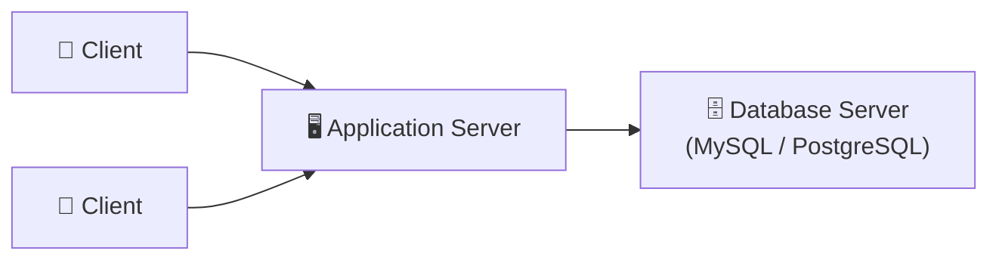
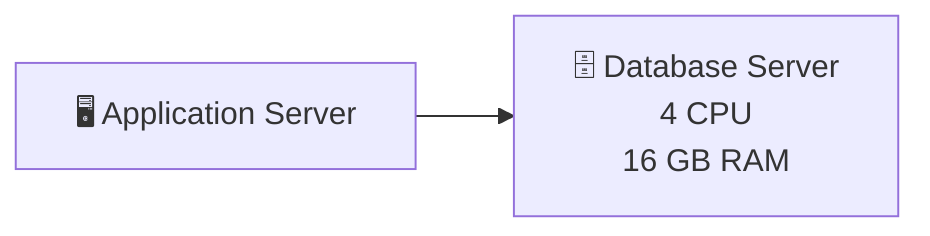
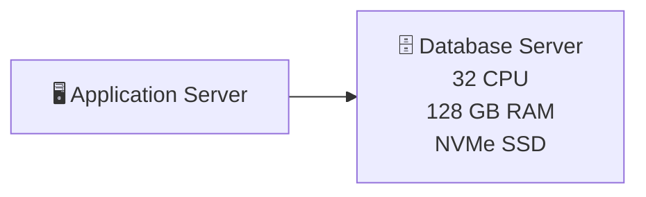
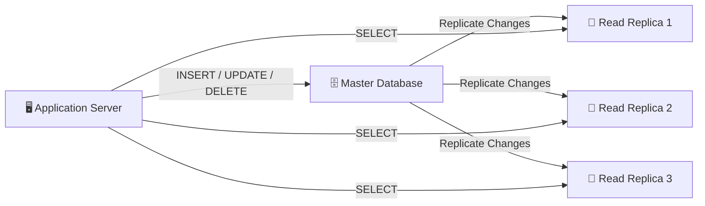
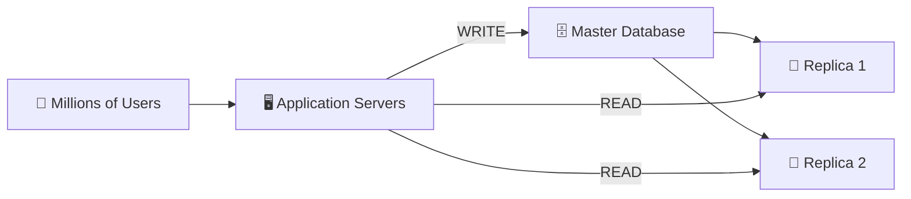
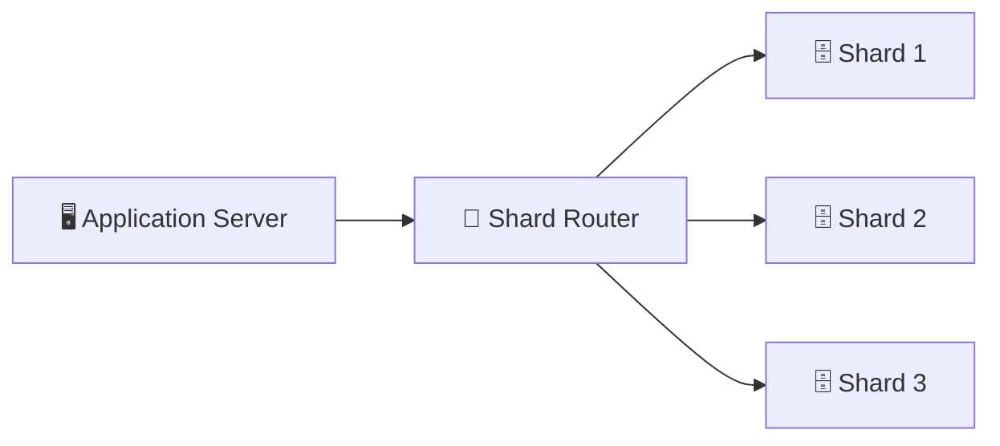
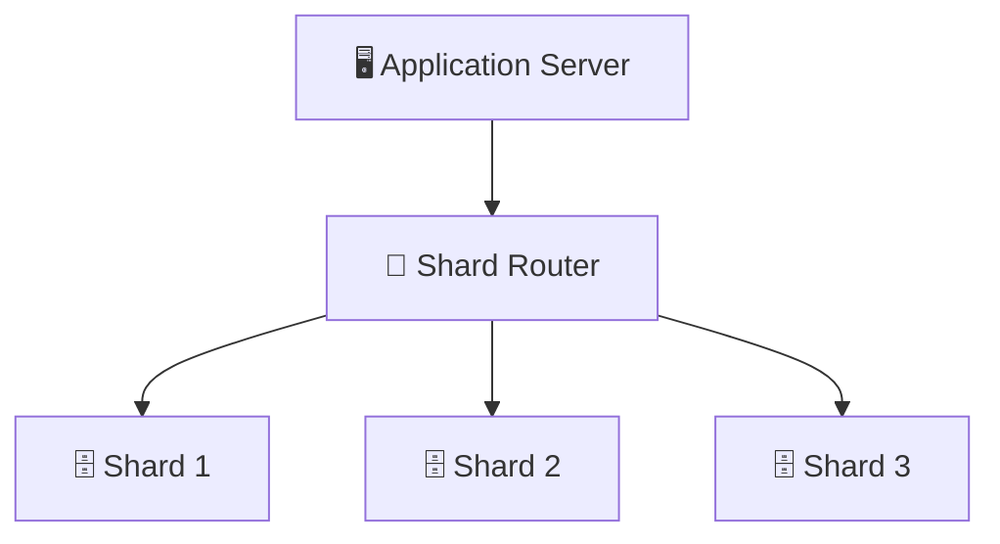
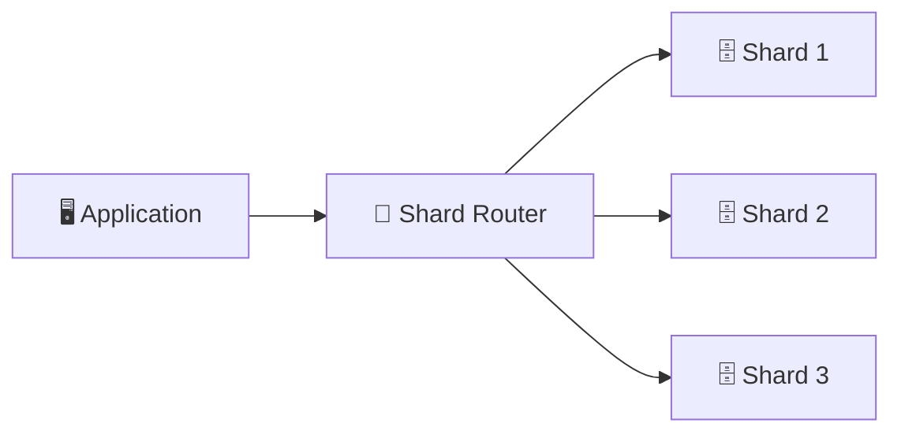
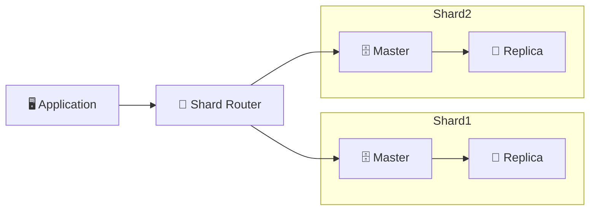

## INTRODUCTION:

Every modern application stores data in a database.

Whenever you:
* Login to Instagram
* Send a WhatsApp message
* Place an Amazon order
* Watch a YouTube video
* Book an Uber ride

your application reads or writes data from a database.

Initially, a single database server is enough for small applications. However, as the number of users, requests, and stored data increases, one database server eventually becomes a performance bottleneck.

To overcome these limitations, companies like Amazon, Netflix, Google, Meta, and Uber use techniques such as Database Replication, Database Sharding, and Horizontal Scaling to distribute data across multiple database servers.

1. SINGLE DATABASE ARCHITECTURE:

Most applications start with a very simple architecture.

The application server receives requests from users and communicates with a single database server.

Architecture:

## Q. HOW DOES THE DATABASE SERVER WORK?

A database server is simply another machine (Virtual Machine, EC2 Instance, Physical Server, etc.) on which database software such as MySQL or PostgreSQL is installed.

The database software runs continuously as a background process and listens for incoming connections on a specific network port.

For example:

Database	    Default Port
MySQL	            3306
PostgreSQL	        5432
MongoDB	            27017

Whenever the application needs data, it sends SQL queries to the database server through these ports.

Example:

Client
↓
Application Server
↓
MySQL Server (Port 3306)
↓
Database

The database executes the query and returns the result back to the application.

Inside a Database Server: A database server is much more than just a hard disk storing data.

It contains several important resources:
* CPU → Executes SQL queries.
* RAM → Stores frequently accessed data in memory.
* Disk (SSD/HDD) → Permanently stores database files.
* Database Process → MySQL/PostgreSQL engine that executes queries.
* EC2 Server

├── MySQL Process

├── CPU

├── RAM (Buffer Cache)

└── SSD / HDD

Every SQL query consumes CPU, memory, disk I/O, and network bandwidth.

Example:

Suppose a user opens Instagram.

The application executes queries like:
SELECT * FROM users WHERE id = 25;

SELECT * FROM posts
WHERE user_id = 25
ORDER BY created_at DESC
LIMIT 10;

The database processes these queries and returns the requested information to the application.
With only a few thousand users, this architecture performs very well. However, problems begin as traffic and data continue to grow.

## Q. WHY DOES A DATABASE BECOME A BOTTLENECK?

A database server has limited resources. It can execute only a certain number of queries simultaneously.
As the number of users grows from thousands to millions, the database must process millions of read and write requests every second.

Eventually, the database becomes the slowest component in the system.

Millions of Users
↓
Application Servers
↓
One Database
↓
🚨 Bottleneck

Once the database becomes overloaded, the entire application starts slowing down because every request eventually depends on the database.

Q. What Happens When the Database Becomes a Bottleneck?

Several production problems begin to appear:
* Queries become slow.
* Applications start timing out.
* User experience degrades.
* Application servers remain blocked while waiting for database responses.
* Even healthy services begin failing due to increased latency.

Modern distributed systems solve these problems by scaling the database horizontally instead of relying on a single machine.

Let's understand why these problems occur.

* 3.1 TOO MANY CONCURRENT REQUESTS: A database can execute only a limited number of queries simultaneously because it has a fixed number of CPU cores, worker threads, and database connections. When millions of users perform actions such as loading feeds, liking posts, or placing orders at the same time, only some queries are processed immediately while the remaining queries wait in a queue. As the queue grows, response time increases, application servers remain blocked waiting for database responses, and users experience a slower application.

* 3.2 HUGE TABLES: As an application grows, database tables may contain millions or even billions of rows, making searches more expensive. Even with indexes, larger tables require more disk reads, index traversals, and data scans, increasing query execution time. As a result, operations such as searching products on Amazon or loading Instagram posts become slower because the database must process a much larger amount of data.

* 3.3 INDEX & CACHE INEFFICIENCY: Database indexes speed up data retrieval, and frequently accessed data is cached in RAM for faster access. However, as the database grows, indexes become larger and the cache can no longer hold all frequently used data. This forces the database to access data from SSDs or hard disks, which are significantly slower than memory, resulting in higher query latency and reduced overall performance.

* 3.4 LOCK CONTENTION: When multiple users try to update the same database record simultaneously, the database applies locks to maintain data consistency. While one transaction holds the lock, other transactions must wait until it is released. As concurrent updates increase, waiting time grows, database throughput decreases, and users experience slower response times. This commonly occurs during viral social media posts or flash sales where thousands of users modify the same data at once.

* 3.5 RESOURCE SATURATION: Every SQL query consumes CPU, RAM, disk I/O, and network bandwidth. As the number of users and requests increases, these hardware resources gradually reach their maximum capacity. Once the database server becomes saturated, queries execute more slowly, application servers spend more time waiting for responses, and the overall user experience degrades due to increased latency and timeouts.

## SCALING THE DATABASE:

After identifying that a single database server has become the bottleneck, the next step is to increase its capacity.

There are two primary approaches to scale a database:
* Vertical Scaling (Scale Up) – Upgrade the existing database server by adding more CPU, RAM, or faster storage.
* Horizontal Scaling (Scale Out) – Add multiple database servers and distribute data among them using techniques like Replication and Sharding.

Modern distributed systems usually start with Vertical Scaling because it is simple to implement. Once the limits of a single machine are reached, they move to Horizontal Scaling.

1. VERTICAL SCALING (Scale Up): 

Vertical Scaling is the process of increasing the hardware capacity of a single database server by upgrading its CPU, RAM, SSD, or network bandwidth without changing the application architecture.

Instead of adding more database servers, we make the existing server more powerful.

Before Scaling Architecture:

After Scaling:

# How It Works:

Suppose your application initially serves 50,000 users.
The database server has:

* 4 CPU
* 16 GB RAM
* 500 GB SSD

As traffic grows to 5 million users, query execution becomes slower because the server runs out of CPU and memory.

Instead of changing the database architecture, we upgrade the machine:
* 32 CPU
* 128 GB RAM
* 2 TB NVMe SSD

The database can now process more queries simultaneously, cache more data in memory, and read from faster storage.

# Real World Example:
Suppose a startup launches an e-commerce website.

Initially, a small MySQL server is sufficient.

As traffic grows, the company upgrades the database server from:
* 8 CPU
* 32 GB RAM

to

* 64 CPU
* 256 GB RAM

without changing any application code. This is Vertical Scaling.

# Advantages:
* Simple Implementation.
* No changes are required in application logic or database queries.
* No Data Migration.
* Since the database remains on the same server, there is no need to split or move data.
* Better Performance.
* Additional CPU, RAM, and faster SSDs allow the database to execute more queries and cache more data.

# Disadvantages:
* Hardware Limits.
* A server cannot be upgraded forever.
* Eventually, even the most powerful machine reaches its maximum capacity.
* Expensive.
* High-end enterprise servers with hundreds of CPU cores and large amounts of RAM are significantly more expensive than adding multiple commodity servers.
* Single Point of Failure.
* Even after upgrading the hardware, the application still depends on one database server.
* If that server crashes, the database becomes unavailable.
* Limited Scalability.

Vertical Scaling can improve performance only up to the hardware limits of a single machine. 
Beyond that point, another solution is required.

# Q. When Should We Use Vertical Scaling?

Vertical Scaling is suitable when:
* The application is still relatively small.
* Traffic is increasing gradually.
* A single server can still handle the workload after upgrading.
* Simplicity is preferred over distributed complexity.

Most startups begin with Vertical Scaling before adopting distributed database architectures.

# Q. Why Isn't Vertical Scaling Enough?

Although Vertical Scaling improves database performance, it does not solve the fundamental limitation of relying on a single database server.

Imagine Instagram storing:
* 5 Billion Posts
* 100 Billion Likes
* 50 Billion Comments
* Hundreds of Millions of Users

Even the most powerful database server would eventually run out of CPU, memory, storage, and network bandwidth.
Moreover, if that single server fails, the entire application becomes unavailable.

To overcome these limitations, modern systems distribute data across multiple database servers instead of relying on one machine.
This approach is called Horizontal Scaling, which includes Database Replication and Database Sharding.

2. DATABASE REPLICATION (Master–Replica Architecture):

Database Replication is the process of maintaining multiple copies of the same database on different servers. One database acts as the Master (Primary), while the others act as Replicas (Secondary/Slave).

The Master database handles all Write Operations (INSERT, UPDATE, DELETE), whereas the Replica databases mainly handle Read Operations (SELECT).
Replication improves Read Scalability, High Availability, and Fault Tolerance without changing the application data model.

# Q. Why Do We Need Replication?

Vertical Scaling can increase the power of a database server, but eventually the database still becomes overloaded with read requests.

Consider Instagram:
* Millions of users continuously open their feed.
* Every feed refresh executes multiple SELECT queries.
* Read operations become significantly more frequent than write operations.

A single database server cannot efficiently handle billions of read requests every day.

Database Replication distributes these read requests across multiple database servers.

Master–Replica Architecture:

# How Does Replication Work?

Whenever a user modifies data:

Example:

INSERT INTO Orders VALUES (...);

The request always goes to the Master Database.

The Master:
* Executes the SQL query.
* Commits the transaction.
* Records the change.
* Sends the updated data to every Replica.

Now every Replica stores the same data as the Master.

Whenever another user performs:

SELECT * FROM Orders;

The application sends the request to one of the Replicas instead of the Master. This greatly reduces the load on the Master Database.

# Request Flow:

Suppose a customer places an order on Amazon.

* STEP 1: The Application Server sends an INSERT query to the Master Database.
* STEP 2: The Master stores the order.
* STEP 3: Master replicates the new order to all Replica databases.
* STEP 4: Later, when another user views their order history, the Application Server retrieves the data from a Replica instead of the Master.

# Real World Example:

Suppose Instagram has:
* 500 Million Feed Requests/day
* 10 Million New Posts/day
* Feed requests are mostly Read Operations.

Instead of sending all reads to one database:

Read Requests
↓
Replica 1

Replica 2

Replica 3

The Master only handles:
* New Posts
* Likes
* Comments
* Profile Updates

This dramatically improves performance.

# ADVANTAGES:
1. Read Scalability - Read traffic is distributed across multiple Replica databases instead of overloading one database.
2. High Availability - If one Replica fails, the application can continue reading data from another healthy Replica.
3. Better Performance - The Master no longer processes every SELECT query. Its resources are reserved mainly for write operations.
4. Fault Tolerance - Multiple copies of the database improve reliability. Even if one database becomes unavailable, other Replicas continue serving requests.

# DISADVANTAGES:
1. Replication Lag - Replication is not always instantaneous. It may take milliseconds or seconds for Replicas to receive the latest data.
A user may temporarily see slightly outdated information.

2. Master is Still the Write Bottleneck. Although read traffic is distributed, every INSERT, UPDATE, and DELETE still goes to one Master Database.
Eventually, the Master becomes overloaded.

3. More Infrastructure - Replication requires additional database servers. Infrastructure cost increases.

# Q. When Should We Use Replication?

Replication is recommended when:
* Read traffic is much higher than write traffic.
* High Availability is required.
* Fault Tolerance is important.
* A single database cannot handle all SELECT queries.

Common examples include:
* Instagram Feed
* YouTube Home Page
* Amazon Product Catalog
* Netflix Movie Listings

# Q. Why Isn't Replication Enough?

Database Replication successfully distributes Read Operations across multiple servers.
However, there is still one major limitation:

Every Write Operation
↓
Master Database

As applications continue to grow, the Master Database eventually becomes overloaded with write requests.

Imagine Instagram receiving:
* 30 Million New Posts/day
* 200 Million Comments/day
* 500 Million Likes/day

Every one of these operations must still be processed by a single Master Database.

Eventually, the Master reaches its CPU, memory, and disk limits, becoming the next bottleneck.
To solve this problem, modern distributed systems divide the data across multiple independent databases.

This technique is called Database Sharding, which enables Write Scalability and is the next step in scaling large-scale applications like Amazon, Instagram, and Facebook.

3. DATABASE SHARDING:

Database Sharding is the process of horizontally partitioning a large database into multiple smaller, independent databases called Shards. 
Each shard stores only a subset of the total data, allowing the workload to be distributed across multiple database servers.

Instead of storing all users in one massive database, the data is divided into multiple shards, with each shard responsible for a specific portion of the data.

# Q. WHY DO WE NEED SHARDING?

Database Replication distributes Read Operations, but all Write Operations still go to a single Master Database.
Eventually, the Master Database becomes overloaded.

Imagine Instagram receives every day:
* 30 Million New Posts
* 500 Million Likes
* 200 Million Comments
* 20 Million New Users

Every write request still reaches one Master Database.

Eventually:
* CPU reaches 100%
* RAM becomes full
* Disk I/O increases
* Write latency increases
* Application becomes slow

At this point, simply upgrading the server or adding more replicas is no longer enough.

Instead of using one huge database, we split the data across multiple smaller databases.

BEFORE SHARDING ARCHITECTURE:

PROBLEM: Although reads are distributed, every write still goes to one Master Database, making it the write bottleneck.

AFTER SHARDING ARCHITECTURE:

Now every shard handles only a portion of the total data.
Instead of one database processing every write request, multiple databases process writes independently.

# How Does Sharding Work?

Suppose Instagram has: 300 Million Users

Instead of storing all users inside one database, the data is divided like this:

Users 1 - 100 Million
↓
Shard 1

---------------------

Users 100M - 200M
↓
Shard 2

---------------------

Users 200M - 300M
↓
Shard 3

Each shard stores only its assigned users.
Now when a user performs an operation, only one shard is accessed instead of searching the entire database.

ARCHITECTURE:

# HOW DOES SHARD ROUTER WORK?

The Application Server never directly chooses a database. Instead, it sends the request to a Shard Router.

The Shard Router determines:
* Which shard stores the requested data?
* Where should the query be executed?

Then it forwards the request to the correct database.

REQUEST FLOW:

Suppose User ID 125,000,000 logs into Instagram.

* Step 1 : The Application Server receives the login request.
* Step 2 : The Application sends the User ID to the Shard Router.
* Step 3 : The Shard Router determines that this user belongs to Shard 2.
* Step 4 : Shard 2 executes the SQL query.
* Step 5 : The result is returned to the Application Server.
* Step 6 : The Application Server sends the response back to the user.

# Real World Example:

Imagine a library with 30 million books. Instead of storing every book on one shelf, the library divides them into multiple sections.

Shelf 1:
Books A - H

----------------

Shelf 2:
Books I - P

----------------

Shelf 3:
Books Q - Z

Now finding a book is much faster because each shelf contains fewer books. Database Sharding follows the same principle.

# ADVANTAGES OF SHARDING:
1. Massive Write Scalability - Write requests are distributed across multiple database servers. No single database handles every write operation.

2. Better Performance - Each shard stores fewer records.

Smaller tables lead to:
* Faster queries
* Faster indexing
* Better cache utilization

3. Independent Scaling - Each shard can be upgraded independently. If one shard receives more traffic, only that shard needs additional resources.

4. Higher Storage Capacity - Instead of storing all data on one server, new shards can be added whenever storage requirements increase.

5. Reduced Database Load - Every database processes only a fraction of the total traffic. CPU, RAM, and Disk I/O remain much lower compared to a single database.

# DISADVANTAGES OF SHARDING:
1. Increased Complexity:

Applications now need:
* Shard Router
* Routing Logic
* Monitoring
* Backup Strategy

Managing multiple databases is significantly more complex than managing one.

2. Cross-Shard Queries - If required data exists in different shards, the application must query multiple databases and combine the results.
This increases query complexity and response time.

3. Rebalancing Data - When new shards are added, existing data must be redistributed. Migrating billions of records between shards is time-consuming and expensive.

4. Uneven Data Distribution - A poor sharding strategy may place significantly more users on one shard than others.
This creates a Hot Shard, where one database receives most of the traffic while other shards remain underutilized.

# Replication vs Sharding:

| Feature             | Replication         |               Sharding                   |
| ------------------- | --------------------| ---------------------------------------- |
| Data Stored         | Same Data           | Different Data                           |
| Purpose             | Read Scaling        | Write Scaling                            |
| Number of Databases | Multiple Copies     | Multiple Independent Databases           |
| Handles Reads       | ✅ Yes              | ✅ Yes                                  |
| Handles Writes      | ❌ Single Master    | ✅ Distributed Writes                   |
| High Availability   | ✅ Yes              | Partial (requires replication per shard) |
| Storage Capacity    | Same Data           | Increased Capacity                       |

# Q. Why Isn't Sharding Alone Enough?

Although Database Sharding distributes write operations across multiple databases, each individual shard is still a single database server.

If Shard 2 crashes:
* Users stored in Shard 2 become unavailable.
* Their data cannot be read or updated.
* The application experiences partial downtime.

To eliminate this single point of failure, every shard is replicated using a Master–Replica architecture.

## SHARD KEY :- 
A Shard Key is a column or attribute used to determine which shard will store a particular piece of data. Every read and write request uses the shard key to route the request to the correct database shard.

Choosing the right shard key is one of the most important decisions in a sharded database because it directly affects data distribution, scalability, and performance.

# Q. Why Do We Need a Shard Key?

Suppose an application has four database shards.
* Shard 1
* Shard 2
* Shard 3
* Shard 4

When a new user registers, the application must answer one question:

# Q. Which shard should store this user's data?

Without a shard key, the application would have to search every shard, making queries slow and inefficient.
The shard key allows the system to locate the correct shard immediately.

ARCHITECTURE:

The Shard Router uses the Shard Key to decide which database should handle the request.

# COMMON SHARD KEYS:-

A good shard key should distribute data evenly across all shards.

Common examples include:

* User ID
* Customer ID
* Region
* Country
* City
* Tenant ID
* Organization ID

Example 1 — User ID Based Sharding

Suppose the Shard Key is: User ID

Routing Rule: UserID % 3

Example:

User ID = 250

250 % 3 = 1

↓

Shard 1

Another user:

User ID = 901

901 % 3 = 2

↓

Shard 2

Every request from the same user always goes to the same shard.

Example 2 — Region Based Sharding

Instead of User ID, data can also be divided geographically.

India
↓
Shard 1

------------------

Europe
↓
Shard 2

------------------

USA
↓
Shard 3

This reduces latency because users are stored closer to their geographic location.

# Characteristics of a Good Shard Key:

A good shard key should:
* Evenly distribute data across all shards.
* Prevent one shard from receiving excessive traffic.
* Be present in most database queries.
* Rarely change after being assigned.
* Support future scaling as new shards are added.

# Characteristics of a Bad Shard Key:

A poor shard key may:
* Store most users in one shard.
* Create Hot Shards.
* Cause uneven storage utilization.
* Reduce query performance.
* Make scaling difficult.

# Real World Example:
Instagram commonly shards user-related data using User ID, ensuring that all posts, followers, and profile information for a user are stored on the same shard.

Large e-commerce platforms may shard customers by Region so that users in India, Europe, and the USA are stored in different database clusters.

# ADVANTAGES:
* Fast shard lookup.
* Even distribution of traffic.
* Better scalability.
* Faster query execution.
* Reduced database load.

# Challenges:
* Selecting the wrong shard key can create Hot Shards.
* Changing the shard key later is extremely difficult because existing data must be migrated.
* Some queries may require accessing multiple shards if they don't include the shard key.

# Why Isn't This Enough?

Even with a good shard key, one problem still remains.

Suppose your application initially has:
* Shard 1
* Shard 2
* Shard 3

After several years, traffic doubles and storage becomes full. A new shard must be added.

Now the system needs to move existing data between shards while keeping the application online.
This process is called Shard Rebalancing, which is the next challenge in large-scale distributed databases.

# TYPES OF SHARDING:

1. RANGE BASED SHARDING:

In Range-Based Sharding, data is divided into different shards based on a predefined range of values from the shard key. When a new request arrives, the system checks the value of the shard key and routes the request to the shard responsible for that range. For example, users with IDs from 1 to 1 million may be stored in one shard, while users from 1 million to 2 million are stored in another shard. This method is simple and efficient for range-based queries, but it can create uneven distribution if most new data falls into one particular range, causing a hot shard.

2. HASH BASED SHARDING:

In Hash-Based Sharding, a hash function is applied to the shard key to calculate which shard should store the data. Instead of dividing data based on fixed ranges, the hash function randomly distributes records across available shards, ensuring a more balanced distribution of data and traffic. For example, a User ID can be passed through a hash function, and the generated hash value determines the destination shard. This approach reduces the chances of one shard becoming overloaded and is commonly used in large-scale applications where uniform data distribution is required.

3. HASH BASED SHARDING:

In Directory-Based Sharding, a separate directory service maintains a mapping between the shard key and the database shard where the data is stored. Whenever a request arrives, the application first queries the directory to find the location of the required data, and then forwards the request to the corresponding shard. This approach provides more flexibility because data can be moved between shards by simply updating the directory mapping instead of changing the shard calculation logic. However, the directory itself becomes a critical component that must be highly available and scalable.

# CHALLENGES IN SHARDING:

Even though Database Sharding greatly improves scalability and write performance, it also introduces several challenges that make distributed databases more complex to design and maintain.

1. CROSS JOINED SHARDS:

When related data is stored in different shards, performing SQL JOIN operations becomes difficult because a single database can only join tables within its own shard. The application or a middleware service must query multiple shards separately and combine the results, which increases network calls, response time, and overall query complexity.

2. CROSS SHARD TRANSACTIONS:

A transaction that involves multiple shards is much more complex than a transaction within a single database. To maintain consistency, all participating shards must either successfully commit the transaction or roll it back together. This usually requires distributed transaction protocols such as Two-Phase Commit (2PC) or Saga Pattern, making transactions slower and more difficult to manage.

3. SHARD REBALANCING:

As applications grow, some shards may become overloaded while others remain underutilized. Shard Rebalancing is the process of redistributing data across existing or newly added shards to maintain an even distribution of storage and traffic. Although necessary for scalability, moving large volumes of data between shards is time-consuming and must be performed carefully to avoid downtime or data inconsistency.

## SHARDING + REPLICATION:- (Production Architecture)

Large companies don't use only sharding or only replication. Instead, every shard has its own Master and Replica databases. Writes go to the Master of the appropriate shard, while reads are served by its Replicas. This provides both Write Scalability through sharding and Read Scalability with High Availability through replication.

ARCHITECTURE:

# Real-World Examples:
COMPANY                   SHARDING KEY
Instagram	                User ID
Facebook	                User ID
WhatsApp	              Phone Number
Amazon	                Customer ID / Region
Uber	                  City / Region
YouTube	                    Video ID

# INTERVIEW QUESTIONS:

Q1. Why can't replication solve write scalability?
Answer: Replication creates multiple copies of the same data, but every write still goes to one Master database. Therefore, write throughput remains limited by a single server.

Q2. When should we use Sharding?
Answer: Use sharding when a single database can no longer handle storage capacity or write traffic, even after vertical scaling and replication.

Q3. Can we use Replication without Sharding?
Answer: Yes. Many applications only need read scaling and high availability, so replication alone is sufficient.

Q4. Can we use Sharding without Replication?
Answer: Technically yes, but it is not recommended because if one shard fails, all data stored in that shard becomes unavailable. Production systems replicate every shard.

Q5. Which comes first: Replication or Sharding?
Answer: Replication usually comes first because most applications become read-heavy before they become write-heavy. Sharding is introduced only when a single Master database can no longer handle write traffic or storage.