## TYPES OF APIs:
An API (Application Programming Interface) is a communication interface that allows different applications, services, or microservices to exchange data and functionality over a network. Based on how they communicate and exchange data, APIs are broadly classified into four major types:

* REST API
* GraphQL
* SOAP
* gRPC
* WebSockets

## STUDY REST API FROM ARPIT BAYANI:
1. REST API - REST (Representational State Transfer) is the most widely used API architecture. It communicates over HTTP/HTTPS, exchanges data in JSON format, and follows a stateless request-response model. It gives flexibility to represent data even if we want to store data in DB in rows & cols, we can server the data in JSON format. 

REST is an architectural style used for designing APIs that allows clients and servers to communicate over a network.

REST commonly uses:
* HTTP protocol
* JSON data format
* Request-response communication model

REST treats every piece of application data as a resource like Student, Customer, Message, Product, Order, Payment

ARCHITECTURE:-
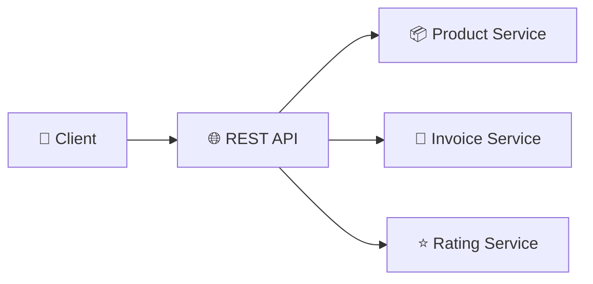

# HOW IT WORKS? 
When a client sends an HTTP request such as GET /products/101, the REST API forwards the request to the appropriate microservice. The service processes the request, fetches the required data, and returns a JSON response. Since REST is stateless, every request contains all the information needed to process it.

# IMPORTANT MUST KNOW POINTS OF REST:
1. REST RESOURCE CONCEPT - In REST, every piece of data inside an application is considered a resource. A resource represents an entity or object that the client wants to access or modify through an API. Examples: Student, Customer, Message, Video, etc.

The internal storage mechanism of the resource does not matter to the client. The resource may be stored inside a relational database like MySQL, a NoSQL database like MongoDB, or any other storage system. The client only interacts with the resource through REST endpoints.

Example:

An application may store students like:

Student Data
        |
        |
 ---------------------
 |          |         |
Students  Messages  Videos

Internally:

* MySQL Table:

Student
----------------
id | name | age
1  | Ayush| 21

or:

* MONGODB COLLECTION:
students {
 id:1,
 name:"Ayush",
 age:21
}

The client does not know how the data is stored internally. The client only requests the resource using a REST API.

Example: GET /students/101

The server receives the request, finds the student data internally, and returns the student resource back to the client.

2. HOW REST COMMUNICATION WORKS - 5. How REST Communication Works?

REST follows a client-server request-response communication model.

The client sends a request asking for a particular resource. The server processes the request, communicates with internal services or databases, converts the result into a representation, and sends the response back.

Example:

Client requests customer information: GET /customers/123

The server performs the following steps:
* Receives the HTTP request.
* Identifies the requested resource.
* Fetches required data from storage.
* Converts data into required representation.
* Sends response back to client.

ARCHITECTURE:
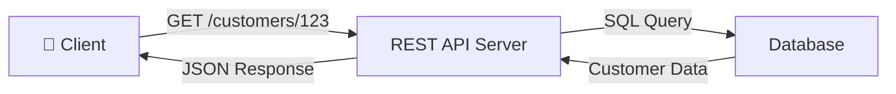

3. REST AND HTTP - REST itself is an architectural style and does not strictly require HTTP. However, REST APIs are commonly implemented using HTTP because HTTP already provides many features required for distributed communication.

HTTP provides:
* Standard request methods
* Status codes
* Security using HTTPS
* Caching mechanisms
* Monitoring support

REST commonly uses HTTP methods: GET, POST, PUT, PATCH, DELETE.

So, Deleting a user: DELETE /users/101 -> Remove the user resource whose identifier is 101.

4. WHY IS REST STATELESS - REST is called stateless because the server does not store any information about previous client requests.

Every request must contain all required information needed for processing.

Example:

First Request: GET /profile

Authorization: Bearer JWT_TOKEN

Second Request: GET /orders

Authorization:
Bearer JWT_TOKEN

The server does not remember the previous request.
Every request is independent.

ARCHITECTURE:
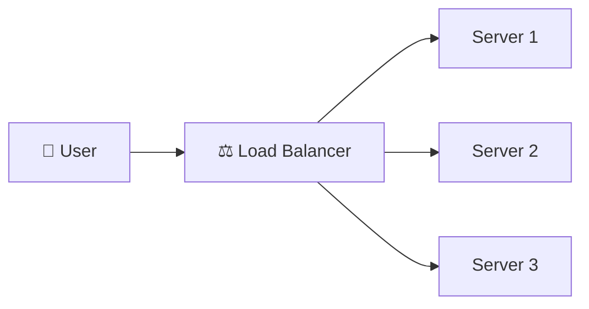

Since servers do not store session information, any server can handle any request.

Advantages:
* Easy horizontal scaling
* Better fault tolerance
* Simple load balancing
* No session synchronization required

# ADVANTAGES OF REST:
1. Simple and Easy - REST uses standard HTTP methods, making APIs easy to understand and implement.

Example:
* GET /users
* POST /users
* DELETE /users/1

2. Scalable - REST is stateless, so new servers can be added easily behind a load balancer.

Example:

Users
 ↓
Load Balancer
↓     ↓     ↓
SVR1 SVR2  SVR3

3. Cache Support - REST supports HTTP caching. Frequently requested data can be stored temporarily to reduce database load.

Example: Product images and details can be served from cache instead of querying the database repeatedly.

4. Platform Independent - REST APIs work with any technology.

Examples:
* Java
* Python
* JavaScript
* Mobile Applications

5. Huge Ecosystem - REST has many existing tools:
* Postman
* Curl
* API Gateways
* Load Balancers
* Monitoring Systems

# DISADVANTAGES OF REST:

1. Over Fetching - Over fetching occurs when the API returns more data than the client actually needs.

Example: Mobile app requires only -> username

But API returns:
* username
* email
* address
* phone
* order history

This wastes bandwidth and processing.

2. Under Fetching - Under fetching occurs when the client needs multiple API calls to get complete information.

Example:

Need:
* User Details
* Orders
* Reviews

Requires:
* GET /users
* GET /orders
* GET /reviews

Multiple requests increase latency.

3. Large Payload Size - Large JSON responses increase network transfer time. REST may not be ideal for:
* Real-time systems
* Extremely low latency applications

4. Repeated Client Logic

Every client needs to implement:
* Serialization
* Deserialization
* Error handling
* Retry mechanisms

# REAL WORLD EXAMPLE: 
When you open a product page on Amazon, the mobile app sends REST API requests to retrieve product details, reviews, inventory, and pricing from different microservices.

BEST USED FOR:
* Web Applications
* Mobile Applications
* Public APIs
* CRUD Operations

Q. Why is REST called Stateless?
Answer: Because the server does not store client session information between requests. Every request must contain all the information required to process it.

2. GRAPHQL - GraphQL is a query language and API runtime developed by Facebook that allows clients to request exactly the data they need, reducing over-fetching and under-fetching.

BEST USED FOR:
* Mobile Applications
* Dashboards
* Multiple Frontend Clients
* Complex Data Fetching

3. SOAP - SOAP (Simple Object Access Protocol) is a protocol-based API that exchanges data using XML and provides built-in support for security, transactions, and reliability.

BEST USED FOR:
* Banking Systems
* Healthcare
* Enterprise Applications
* Government Services

4. gRPC - gRPC (Google Remote Procedure Call) is Google's high-performance communication framework that exchanges data using Protocol Buffers (Protobuf) instead of JSON, making it much faster than REST.

BEST USED FOR:
* Internal Microservices
* Low-Latency Systems
* High-Performance Communication
* Real-Time Applications

5. WebSocket API - WebSocket is a communication protocol that provides a persistent, two-way communication channel between client and server over a single TCP connection.

Unlike REST, where the client sends a request and receives a response, WebSocket allows both client and server to send messages anytime.

# How It Works:-
Connection Flow:
* Client establishes WebSocket connection.
* Connection remains open.
* Client and server exchange messages continuously.
* Server can push updates instantly.

BEST USED FOR:
* Chat Applications
* Gaming
* Live Notifications
* Stock Trading
* Video Collaboration
* Real-Time Tracking

3. API GATEWAY - An API Gateway is a single entry point for all client requests in a microservices architecture. Instead of clients communicating directly with individual microservices, every request first passes through the API Gateway, which performs authentication, authorization, routing, rate limiting, and request transformation before forwarding it to the appropriate service.

ARCHITECTURE:
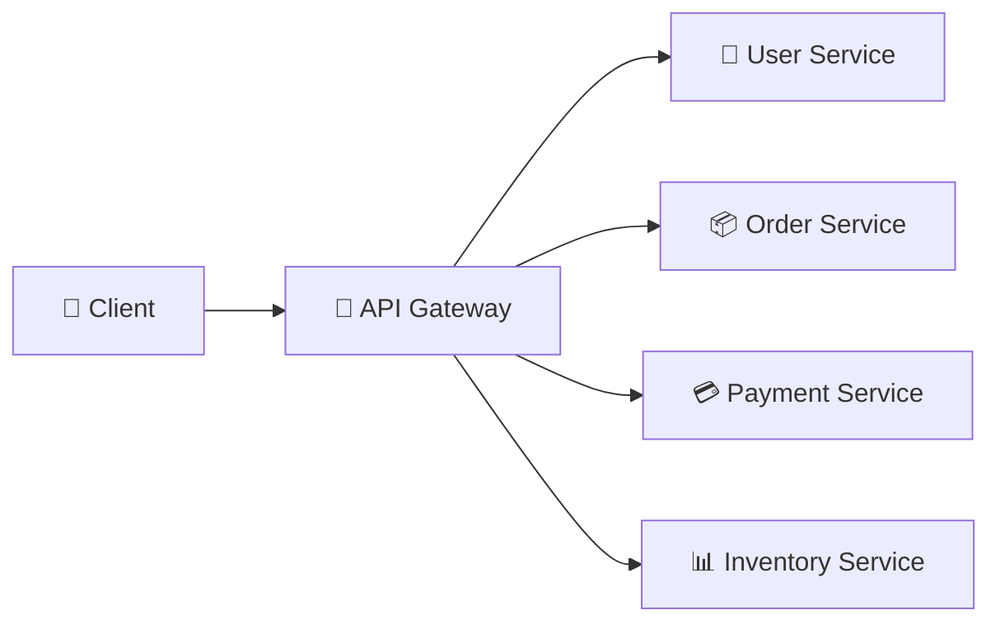

# HOW IT WORKS
When a client sends a request, the API Gateway first validates the request, authenticates the user, checks permissions, applies rate limiting if required, and identifies the appropriate microservice. It then forwards the request to that service and returns the response back to the client.

# REAL WORLD EXAMPLE
When you open Amazon, your request goes to api.amazon.com, not directly to the Product, Payment, or Inventory services. The API Gateway determines which microservice should handle your request and forwards it internally.

# RESPONSIBILITIES OF API GATEWAY:
* Authentication
* Authorization
* Request Routing
* Rate Limiting
* API Versioning
* SSL Termination
* Logging & Monitoring
* Request Transformation

# ADVANTAGES OF API GATEWAY
Single Entry Point
Improved Security
Centralized Authentication
Simplified Client Communication
Easier API Management
INTERVIEW QUESTION

Q. Why don't clients communicate directly with microservices?
Answer: Direct communication exposes internal services, increases security risks, tightly couples clients to backend services, and makes versioning and routing difficult. An API Gateway centralizes these responsibilities and provides a secure, unified interface.

4. OAUTH 2.0 AUTHENTICATION - OAuth 2.0 is an industry-standard authorization framework that allows users to grant applications limited access to their resources without sharing their passwords. It is commonly used with JWT (JSON Web Tokens) to securely authenticate and authorize users in microservices.

ARCHITECTURE:
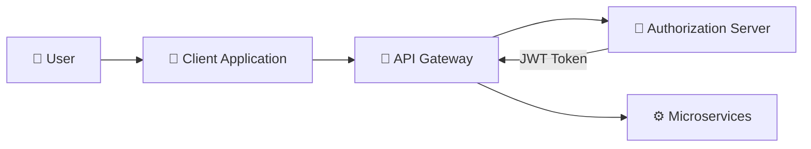

# HOW IT WORKS:
When a user logs in, the credentials are verified by the Authorization Server. After successful authentication, a JWT Access Token is generated and returned to the client. For every future request, the client sends this token to the API Gateway, which validates it before forwarding the request to the appropriate microservice.

# REAL WORLD EXAMPLE
When you log into Google using "Sign in with Google," Google authenticates your identity and issues an access token. Other applications use this token instead of asking for your Google password.

# RESPONSIBILITIES OF OAUTH 2.0
* User Authentication
* Secure Authorization
* Access Token Generation
* JWT Validation
* Permission Management
* Third-Party Login Support

# ADVANTAGES OF OAUTH 2.0
* Improved Security
* Password less Authorization
* Single Sign-On (SSO)
* Stateless Authentication using JWT
* Industry Standard

Q. Why do we use JWT instead of sending the username and password with every request?
Answer: Sending credentials with every request is insecure. JWT contains digitally signed user information that can be verified by the API Gateway, allowing secure and stateless authentication without repeatedly sending passwords.

5. SERVICE DISCOVERY - Service Discovery is the process of automatically locating healthy instances of microservices in a distributed system. Instead of hardcoding server addresses, services register themselves with a Service Registry (such as Eureka or Consul), allowing other services to dynamically discover and communicate with them.

ARCHITECTURE:
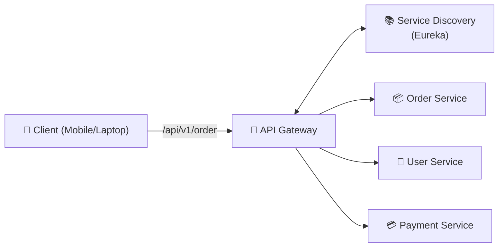

# HOW IT WORKS
Whenever a microservice starts, it registers itself with the Service Registry by providing its IP address and port number. When another service needs to communicate with it, it first queries the registry to obtain the latest healthy instance instead of using a fixed IP address.

# REAL WORLD EXAMPLE
Suppose Amazon runs 50 Payment Service instances. If one instance crashes or a new instance is created, the Service Registry automatically updates the available instances, allowing requests to be routed only to healthy servers.

# RESPONSIBILITIES OF SERVICE DISCOVERY
* Service Registration
* Service Lookup
* Health Monitoring
* Dynamic Routing
* Failure Detection

# ADVANTAGES OF SERVICE DISCOVERY
* Dynamic Service Discovery
* Eliminates Hardcoded IP Addresses
* Better Scalability
* Automatic Failure Detection
* Simplifies Microservice Communication

Q. Why can't microservices communicate using fixed IP addresses?
Answer: Microservices are constantly created, destroyed, or scaled. Their IP addresses frequently change, so using fixed addresses would make communication unreliable. Service Discovery always provides the latest healthy service instance.

6. API VERSIONING - API Versioning is the practice of maintaining multiple versions of an API so that existing clients continue working while new features and improvements are introduced without breaking backward compatibility.

ARCHITECTURE:
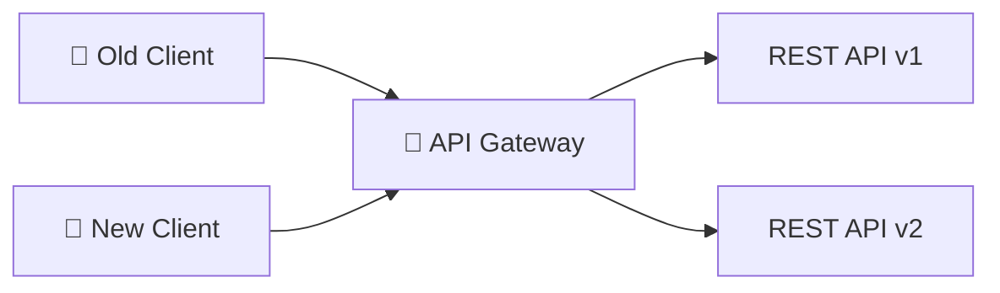

# HOW IT WORKS
When an API changes, instead of modifying the existing API, a new version is created. Older clients continue using the previous version while newer clients can migrate to the updated version without disruption.

# REAL WORLD EXAMPLE
Amazon may expose:

/api/v1/orders
/api/v2/orders

Older mobile applications continue using v1, while newly updated applications use v2 with additional features.

# COMMON VERSIONING STRATEGIES
* URL Versioning (/api/v1/products)
* Header Versioning
* Query Parameter Versioning

# ADVANTAGES OF API VERSIONING
* Backward Compatibility
* Easier API Evolution
* Smooth Client Migration
* Reduced Downtime

Q. Which API versioning strategy is the most commonly used?
Answer: URL Versioning is the most widely used because it is simple, explicit, easy to document, and supported by most API management tools.

7. LOAD BALANCER - A Load Balancer is a networking component that distributes incoming client requests across multiple server instances to improve scalability, high availability, fault tolerance, and performance. Instead of sending all traffic to a single server, it intelligently routes requests to healthy servers using different load balancing algorithms.

ARCHITECTURE:
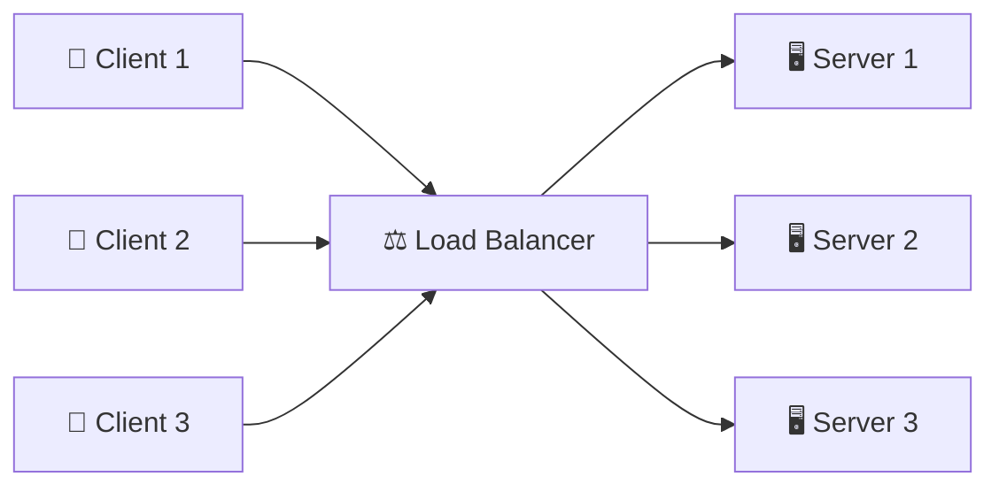

# HOW IT WORKS
Every client request first reaches the Load Balancer. It continuously monitors the health of backend servers and selects one of the healthy instances using algorithms such as Round Robin, Least Connections, or Weighted Round Robin. If a server becomes unavailable, the Load Balancer automatically stops sending requests to it and routes traffic to the remaining healthy servers.

# REAL WORLD EXAMPLE
When millions of users visit Amazon during Prime Day, requests first reach an Application Load Balancer (ALB). The Load Balancer distributes traffic across hundreds of EC2 instances, ensuring that no single server becomes overloaded.

# RESPONSIBILITIES OF LOAD BALANCER:
* Traffic Distribution
* High Availability
* Horizontal Scaling
* Health Checks
* Fault Tolerance
* Session Persistence (Sticky Sessions)
* SSL Termination (Optional)

Q. Why do we need a Load Balancer if we already have multiple servers?

Answer: Without a Load Balancer, clients would need to know the IP address of every server and manually choose where to send requests. A Load Balancer automatically distributes traffic among healthy servers, prevents overload, and provides failover if a server crashes.

8. API GATEWAY VS LOAD BALANCER - 

Many beginners think an API Gateway and a Load Balancer perform the same job because both receive client requests. In reality, they solve different problems. An API Gateway decides which microservice should handle a request and applies policies such as authentication, authorization, routing, and rate limiting. A Load Balancer decides which instance of that microservice should process the request by distributing traffic across multiple healthy servers.

ARCHITECTURE:
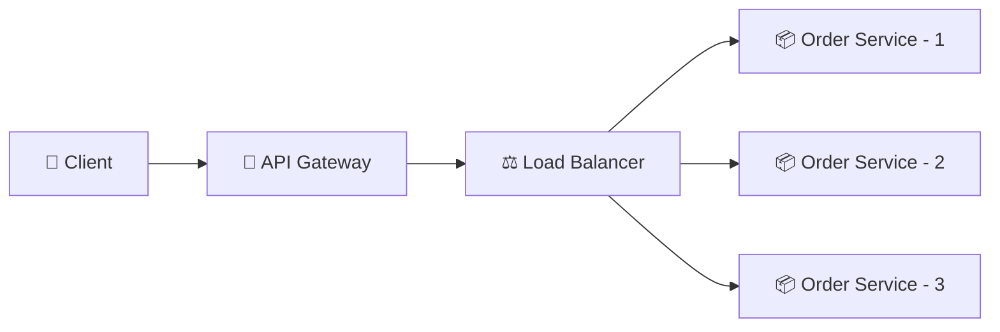

# HOW IT WORKS
When a client sends a request, it first reaches the API Gateway, where authentication, authorization, request validation, and routing are performed. The request is then forwarded to a Load Balancer, which selects one of the healthy service instances using algorithms such as Round Robin or Least Connections. The selected server processes the request and returns the response back to the client.

# REAL WORLD EXAMPLE
Suppose a customer opens Amazon and requests order details.

Client
   │
   ▼
API Gateway (Authentication + Routing)
   │
   ▼
Load Balancer
   │
   ▼
Order Service Instance 1
or
Order Service Instance 2
or
Order Service Instance 3

The API Gateway decides that the request belongs to the Order Service, while the Load Balancer decides which Order Service instance should process it.

# API GATEWAY RESPONSIBILITIES
* Authentication
* Authorization
* Request Routing
* API Versioning
* Rate Limiting
* SSL Termination
* Logging & Monitoring
* Request Transformation

# LOAD BALANCER RESPONSIBILITIES
* Traffic Distribution
* High Availability
* Health Checks
* Horizontal Scaling
* Fault Tolerance
* Session Persistence (Sticky Sessions)

9. AVAILABILITY ZONE (AZ) - An Availability Zone (AZ) is an isolated location within a cloud Region consisting of one or more physically separate Data Centers connected through high-speed, low-latency networking. Applications are deployed across multiple Availability Zones to improve high availability, fault tolerance, and disaster recovery.

ARCHITECTURE:
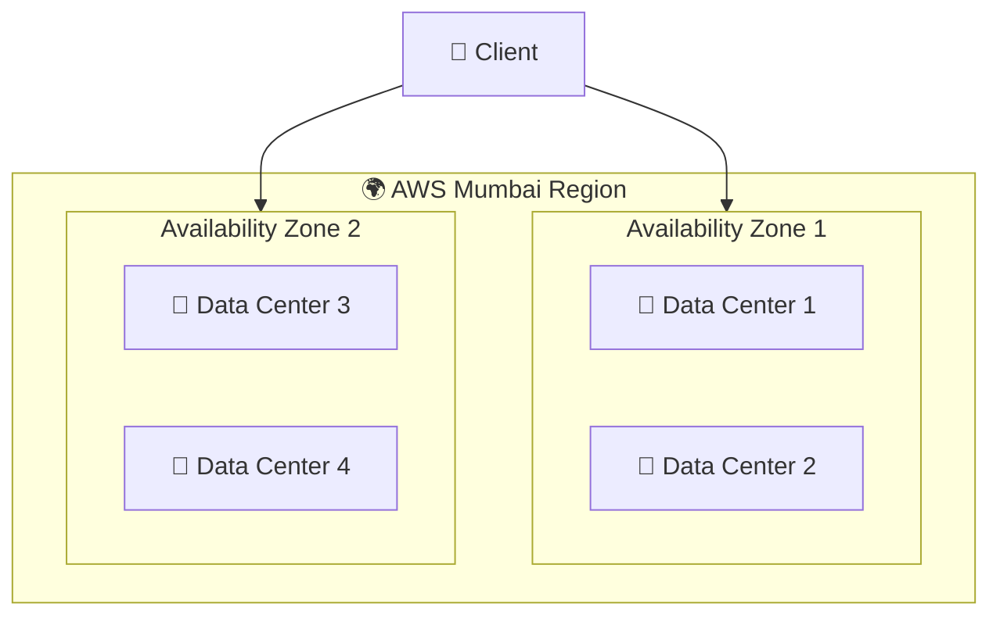

# HOW IT WORKS
An Availability Zone contains one or more independent Data Centers with separate power, cooling, and networking infrastructure. Applications are deployed across multiple AZs so that if one Availability Zone experiences an outage, traffic can automatically be redirected to another healthy Availability Zone within the same Region.

# REAL WORLD EXAMPLE
Amazon deploys its services across multiple Availability Zones in the Mumbai Region. If one Availability Zone fails due to a power outage or network issue, requests are automatically served from another Availability Zone without affecting users.

# DATA CENTER VS AVAILABILITY ZONE
Data Center	                              Availability Zone
Physical Building	             Logical Group of One or More Data Centers
Stores Servers	                     Provides High Availability
Independent Infrastructure	      Connected via High-Speed Network
Smallest Physical Unit	       Deployment Unit for Cloud Applications

# ADVANTAGES OF AVAILABILITY ZONES
* High Availability
* Fault Tolerance
* Low Latency Between AZs
* Disaster Recovery
* Automatic Failover

Q. Does one Availability Zone contain multiple Data Centers?
Answer: Yes. An Availability Zone is a logical grouping of one or more physically separate Data Centers connected through low-latency networking. Applications are typically deployed across multiple Availability Zones within a Region for higher availability.

10. REGION - A Region is a geographically isolated cloud location containing multiple Availability Zones. Each Region operates independently and provides complete cloud infrastructure, enabling organizations to deploy applications closer to users for lower latency, fault tolerance, and disaster recovery.

ARCHITECTURE:
ARCHITECTURE:
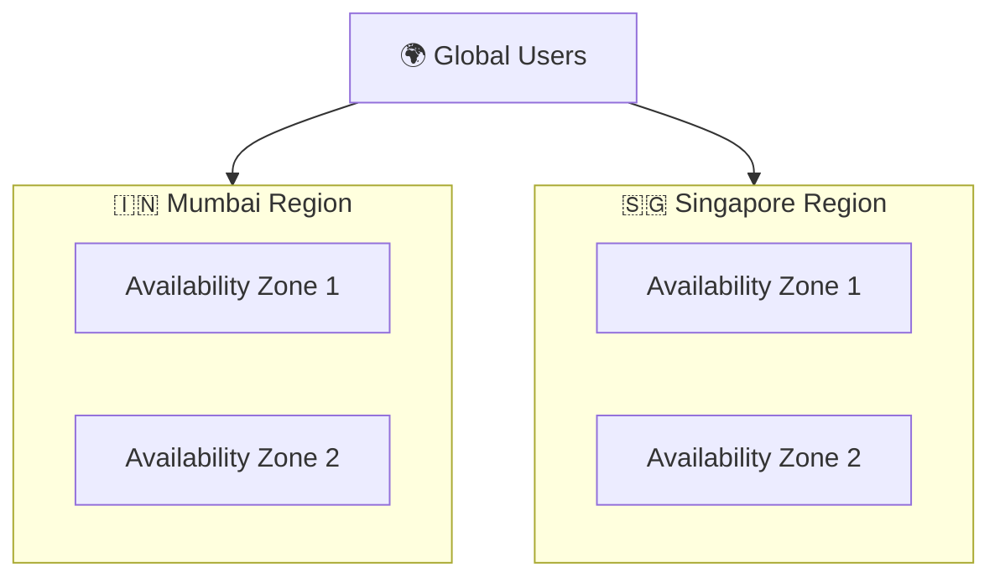

HOW IT WORKS

Each Region contains multiple Availability Zones with independent infrastructure. Organizations deploy applications across multiple Regions so that if an entire Region becomes unavailable due to a large-scale outage or natural disaster, another Region can continue serving users.

REAL WORLD EXAMPLE

Netflix deploys its services across multiple AWS Regions such as US-East, US-West, and Europe. If one Region becomes unavailable, traffic is automatically redirected to another healthy Region.

# AVAILABILITY ZONE VS REGION
Availability Zone	                           Region
One or More Data Centers	   Collection of Multiple Availability Zones
Same City	                       Different Geographic Location
Low Latency	                           Disaster Recovery
Handles AZ Failure	               Handles Regional Failure

# ADVANTAGES OF MULTI-REGION DEPLOYMENT
* Global Availability
* Disaster Recovery
* Reduced Latency
* Improved Reliability
* Business Continuity

Q. Why don't companies deploy applications in only one Region?
Answer: A single Region can fail due to large-scale outages or disasters. Multi-Region deployment ensures that applications remain available by redirecting users to another healthy Region.

11. DNS LOAD BALANCER - A DNS Load Balancer distributes client traffic across multiple Regions, Availability Zones, or Data Centers by resolving a domain name to the most appropriate server IP address. It improves global availability, fault tolerance, and low latency before the client even establishes a connection.

ARCHITECTURE:
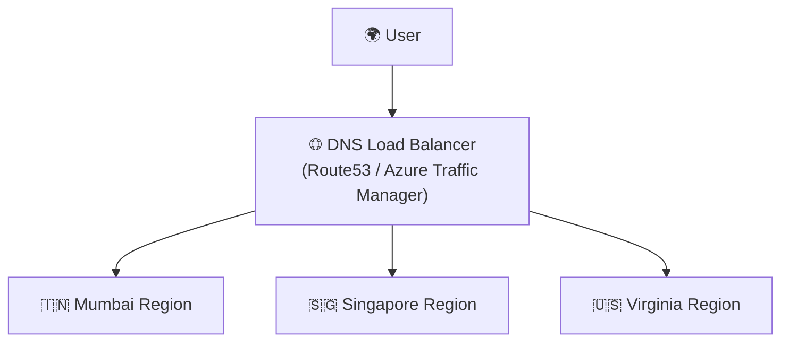

# HOW IT WORKS
When a user enters a domain such as api.amazon.com, the DNS Load Balancer evaluates routing policies like Latency-Based Routing, Weighted Routing, or Failover Routing and returns the IP address of the most suitable Region. The client then communicates directly with that Region.

# REAL WORLD EXAMPLE
A user in India accessing amazon.in is typically routed to the Mumbai Region, while a user in Singapore is routed to the Singapore Region to minimize latency.

# COMMON DNS ROUTING POLICIES
* Latency-Based Routing
* Weighted Routing
* Geolocation Routing
* Failover Routing
* Multi-Value Answer Routing

# ADVANTAGES OF DNS LOAD BALANCER
* Global Traffic Distribution
* Reduced Latency
* Automatic Failover
* High Availability
* Better User Experience

Q. How is a DNS Load Balancer different from a normal Load Balancer?
Answer: A DNS Load Balancer selects the best Region or Data Center by returning an appropriate IP address during DNS resolution, whereas a traditional Load Balancer distributes traffic among servers within the selected Region or Availability Zone.

12. COMPLETE PRODUCTION REQUEST FLOW - A production request in a modern distributed system passes through multiple networking components before reaching the target microservice. Each component has a specific responsibility, ensuring the application remains secure, scalable, fault-tolerant, and highly available.

ARCHITECTURE:
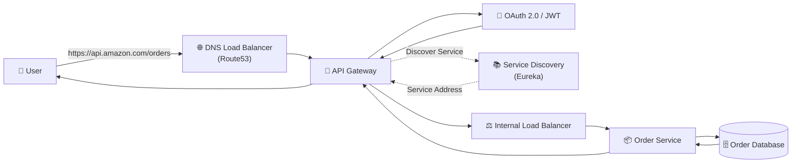

# REAL WORLD EXAMPLE:

Suppose you open the Amazon Orders page.

Step 1: Your browser sends an HTTPS request to api.amazon.com/orders.

Step 2: AWS Route53 resolves the domain name and routes the request to the nearest healthy AWS Region.

Step 3: The request reaches the API Gateway, which authenticates the user by validating the JWT Access Token.

Step 4: The API Gateway queries Eureka (Service Discovery) to locate healthy instances of the Order Service.

Step 5: The request is forwarded to an Internal Load Balancer, which selects one healthy Order Service instance using a load balancing algorithm.

Step 6: The selected Order Service retrieves the requested order details from its Order Database and executes the business logic.

Step 7: The response is returned through the Load Balancer → API Gateway back to the browser as a JSON response.

13. COMPLETE PRODUCTION ARCHITECTURE:

ARCHITECTURE:
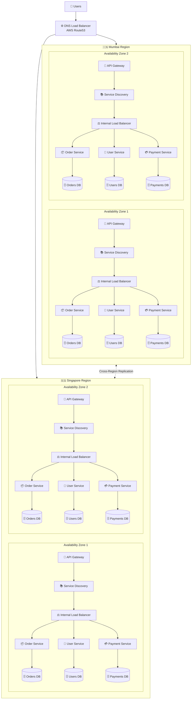
# HOW THE COMPLETE ARCHITECTURE WORKS
Users access the application through a domain name, which is resolved by a DNS Load Balancer to the nearest healthy Region. Each Region contains multiple Availability Zones to tolerate Data Center failures. Every Availability Zone hosts an API Gateway, Service Discovery, Internal Load Balancer, and multiple instances of each microservice. Each microservice owns its own database following the Database-per-Service pattern. Data is replicated across Regions to provide disaster recovery and business continuity.

Q. Why do companies like Amazon and Netflix use this architecture instead of deploying everything on a single server?
Answer: This architecture eliminates single points of failure, supports horizontal scaling, reduces latency by serving users from nearby Regions, enables independent deployment of microservices, and ensures high availability through redundancy across Availability Zones and Regions. It is the foundation of modern cloud-native distributed systems.