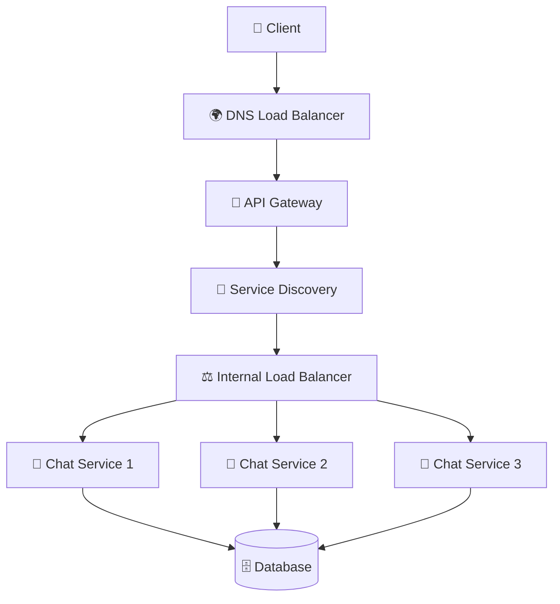
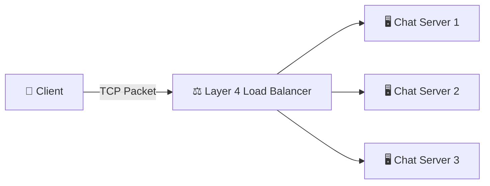
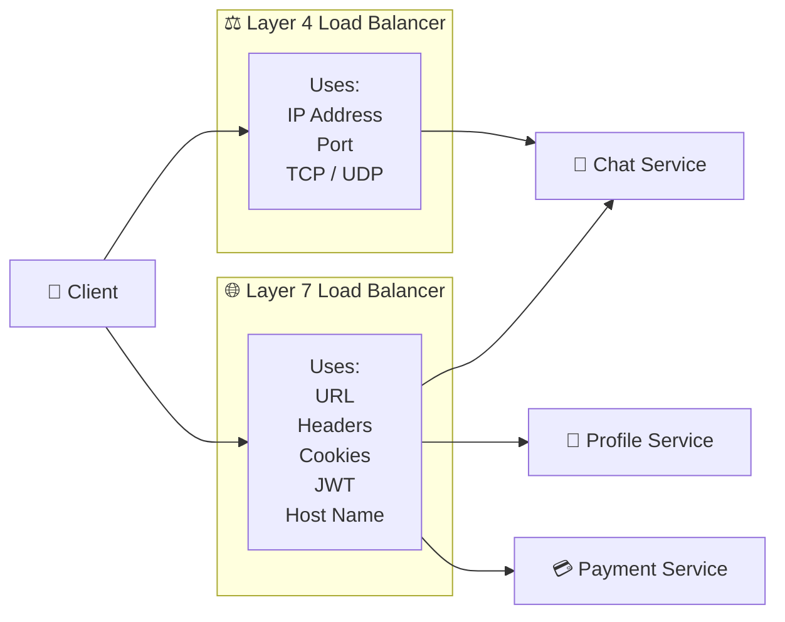
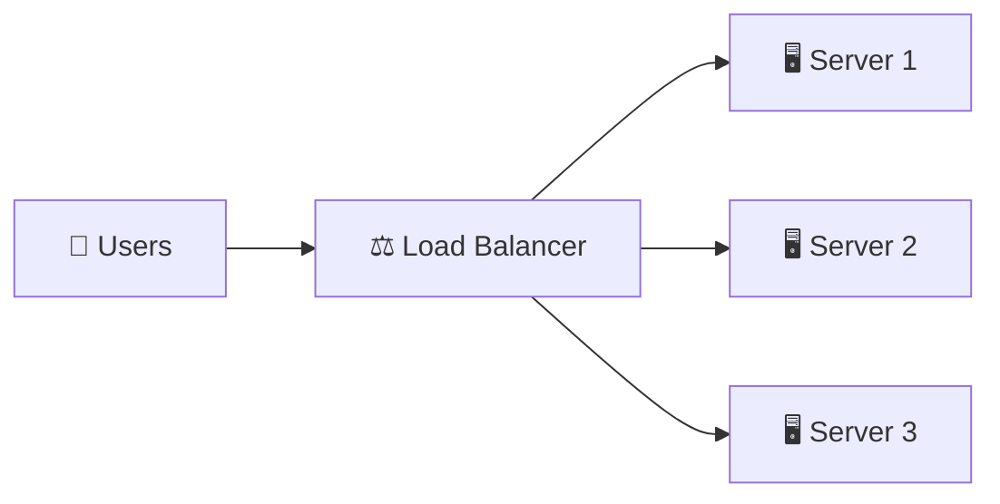
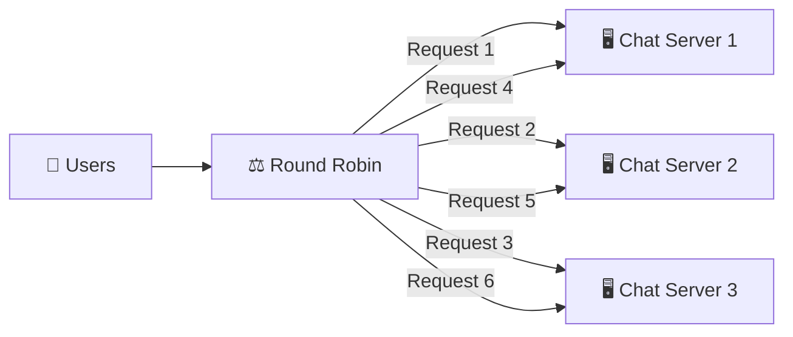
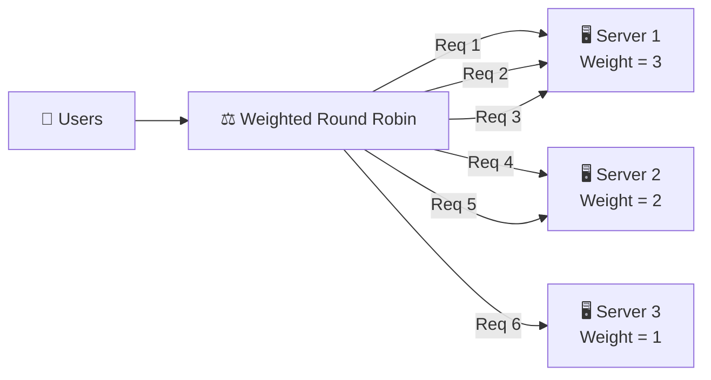
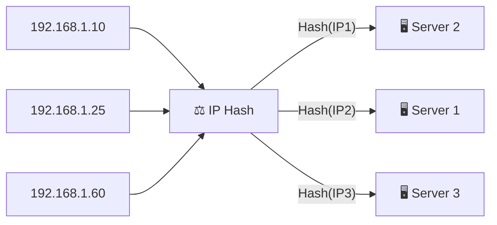
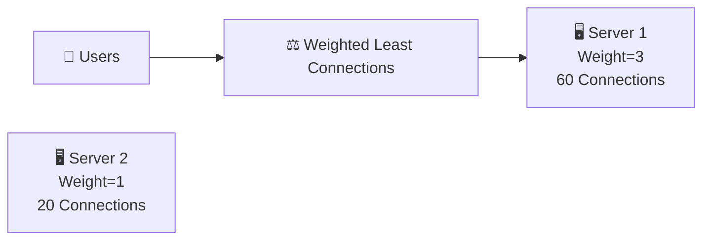
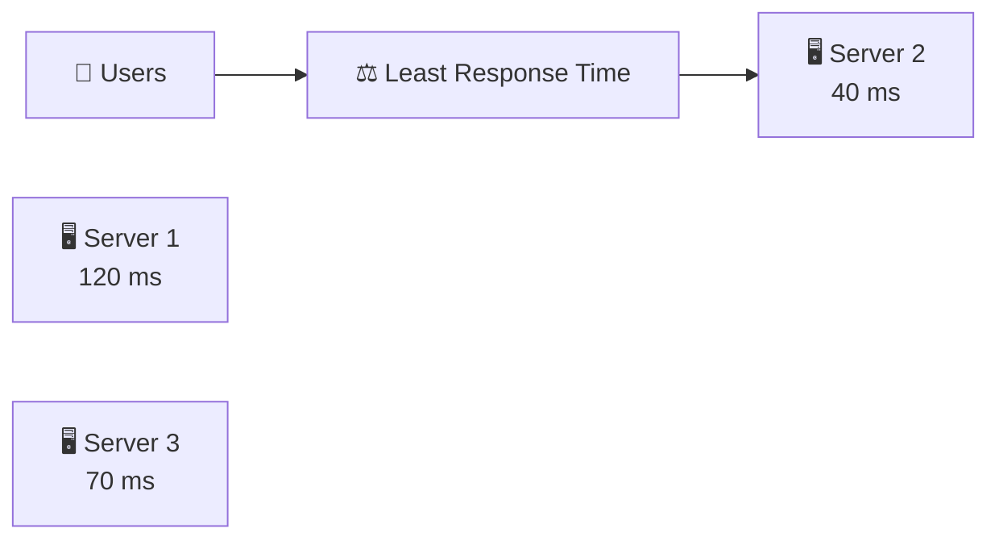
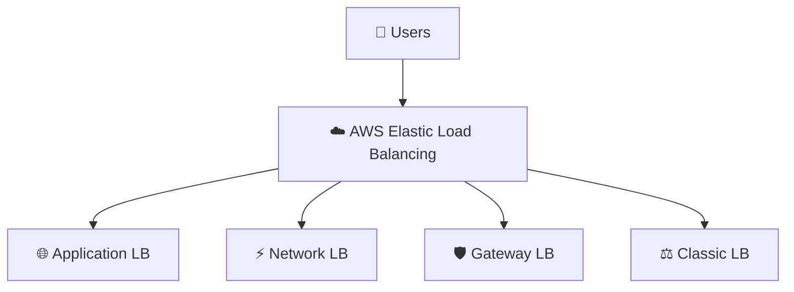

## WHAT IS LOAD BALANCER?

A Load Balancer is a hardware or software component that sits between clients and backend servers, receives incoming client requests, and intelligently distributes them across multiple servers. Its primary goal is to ensure that no single server becomes overloaded while improving availability, scalability, fault tolerance, and application performance. To users, the Load Balancer appears as a single entry point, even though requests are being handled by multiple backend servers.


# Q. Why Do We Need a Load Balancer?

As the number of users increases, a single server is no longer sufficient to handle all incoming requests efficiently. Without a Load Balancer, applications face several problems:

* CPU Overload – One server has to process every request, eventually reaching 100% CPU utilization.
* Memory Overload – Thousands of active users consume large amounts of RAM, causing the server to run out of memory.
* Network Bottleneck – Every server has limited network bandwidth, leading to slow responses and connection timeouts during heavy traffic.
* Single Point of Failure (SPOF) – If the only server crashes, the entire application becomes unavailable.
* Poor Scalability – Adding more backend servers alone doesn't help because clients don't know which server they should connect to.
* Uneven Traffic Distribution – Some servers may become overloaded while others remain underutilized, resulting in inefficient resource usage.

A Load Balancer solves these problems by intelligently distributing requests across multiple healthy servers, ensuring high availability, better performance, and easy horizontal scaling.


# Real-World Example:
Imagine WhatsApp during New Year's Eve, when millions of users send messages at the same time. If all requests were directed to a single chat server, it would quickly become overloaded and crash, causing messages to fail. Instead, WhatsApp uses a Load Balancer to distribute incoming requests across hundreds or thousands of chat servers. If one server becomes busy or fails, the Load Balancer automatically routes new requests to other healthy servers, allowing users to continue sending and receiving messages without noticing any interruption. This enables WhatsApp to handle massive traffic while maintaining high availability and fast response times.


2. PRODUCTION ARCHITECTURE
A Load Balancer is one of the most important components in a modern distributed system. In production environments, user requests do not directly reach backend servers. Instead, they pass through multiple networking components such as DNS, API Gateway, Service Discovery, and finally the Load Balancer, which selects a healthy backend server to process the request. This architecture improves scalability, fault tolerance, security, and availability.

ARCHITECTURE:



# HOW IT WORKS:
When a client sends a request, the DNS Load Balancer first routes it to the nearest healthy region. The request then reaches the API Gateway, which authenticates the user, validates the request, and applies security policies. The API Gateway queries Service Discovery to obtain the list of healthy service instances. Finally, the Internal Load Balancer selects one of those healthy backend servers using a routing algorithm such as Round Robin or Least Connections. The selected server processes the request, communicates with the database if necessary, and returns the response to the client.


# COMPLETE REQUEST FLOW:

Suppose a user sends the following request:

POST /api/v1/chat/sendMessage

STEP 1:- The client sends a request to api.chatapp.com.

STEP 2:- The DNS Load Balancer resolves the domain name and routes the request to the nearest healthy Region or Data Center.

STEP 3:- The request reaches the API Gateway, which authenticates the user, validates the JWT token, applies rate limiting, and checks authorization.

STEP 4:- The API Gateway requests the list of healthy Chat Service instances from Service Discovery.

STEP 5:- Service Discovery returns all healthy Chat Service instances currently available.

STEP 6:- The Internal Load Balancer selects one backend Chat Service using its configured routing algorithm.

STEP 7:- The selected Chat Service processes the request, stores the message in the database, and generates the response.

STEP 8:- The response is returned through the Load Balancer and API Gateway back to the client.


# REAL WORLD EXAMPLE:
When you send a message on WhatsApp, your request does not directly reach a chat server. It first passes through DNS to locate the nearest region, then through an API Gateway for authentication, followed by Service Discovery to locate healthy Chat Service instances. Finally, the Load Balancer selects one available Chat Server to process your message and store it in the database before sending the response back to your device.


## RESPONSIBILITIES OF EACH COMPONENT
Component	                                             Responsibility
DNS Load Balancer	                        Routes users to the nearest healthy Region
API Gateway	                            Authentication, Authorization, Rate Limiting, Routing
Service Discovery	                        Maintains a list of healthy service instances
Load Balancer	                        Selects one backend server using a routing algorithm
Chat Service	                        Executes business logic and interacts with the database
Database	                                    Stores and retrieves application data


# ADVANTAGES:
* HIGH AVAILABILITY - Requests are automatically routed to healthy backend servers if one server fails.
* BETTER SCALABILITY - New backend servers can be added without affecting clients.
* IMPROVED FAULT TOLERANCE - Server failures do not bring down the entire application.
* EFFICIENT RESOURCE UTILIZATION - Incoming traffic is evenly distributed among available servers.
* SIMPLIFIED CLIENT COMMUNICATION - Clients only communicate with a single public endpoint instead of multiple backend servers.

# DISADVANTAGES:
* ADDITIONAL INFRASTRUCTURE - Components such as API Gateway, Service Discovery, and Load Balancers increase infrastructure complexity.
* CONFIGURATION OVERHEAD - Routing rules, health checks, and service registrations must be properly configured.
* COST - Running multiple networking components increases operational expenses.


# Q. Why can't the API Gateway directly choose a backend server?
Answer: The API Gateway is responsible for authentication, authorization, and request routing. Selecting the best backend server based on health, traffic, and routing algorithms is the responsibility of the Load Balancer.

# Q. Why do we need Service Discovery if we already have a Load Balancer?
Answer: Backend servers are constantly created, removed, or restarted. Service Discovery always maintains an updated list of healthy service instances, while the Load Balancer simply chooses one server from that list to handle the request.

# Q. WHY ISN'T THIS ENOUGH?
We now understand where a Load Balancer fits inside a production architecture.


# Q. How does the Load Balancer actually decide which backend server should receive the next request?

The answer depends on the type of Load Balancer being used. Some Load Balancers work only with TCP/UDP packets (Layer 4), while others understand HTTP requests, URLs, Headers, Cookies, and JWT tokens (Layer 7).


## TYPES OF LOAD BALANCER: 

1. L4 LOAD BALANCER:
A Layer 4 (L4) Load Balancer operates at the Transport Layer (Layer 4) of the OSI Model. It distributes requests using only network-level information such as the Source IP Address, Destination IP Address, Source Port, Destination Port, and TCP/UDP Protocol. Since it does not inspect the actual application data, it is extremely fast and is commonly used for TCP and UDP traffic.

ARCHITECTURE:



# HOW IT WORKS:
When a client sends a request, the Layer 4 Load Balancer examines only the network information such as the source IP, destination IP, source port, destination port, and transport protocol (TCP/UDP). Based on its configured routing algorithm, it forwards the packet to one of the backend servers without inspecting the HTTP request, URL, headers, cookies, or request body.


# WHAT CAN L4 READ?

A Layer 4 Load Balancer can read:
* Source IP Address
* Destination IP Address
* Source Port
* Destination Port
* TCP Protocol
* UDP Protocol

It cannot read:
* HTTP URL
* HTTP Headers
* Cookies
* JWT Tokens
* Request Body
* Query Parameters


# REAL WORLD EXAMPLE

Suppose a WhatsApp client establishes a WebSocket connection over TCP.

Client

↓

TCP Connection

↓

Layer 4 Load Balancer

↓

Chat Server

The Load Balancer simply forwards the TCP connection to one of the available Chat Servers. It does not know whether the user is sending a message, creating a group, or updating their profile because it cannot inspect the HTTP data.


# ADVANTAGES:
* HIGH PERFORMANCE - Since it only examines network-level information, request processing is extremely fast.

* LOW LATENCY - Minimal packet inspection results in lower processing time.

* LOW CPU USAGE - No HTTP parsing or application-layer processing is required.

* IDEAL FOR TCP & UDP APPLICATIONS - Well suited for protocols such as WebSockets, Gaming, DNS, MQTT, VoIP, and other TCP/UDP-based applications.


# DISADVANTAGES:
* NO CONTENT-BASED ROUTING - Cannot route requests based on URLs, headers, cookies, or request body.

* NO SSL TERMINATION - It cannot inspect encrypted HTTP requests for intelligent routing.

* LIMITED INTELLIGENCE - Makes routing decisions only using IP addresses and ports.


# Q. Can an L4 Load Balancer route /api/v1/chat to a Chat Service?
Answer: No. A Layer 4 Load Balancer cannot read HTTP URLs or request paths. It only sees IP addresses, ports, and transport protocols.

# Q. Where are L4 Load Balancers commonly used?
Answer:L4 Load Balancers are commonly used for TCP/UDP-based applications such as WebSockets, Gaming Servers, DNS, MQTT Brokers, Database Connections, and VoIP systems where extremely low latency is required.

# WHY ISN'T THIS ENOUGH?
Although Layer 4 Load Balancers are extremely fast, they cannot understand HTTP requests.

Suppose a client sends:

GET /api/v1/profile

or

POST /api/v1/chat/sendMessage

An L4 Load Balancer cannot determine which request should go to the Profile Service or the Chat Service because it cannot read URLs or HTTP headers.

To perform intelligent request routing based on application data, we need a Layer 7 (L7) Load Balancer, which understands HTTP, HTTPS, URLs, Headers, Cookies, JWT Tokens, and Request Bodies.


2. LAYER 7 (L7) LOAD BALANCER:

A Layer 7 (L7) Load Balancer operates at the Application Layer (Layer 7) of the OSI Model. Unlike an L4 Load Balancer, it understands HTTP and HTTPS traffic, allowing it to inspect URLs, HTTP methods, headers, cookies, JWT tokens, and request bodies before deciding which backend service should process the request.

ARCHITECTURE:


# HOW IT WORKS:
When a client sends an HTTP or HTTPS request, the Layer 7 Load Balancer first examines the application-layer data such as the URL path, HTTP method, headers, cookies, host name, or JWT token. It then forwards the request to the appropriate backend service based on configured routing rules.


# WHAT CAN L7 READ?

A Layer 7 Load Balancer can inspect:
* HTTP URL
* HTTP Method (GET, POST, PUT, DELETE)
* Headers
* Cookies
* JWT Tokens
* Host Name
* Query Parameters
* Request Body


# REAL WORLD EXAMPLE:
When you open Amazon:

/api/products   -> is routed to the Product Service.

/api/orders     -> is routed to the Order Service.

/api/payment    -> is routed to the Payment Service.

All these requests first reach the same Layer 7 Load Balancer, which decides the appropriate backend service based on the URL.


# ADVANTAGES:
* INTELLIGENT ROUTING - Routes requests based on URLs, headers, cookies, host names, and HTTP methods.

* SSL TERMINATION - Can decrypt HTTPS traffic before forwarding requests to backend services.

* MICROSERVICE FRIENDLY - Perfect for routing requests to different microservices.

* SUPPORTS AUTHENTICATION - Can work with JWT tokens, OAuth, API Keys, and custom authentication mechanisms.


# DISADVANTAGES: 
* SLIGHTLY HIGHER LATENCY - Additional HTTP inspection introduces a small processing overhead.

* HIGHER CPU USAGE - Parsing HTTP requests consumes more resources than Layer 4 routing.

* APPLICATION LAYER ONLY - Primarily designed for HTTP and HTTPS traffic.

Q. Why do Microservices commonly use L7 Load Balancers?
Answer: Because a Layer 7 Load Balancer understands HTTP semantics and can route requests based on URLs, headers, host names, cookies, and JWT tokens, making it ideal for REST APIs and Microservices.

Q. Can an L7 Load Balancer perform SSL Termination?
Answer: Yes. L7 Load Balancers can terminate SSL/TLS connections, decrypt incoming HTTPS requests, inspect them, and then forward them to backend services.


# WHY ISN'T THIS ENOUGH?
We now understand both Layer 4 and Layer 7 Load Balancers.

However, choosing the right one can still be confusing because both distribute traffic across backend servers but operate differently.

In the next section, we'll compare Layer 4 vs Layer 7 Load Balancers feature by feature, understand their differences, and determine when each should be used in real production systems.


## L4 VS L7 LOAD BALANCER:

Both Layer 4 and Layer 7 Load Balancers distribute incoming traffic across multiple backend servers, but they operate at different layers of the OSI Model and make routing decisions using different information. Choosing the correct Load Balancer depends on the application protocol, routing requirements, and performance needs.

ARCHITECTURE:


# HOW IT WORKS:
A Layer 4 Load Balancer examines only network-level information such as IP addresses, ports, and transport protocols before forwarding packets to backend servers. In contrast, a Layer 7 Load Balancer inspects application-layer data such as URLs, HTTP methods, headers, cookies, and JWT tokens, enabling intelligent request routing to different services.


# REAL WORLD EXAMPLE
Suppose a user opens Amazon.

GET /api/products

The Layer 7 Load Balancer routes the request to the Product Service.

POST /api/payment

The same Load Balancer routes this request to the Payment Service.

A Layer 4 Load Balancer cannot make this decision because it cannot read the HTTP URL.


# L4 VS L7 COMPARISON:
| Feature            | Layer 4 (L4)       | Layer 7 (L7)              |
| ------------------ | -------------------| --------------------------|
| OSI Layer          | Transport Layer    | Application Layer         |
| Protocols          | TCP, UDP           | HTTP, HTTPS, WebSocket    |
| Reads URL          | ❌ No             | ✅ Yes                    |
| Reads Headers      | ❌ No             | ✅ Yes                    |
| Reads Cookies      | ❌ No             | ✅ Yes                    |
| Reads JWT          | ❌ No             | ✅ Yes                    |
| Reads Request Body | ❌ No             | ✅ Yes                    |
| SSL Termination    | ❌ No             | ✅ Yes                    |
| Speed              | Very Fast          | Slightly Slower           |
| CPU Usage          | Low                | Higher                    |
| Best For           | TCP, UDP, Gaming   | REST APIs, Microservices  |

# WHEN SHOULD WE USE L4?

Use an L4 Load Balancer when:
* Extremely low latency is required.
* The application uses TCP or UDP.
* HTTP inspection is not required.
* Maximum throughput is the priority.

Examples:
* Gaming Servers
* DNS Servers
* MQTT Brokers
* VoIP Systems
* Database Connections


# WHEN SHOULD WE USE L7?

Use an L7 Load Balancer when:
* URL-based routing is required.
* Different APIs must be routed to different services.
* SSL Termination is needed.
* Authentication or Header-based routing is required.

Examples:
* REST APIs
* Microservices
* E-Commerce Websites
* Banking Applications
* SaaS Platforms

# Q. Which Load Balancer is faster?
Answer: Layer 4 Load Balancers are generally faster because they only inspect network-level information, whereas Layer 7 Load Balancers inspect HTTP requests before routing them.

# Q. Which Load Balancer is used in Microservices?
Answer: Layer 7 Load Balancers are preferred because they can route requests based on URLs, headers, cookies, host names, and JWT tokens.


# Q. WHY ISN'T THIS ENOUGH?
ANS- We now understand the different types of Load Balancers.

However, another important question remains:

# Q. How does a Load Balancer decide which backend server should receive the next request?

ANS - This decision is made using Load Balancing Algorithms. These algorithms are broadly classified into:

* Static Load Balancing Algorithms
* Dynamic Load Balancing Algorithms

Let's first understand the Static Load Balancing Algorithms, where routing decisions are made using predefined rules.


## STATIC LOAD BALANCING ALGORITHMS:

Static Load Balancing Algorithms distribute requests using predefined routing rules. They do not monitor the current CPU usage, memory usage, response time, or active connections of backend servers. Every routing decision follows a fixed algorithm, making these algorithms simple, fast, and suitable for environments where all backend servers have similar hardware configurations.

TYPES OF STATIC LOAD BALANCING ALGORITHMS
* Round Robin
* Weighted Round Robin
* IP Hash


ARCHITECTURE:


The Load Balancer distributes requests according to a predefined algorithm instead of checking the real-time health or workload of each server.

# STATIC VS DYNAMIC ALGORITHMS:
| Static Algorithms              | Dynamic Algorithms                   |
| ------------------------------ | ------------------------------------ |
| Follow predefined rules        | Use real-time server information     |
| Do not check server load       | Continuously monitor server load     |
| Faster routing decisions       | Slightly slower due to monitoring    |
| Easy to implement              | More intelligent routing             |
| Suitable for identical servers | Suitable for production environments |


# REAL WORLD EXAMPLE:
Suppose an organization has three backend servers with identical hardware specifications.

Instead of analyzing CPU usage or response time for every request, the Load Balancer simply follows a predefined routing algorithm such as Round Robin or IP Hash to distribute incoming traffic evenly.

# Q. Why are Static Algorithms called "Static"?
Answer: Because they make routing decisions using fixed predefined rules and do not consider the real-time state or workload of backend servers.


# WHY ISN'T THIS ENOUGH?
Static algorithms work well when all servers have similar hardware and receive similar workloads.

However, in real production systems:
* One server may already have thousands of active users.
* Another server may have almost no traffic.
* Some servers may be much more powerful than others.

Since Static Algorithms cannot detect these runtime differences, they may distribute traffic inefficiently.

To overcome this limitation, we first study the most commonly used Static Algorithms:

* Round Robin
* Weighted Round Robin
* IP Hash


1. ROUND ROBIN - Round Robin distributes incoming requests sequentially among all backend servers. Every server receives an equal number of requests without considering its current workload or hardware capacity.

ARCHITECTURE:


# HOW IT WORKS:

The Load Balancer maintains a pointer to the backend servers. Each incoming request is forwarded to the next server in sequence. After reaching the last server, the cycle starts again from the first server.


# REAL WORLD EXAMPLE:
Suppose an e-commerce application has three identical application servers. If six users visit the website, the requests are distributed as:

User 1 → Server 1
User 2 → Server 2
User 3 → Server 3
User 4 → Server 1
User 5 → Server 2
User 6 → Server 3


2. WEIGHTED ROUND ROBIN - Weighted Round Robin assigns a weight to every backend server. Servers with higher weights receive more requests, allowing powerful servers to handle a larger portion of the traffic.

ARCHITECTURE:

# HOW IT WORKS:
Each server is assigned a predefined weight based on its hardware capacity. The Load Balancer distributes requests according to these weights, so higher-capacity servers receive proportionally more traffic.


# REAL WORLD EXAMPLE:

Suppose an application has three servers:

Server 1 → 64 CPU → Weight = 3
Server 2 → 32 CPU → Weight = 2
Server 3 → 16 CPU → Weight = 1

The Load Balancer distributes requests in the ratio 3 : 2 : 1, allowing the most powerful server to process the most requests.


3. IP HASH - IP Hash uses the client's IP address to determine which backend server should receive the request. The same client IP is always mapped to the same server, providing Session Affinity (Sticky Sessions).

ARCHITECTURE:



# HOW IT WORKS:
The Load Balancer applies a hash function to the client's IP address. The resulting hash determines which backend server will handle the request. As long as the server remains available, every request from the same client IP is routed to the same server.


# REAL WORLD EXAMPLE:
Suppose a user logs into WhatsApp from IP address 192.168.10.25. Every request, such as sending messages, receiving messages, or viewing chats, is routed to the same Chat Server, ensuring the user's session remains consistent.

This is enough for static algorithms. The dynamic algorithms (Least Connections, Weighted Least Connections, Least Response Time) deserve slightly more explanation because they're the algorithms actually used in production systems like AWS ALB, NGINX, Envoy, and HAProxy.


# STATIC LOAD BALANCING ALGORITHMS COMPARISON:
| Feature                   | Round Robin       | Weighted Round Robin | IP Hash              |
| ------------------------- | ----------------- | -------------------- | ---------------------|
| Routing Based On          | Sequential Order  | Server Weight        | Client IP Address    |
| Considers Server Capacity | ❌ No             | ✅ Yes              | ❌ No                |
| Sticky Sessions           | ❌ No             | ❌ No               | ✅ Yes               |
| Runtime Load Aware        | ❌ No             | ❌ No               | ❌ No                |
| Best For                  | Identical Servers | Different Hardware   | Stateful Applications |


# WHY ISN'T THIS ENOUGH?

Static Load Balancing Algorithms follow predefined rules and never check the real-time condition of backend servers.

Suppose:
* Server 1 → CPU = 95%
* Server 2 → CPU = 20%
* Server 3 → CPU = 15%

A Static Algorithm may still send requests to Server 1 even though it is overloaded.

To solve this problem, production systems use Dynamic Load Balancing Algorithms, which continuously monitor the health and workload of backend servers before routing requests.


## DYNAMIC LOAD BALANCING ALGORITHMS:

Dynamic Load Balancing Algorithms make routing decisions using the real-time status of backend servers. Before forwarding a request, the Load Balancer checks metrics such as CPU usage, active connections, response time, memory utilization, and server health to select the most suitable server.

TYPES OF DYNAMIC LOAD BALANCING ALGORITHMS
* Least Connections
* Weighted Least Connections
* Least Response Time

ARCHITECTURE:

# HOW IT WORKS:
Before routing every request, the Load Balancer collects real-time information from all backend servers and forwards the request to the server that is currently the most suitable according to the selected algorithm.

# REAL WORLD EXAMPLE:

Suppose three servers are running:
* Server 1 → 90% CPU
* Server 2 → 25% CPU
* Server 3 → 40% CPU

Instead of following a fixed sequence, the Load Balancer forwards the next request to Server 2 because it currently has the lowest workload.


# STATIC VS DYNAMIC ALGORITHMS:
| Feature                     | Static Algorithms | Dynamic Algorithms      |
| --------------------------- | ----------------- | ----------------------- |
| Decision Based On           | Fixed Rules       | Real-Time Server Status |
| Checks CPU Usage            | ❌ No             | ✅ Yes                 |
| Checks Active Connections   | ❌ No             | ✅ Yes                 |
| Checks Response Time        | ❌ No             | ✅ Yes                 |
| Better Resource Utilization | ❌                | ✅                     |
| Used in Production          | Limited           | Widely Used             |


Dynamic Algorithms use different metrics to determine the best backend server.

Some algorithms focus on:
* Active Connections
* Server Capacity
* Response Time

Let's understand each algorithm individually, starting with the most commonly used one—Least Connections.


1. LEAST CONNECTIONS - Least Connections routes each new request to the backend server that currently has the fewest active connections. This helps distribute traffic more evenly, especially when requests have different processing times.

ARCHITECTURE:
```mermaid
flowchart LR

U1["192.168.1.10"]

U2["192.168.1.25"]

U3["192.168.1.60"]

LB["⚖️ IP Hash"]

S1["🖥️ Server 1"]

S2["🖥️ Server 2"]

S3["🖥️ Server 3"]

U1 --> LB
U2 --> LB
U3 --> LB

LB -->|"Hash(IP1)"| S2
LB -->|"Hash(IP2)"| S1
LB --
``` 

# HOW IT WORKS:
The Load Balancer continuously monitors the number of active connections on each backend server. Every new request is forwarded to the server with the least number of active connections.


# REAL WORLD EXAMPLE:
Suppose a chat application has:

* Server 1 → 120 Active Users
* Server 2 → 45 Active Users
* Server 3 → 80 Active Users

The next user will be connected to Server 2 because it currently has the fewest active connections.


2. WEIGHTED LEAST CONNECTIONS - Weighted Least Connections combines server capacity and active connections. More powerful servers are assigned higher weights, allowing them to handle more active connections before receiving fewer new requests.

ARCHITECTURE:


# HOW IT WORKS:
The Load Balancer compares the number of active connections relative to each server's weight instead of simply counting connections. A powerful server can receive more requests than a smaller server while still maintaining balanced utilization.


# REAL WORLD EXAMPLE

Suppose:

* Server 1 → Weight = 3 → 60 Connections
* Server 2 → Weight = 1 → 20 Connections

Although Server 1 has more connections, it has much greater capacity, so it may still receive the next request.


3. LEAST RESPONSE TIME - Least Response Time selects the backend server that responds the fastest. It considers both the server's response time and, in many implementations, the number of active connections to choose the most responsive server.

ARCHITECTURE:


# HOW IT WORKS:
The Load Balancer continuously measures the response time of backend servers. Incoming requests are forwarded to the server responding the quickest, helping reduce latency and improve user experience.


# REAL WORLD EXAMPLE:

Suppose three application servers respond in:
* Server 1 → 120 ms
* Server 2 → 40 ms
* Server 3 → 65 ms

The next request is routed to Server 2 because it has the lowest response time.


# DYNAMIC LOAD BALANCING ALGORITHMS COMPARISON:

| Feature                   | Least Connections   | Weighted Least Connections  | Least Response Time      |
| ------------------------- | ------------------  | --------------------------- | ------------------------ |
| Routing Based On          | Active Connections  | Active Connections + Weight | Fastest Response Time    |
| Considers Server Capacity | ❌ No               | ✅ Yes                     | Indirectly               |
| Checks Active Connections | ✅ Yes              | ✅ Yes                     | Usually Yes              |
| Checks Response Time      | ❌ No               | ❌ No                      | ✅ Yes                   |
| Best For                  | Chat Apps           | Mixed Hardware              | Low-Latency Applications |


## AWS LOAD BALANCERS:

AWS provides different types of Load Balancers, each designed for different networking requirements.

TYPES OF AWS LOAD BALANCERS
* Application Load Balancer (ALB)
* Network Load Balancer (NLB)
* Gateway Load Balancer (GWLB)
* Classic Load Balancer (CLB)

ARCHITECTURE:



1. APPLICATION LOAD BALANCER (ALB) - An Application Load Balancer (ALB) is a Layer 7 Load Balancer that routes HTTP/HTTPS requests based on URLs, Host Names, Headers, Cookies, and Query Parameters.


# REAL WORLD EXAMPLE:
Amazon routes:
* /products  → Product Service
* /orders    → Order Service
* /payment   → Payment Service

using an Application Load Balancer.


2. NETWORK LOAD BALANCER (NLB) - A Network Load Balancer (NLB) is a Layer 4 Load Balancer designed for extremely high-performance TCP, UDP, and TLS traffic with very low latency.


# REAL WORLD EXAMPLE:
Gaming servers and VoIP applications use NLB because they require millions of TCP/UDP connections with minimal latency.


3. GATEWAY LOAD BALANCER (GWLB) - A Gateway Load Balancer (GWLB) distributes traffic to virtual security appliances such as Firewalls, Intrusion Detection Systems (IDS), and Intrusion Prevention Systems (IPS).


# REAL WORLD EXAMPLE:
An enterprise routes all incoming internet traffic through multiple firewall appliances using a Gateway Load Balancer before forwarding requests to application servers.


4. CLASSIC LOAD BALANCER (CLB) - A Classic Load Balancer (CLB) is AWS's legacy Load Balancer that supports both Layer 4 and basic Layer 7 features. It is maintained for older applications but is generally replaced by ALB and NLB for new deployments.

# REAL WORLD EXAMPLE::
Older AWS applications built before ALB and NLB commonly use the Classic Load Balancer.