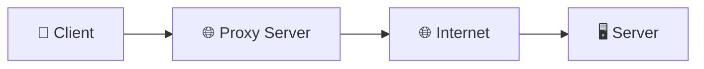
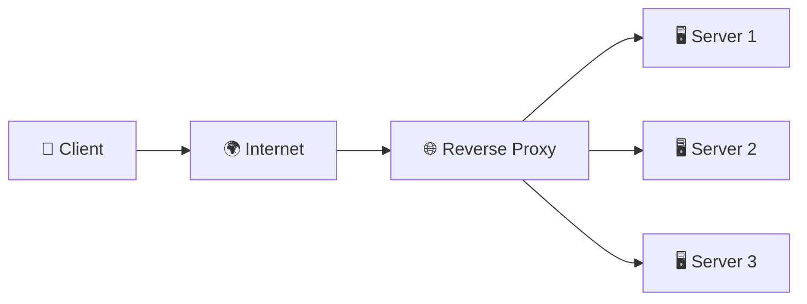
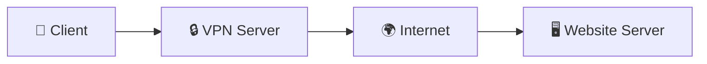
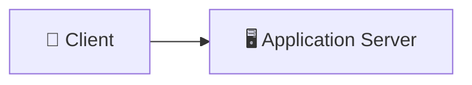
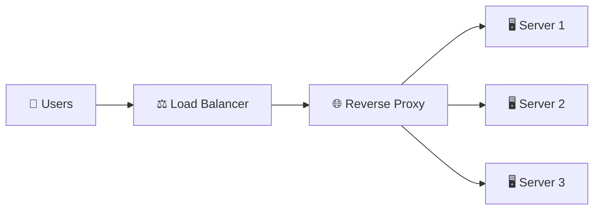

# TYPES OF SERVER:

1. WEB SERVER - A Web Server receives HTTP/HTTPS requests from clients and serves static content such as HTML, CSS, JavaScript, images, and videos. It can also forward dynamic requests to an Application Server.

Examples: NGINX, Apache HTTP Server, Caddy

REAL WORLD EXAMPLE: When you open amazon.com, the HTML, CSS, JavaScript, and images are typically served by a Web Server.

2. DATABASE SERVER - A Database Server stores, manages, and retrieves application data. It processes queries, handles transactions, and ensures data consistency and persistence.

Examples: PostgreSQL, MySQL, MongoDB, Cassandra

REAL WORLD EXAMPLE: When you place an order on Amazon, the order details are stored in a Database Server.

3. MAIL SERVER - A Mail Server sends, receives, and stores emails using protocols such as SMTP, POP3, and IMAP.

Examples: Microsoft Exchange, Postfix, Gmail Mail Servers

REAL WORLD EXAMPLE: When you receive an OTP or password reset email, it is delivered through a Mail Server.

4. FILE SERVER - A File Server centrally stores and shares files across multiple users or systems while managing file access and permissions.

Examples: NAS (Network Attached Storage), Windows File Server, Samba

REAL WORLD EXAMPLE: Employees in a company access shared documents from a common File Server instead of storing copies on every computer.

5. GAME SERVER - A Game Server hosts multiplayer games, synchronizes player actions, maintains game state, and communicates updates to connected players in real time.

Examples: Minecraft Server, Counter-Strike Server, Valorant Game Servers

REAL WORLD EXAMPLE: During a PUBG or Valorant match, all player movements and game events are synchronized through a Game Server.

6. PROXY SERVER - A Proxy Server acts as an intermediary between clients and destination servers, forwarding requests while providing privacy, security, caching, access control, and traffic monitoring.

Examples: Squid Proxy, HAProxy (Forward Proxy Mode)

REAL WORLD EXAMPLE: A company routes all employee internet traffic through a Proxy Server to block restricted websites and monitor network usage.

7. AI SERVER - An AI Server hosts machine learning models and performs inference or training tasks by processing AI requests from clients or applications.

Examples: NVIDIA Triton Inference Server, Ollama Server, TensorFlow Serving

REAL WORLD EXAMPLE: When you ask ChatGPT a question, your request is processed by AI servers running large language models.

8. CLOUD SERVER - A Cloud Server is a virtual server hosted by cloud providers, offering scalable compute resources on demand without requiring physical hardware management.

Examples: AWS EC2, Azure Virtual Machines, Google Compute Engine

REAL WORLD EXAMPLE: Netflix and Airbnb run thousands of Cloud Servers on AWS to dynamically scale based on user traffic.

Q. What is the difference between a Web Server and an Application Server?

Answer: A Web Server primarily serves static content and handles HTTP requests, whereas an Application Server executes business logic, communicates with databases, and generates dynamic responses.

Q. Which server stores application data?
Answer: A Database Server stores, manages, and retrieves application data while ensuring consistency, durability, and efficient query processing.

Q. Which servers are commonly used in modern web applications?
Answer: A typical production system uses a Web Server, Application Server, Database Server, Proxy/Reverse Proxy, and Cloud Server. Additional servers such as Mail Servers, File Servers, Game Servers, or AI Servers are used based on the application's requirements.

# WHAT IS PROXY SERVER?
A Proxy Server is an intermediate server that forwards requests between a client and another server. It acts as a gateway, providing security, privacy, caching, monitoring, and traffic management.

Purpose: To provide privacy, security, caching, monitoring, and controlled internet access for clients.

ARCHITECTURE:

# Q. WHY DO WE NEED PROXY SERVERS?
* PROVIDES IP ANONYMITY (TO CLIENT) - A Forward Proxy hides the client's original IP address by forwarding requests using its own public IP address. As a result, the destination server only sees the Proxy Server's IP, improving client privacy and anonymity.

* ACCESS CONTROL - A Forward Proxy can enforce organizational policies by allowing or blocking access to specific websites before requests reach the internet. This helps organizations control how employees use the internet.

Example: A company may allow access to GitHub and Stack Overflow but block Facebook, Instagram, and YouTube.

* REQUEST GROUPING - A Forward Proxy groups multiple requests for the same resource into a single request to the destination server. The fetched resource is then shared with all requesting clients, reducing bandwidth usage and unnecessary network traffic.

Example: If 500 employees request the same company logo, the Proxy downloads it once and serves the cached copy to everyone.

* RESTRICTED CONTENT FILTERING - A Forward Proxy inspects outgoing requests and blocks access to restricted, malicious, or unauthorized websites based on predefined security rules. This protects users and organizations from accessing unsafe content.

Example: Schools and offices block gambling, adult, phishing, and malware websites.

* HELPS IN CACHING - A Forward Proxy stores frequently requested resources locally so that future requests can be served directly from the Proxy instead of contacting the original server again. This reduces latency, bandwidth usage, and server load.

Example: Frequently accessed images, CSS, JavaScript files, and documents are served from the Proxy Cache instead of being downloaded repeatedly.

# Q. Is a Proxy mandatory for every application?
Answer: No. Small applications usually communicate directly with servers, while medium and large-scale systems commonly use proxies for security and scalability.

## WHAT IS REVERSE PROXY?
A Reverse Proxy is an intermediate server that sits in front of one or more backend servers and forwards client requests to the appropriate server on behalf of those servers. It represents the server, providing IP anonymity, security, SSL termination, caching, load balancing, and traffic management.

Purpose: To secure backend servers, hide their identity, optimize requests, and improve scalability.

ARCHITECTURE:

# HOW IT WORKS:
Clients never communicate directly with backend servers. Every request first reaches the Reverse Proxy, which inspects the request, applies security rules, optionally performs SSL termination or caching, and forwards it to the appropriate backend server.

# REAL WORLD EXAMPLE: 
When you visit amazon.com, your browser connects to Amazon's Reverse Proxy instead of directly accessing the Product, Order, or Payment servers.

# Q. WHY DO WE NEED A REVERSE PROXY?
* SITS IN FRONT OF SERVERS - A Reverse Proxy acts as the single public entry point for backend servers. Clients communicate only with the Reverse Proxy, while the backend servers remain private.

* PROVIDES IP ANONYMITY (TO SERVERS) - A Reverse Proxy hides the real IP addresses of backend servers. Clients only see the Reverse Proxy's public IP, improving security by preventing direct access to internal servers.

* HELPS IN LOAD BALANCING - A Reverse Proxy can distribute incoming requests across multiple backend server instances, preventing any single server from becoming overloaded and improving application availability.

* PROTECTS FROM DDoS ATTACKS - The Reverse Proxy filters malicious traffic before it reaches backend servers. It can block suspicious requests, enforce rate limits, and absorb large volumes of traffic during DDoS attacks.

Q. Who does a Reverse Proxy protect?
Answer: A Reverse Proxy protects the servers by hiding their identities, filtering incoming traffic, and preventing direct access from clients.

## PROXY VS VPN: 
A Proxy forwards application requests and hides the client's IP address, whereas a VPN (Virtual Private Network) creates an encrypted tunnel between the client and the VPN server, protecting all network traffic from interception.

PURPOSE OF VPN: To securely transmit all network traffic through an encrypted tunnel.

ARCHITECTURE OF VPN:

# HOW IT WORKS:
A Proxy simply forwards requests using its own IP address. A VPN encrypts all traffic before it leaves the client device, sends it securely through the VPN tunnel, and decrypts it at the VPN server before forwarding it to the destination.

# REAL WORLD EXAMPLE:
Employees working remotely often connect to their company's internal network through a VPN so that all communication remains encrypted over the internet.

# PROXY VS VPN
    Proxy	                           VPN
Hides Client IP	                  Hides Client IP
No End-to-End Encryption	    Encrypts All Traffic
Application Level	                Device Level
Faster	                          Slightly Slower
Lower Security	                   Higher Security

Q. Does a Proxy encrypt internet traffic?
Answer: No. A Proxy mainly provides IP masking and request forwarding. Encryption is provided by HTTPS or a VPN.

Q. Does a VPN protect all internet traffic while a Proxy only protects browser traffic?
Answer: Yes. A VPN encrypts all network traffic leaving the device, whereas a Proxy generally works only for the configured application (such as a browser or a specific app). Therefore, VPNs provide broader security than Proxies.

## REVERSE PROXY VS LOAD BALANCER

A Reverse Proxy manages and secures incoming requests before forwarding them to backend servers, whereas a Load Balancer focuses on distributing traffic across healthy server instances to improve scalability and availability.

ARCHITECTURE:

A Reverse Proxy MAY perform Load Balancing, but Load Balancing is NOT its primary responsibility.

Its primary responsibilities include:
* Security
* SSL Termination
* Request Routing
* Caching
* Authentication
* Logging & Monitoring
* Compression
* Rate Limiting

Load Balancing is simply one of the many features offered by a Reverse Proxy.

    REVERSE PROXY                                 LOAD BALANCER
Hides Server IP Addresses               Distributes Traffic Across Servers
SSL Termination                             Performs Health Checks
Request Routing                             Detects Server Failures
Caching                                   Supports Horizontal ScalingCompression                                 
Logging & Monitoring                      Provides Automatic Failover                                        
Authentication
Can Perform Load Balancing

Q. If a Reverse Proxy can perform Load Balancing, why do we still need a Load Balancer?
Answer: For small applications, a Reverse Proxy alone is sufficient. In large-scale production systems, a dedicated Load Balancer distributes traffic globally, while the Reverse Proxy focuses on security, routing, caching, SSL termination, and request processing.

Q. Can a Reverse Proxy exist with only one server?
Answer: Yes. Even if an application has only one backend server, companies still place a Reverse Proxy in front of it because it provides several important features such as:

* SSL Termination
* Authentication
* Request Routing
* IP Anonymity
* Caching
* Compression
* Logging & Monitoring
* Rate Limiting

This is why web servers such as NGINX or Apache are commonly used as Reverse Proxies even when there is only a single backend server.

## Q. DO WE NEED PROXY SERVER EVERYWHERE?
ANS - No. Proxy Servers are not required for every application. Small applications usually communicate directly with backend servers, whereas medium and large-scale applications use Reverse Proxies to improve security, performance, and scalability.

ARCHITECTURE:

Small Applications like:
* Todo App
* Portfolio Website
* College Project
No Proxy Server required.

Large Application like: 
* Amazon
* Netflix
* Google
* Uber
Reverse Proxy recommended.

Q. Should every application use a Reverse Proxy?
Answer: No. Small applications generally do not need one. Reverse Proxies become valuable as traffic, security requirements, and system complexity increase.

## Q. IF REVERSE PROXY CAN DO LOAD BALANCING, THEN WHAT IS THE NEED OF LOAD BALANCERS?
Although a Reverse Proxy can distribute traffic, its primary responsibility is request management and security. In enterprise-scale systems, a dedicated Load Balancer handles traffic distribution, while the Reverse Proxy provides advanced features such as caching, SSL termination, logging, authentication, and request routing.

ARCHITECTURE:

RESPONSIBILITY DISTRIBUTION: 

1. LOAD BALANCER:
* Global Traffic Distribution - Distributes incoming client requests across multiple healthy servers or server clusters to prevent overload and improve scalability.

* Health Checks - Continuously monitors backend servers and automatically stops sending traffic to unhealthy or failed servers.

* Failover - Redirects traffic to healthy servers whenever a server or instance becomes unavailable, ensuring high availability.

* Horizontal Scaling - Allows applications to handle increasing traffic by adding more server instances without changing the application itself.

2. REVERSE PROXY:
* SSL Termination - Decrypts incoming HTTPS requests at the proxy, reducing the processing overhead on backend servers.

* Authentication - Validates user credentials or access tokens before forwarding requests to backend services.

* Request Routing - Routes requests to the appropriate backend server or microservice based on URL, headers, or routing rules.

* IP Anonymity - Hides the real IP addresses of backend servers so clients only communicate with the Reverse Proxy.

* Caching - Stores frequently requested responses and serves them directly, reducing server load and improving response times.

* Compression - Compresses responses using algorithms like Gzip or Brotli before sending them to clients, reducing bandwidth usage and speeding up page loads.

* Logging - Records incoming requests, responses, errors, and access logs for monitoring, debugging, and auditing purposes.

* Rate Limiting - Restricts the number of requests a client can make within a specific time period to prevent abuse and DDoS attacks.

# REAL WORLD EXAMPLE:
Amazon first uses a Load Balancer to distribute incoming traffic across healthy server clusters. The selected cluster then uses a Reverse Proxy (such as NGINX or Envoy) to handle SSL termination, routing, authentication, caching, and forwarding requests to the appropriate backend service.

Q. Why do companies like Amazon use both a Load Balancer and a Reverse Proxy?
Answer: A Load Balancer decides which server or cluster should receive the request, while the Reverse Proxy decides how the request should be processed, secured, cached, and routed before it reaches the backend application. Together they provide scalability, security, and high availability.