# SCALING:-
Scaling is the process of increasing an application's capacity to handle more users, requests, or data while maintaining performance, availability, and reliability.

As applications grow from a few users to millions of users, a single server eventually becomes insufficient. Companies continuously improve their architecture by introducing new components and distributing the workload across multiple machines.


# WHY DO WE NEED SCALING?
As user traffic increases, applications begin to experience several challenges:
* High CPU Utilization
* High Memory Usage
* Slow Database Queries
* Increased Response Time
* Network Congestion
* Hardware Limitations

Without scaling, applications eventually become slow or completely unavailable.


# REAL WORLD EXAMPLE:
Suppose you build a To-Do application for 100 users Everything works perfectly.

A few months later, the application becomes popular and now serves: 100,000 Users


The existing server starts experiencing:
* CPU = 100%
* RAM = Full
* Slow Database Queries
* Higher Response Time

Instead of rebuilding the application, companies scale the infrastructure.


## TYPES OF SCALING:
There are two primary ways to scale an application.

1. Vertical Scaling (Scale Up)
2. Horizontal Scaling (Scale Out)

Most modern distributed systems combine both approaches to achieve maximum scalability.


## VERTICAL SCALING (SCALE UP):

Vertical Scaling is the process of increasing the computing resources of a single server by upgrading its hardware. 
Instead of adding more servers, the existing server becomes more powerful by increasing CPU, RAM, Storage, or Network capacity.

ARCHITECTURE:
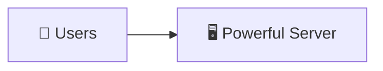

# HOW IT WORKS:
As application traffic increases, the existing server is upgraded with more CPU cores, RAM, storage, or faster networking. Since there is still only one server, all requests continue to be processed by the same machine.


# REAL WORLD EXAMPLE:
A startup initially deploys its application on an AWS EC2 instance with 2 vCPUs and 4 GB RAM. As traffic grows, it upgrades the instance to 16 vCPUs and 64 GB RAM instead of introducing additional servers.


# ADVANTAGES OF VERTICAL SCALING:

1. SIMPLE TO IMPLEMENT - Only one server needs to be upgraded. No architectural changes are required.

2. STRONG DATA CONSISTENCY - Since there is only one application server and one database, every user always sees the latest data.

3. FAST COMMUNICATION - All components communicate locally without network latency.

4. EASY TO MANAGE - Managing a single server is significantly easier than maintaining multiple distributed servers.


# DISADVANTAGES OF VERTICAL SCALING:

1. SINGLE POINT OF FAILURE - If the only server crashes, the entire application becomes unavailable.

2. HARDWARE LIMITATIONS - A server cannot be upgraded indefinitely. Every machine has maximum CPU, RAM, and storage limits.

3. EXPENSIVE UPGRADES - High-end enterprise servers are considerably more expensive than commodity servers.

4. LIMITED SCALABILITY - Eventually, hardware reaches its limit, forcing the application to adopt Horizontal Scaling.


# WHEN SHOULD WE USE VERTICAL SCALING?

Recommended for:
* Startups
* College Projects
* MVPs
* Internal Company Tools
* Small Business Applications


Q. Why isn't Vertical Scaling sufficient for Amazon or Netflix?
Answer: Vertical Scaling eventually reaches hardware limits and still creates a Single Point of Failure. Large-scale systems require Horizontal Scaling for better scalability and fault tolerance.


# HORIZONTAL SCALING (SCALE OUT)

Horizontal Scaling is the process of increasing application capacity by adding multiple servers instead of upgrading a single server. 
Incoming requests are distributed across these servers using a Load Balancer.

ARCHITECTURE:
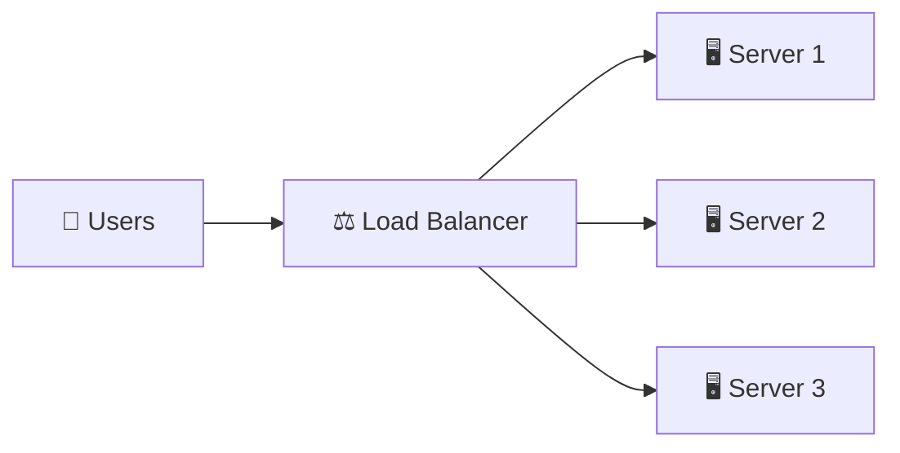

# HOW IT WORKS:
Instead of increasing the capacity of one server, additional servers are deployed. The Load Balancer distributes incoming requests across healthy server instances, ensuring that no individual server becomes overloaded.


# REAL WORLD EXAMPLE:
Amazon runs thousands of application servers behind Load Balancers. During Prime Day, additional server instances are automatically launched to handle increased traffic.


# ADVANTAGES OF HORIZONTAL SCALING:

1. HIGH SCALABILITY - Additional servers can be added whenever traffic increases.

2. HIGH AVAILABILITY - If one server fails, the Load Balancer automatically redirects traffic to healthy servers.

3. BETTER FAULT TOLERANCE - The application continues running even when individual servers become unavailable.

4. COST EFFECTIVE - Adding multiple commodity servers is often cheaper than purchasing one extremely powerful machine.


# DISADVANTAGES OF HORIZONTAL SCALING

1. MORE COMPLEX ARCHITECTURE - Multiple servers require Load Balancers, Service Discovery, Monitoring, and Distributed Communication.

2. NETWORK LATENCY - Servers communicate over the network instead of locally, increasing communication latency.

3. DATA CONSISTENCY CHALLENGES - Keeping multiple servers and databases synchronized becomes significantly more difficult.

4. HIGHER OPERATIONAL COST - Running multiple servers increases deployment, monitoring, logging, and infrastructure costs.


# WHEN SHOULD WE USE HORIZONTAL SCALING?

Recommended for:
* E-Commerce Platforms
* Social Media Applications
* Streaming Services
* Microservices
* Enterprise Applications

# INTERVIEW QUESTION

Q. Why is Horizontal Scaling preferred in Distributed Systems?
Answer: It provides better scalability, high availability, and fault tolerance by distributing traffic across multiple servers instead of relying on a single machine.


## VERTICAL SCALING VS HORIZONTAL SCALING:

| Feature                 |           Vertical Scaling          |           Horizontal Scaling       |
|-------------------------|-------------------------------------|------------------------------------|
| Number of Servers       |                  One                |                Multiple            |
| Scaling Method          |           Upgrade Hardware          |              Add Servers           |
| Single Point of Failure |                  Yes                |                   No               |
| Data Consistency        |                 Easier              |             More Challenging       |
| Hardware Limit          |                  Yes                |           Practically Unlimited    |
| Communication           |               Local IPC             |               Network Calls        |
| Load Balancer Required  |                  No                 |                   Yes              |
| Fault Tolerance         |                 Low                 |                  High              |
| Scalability             |                Limited              |               Excellent            |


## HYBRID SCALING:

Hybrid Scaling combines Vertical Scaling and Horizontal Scaling to achieve the advantages of both approaches. 
Companies first upgrade individual servers to a reasonable capacity and then deploy multiple server instances behind a Load Balancer as traffic continues to grow.

ARCHITECTURE:
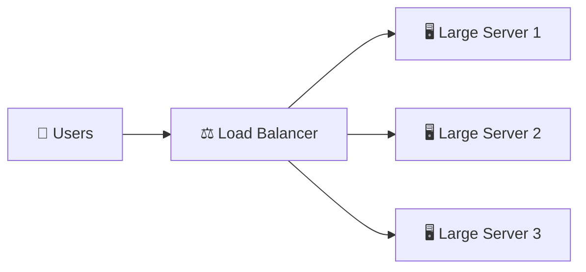

# HOW IT WORKS:
Each application server is vertically scaled with sufficient CPU and memory, while multiple server instances are deployed horizontally behind a Load Balancer to handle increasing traffic.


# REAL WORLD EXAMPLE:
Netflix runs powerful cloud instances across multiple AWS Regions while simultaneously distributing traffic across thousands of server instances using Load Balancers.


# ADVANTAGES OF HYBRID SCALING:
1. HIGH PERFORMANCE - Combines powerful hardware with multiple server instances.

2. HIGH AVAILABILITY - Server failures do not affect the overall application.

3. BETTER FAULT TOLERANCE - Traffic is automatically redirected to healthy servers.

4. FUTURE READY - Allows applications to continue growing without major architectural changes.


Q. Which scaling approach is commonly used by companies like Amazon, Netflix, and Google?
Answer: Hybrid Scaling. They combine Vertical Scaling for powerful servers and Horizontal Scaling for distributed, highly available infrastructure.


1. STATELESS ARCHITECTURE:

A Stateless system is an architecture where the server does not store any client-specific information between requests. Every request contains all the required information needed for the server to process it independently.

The server treats every request as a new request and does not depend on previous interactions.

ARCHITECTURE:
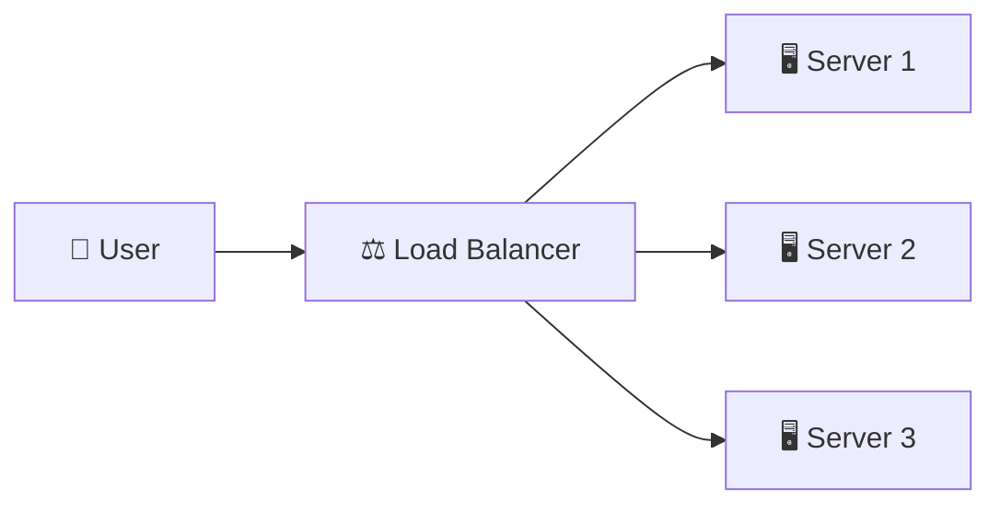
# How It Works:

Suppose a user sends three requests:
* Request 1 → Server 1
* Request 2 → Server 2
* Request 3 → Server 3

Any server can handle any request because no server stores user session data locally.


# Real World Example:

Amazon product search is mostly stateless.

sO, When you search for an iPhone:

User Request
      |
      ↓
Load Balancer
      |
      ↓
Any Available Server

The server receives:
* User ID
* Search query
* Authentication token

and processes the request independently.


# Advantages:

* Easy Horizontal Scaling - New servers can be added anytime without moving user sessions.

* Better Fault Tolerance - If one server crashes, another server can handle requests.

* Easy Load Balancing - Traffic can be distributed equally among servers.


2. STATEFUL ARCHITECTURE:

A Stateful system is an architecture where the server stores client-specific information and depends on previous interactions to process future requests.

The server remembers the user's previous state.

ARCHITECTURE:
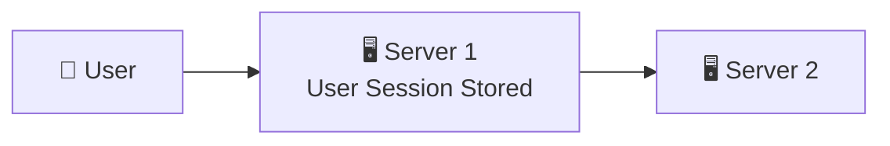


# How It Works:

Example:

First request:

User Login
↓
Server 1 stores session:
User = Ayush
Logged In = True
Cart Items = 3


Next request:

User Request
↓
Must go to Server 1

because Server 1 contains the user's session.


# Real World Example

Online gaming servers are often stateful.

Example:

A multiplayer game stores:
* Player position
* Current score
* Game progress
* Match status

If the player is connected to another server without transferring state, the game cannot continue correctly.


# PROBLEMS WITH STATEFUL SYSTEMS:

* Difficult Horizontal Scaling - New servers cannot easily handle existing users because user state exists on specific servers.


* Load Balancing Problem - Requests from the same user must go to the same server.

This requires: Sticky Sessions


* Server Failure Risk - If the server storing user state crashes, the user's session may be lost.


Why Modern Distributed Systems Prefer Stateless Services?

Large-scale systems like Amazon, Netflix, Uber, and Google prefer stateless microservices because:

More Users
    |
    ↓
Add More Servers
    |
    ↓
Load Balancer Distributes Traffic
    |
    ↓
No Session Dependency

The user state is moved to external systems:

Application Servers
        |
        ↓
Redis / Database
        |
        ↓
User State Stored Externally

This allows unlimited horizontal scaling.


# EVOLUTION OF SCALING (0 → MILLIONS OF USERS)

Every successful application evolves gradually.

Nobody starts with Kafka, Redis, CDN, or hundreds of microservices. 
Instead, companies continuously improve their architecture as traffic grows.

ARCHITECTURE:
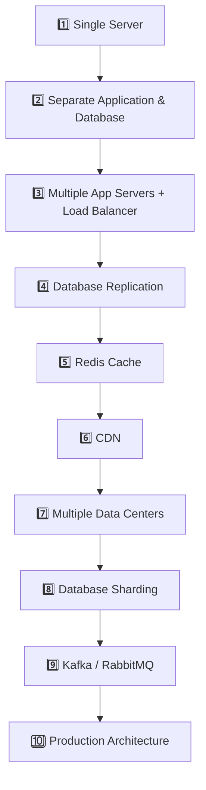

In the following sections, we'll explore each stage of this evolution and understand why every architectural improvement becomes necessary as an application grows from a few users to millions of users.


## STEP 1: SINGLE SERVER (APPLICATION + DATABASE) - 

A Single Server Architecture is the simplest deployment model where both the Application Server and the Database run on the same machine. The server is responsible for processing client requests, executing business logic, storing data, and returning responses.

ARCHITECTURE:
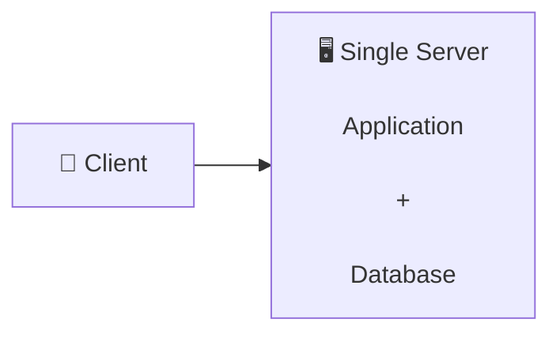

# HOW IT WORKS:
When a client sends a request, the single server executes the application logic, reads or writes data from the local database, and returns the response. Since everything runs on the same machine, communication is very fast because no network calls are required.


# REAL WORLD EXAMPLE:
A college project or a small To-Do application usually runs on a single server where the frontend, backend, and database are deployed together.


# ADVANTAGES OF SINGLE SERVER ARCHITECTURE
1. SIMPLE TO BUILD - Only one server needs to be configured and maintained.

2. LOW COST - Ideal for startups, MVPs, hackathons, and personal projects.

3. FAST COMMUNICATION - The application communicates with the database locally without network latency.

4. STRONG DATA CONSISTENCY - Since there is only one database, every user always sees the latest data.


# DISADVANTAGES OF SINGLE SERVER ARCHITECTURE

1. SINGLE POINT OF FAILURE - If the server crashes, the entire application becomes unavailable.
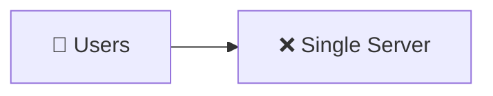

2. LIMITED SCALABILITY - As traffic increases, CPU, RAM, and storage eventually become bottlenecks.

3. RESOURCE COMPETITION - The application and database compete for the same CPU, memory, storage, and network resources.

4. HARDWARE LIMITATIONS - Eventually, the server reaches its maximum hardware capacity, making further scaling impossible.


Q. Why is a Single Server Architecture not suitable for production?
Answer: It suffers from a Single Point of Failure, limited scalability, resource contention, and hardware limitations, making it unsuitable for applications with high traffic.


# WHY ISN'T THIS ENOUGH?
Initially, this architecture works well.
However, as users increase, another problem appears.

Both the Application and the Database compete for the same:
* CPU
* RAM
* Disk
* Network

Suppose: Application Needs 10 GB RAM and Database Needs 20 GB RAM.

One server cannot efficiently satisfy both workloads.
Instead of upgrading the same machine repeatedly, companies separate the Application and Database onto different servers.


## STEP 2: SEPARATE APPLICATION SERVER & DATABASE SERVER - 

Instead of running everything on one machine, the Application Server and Database Server are deployed on separate machines. Each server now has dedicated hardware resources, improving performance, maintainability, and scalability.

ARCHITECTURE:
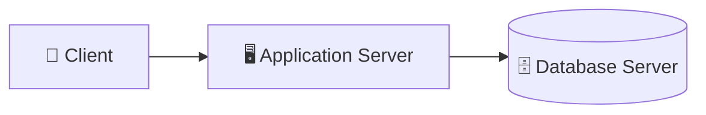

# HOW IT WORKS:
The client sends requests to the Application Server. The Application Server executes business logic and communicates with the Database Server over the network whenever data needs to be read or written.


# REAL WORLD EXAMPLE:
Many startups separate their backend server from PostgreSQL or MySQL once the application starts receiving thousands of users.


# ADVANTAGES OF SEPARATING APPLICATION & DATABASE

1. BETTER PERFORMANCE - Application and Database no longer compete for the same CPU and RAM.

2. INDEPENDENT RESOURCE UPGRADES - If the database requires more memory, only the Database Server needs to be upgraded.

3. BETTER SECURITY - Clients never communicate directly with the database. Only the Application Server has access to it.

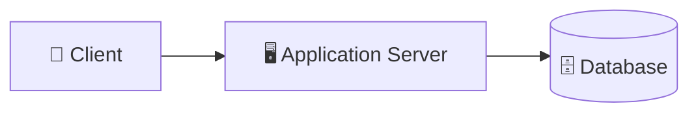

4. EASIER MAINTENANCE - Application deployments and database maintenance can be managed independently.


# DISADVANTAGES OF SEPARATING APPLICATION & DATABASE

1. NETWORK LATENCY - Application and Database now communicate over the network, introducing additional latency.

2. DATABASE BECOMES A SINGLE POINT OF FAILURE - Although the Application Server is separate, there is still only one Database Server.

If the database crashes, the application becomes unavailable.

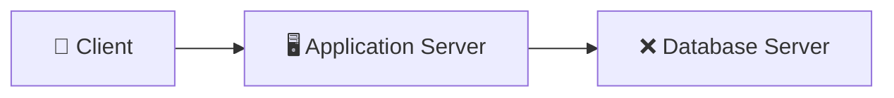

3. DATABASE BECOMES THE BOTTLENECK - The Application Server may process thousands of requests per second, but every request still depends on a single Database Server. Eventually, the database becomes overloaded.


Q. Why don't clients communicate directly with the Database Server?
Answer: Direct database access is insecure. The Application Server validates requests, applies business logic, enforces authentication and authorization, and protects the database from unauthorized access.


# Q. WHY ISN'T THIS ENOUGH?
Separating the Application and Database solves resource contention.

However, there is still only One Application Server.

Suppose the application now serves: 1 Million Users

A single Application Server cannot process millions of requests every second. If that server crashes, every user loses access to the application.

The next evolution is to deploy Multiple Application Servers behind a Load Balancer, allowing traffic to be distributed across several servers while eliminating the Application Server as a Single Point of Failure.


## STEP 3: MULTIPLE APPLICATION SERVERS + LOAD BALANCER - 

As the number of users continues to grow, a single Application Server can no longer process every request efficiently. To distribute incoming traffic and eliminate the Application Server as a Single Point of Failure, multiple Application Servers are deployed behind a Load Balancer.

ARCHITECTURE:
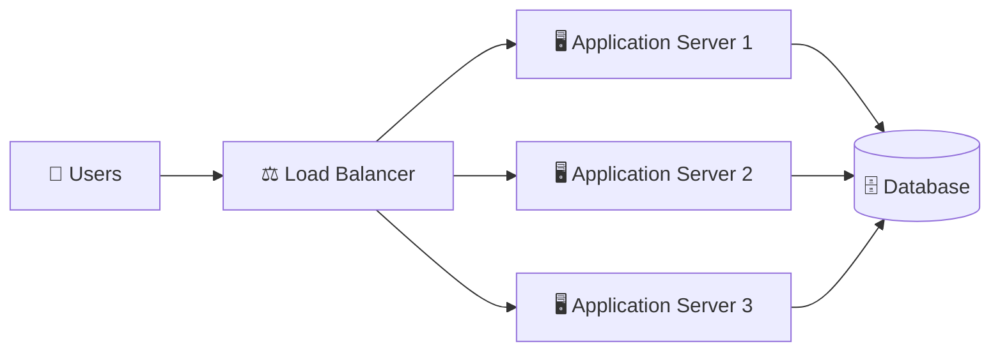

# HOW IT WORKS:
Every client request first reaches the Load Balancer. The Load Balancer checks which Application Server is healthy and forwards the request to that server. Each server processes the request and communicates with the shared Database before returning the response.


# REAL WORLD EXAMPLE:
During Amazon Prime Day, millions of customers access Amazon simultaneously. Instead of relying on one server, requests are distributed across thousands of Application Servers to prevent overload.


# ADVANTAGES: 

1. HIGH AVAILABILITY - If one Application Server fails, the Load Balancer automatically redirects traffic to the remaining healthy servers.

2. HORIZONTAL SCALING - Additional Application Servers can be added whenever traffic increases.

3. BETTER PERFORMANCE - Incoming requests are distributed across multiple servers, preventing any single server from becoming overloaded.

4. BETTER FAULT TOLERANCE - The failure of one server does not affect the overall application.


# DISADVANTAGES:

1. DATABASE IS STILL A BOTTLENECK - Although multiple Application Servers exist, every request still communicates with a single Database.

2. DATABASE REMAINS A SINGLE POINT OF FAILURE - If the Database crashes, all Application Servers become useless because they cannot retrieve or store data.
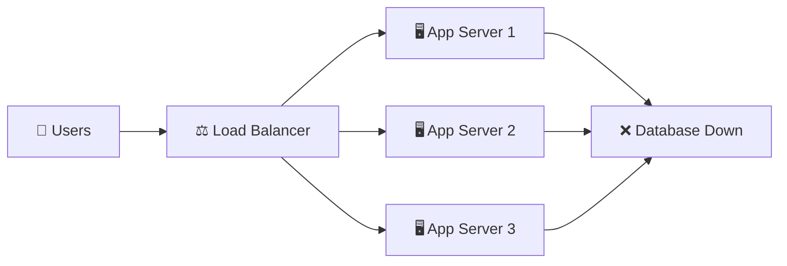


Q. Why can't we directly connect users to Application Servers without a Load Balancer?
Answer: Without a Load Balancer, clients would need to know every server's IP address, traffic would not be distributed evenly, and failed servers would still receive requests. A Load Balancer solves all these problems.


# Q. WHY ISN'T THIS ENOUGH?

The Application Layer now scales efficiently.

However, every Application Server still performs:

```
Read Queries

↓

One Database
```

Eventually, the Database becomes overloaded with read requests.

Instead of adding another Database that stores different data, companies first create multiple copies of the same Database.

This technique is called Database Replication.


## STEP 4: DATABASE REPLICATION - 

Database Replication is the process of creating multiple copies (Replicas) of the same database. A Primary (Master) Database handles all write operations, while one or more Replica Databases handle read operations.

ARCHITECTURE:
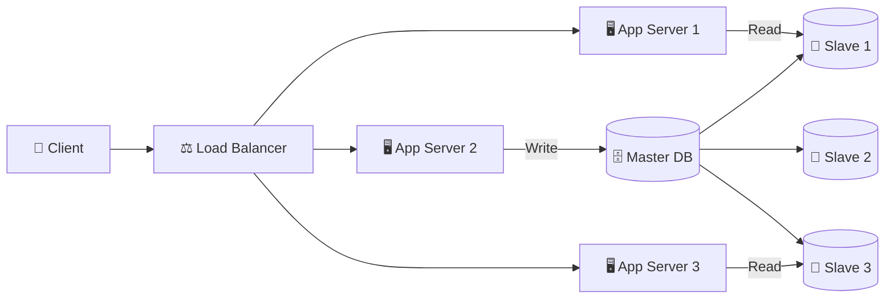

# HOW IT WORKS:
Whenever data is inserted, updated, or deleted, the Primary Database processes the write operation and replicates those changes to every Replica Database. Read requests are then distributed across the Replicas, reducing the load on the Primary Database.


# REAL WORLD EXAMPLE:
Instagram stores new posts using the Primary Database, while millions of users reading feeds are served by Replica Databases.


# ADVANTAGES: 

1. READ SCALABILITY - Read requests are distributed across multiple Replica Databases.

2. HIGH AVAILABILITY - If one Replica fails, another Replica continues serving read requests.

3. BETTER PERFORMANCE - The Primary Database focuses on writes while Replicas handle reads.

4. BACKUP DATABASES - Replica Databases can also serve as backup copies of the Primary Database.


# DISADVANTAGES:

1. WRITE BOTTLENECK - Every write operation still goes to the Primary Database.

2. REPLICATION DELAY - Replica Databases may briefly contain stale data until replication completes.

3. STORAGE COST - Every Replica stores a complete copy of the database, increasing storage requirements.


Q. Does Database Replication improve write performance?
Answer: No. Replication improves read scalability. All write operations are still processed by the Primary Database.


# Q. WHY ISN'T THIS ENOUGH?

ANS - Database Replication solves the Read Bottleneck.
However, applications still repeatedly execute the same database queries.

Example:
```
Home Page

↓

Product List

↓

Trending Products

↓

Categories
```

Thousands of users request the same information every second. Querying the Database every time is inefficient.

Instead, frequently accessed data is stored in memory.
This technique is called Caching.


## STEP 5: REDIS CACHE -

A Cache is a high-speed in-memory storage layer that stores frequently accessed data. Before querying the Database, the Application Server first checks the Cache. If the data exists, it is returned immediately without contacting the Database.

ARCHITECTURE:
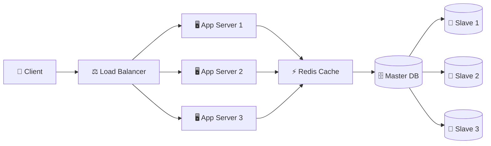


# HOW IT WORKS:
When a request arrives, the Application Server first checks Redis.

If the data exists (Cache Hit), it is returned immediately.

If the data does not exist (Cache Miss), the Application Server retrieves it from the Database, stores it in Redis, and then returns it to the client.


# REAL WORLD EXAMPLE:
When millions of users open Amazon's homepage, Redis stores popular products, categories, and recommendations so they can be served without repeatedly querying the Database.


# ADVANTAGES:

1. LOWER DATABASE LOAD - Frequently accessed data is served directly from memory.

2. FASTER RESPONSE TIME - Redis is significantly faster than disk-based databases.

3. HIGHER THROUGHPUT - The Database can focus on processing more important queries.

4. BETTER USER EXPERIENCE - Applications become much more responsive because most requests are served from Cache.


# DISADVANTAGES:

1. CACHE INVALIDATION - Updating stale cached data is one of the most challenging problems in distributed systems.

2. MEMORY COST - Memory is significantly more expensive than disk storage.

3. CACHE MISSES - Data not present in Cache still requires a Database query.


Q. Does Redis replace the Database?

Answer: No. Redis is a Cache used to reduce Database load. The Database remains the source of truth for persistent data.


# WHY ISN'T THIS ENOUGH?

Our application is now much faster.
However, users located far away from the Data Center still experience high latency because static resources such as images, videos, CSS, and JavaScript files travel long distances over the internet.

To reduce latency for global users, companies introduce a Content Delivery Network (CDN).


## STEP 6: CONTENT DELIVERY NETWORK (CDN) - 

As applications grow globally, users located far away from the application's Data Center experience higher latency while downloading static resources such as images, videos, CSS, JavaScript, and fonts.

Instead of serving static content from one location, companies deploy a Content Delivery Network (CDN) to cache static resources at multiple edge locations around the world.

ARCHITECTURE:
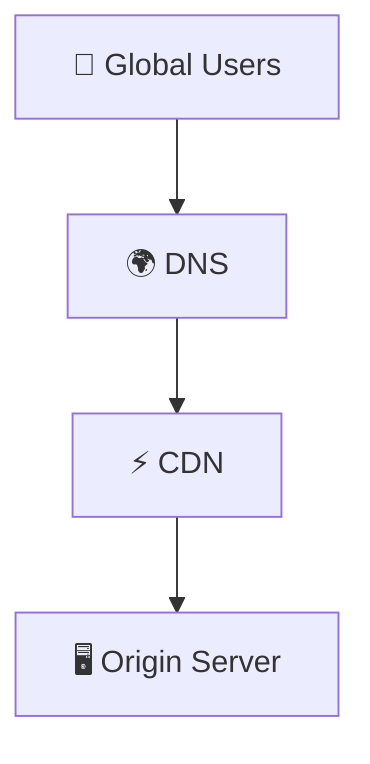

# HOW IT WORKS:
When a user requests a static resource, DNS routes the request to the nearest CDN Edge Server. If the requested file already exists in the CDN (Cache Hit), it is returned immediately. Otherwise (Cache Miss), the CDN fetches the file from the Origin Server, caches it locally, and serves it to the user.


# REAL WORLD EXAMPLE:
When users from India open Netflix, videos and images are served from a nearby CDN Edge Server instead of traveling all the way to a Data Center in the United States.


# ADVANTAGES:

1. LOW LATENCY - Users download static content from the nearest Edge Server instead of a distant Data Center.

2. REDUCED SERVER LOAD - Most static requests are served directly by the CDN, reducing traffic on the Origin Server.

3. FASTER PAGE LOADS - Images, JavaScript, CSS, fonts, and videos are delivered much faster.

4. GLOBAL SCALABILITY - Millions of users can simultaneously download static content from different CDN Edge Servers.


# DISADVANTAGES:

1. CACHE INVALIDATION - Updating cached files across hundreds of Edge Servers takes time.

2. ADDITIONAL COST - Running CDN infrastructure introduces extra operational expenses.

3. DYNAMIC CONTENT - CDNs are primarily designed for static content. Dynamic API responses are generally served from backend servers.


Q. Does a CDN replace the Application Server?
Answer: No. A CDN only serves static resources such as images, CSS, JavaScript, and videos. Dynamic requests still go to the backend application.


# WHY ISN'T THIS ENOUGH?

Our application is now:
* Horizontally Scaled
* Database Replicated
* Cached with Redis
* Accelerated using a CDN

However, everything still exists inside One Data Center.

Suppose that Data Center experiences:

* Power Failure
* Flood
* Fire
* Earthquake
* Network Failure

The entire application becomes unavailable.

To eliminate this Single Point of Failure, companies deploy their infrastructure across Multiple Data Centers.


## STEP 7: MULTIPLE DATA CENTERS - 

Instead of deploying the complete application inside one physical location, companies deploy multiple copies of the application across different geographical Data Centers. This improves availability, disaster recovery, and reduces latency for users around the world.

ARCHITECTURE:
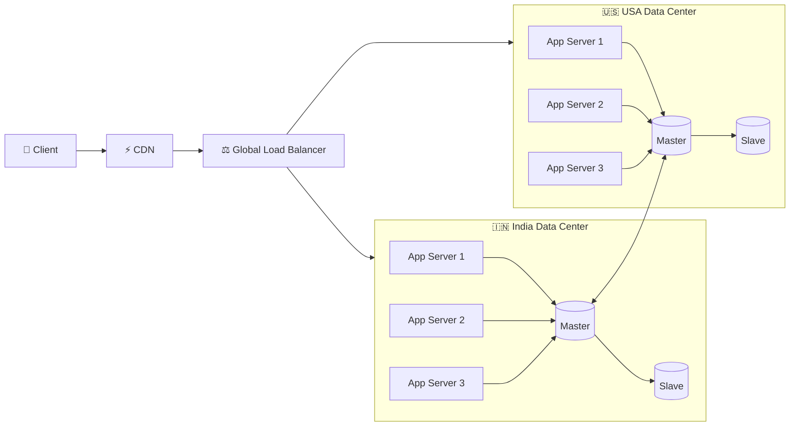

# INSIDE EACH DATA CENTER:

Each Data Center contains its own complete infrastructure.

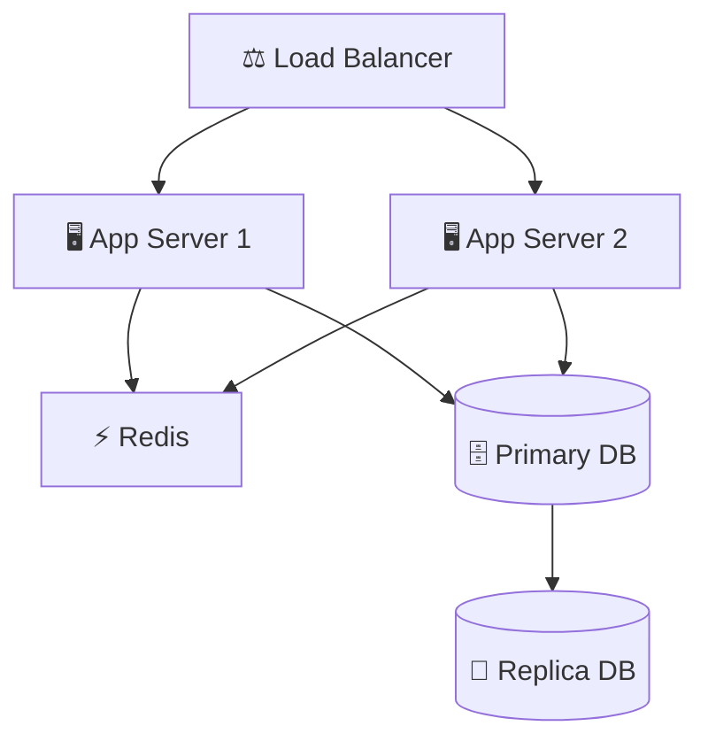


# HOW IT WORKS:
When a user opens the application, Global DNS identifies the nearest healthy Data Center and routes the request there. Every Data Center independently processes requests using its own Load Balancer, Application Servers, Redis Cache, and Database.


# REAL WORLD EXAMPLE:
An Indian customer opening Amazon is routed to the Mumbai Data Center, while a customer in Germany is routed to the Frankfurt Data Center. Both users experience low latency because requests stay within nearby regions.


# ADVANTAGES:

1. LOWER LATENCY - Users connect to geographically closer Data Centers, reducing network travel time.

2. DISASTER RECOVERY - If one Data Center becomes unavailable, traffic is automatically redirected to another healthy Data Center.

3. HIGH AVAILABILITY - Applications remain online even when an entire Data Center fails.

4. GLOBAL SCALABILITY - Traffic is distributed geographically instead of overwhelming one location.


# DISADVANTAGES:

1. DATA SYNCHRONIZATION - Keeping databases synchronized across multiple Data Centers is complex.

2. HIGHER INFRASTRUCTURE COST - Every Data Center requires its own servers, databases, networking equipment, monitoring, and storage.

3. COMPLEX DEPLOYMENTS - Software updates must be deployed consistently across every Data Center.


Q. Why don't companies use one massive Data Center instead of multiple Data Centers?
Answer: A single Data Center becomes a Single Point of Failure and introduces high latency for users located far away. Multiple Data Centers improve availability, disaster recovery, and global performance.


# WHY ISN'T THIS ENOUGH?

Our application is now globally distributed.
However, another bottleneck appears.

Although requests are distributed across multiple Data Centers, every write operation still reaches the Primary Database.

Suppose Instagram receives:

```
5 Million New Posts

20 Million Likes

50 Million Comments
```

Every write still goes to one Primary Database.
Eventually, the Primary Database becomes overloaded.

Instead of storing all data in one database, companies divide the data across multiple independent databases.

This technique is called Database Sharding.


## STEP 8: DATABASE SHARDING - 

Our architecture now includes:
* Multiple Application Servers
* Load Balancer
* Database Replication
* Redis Cache
* CDN
* Multiple Data Centers

Everything appears scalable.
However, every write operation still goes to a single Primary Database.

As traffic continues to grow, the Primary Database eventually becomes the bottleneck.

Instead of storing all data in one huge database, companies divide it across multiple independent databases. 
This technique is called Database Sharding.

ARCHITECTURE:
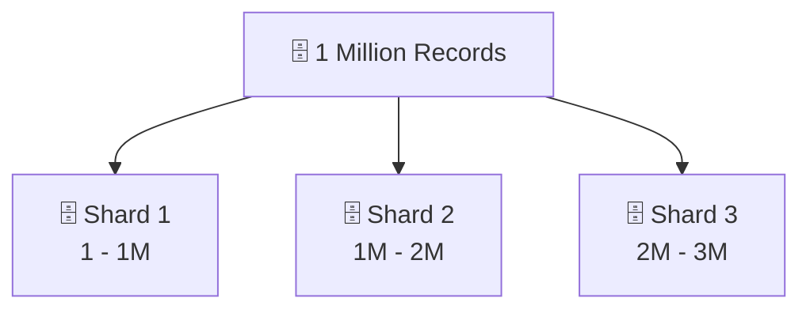


# HOW IT WORKS:
Whenever a request arrives, the Shard Router determines which database shard contains the required data using a sharding strategy such as Range-Based or Hash-Based Sharding. Only that shard processes the request.


# REAL WORLD EXAMPLE:
Instagram stores billions of users across thousands of database shards. A user's data is stored in only one shard instead of every database.


# TYPES OF SHARDING:

1. RANGE-BASED SHARDING - Data is divided into continuous ranges.

Example:

```
User ID

1 - 1,000,000

↓

Shard 1

-------------------

1,000,001 - 2,000,000

↓

Shard 2

-------------------

2,000,001 - 3,000,000

↓

Shard 3
```

2. HASH-BASED SHARDING - A Hash Function determines which shard stores the data.

Example:

```
User ID

↓

Hash(UserID)

↓

Shard Number
```

This distributes data more evenly across shards.


# ADVANTAGES:

1. WRITE SCALABILITY - Write requests are distributed across multiple databases instead of one Primary Database.

2. BETTER PERFORMANCE - Each shard stores less data, making queries much faster.

3. STORAGE SCALABILITY - Additional shards can be added as the database grows.

4. REDUCED DATABASE BOTTLENECKS - No single database stores the entire dataset.

# DISADVANTAGES:

1. CROSS-SHARD QUERIES - Some queries require collecting data from multiple shards.

2. COMPLEX ROUTING - Applications need routing logic to determine the correct shard.

3. REBALANCING - Adding new shards often requires moving large amounts of data.


Q. What's the difference between Replication and Sharding?

Answer: Replication copies the same data to multiple databases for Read Scaling, 
whereas Sharding stores different data in multiple databases for Write Scaling.


# WHY ISN'T THIS ENOUGH?

Our database now scales efficiently.
However, another issue appears.

Suppose a customer places an order on Amazon.

The application must:
* Process Payment
* Update Inventory
* Send Email
* Send SMS
* Notify Warehouse
* Generate Invoice

Q. Should the user wait until every task finishes?
ANS - No.

The application should respond immediately and perform these operations in the background.

This is achieved using Message Queues.


## STEP 9: MESSAGE QUEUES (KAFKA / RABBITMQ) -

A Message Queue enables Asynchronous Communication between services. Instead of directly calling another service, a service publishes a message to the queue, allowing other services to process it independently.

ARCHITECTURE WITH MQ:
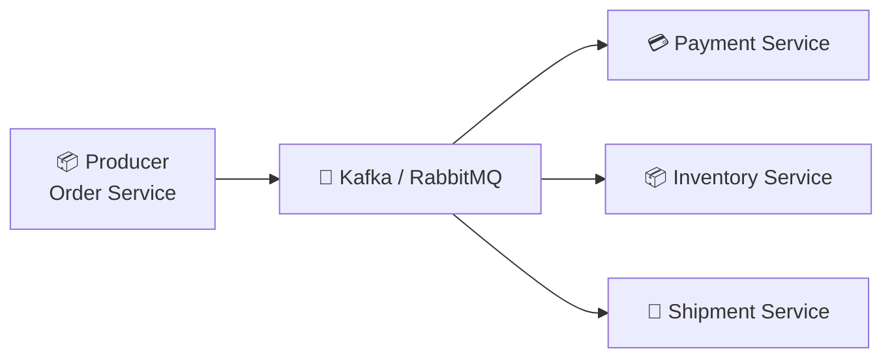

ARCHITECTURE WITHOUT MQ:
```mermaid
flowchart LR

Order["📦 Order Service"]

Payment["💳 Payment Service"]

Inventory["📦 Inventory Service"]

Shipment["🚚 Shipment Service"]

Order --> Payment
Payment --> Inventory
Inventory --> Shipment
```


# HOW IT WORKS:
The Order Service publishes a message to the Message Queue and immediately returns a success response to the user. Background services consume messages independently and process their tasks without blocking the user.


# REAL WORLD EXAMPLE:
When you place an order on Amazon, the confirmation page appears instantly while payment verification, inventory updates, invoice generation, and email notifications continue processing in the background.


# KAFKA VS RABBITMQ

| Kafka                     |           RabbitMQ                 |
|---------------------------|------------------------------------|
| Event Streaming Platform  |   Traditional Message Queue        |
| Extremely High Throughput |       Lower Latency                |
| Stores Events             | Removes Messages After Consumption |
| Best for Analytics        |     Best for Task Processing       |
| Distributed Log           |       Queue-Based Messaging        |


# ADVANTAGES:

1. LOOSE COUPLING - Services communicate independently without directly depending on one another.

2. FASTER RESPONSE TIME - Users receive responses immediately while background processing continues asynchronously.

3. BETTER SCALABILITY - Consumers can be increased independently as workload grows.

4. FAULT TOLERANCE - Messages remain in the queue until they are successfully processed.


# DISADVANTAGES:

1. EVENTUAL CONSISTENCY - Some operations complete after the user has already received a response.

2. INFRASTRUCTURE COMPLEXITY - Operating Kafka or RabbitMQ requires additional servers and monitoring.

3. DEBUGGING DIFFICULTY - Tracing asynchronous workflows is more challenging than synchronous requests.


Q. When should we use Message Queues?
Answer: Message Queues are ideal for background processing such as emails, notifications, analytics, payment pipelines, image processing, and other long-running tasks.


# Q. WHY ISN'T THIS ENOUGH?

Our application is now highly scalable and fault tolerant.

It includes:
* Load Balancers
* Database Replication
* Redis Cache
* CDN
* Multiple Data Centers
* Database Sharding
* Message Queues

The final step is to combine all these components into one Production-Ready Architecture, similar to what companies like Amazon, Netflix, Google, Uber, and Meta use in production.


## STEP 9.5: LOGGING & MONITORING - 

After handling caching, database access, and business logic, production systems record important information about every request for debugging, monitoring, and performance analysis.

Logging is the process of recording application events such as requests, errors, warnings, and user activities.

Monitoring is the continuous observation of application health, performance, CPU usage, memory usage, latency, and failures using collected metrics and logs.

ARCHITECTURE:
```mermaid
flowchart LR

Service["🖥️ Microservice"]

Logs["📝 Logging"]

Monitor["📊 Monitoring"]

Dashboard["📈 Grafana / Kibana"]

Alert["🚨 Alerts"]

Service --> Logs

Service --> Monitor

Logs --> Dashboard

Monitor --> Dashboard

Dashboard --> Alert
```


# HOW IT WORKS:
Whenever a microservice processes a request, it records important events as logs and continuously sends metrics such as CPU usage, memory usage, request latency, and error rates to monitoring systems. If any abnormal behavior is detected, alerts are automatically generated for engineers.


# REAL WORLD EXAMPLE:
When you place an order on Amazon, the Order Service logs the request, payment status, response time, and any errors. Monitoring tools continuously track system health and immediately notify engineers if services become slow or unavailable.

PURPOSE:-
* Request Logging
* Error Tracking
* Performance Monitoring
* Health Monitoring
* Alert Generation
* Debugging
* Audit Trails


COMMON TOOLS:-
* Logging	                                    ->    Monitoring
* ELK Stack (Elasticsearch, Logstash, Kibana)   ->    Prometheus
* Fluentd	                                    ->    Grafana
* Splunk	                                    ->    Datadog
* CloudWatch	                                ->    New Relic


# STEP 10: COMPLETE PRODUCTION ARCHITECTURE - 

After gradually solving each scalability bottleneck, a modern distributed system evolves into a highly available, fault-tolerant, and globally distributed architecture. Companies like Amazon, Netflix, Google, Meta, and Uber use similar architectures to serve millions of users every day.

ARCHITECTURE:
```mermaid
flowchart TB

Client["👤 Users"]

DNS["🌍 Global DNS"]

CDN["⚡ CDN"]

GLB["🌐 Global Load Balancer"]

subgraph Region1["🇮🇳 Mumbai Region"]

subgraph AZ1["Availability Zone 1"]

LB1["⚖️ Load Balancer"]

Gateway1["🚪 API Gateway"]

Discovery1["📡 Service Discovery"]

Order1["📦 Order Service"]
User1["👤 User Service"]
Payment1["💳 Payment Service"]
Inventory1["📦 Inventory Service"]

Redis1["⚡ Redis"]

MQ1["📨 Kafka"]

Logs1["📝 Logging"]

Monitor1["📊 Monitoring"]

Router1["🧭 Shard Router"]

Shard11[("🗄️ DB Shard 1")]
Shard12[("🗄️ DB Shard 2")]

LB1 --> Gateway1
Gateway1 --> Discovery1

Discovery1 --> Order1
Discovery1 --> User1
Discovery1 --> Payment1
Discovery1 --> Inventory1

Order1 --> Redis1
Order1 --> MQ1
Order1 --> Router1
Order1 --> Logs1
Order1 --> Monitor1

User1 --> Logs1
User1 --> Monitor1

Payment1 --> Logs1
Payment1 --> Monitor1

Inventory1 --> Logs1
Inventory1 --> Monitor1

Router1 --> Shard11
Router1 --> Shard12

end

end

subgraph Region2["🇺🇸 Virginia Region"]

LB2["⚖️ Load Balancer"]

Gateway2["🚪 API Gateway"]

Discovery2["📡 Service Discovery"]

Services2["🖥️ Microservices"]

Redis2["⚡ Redis"]

MQ2["📨 Kafka"]

Logs2["📝 Logging"]

Monitor2["📊 Monitoring"]

Shard2[("🗄️ Database Shards")]

LB2 --> Gateway2

Gateway2 --> Discovery2

Discovery2 --> Services2

Services2 --> Redis2
Services2 --> MQ2
Services2 --> Shard2
Services2 --> Logs2
Services2 --> Monitor2

end

Client --> DNS

DNS --> CDN

CDN --> GLB

GLB --> Region1
GLB --> Region2
```


## COMPLETE REQUEST FLOW:

Let's understand how a real production request travels through the system.

Suppose you open Amazon and search for an iPhone.

# STEP 1:-
Your browser sends a request to amazon.com.

# STEP 2:-
The DNS resolves the domain name and returns the nearest healthy Region or Data Center.

# STEP 3:-
The request reaches the CDN, which serves cached static content (images, CSS, JavaScript) if available. If the content is not cached, the request continues to the backend.

# STEP 4:-
Dynamic requests are forwarded to the Global Load Balancer, which selects the best available region based on latency and health.

# STEP 5:-
The Global Load Balancer routes the request to the nearest healthy Regional Data Center.

# STEP 6:-
Inside the selected region, the Regional Load Balancer forwards the request to the API Gateway.

# STEP 7:-
The API Gateway authenticates the user, validates the JWT token, applies rate limiting, and routes the request to the appropriate microservice.

# STEP 8:-
Service Discovery locates a healthy instance of the required microservice, and the request is forwarded to it.

# STEP 9:-
The selected microservice first checks the Redis Cache. If the required data exists (Cache Hit), it is returned immediately. Otherwise (Cache Miss), the service queries the database.

# STEP 10:-
If database access is required, the Shard Router identifies the correct Database Shard, and the microservice reads or writes data on that shard.

# STEP 11:-
The microservice records logs and publishes performance metrics to the Logging and Monitoring systems. These systems help monitor application health, detect failures, and generate alerts for engineers.

# STEP 12:-
Background tasks such as Email Notifications, SMS, Analytics, Invoice Generation, Recommendation Processing, and Inventory Updates are published to Kafka/RabbitMQ for asynchronous execution.

# STEP 13:-
The microservice returns the response to the API Gateway, which sends it back through the Load Balancer, CDN (if applicable), and finally to the user's browser. The user receives the requested page within milliseconds.


