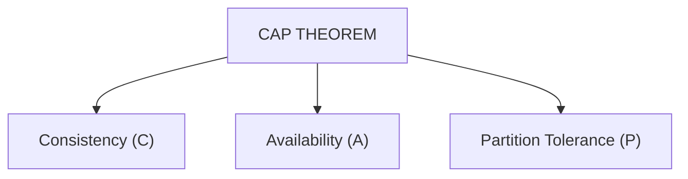
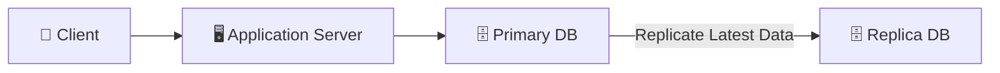
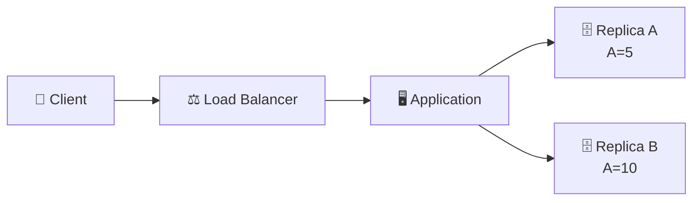
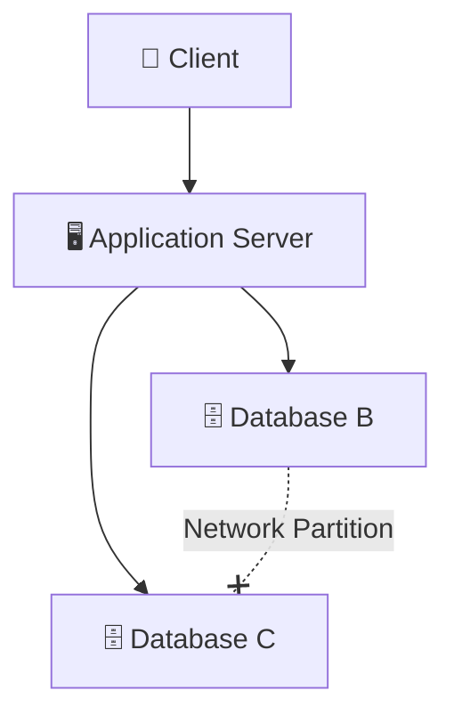
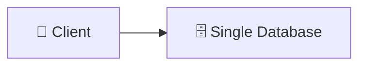
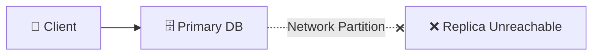
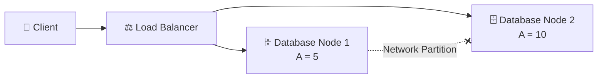

# CAP THEOREM:
CAP Theorem states that a Distributed System cannot simultaneously guarantee all three properties: Consistency (C), Availability (A), and Partition Tolerance (P). When a network partition occurs, the system must choose between Consistency and Availability.

ARCHITECTURE:

## CONSISTENCY (C):- 
Consistency guarantees that every client always reads the most recent data. Once data is updated on one database node, the same update must be replicated to all other database nodes before any client can read it.

EXAMPLE: Suppose the value of A = 10.

A user updates it to: A = 5

Every database replica must also store:
A = 5

No user should ever see the old value (A = 10).

ARCHITECTURE:

# REAL WORLD EXAMPLE:
A customer transfers ₹10,000 using online banking. Every database replica must immediately reflect the updated balance. Showing different balances to different users is unacceptable.

## AVAILABILITY (A):-
Availability guarantees that every request receives a non-error response, even if the returned data is stale or not the latest. It focuses on client ↔ system communication.

The system prioritizes responding to users instead of failing.

EXAMPLE:

Suppose: A = 10

One database has already updated: A = 5

Another database still contains: A = 10

Instead of failing, the system still returns a response.
The response may contain old data, but the application remains available.

ARCHITECTURE:

# REAL WORLD EXAMPLE
Instagram continues loading posts even if some likes or comments are slightly outdated. Showing slightly stale data is better than showing an error page.

## PARTITION TOLERANCE (P):-

Partition Tolerance means the distributed system continues operating even when communication between database nodes is interrupted due to network failures. It focuses on server ↔ server communication.

Instead of shutting down, the healthy nodes continue serving requests.

EXAMPLE: Suppose two database nodes lose network connectivity.

Database B  ✖────────✖  Database C

The databases cannot exchange updates. Even then, the application continues running.

ARCHITECTURE:

# REAL WORLD EXAMPLE
Suppose an AWS Availability Zone loses network connectivity with another AZ. The healthy Availability Zone continues serving users instead of shutting down the entire application.

# Q. WHY CAN'T WE HAVE ALL THREE?
When there is no network partition, a distributed system can provide both Consistency and Availability However, when a network partition occurs, database nodes cannot communicate with each other.

At that moment, the system has only two choices:

* Option 1:- Stop serving requests until every database becomes consistent.

Result:

✔ Consistency
✔ Partition Tolerance
✖ Availability

* Option 2:- Continue serving requests using whichever database is reachable.

Result:

✔ Availability
✔ Partition Tolerance
✖ Consistency

Therefore, during a Network Partition:- 

Choose Either: Consistency OR Availability

Not Both: CA (CONSISTENCY + AVAILABILITY)

* CA systems guarantee both Consistency and Availability but assume that network partitions never occur.

Since real distributed systems always face possible network failures, CA is generally limited to single-node or non-distributed databases.

ARCHITECTURE:

EXAMPLE: A single PostgreSQL server inside one machine.
No network partition exists because only one database node is present.

* CP (CONSISTENCY + PARTITION TOLERANCE):
CP systems always return the latest consistent data, even if some requests must wait or fail during a network partition.

ARCHITECTURE:

# HOW IT WORKS
If Database C becomes unreachable, Database B refuses operations that could violate consistency. Some requests may fail temporarily, but clients never receive inconsistent data.

# REAL WORLD EXAMPLE
A banking application refuses money transfers during a partition instead of risking incorrect account balances.

AP (AVAILABILITY + PARTITION TOLERANCE):-

AP systems prioritize Availability and Partition Tolerance. During a network partition, every healthy database node continues serving client requests, even if some users temporarily receive stale or inconsistent data. The system remains available instead of rejecting requests.

ARCHITECTURE:

# HOW IT WORKS
Suppose a user updates the value of A from 10 to 5. Database Node 1 successfully stores the new value, but due to a network partition, Database Node 2 does not receive the update immediately. Instead of rejecting requests, both database nodes continue responding independently. Users connected to Node 1 receive A = 5, while users connected to Node 2 may temporarily receive A = 10 until replication is restored.

# REAL WORLD EXAMPLE
Amazon may continue displaying slightly outdated product review counts or recommendation lists during a network issue instead of showing an error page. Once connectivity is restored, all replicas synchronize automatically.

## SQL VS NoSQL USING CAP:-
| SQL Databases          | NoSQL Databases         |
| ---------------------- | ----------------------- |
| Usually follow **CP**  | Usually follow **AP**   |
| Strong Consistency     | Eventual Consistency    |
| Banking Systems        | Social Media Platforms  |
| Payment Processing     | Product Catalogs        |
| Financial Transactions | Recommendations & Feeds |
