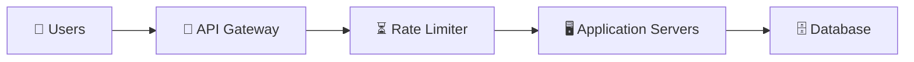
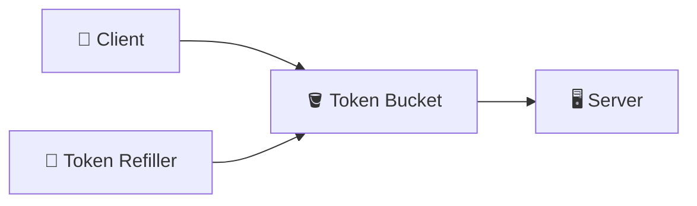
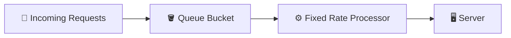
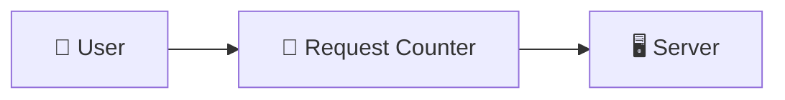
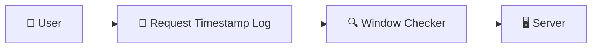
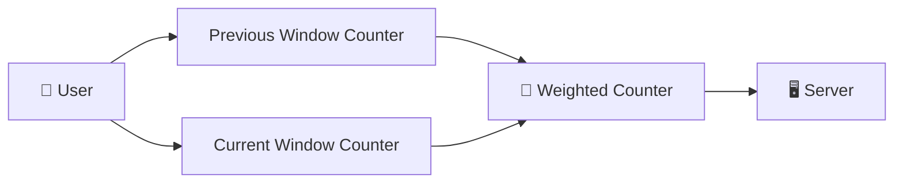
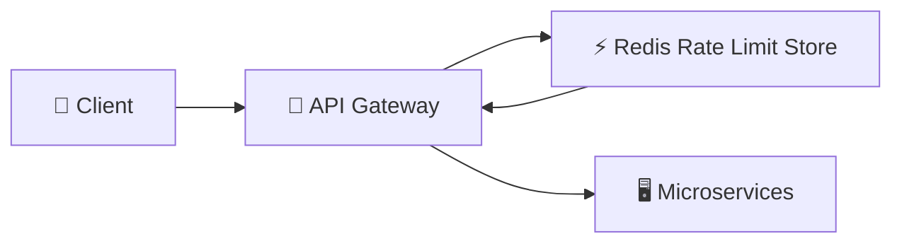

## WHAT IS RATE LIMITING?

Rate Limiting is a technique used to control the number of requests a user, client, or service can send to an application within a specific time period.

It prevents a system from being overloaded by controlling incoming traffic.

Example:

Suppose Instagram allows:

1 User → 100 API Requests / Minute

If the user sends:

* Request 1  ✅ Allowed
* Request 2  ✅ Allowed
        ...
* Request 100 ✅ Allowed

* Request 101 ❌ Rejected

The server returns:
* HTTP 429
* Too Many Requests

# Q. WHY DO WE NEED RATE LIMITING?

Modern applications handle millions of requests every second.

Without rate limiting:

        Millions of Requests
            |
            ↓
        API Server
            |
            ↓
        Database
            |
            ↓
        Server Overload

Problems:
* Server resources get exhausted.
* Database receives unnecessary load.
* Application latency increases.
* APIs can be abused by bots.
* DDoS attacks become easier.
* Infrastructure cost increases.

# REAL WORLD EXAMPLE:-

Suppose an attacker tries to attack Instagram login API:

Without Rate Limiting:

Bot
 ↓
Login API
 ↓
Database
 ↓
Password Verification

Millions of fake requests consume server resources.

With Rate Limiting:

Bot
 ↓
API Gateway
 ↓
Rate Limiter
 ↓
429 Error

Only allowed requests reach backend services.

# Q. WHERE IS RATE LIMITING IMPLEMENTED?

Usually Rate Limiting is implemented at the API Gateway or Load Balancer layer before requests reach application servers.

ARCHITECTURE:

# How It Works:-
1. User sends an API request.
2. API Gateway forwards the request to Rate Limiter.
3. Rate Limiter checks user's request count.
4. If limit is available → request continues.
5. If limit exceeds → request is rejected with HTTP 429.

# Q. WHAT IS A RATE LIMITER?

A Rate Limiter is a component that decides whether a request should be accepted or rejected based on predefined rules.

It tracks:
* User ID
* IP Address
* API Endpoint
* Request Count
* Request Timestamp

Example Rule: POST /login

Maximum: 5 requests/minute/IP

## STRATEGIES FOR IMPLEMENTING RATE LIMITING:-

1. TOKEN BUCKET ALGORITHM:

Token Bucket Algorithm controls requests using a bucket that stores tokens.

Each request requires one token.

If a token exists: Request Allowed

If no token exists: Request Rejected

ARCHITECTURE:

# How Token Bucket Works?

Suppose: Bucket Capacity = 5 Tokens

Refill Rate = 1 Token/Second

Initially:

Bucket: 🟢 🟢 🟢 🟢 🟢 (5 Tokens)

User sends requests:

Request 1
↓
Token Removed

Bucket: 🟢 🟢 🟢 🟢 (4 Tokens)

After 5 requests:

Bucket: Empty

Now, Request 6
        ↓
     No Token
        ↓
     Rejected

Meanwhile:

Refiller
↓
Adds Tokens
↓
Bucket

# Real World Example:

Twitter API:

User: 100 API Calls / Minute

System gives user: 100 Tokens

Every API call consumes one token.

When tokens finish, the user must wait until tokens refill.

# Advantages:
1. Supports Traffic Bursts - Users can send multiple requests instantly if tokens are available.

Example: Bucket has 20 tokens, User sends 20 requests together. All are accepted

2. Simple Implementation - Only token count and refill rate are maintained.

3. Smooth Traffic Control - Requests are controlled without completely blocking users.

# Disadvantages:
1. Token Synchronization Problem - In distributed systems, multiple servers need a shared token count. Usually solved using Redis.

2. Sudden Bursts Can Still Reach Backend - If bucket is full, many requests can arrive together.

2. LEAKY BUCKET ALGORITHM:

Leaky Bucket Algorithm processes requests at a fixed constant rate.

Incoming requests are stored inside a queue, and the server consumes them at a fixed speed.

Like water leaking from a bucket.

ARCHITECTURE:

# How Leaky Bucket Works?

Example:

Configuration:

* Bucket Size = 100 Requests
* Processing Rate = 10 Requests/sec

Suppose:

1000 Requests arrive

Instead of sending all requests:

1000 Requests
↓
Bucket Queue
↓
10 Requests/sec
↓
Server

The server receives a stable traffic flow.

# Real World Example:

Payment systems:

During a flash sale, Millions of users click "Buy Now".
Instead of processing everything immediately:

Requests
↓
Queue
↓
Payment Processor

Payments are processed at a controlled speed.

# Advantages:
1. Prevents Traffic Spikes - Backend receives a constant request rate.

2. Protects Servers - Database and services are not overloaded.

3. Predictable Processing - The output rate remains constant.

# Disadvantages
1. No Burst Handling - Even valid users must wait.

2. Higher Latency - Requests stay in queue.

3. Queue Overflow - If traffic is extremely high, new requests are dropped.

3. FIXED WINDOW COUNTER:

Fixed Window Counter divides time into fixed intervals and counts requests inside each interval.

Example:

Limit: 100 Requests / Minute

The counter resets every minute.

ARCHITECTURE:

# How It Works?

Example:

Window: 12:00 - 12:01

Requests:
* 12:00:10  -> Request 1
* 12:00:20  -> Request 2
* 12:00:50  -> Request 3

Counter: 3 Requests

At: 12:01

Counter resets: 0 Requests

# Real World Example:

Instagram API: 100 Requests/minute/user

System maintains:

* User ID
* Request Count
* Current Minute

# Problem with Fixed Window:

Boundary Problem:

* Limit: 5 requests/minute

User sends:  12:00:59 -> 5 Requests

Then:  12:01:01 -> 5 Requests

Total: 10 Requests in 2 seconds

But system accepts because they belong to different windows.

# Advantages:
* Very simple.
* Low memory usage.
* Fast implementation.

# Disadvantages
* Boundary issue.
* Allows sudden traffic bursts.
* Less accurate.

4. SLIDING WINDOW LOG ALGORITHM:

Sliding Window Log stores timestamps of every request and checks how many requests happened inside the current time window.

It solves the boundary problem of Fixed Window Counter.

ARCHITECTURE:

# How It Works?

Example:

Limit: 3 Requests / 5 seconds

Request Log:

* 00:01
* 00:03
* 00:05

New Request: 00:06

Current Window: 00:01 - 00:06

Requests inside window: 3

Limit reached: Request Rejected

Expired timestamps are removed automatically.

# Real World Example:

Banking API:

Maximum: 10 transactions / minute

The system stores transaction timestamps and checks recent activity.

# Advantages:
1. Very Accurate - No boundary problem.

2. Smooth Traffic Control - Requests are evaluated continuously.

3. Better User Experience - Valid requests are not blocked unnecessarily.

# Disadvantages
1. High Memory Usage - Every request timestamp must be stored.

2. Expensive at Huge Scale - Millions of users create millions of timestamps.

5. SLIDING WINDOW COUNTER ALGORITHM

Sliding Window Counter combines:
* Fixed Window Counter
* Sliding Window Log

It provides better accuracy than Fixed Window while using less memory than Sliding Window Log.

ARCHITECTURE:

# How It Works?

Example:

Limit: 100 Requests / Minute

Previous Window:   12:00 - 12:01 -> 80 Requests

Current Window:    12:01 - 12:02 -> 40 Requests

Current time is halfway:

Previous contribution: 80 × 50% = 40

Total: 40 + 40 = 80 Requests

Since: 80 < 100, Request is allowed.

# Real World Example:

Netflix API:

* User Recommendation API
* 1000 requests/minute

Sliding Window Counter prevents sudden spikes while maintaining low memory usage.

# Advantages:
* More accurate than Fixed Window.
* Less memory than Sliding Window Log.
* Works well in distributed systems.

# Disadvantages:
* Approximate calculation.
* More complex implementation.
* Requires maintaining multiple counters.

## RATE LIMITING ALGORITHM COMPARISON:

| Algorithm              | Accuracy  | Memory Usage | Burst Handling |
| ---------------------- | --------- | ------------ | -------------- |
| Token Bucket           | Medium    | Low          | Excellent      |
| Leaky Bucket           | High      | Low          | Poor           |
| Fixed Window Counter   | Low       | Low          | Poor           |
| Sliding Window Log     | Very High | High         | Good           |
| Sliding Window Counter | High      | Medium       | Good           |

## Most large-scale systems combine:

API Gateway + Redis + Token Bucket / Sliding Window Counter

ARCHITECTURE:

Redis stores counters because multiple API servers need a shared rate limit state.

