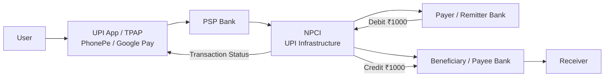

# DIFFERENCE BETWEEN PAYMENT GATEWAY AND PAYMENT PROCESSOR:

# FUNCTIONAL REQUIREMENTS:
1. CLIENT SHOULD BE ABLE TO INITIATE PAYMENT REQUESTS
2. GATEWAY CREATES A TEMPORARY SESSION FOR USER TO ENTER CARD DETAILS
3. PAYMENT CARD INDUSTRY(PCI DETAILS): THE PCI DATA SECURITY STANDARD (PCI DS5) IS THE GLOBAL SECURITY STANDARD FOR ALL ENTITIES THAT STORE, PROCESS OR TRANSMIT CARDHOLDER DATA AND/OR SENSITIVE AUTHENTICATION.
4. TRANSACTION STATUS TRACKING
* OUT OF SCOPE - PART PAYMENT, RETURNS AND REFUND

# NON-FUNCTIONAL REQUIREMENTS:
1. SCALE: 10K TRANSACTIONS PER SECOND(TPS)
2. CAP: HIGHLY CONSISTENCY >> AVAILABILITY
3. LOW LATENCY(BELOW 200MS RESPONSE TIME FOR PAYMENT AUTHORIZATION)
4. SECURITY - END TO END ENCRYPTION, PCI-DS5 LEVEL 1 COMPLIANT
5.

# CORE-ENTITIES:
1. MERCHANT / CLIENTS(AMAZON)
2. TRANSACTION
3. PAYMENT-METHOD
4. CUSTOMERS / USERS
5. WEBHOOK-EVENTS(USED TO GIVE CLIENT SUCCESS/FAILURE MSG FROM OUR SYSTEM)
6. PAYMENT SESSION

# HIGH-LEVEL-FUNCTIONALITY TO HELP DESIGN API'S:
WHENEVER IN SUPPOSE AMAZON USER CLICKS ON BUY BUTTON, CLIENT SAVES A PAYMENT DETAILS(WHAT IS THE ITEM, HOW MANY ITEMS, WHAT ARE PRICES OF EACH) IN LOCAL DB AND IN RESPONSE SENDS A PAYMENT INTENT ID TO PAYMENT GATEWAY. ONCE CLIENT RECEIVES PAYMENT INTENT ID, IT HAS TO FIRST CREATE A SECURE SESSION BY WHICH ENTIRE TRANSACTION SHOULD HAPPEN. AS SOON AS GATEWAY NOTICES,  CLIENT WANTS TO ESTABLISH A SESSION REQUEST, PAYMENT GATEWAY GIVES A TEMPORARY FRONTEND PAGE TO THE CLIENT TO FULFILL BANK CREDENTIALS WITH A SESSION TIMER(LIKE RAZORPAY 12 MINS). ONCE USER ENTERS CARD CREDENTIALS AND HITS ON PAY NOW BUTTON THEN A PAY REQ COMES TO PAYMENT GATEWAY WHICH TAKES RESPONSIBILITY OF PAYMENT GATEWAY TO TOKENIZE IT, MANAGE IT AND PASS IT TO THE PAYMENT PROCESSOR BY SOME METHOD. 

# API DESIGN:

# SERVICES:
1. SERVICE
2. SERVICE
3. SERVICE
4. SERVICE

# FLOW:
WHEN USERS OF A CLIENT FOR SUPPOSE AMAZON, CLICKS ON BUY NOW BUTTON THEN THE REQ PASSED THROUGH API GATEWAY/LOAD BALANCER AND THEN INVOKES THE PAYMENT INTENT SERVICE IN WHICH ORDER DETAILS LIKE THE ORDER ID, ITEMS THAT ARE TO BE PURCHASED WITH THEIR QUANTITY, PRICING ARE ALL STORED IN LOCAL DB (PAYMENT-INTENT DB)AND A PAYMENT_INTENT_ID IS CREATED. NOW AS THE MERCHANT/CLIENT RECEIVES THE PAYMENT_INTENT_ID IT MAKES SECOND REQUEST TO CREATE A SECURE SESSION OF TRANSACTION. HERE PAYMENT SESSION SERVICE IS INVOKED WHICH CREATES A SESSION FOR PAYMENT AND IN RETURN GIVES A SECURE WEBPAGE TO THE CLIENT BY WHICH USER CAN ENTER CARD CREDENTIALS. MERCHANT WILL NOT CREATE A WEBPAGE OF ITS OWN FOR THIS BECAUSE THAT WILL MAKE IT VERY INSECURE TO GET CARD DETAILS(WITHOUT PCI DS5 COMPLIANT). NOW ONCE THE USER ENTERS CARD DETAILS AND CLICKS ON PAY ANOTHER REQUEST COMES TO OUR API GATEWAY DUE TO WHICH  PAYMENT PROCESSOR SERVICE GETS INVOKED WHICH IS ACTUALLY MAKING SECURE CONNECTION WITH EXTERNAL PAYMENT PROCESSOR. ONCE PROCESSOR SERVICE DOES PAYMENT SUCCESSFULLY, IT SENDS A RESPONSE THAT PAYMENT ORDER HAS BEEN SUCCESSFULLY DONE WITH THE BANK. 
THOUGH WE ARE MAKING TRANSACTION WITH THE BANK, BUT IT IS NOT NECESSARY THAT THE CONFIRMATION WE ARE GETTING IN THE RESPONSE IS NOT CONFIRMATION THAT MONEY GOT DEDUCTED. MAYBE THERE CAN BE A CASE THAT WHILE MAKING TRANSACTION IN UI IT SHOWS PAYMENT FAILED BUT IN SMS WE RECEIVE MONEY DEDUCTED FROM BANK ACC. SIMILARLY WHEN USER CLICKS ON PAY THE ACTUAL PAYMENT DID NOT TAKE PLACE BUT THE ORDER GOT PLACED SUCCESSFULLY WITH MESSAGE THAT PAYMENT GOT SUCCESSFUL, BUT AFTER FEW HOURS ON ORDER LIST IT IS SHOWN THAT PAYMENT GOT DECLINED, PAY AGAIN. SO THERE SHOULD BE SOME RECONCILIATION JOB PROCESS TO VALIDATE ALL SESSION_ID, INTEND_ID, PAYMENT_ID AND TO GIVE RESPONSE PAYMENT GOT SUCCESS/FAILED. 

# PAYMENT INTENT SERVICE:
WE KNOW, WHEN USERS OF A CLIENT FOR SUPPOSE AMAZON, CLICKS ON BUY NOW BUTTON THEN THE REQ PASSED THROUGH API GATEWAY/LOAD BALANCER AND THEN INVOKES THE PAYMENT INTENT SERVICE IN WHICH PAYMENT RELATED METADATA LIKE THE ORDER ID, ITEMS THAT ARE TO BE PURCHASED WITH THEIR QUANTITY, PRICING ARE ALL STORED IN LOCAL DB (PAYMENT-INTENT DB)AND A PAYMENT_INTENT_ID IS CREATED.
SINCE WE ARE DEALING WITH PAYMENTS AND OUR SYSTEM WOULD BE MORE CONSISTENCY RELEVANT THEN WE SHOULD USE SQL DB(POSTGRESS). ONCE THE ENTRY HAS BEEN CREATED IN DB, THEN WE WILL SIMPLY RETURN RESPONSE OF PAYMENT_INTENT_ID. 

# CHECKOUT SESSION SERVICE(PAYMENT SESSION SERVICE):
ONCE THE PAYMENT CLIENT RECEIVES THE PAYMENT_INTENT_ID, AGAIN IT REQUESTS FOR CREATION OF SESSION OR ENVIRONMENT BY WHICH PAYMENT CAN DE DONE. SO CLIENT REQUESTS FOR SESSION CREATION WHICH PASSES THROUGH API GATEWAY/ LOAD BALANCER AND INVOKES CHECKOUT SESSION SERVICE. ONCE WE RECEIVE THE PAYMENT_INTENT_ID (FROM PREVIOUS REQ FROM PAYMENT INTENT SERVICE), FIRST WE CAPTURE THE PAYMENT METADATA IN REDIS CLUSTER. WE DO NOT STORE IN DB BECAUSE WE KNOW THE GATEWAY IS FOR A SHORT TIME PERIOD(EG: 10 MINS) AS WELL AS STORING IN REDIS MEANS FASTER RETRIEVAL TIME FOR MINIMIZING LATENCY. ONCE IT IS STORED/WRITTEN IN REDIS CLUSTER WE WILL ALSO ATTACH A TTL LIKE OF 10 MINS, AND IN RESPONSE OF THE REQUEST WE HAVE TO GIVE A WEB PAGE TO THE CLIENT. NOT COMPLETE WEB PAGE BUT A GENERATED URL OF WEB PAGE WHERE ALL CARD CREDENTIALS WILL BE INSERTED BY USER.

RESPONSE BY CHECKOUT SESSION:

Q. WHY WE HAVE SESSION ID IN REDIRECT URL?
ANS -  FOR FUTURE AUTHENTICATION AND VALIDATION. SUPPOSE WHEN A CLIENT CHANGED ITS SESSION ID AND AT THAT TIME ONCE NEXT REQUEST COMES INTO OUR SYSTEM WE WILL VALIDATE WHETHER PAY REQUEST MATCHES WITH THE SESSION_ID IN REDIRECT_URL OR NOT. IF NOT WE WILL INVALIDATE THE REQUEST OR ELSE PROCEED WITH PAYMENT. 

NOW ONCE THE USER RECEIVE THIS URL, THE CLIENT REDIRECTS ITS WEB PAGE INTO THIS URL TO PUT OUR CREDENTIALS INTO THIS PAGE. WE HAVE TO CREATE THE WEB PAGE BY CREATING CLIENT SIDE SERVICE WHICH WILL GIVE THEM A WEB PAGE. FOR DOING OS, WE HAVE CHECKOUT FRONTEND SERVICE WHICH CREATES FRONTEND PAGE FOR THE URL. ONCE THE CLIENT/USER ACTUALLY HITS REDIRECT_URL THE ACTUAL WEB PAGE WHERE THE CREDENTIALS CAN BE GIVEN IS HOSTED IN THIS SERVICE. SO FROM THE CHECKOUT SERVICE, REQUEST WILL BE NOW COMING TO OUR CHECKOUT FRONTEND SERVICE.
WE HAVE AN ASSUMPTION THAT 10K REQ OF TRANSACTION PER SECOND FOR CREATION OF SESSION. SO ALL CLIENT WILL BE INVOKING CHECKOUT FRONTEND SERVICE AS WELL. NOW, INSTEAD OF DIRECTLY HITTING THIS SERVICE BEFORE THIS WE WILL PUT A SEPARATE LOAD BALANCER.  

# CHECKOUT BACKEND SERVICE(PAYMENT PROCESSOR SERVICE):
ONCE THE USER CLICKS THE PAY AFTER FILLING CREDENTIALS,  WHEN CLIENT CLICKS ON PAY THEN ALL THE METADATA AND SENSITIVE INFORMATION OF CREDIT CARD AND PCI DATA HAVE LANDED INTO OUR BACKEND SERVICE. UNTIL NOW NO SERVICE HAD THE CREDENTIALS DETAILS. THE RESPONSIBILITY OF OUR CHECKOUT BACKEND SERVICE START WITH CHECKING THAT SESSION ACTUALLY EXISTS OR EXPIRED, AS WE KNOW THERE WILL BE A TTL RUNNING THAT WAS SET ON REDIS CLUSTER. WE ALSO HAVE TO CHECK THEN THE PAYMENT_INTENT_ID RECEIVED TO US WAS VALID OR NOT BY CHECKING IT FIRST IN REDIS HAVING THAT IS PAYMENT_INTENT_ID, SESSION_ID, CLIENT_INFO, ORDER_ID, ETC. AND IF ALL THOSE THINGS MATCHES WITH SESSION REQUEST RIGHT NOW THEN ONLY WE CAN TELL REQUEST RECEIVED FOR  ON CLICK ON PAY NOW IS VALID.

DATA WE HAVE RECEIVED IS A VERY SENSITIVE INFORMATION WHICH WE CANNOT STORE INTO OUR SYSTEM OR TRANSFER TO SOME EXTERNAL AGENT. ACCORDING TO PCI STANDARDS, WE MUST ENCRYPT OR TOKENIZE THE CARD DETAILS SO BEFORE MAKING THE PROCESSOR CALL WE HAVE TO MAKE AN INTERNAL CALL TO TOKENIZATION SYSTEM WHICH IS ITSELF A SECURE AND PCI ZONE WHERE ALL TOKENIZATION IS DONE. THE CHECKOUT BACKEND SERVICE RATHER PERFORMING HTTP, DOES A TLS REQ(MOST SECURE) TO PCI ZONE, IN WHICH WE HAVE TOKENIZATION SERVICE WHICH:

* VALIDATES REQUEST(LIKE CARD NO VALID OR NOT). 

* ON FINDING VALID, IT GENERATES A FINGERPRINT[HASH OF BIN(IDENTIFICATION OF BANK) + LAST 4 DIGITS+ EXPIRY + NAME] SO IN FUTURE IT CANNOT GETS DECRYPTED EVEN IF IT GETS STOLEN. 

* ONCE FINGERPRINT GETS GENERATED FOR A PARTICULAR CARD, THEN WE HAVE TO ENCRYPT THAT CARD NO FOR WHICH WE WILL NEED A KEY FOR ENCRYPTION. FOR NORMAL ENCRYPTION WE KEEP THE ENCRYPTION KEY IN SOME STORAGE UNIT NEED LIKE A PRIVATE OR A PUBLIC KEY BUT IN CASE OF CARDS WE DO NOT HAVE A PRIVATE OR A PUBLIC KEY TO ENCRYPT BECAUSE WHATEVER WE ARE STORING IN IT CLOUD OR SOMETHING ELSE IT HAS CHANCES OF BEING STOLEN. SO TO DO THIS MORE SECURELY, WE WILL TAKE HELP OF HSM(HARDWARE SECURITY MODULE). 

ONCE EVERYTHING IS DONE, WE SEND RESPONSE OF THIS SERVICE WHICH IS THE ENCRYPTED CARD TOKEN TO CHECKOUT BACKEND SERVICE. NOW THE QUESTION ARISES BY WHICH PROCESSOR IT SHOULD GO(LIKE RU-PAY, RAZORPAY). THIS IS ACTUALLY CONFIGURED BY CLIENT/MERCHANT DURING ONBOARDING PROCESS LIKE WHEN THEY WOULD BE ACCESSING OUR PAYMENT GATEWAY THEY MUST HAVE ALREADY REGISTERED CHOSEN THE PROCESSOR FOR THEIR SUCCESSFUL PAYMENT AS CHARGE FOR PARTICULAR TRANSACTION DEPENDS ON PROCESSOR(LIKE SOME PROCESSORS TAKE 1%, SOME 2% CHARGES). BASED ON CHARGE AND OTHER DETAILS THIS CLIENT WILL TAKE CALL FOR CHOOSING THE PARTICULAR PROCESSOR TO TALK TO. NOW BASED ON CONFIGURATION THEY HAV CHOSEN, TO DIVERGE THE REQUEST TO THAT PROCESSOR WE WILL CALL AN ORCHESTRATOR SERVICE WHICH WILL FIRST CHECK THE CONFIGURATION OF MERCHANT/CLIENT TO DIVERGE TRAFFIC ACCORDINGLY. ORCHESTRATOR SERVICE WILL FIRST TALK TO MERCHANT PREFERENCE DB(HOLDING INFO OF PARTICULAR MERCHANT/CLIENT) AND BASED ON IT WE HAVE TO DIVERGE TRAFFIC AND CALL PROCESSOR ACCORDINGLY. THEN THE ORCHESTRATOR SERVICE STORES THE PAYMENT INFO TO PAYMENT PROCESSOR DB (CORE DB UNIT FOR ALL TRANSACTION THAT HAPPENED THROUGH OUR GATEWAY SERVICE) BEFORE GOING TO PROCESSOR SERVICE. 

NOW FOR OUR SYSTEM THERE EXISTS ANOTHER COLLECTOR CALLBACK SERVICE WHICH WILL RECEIVE ALL RESPONSES FROM PROCESSOR SERVICE. NOW THERE WILL BE THOUSANDS OF RESPONSE IT WILL RECEIVE. 

ONCE REQUEST HAVE BEEN MADE TO PROCESSOR UNIT (UPDATE STATUS FIELD INSIDE PAYMENT PROCESSOR DB AS SENT) AND WE GET A RESPONSE INTO OUR COLLECTOR CALLBACK SERVICE BASED ON RESPONSE WE HAVE TO UPDATE THE STATUS FIELD OF DATABASE TO DONE. THESE STATUS CHANGES ARE DONE BY ORCHESTRATOR SERVICE BECAUSE IF SOME OTHER SERVICE DOES THAT THERE WILL BE SOME DUPLICATION ERRORS IN DATABASE. 

Q. NOW HOW WILL SEND THE ACKNOWLEDGEMENT TO FRONTEND PAGE?
ANS - THE CHECKOUT FRONTEND SERVICE ACTUALLY POLLS CHECKOUT BACKEND SERVICE FOR A PARTICULAR TRANSACTION'S SUCCESS / FAILURE. THEREFORE, THE CHECKOUT BACKEND SERVICE UPDATES THE TRANSACTION STATUS BY SEEKING INTO THE PAYMENT PROCESSOR DB AND UPDATES THE CURRENT STATUS TO CHECKOUT FRONTEND SERVICE.

SCHEMA STRUCTURE OF PAYMENT PROCESSOR DB:

# UPI SYSTEM DESIGN — HOW UPI WORKS: (VERY-HIGH LEVEL):

UPI (Unified Payments Interface) is an interoperable payment infrastructure that allows users to transfer money between bank accounts instantly using a simple identifier such as a UPI ID/VPA (Virtual Payment Address) instead of entering the recipient's complete bank details every time. The main idea behind UPI is to make bank-to-bank payments simple for the user while the underlying system handles routing and communication between different banks.

UPI Architecture:

The most important component in this architecture is NPCI (National Payments Corporation of India). NPCI operates the UPI infrastructure that enables participating banks and payment participants to communicate and process interoperable UPI transactions. It acts as the backbone of the UPI ecosystem rather than being a consumer-facing payment application like PhonePe or Google Pay.

When a user opens a UPI application such as PhonePe or Google Pay, the application provides the interface for making the payment. The user can enter a VPA/UPI ID, such as piyush@bank, or scan a QR code containing the payment information. The VPA acts as a simple payment address, so the user does not need to remember the recipient's account number and IFSC every time.

Suppose Ayush wants to send ₹1,000 to Piyush. Ayush enters Piyush's UPI ID and amount in the application. This creates a payment intent — essentially a request saying, "I want to transfer ₹1,000 to this recipient." The UPI application then sends the transaction through the appropriate PSP (Payment Service Provider) bank into the UPI ecosystem. In modern terminology, applications such as PhonePe and Google Pay can operate as TPAPs (Third Party Application Providers), while PSP banks provide the required banking connectivity.

The transaction then reaches the NPCI/UPI infrastructure, which enables the transaction to be routed toward the appropriate participating banks. On the payer side, the payer/remitter bank is responsible for the payer's account. On the receiver side, the beneficiary/payee bank handles the recipient's account.

Before the payment is completed, the payer must authenticate the transaction, typically by entering the UPI PIN. The payer bank performs the necessary checks, such as whether the account can make the transaction and whether sufficient funds are available. After successful authorization, the payer's bank debits ₹1,000 from the payer's account.

The transaction then proceeds toward the beneficiary bank, which credits ₹1,000 to the recipient's account. Conceptually, the flow is:

Payer Account
     │
     │ - ₹1,000
     ▼
Payer Bank
     │
     ▼
NPCI / UPI
     │
     ▼
Beneficiary Bank
     │
     │ + ₹1,000
     ▼
Receiver Account

The transaction is considered successful only after the required processing and acknowledgements are received. The payment application can then show the user a successful transaction notification. The transcript specifically emphasizes that acknowledgement from the relevant side is important before the transaction is treated as complete.

The important part of UPI system design is what happens when something goes wrong. For example, the payer's account may be debited, but the beneficiary bank may temporarily fail to process or acknowledge the transaction. The system therefore needs mechanisms for transaction status, retries, reconciliation, and reversal. If the transaction cannot be successfully completed, the payment may eventually be reversed so that the payer does not permanently lose the money.

UPI also supports different payment patterns. In a push payment, the payer initiates the payment — for example, Ayush sends ₹1,000 to Piyush. In a collect/pull payment, the recipient sends a payment request to the payer, who then reviews and authorizes it.

From a system-design perspective, UPI must also handle huge transaction volumes, high availability, security, idempotency, failure handling, reconciliation, and consistency. For example, if a network failure causes the same payment request to be retried, the system must ensure that the same transaction is not processed twice. Similarly, if money is debited but the final status is uncertain, the system needs a reliable mechanism to determine the final state and reconcile the transaction.

# Design Payment Gateway

A secure, highly available payment gateway that allows merchants/clients to initiate payments, securely collect customer payment details, communicate with external payment processors, track transaction status, handle processor callbacks, and reconcile transactions.

---

# 1. Functional Requirements

## 1.1 Client / Merchant Should Be Able to Initiate Payment Requests

The merchant/client should be able to initiate a payment request through the Payment Gateway.

For example:

~~~text
Merchant / Client
        ↓
API Gateway
        ↓
Payment Intent Service
        ↓
Payment Intent DB
~~~

The system creates a unique `payment_intent_id` that represents the intention to make a payment.

A Payment Intent may contain:

~~~text
payment_intent_id
merchant_id
customer_id
amount
currency
payment_method
status
metadata
created_at
~~~

For example:

~~~json
{
  "payment_intent_id": "pi_123",
  "merchant_id": "m_42",
  "customer_id": "cus_123",
  "amount": 50000,
  "currency": "INR",
  "payment_method": "CARD",
  "status": "CREATED"
}
~~~

The Payment Intent is important because the payment may involve multiple steps before the final transaction is created.

---

## 1.2 Create a Temporary Payment / Checkout Session

The gateway should create a temporary checkout session for the customer.

The session allows the customer to enter payment details and select a payment method.

The flow is:

~~~text
Client / Merchant
        ↓
Create Payment Intent
        ↓
Create Checkout Session
        ↓
Return Checkout URL
        ↓
Customer opens Checkout Page
        ↓
Customer enters payment details
~~~

The Checkout Session should contain information such as:

~~~text
session_id
payment_intent_id
merchant_id
amount
currency
allowed_payment_methods
expires_at
status
metadata
~~~

For example:

~~~json
{
  "session_id": "sess_ABC",
  "intent_id": "pi_123",
  "merchant_id": "m_42",
  "amount": 50000,
  "currency": "INR",
  "allowed_methods": ["card", "upi"],
  "expires_at": "2026-08-13T10:15:00Z"
}
~~~

The session is temporary and should expire after a certain amount of time.

---

## 1.3 Securely Collect Payment Details

The gateway should securely collect sensitive payment information.

For example, card information may contain:

~~~text
Card Number
Expiry Month
Expiry Year
CVV
Billing Address
~~~

The system should avoid storing raw card information in the normal application database.

Instead, the payment gateway should use tokenization.

~~~text
Raw Card Details
       ↓
Tokenization Service
       ↓
Card Token
       ↓
Payment Processing
~~~

For example:

~~~text
Raw Card Number
4111 1111 1111 1111

        ↓

Tokenization

        ↓

tok_123
~~~

The rest of the payment system can work with:

~~~text
card_token = tok_123
~~~

instead of repeatedly handling the raw card number.

The transcript specifically introduces a secure PCI zone containing:

~~~text
PCI Zone
   │
   ├── Tokenization Service
   ├── HSM
   └── Card Vault
~~~

The HSM (Hardware Security Module) is responsible for protecting cryptographic keys and performing secure cryptographic operations.

---

## 1.4 Process / Authorize Payment

After the customer submits the payment details, the system should process the payment through an external payment processor.

The basic flow is:

~~~text
Checkout Backend
        ↓
Orchestrator Service
        ↓
Payment Connector
        ↓
Processor Gateway
        ↓
External Payment Processor
~~~

The gateway can support multiple processors.

For example:

~~~text
                    Orchestrator
                         │
             ┌───────────┼───────────┐
             ↓           ↓           ↓
       RazorPay       PayU       Fiserv
       Connector     Connector   Connector
             │           │           │
             └───────────┼───────────┘
                         ↓
                 Processor Gateway
~~~

The Orchestrator Service decides which connector should be used for the payment.

---

## 1.5 Track Payment / Transaction Status

The merchant/client should be able to retrieve the current payment status.

Possible states include:

~~~text
CREATED
PENDING
PROCESSING
SUCCESS
FAILED
CANCELLED
REFUNDED
~~~

For example:

~~~text
Payment Intent
      ↓
Payment Processing
      ↓
Transaction Created
      ↓
SUCCESS / FAILED
~~~

A payment transaction can contain:

~~~text
txn_id
intent_id
status
amount
currency
merchant_id
payment_method
card_token
processor_ref
created_at
metadata
~~~

---

## 1.6 Handle Processor Callbacks / Webhooks

Payment processors may asynchronously send callbacks when a transaction status changes.

For example:

~~~text
External Processor
        ↓
Processor Callback
        ↓
Collector Callback Service
        ↓
Kafka
        ↓
Payment Services
~~~

This is important because payment processing may not finish during the original synchronous request.

For example:

~~~text
Client
  ↓
Pay Request
  ↓
Payment Gateway
  ↓
Processor
  ↓
Processing...
  ↓
Later Callback
  ↓
SUCCESS
~~~

The callback allows the gateway to update its internal transaction state.

---

## 1.7 Reconciliation

The system should periodically compare its internal payment state with the processor's state.

This is handled by the Reconciliation Service.

For example:

~~~text
Internal Payment DB

txn_123 → PENDING

        ↓

Processor

txn_123 → SUCCESS

        ↓

Reconciliation Service

        ↓

Internal state updated

txn_123 → SUCCESS
~~~

Reconciliation protects the system against:

- Missed callbacks
- Network failures
- Duplicate callbacks
- Processor-side state changes
- Internal service failures
- Incorrect or stale transaction states

---

## 1.8 Refunds

The system should support refunds for successful transactions.

Conceptually:

~~~text
Merchant
    ↓
Payment Gateway
    ↓
Orchestrator
    ↓
Payment Connector
    ↓
External Processor
    ↓
Refund
~~~

The exact refund API is not explicitly shown in the provided transcript, so this is a logical extension of the payment gateway requirements rather than a verbatim transcript endpoint.

---

# 2. Non-Functional Requirements

## 2.1 Scalability

The system should support approximately:

~~~text
10K TPS
~~~

as specified in the transcript.

The architecture should therefore support:

~~~text
Large number of merchants
Large number of customers
Large number of concurrent payments
Large number of processor callbacks
Large number of payment status queries
~~~

Services should be horizontally scalable.

For example:

~~~text
Payment Intent Service
        │
        ├── Instance 1
        ├── Instance 2
        ├── Instance 3
        └── Instance N
~~~

The Load Balancer distributes requests across these instances.

---

## 2.2 Consistency

Payment transactions are financial operations, so correctness is extremely important.

The transcript specifies:

~~~text
CAP:
Availability << Consistency
~~~

This means that for payment transaction state, consistency is more important than accepting an ambiguous transaction state.

For example, we must avoid a situation where:

~~~text
Internal Database
       ↓
SUCCESS

Processor
       ↓
FAILED
~~~

without resolving the actual transaction state.

Therefore:

~~~text
Payment Transaction
        ↓
Strong Consistency
~~~

However, asynchronous components such as Kafka consumers, callbacks, and reconciliation may cause status changes to propagate asynchronously.

---

## 2.3 Low Latency

The transcript specifies:

~~~text
< 200 ms response time
~~~

for payment authorization-related requests.

Therefore, the synchronous payment path should minimize unnecessary processing and network calls.

The main path is:

~~~text
Client
  ↓
API Gateway
  ↓
Payment Service
  ↓
Orchestrator
  ↓
Connector
  ↓
Processor
~~~

Asynchronous operations such as callbacks and reconciliation can be processed separately.

---

## 2.4 Security

Security is one of the most important requirements of a payment gateway.

The transcript specifies:

~~~text
End-to-end encryption
PCI-DSS Level 1 compliance
~~~

Sensitive payment information should be protected throughout the system.

The system should use:

~~~text
TLS
Encryption
Tokenization
HSM
Secure Card Vault
PCI-compliant environment
~~~

The normal application services should preferably work with:

~~~text
card_token
~~~

instead of raw card information.

---

## 2.5 Reliability

A payment system must avoid:

~~~text
Double charging
Lost transactions
Incorrect payment status
Lost processor callbacks
Inconsistent transaction state
~~~

Therefore, the system requires:

~~~text
Idempotency
Strong transaction state
Durable storage
Kafka
Retries
Processor callbacks
Reconciliation
~~~

---

# 3. Core Entities

The major entities identified in the transcript are:

~~~text
Merchant / Client
Transaction
PaymentMethod
Customer / User
WebhookEvent
PaymentSession
PaymentIntent
~~~

---

## 3.1 Merchant / Client

Represents the business that uses the payment gateway.

~~~text
Merchant
--------
merchant_id
name
status
api_key
created_at
metadata
~~~

---

## 3.2 Customer / User

Represents the customer making the payment.

~~~text
Customer
--------
customer_id
name
email
phone
created_at
metadata
~~~

---

## 3.3 Payment Intent

A Payment Intent represents the intention to make a payment.

~~~text
PaymentIntent
-------------
payment_intent_id
merchant_id
customer_id
amount
currency
payment_method
status
created_at
metadata
~~~

Example:

~~~json
{
  "payment_intent_id": "pi_123",
  "merchant_id": "m_42",
  "customer_id": "cus_123",
  "amount": 50000,
  "currency": "INR",
  "payment_method": "CARD",
  "status": "CREATED"
}
~~~

---

## 3.4 Payment Session

A Payment Session represents a temporary checkout session.

~~~text
PaymentSession
--------------
session_id
payment_intent_id
merchant_id
amount
currency
allowed_methods
expires_at
status
metadata
~~~

The session is stored temporarily and expires after a specific time.

The transcript specifically shows Redis being used for checkout-session information.

---

## 3.5 Transaction

The Transaction represents the actual payment transaction processed through the external processor.

~~~text
Transaction
-----------
txn_id
intent_id
status
amount
currency
merchant_id
payment_method
processor_ref
card_token
created_at
metadata
~~~

Example:

~~~json
{
  "txn_id": "txn_242",
  "intent_id": "pi_123",
  "status": "SUCCESS",
  "amount": 50000,
  "currency": "INR",
  "merchant_id": "m_42",
  "payment_method": "CARD",
  "processor_ref": "pay_44ff12"
}
~~~

---

## 3.6 Payment Method

Represents the method used for payment.

Examples:

~~~text
CARD
UPI
NET_BANKING
WALLET
~~~

For a card, the system should store a token rather than raw card information.

~~~text
PaymentMethod
-------------
payment_method_id
customer_id
type
card_token
last4
brand
fingerprint
metadata
~~~

Example:

~~~json
{
  "card_token": "tok_123",
  "last4": "1111",
  "brand": "VISA",
  "expiry_month": "12",
  "expiry_year": "2029",
  "fingerprint": "fp_xxx"
}
~~~

---

## 3.7 Webhook Event

Represents a callback/event received from an external processor.

~~~text
WebhookEvent
------------
event_id
processor
event_type
transaction_id
status
payload
received_at
processed_at
~~~

The event should be processed idempotently because processors may retry callbacks.

---

# 4. Major Backend Services

## 4.1 API Gateway + Load Balancer

All client and merchant requests enter through the API Gateway / Load Balancer.

Responsibilities:

- Distribute traffic across service instances
- Route requests to the correct microservice
- Authentication and authorization
- Rate limiting
- Request validation
- Provide a common entry point
- Protect internal services from direct public access

The architecture is:

~~~text
Clients / Merchants
        ↓
API Gateway + Load Balancer
        ↓
Backend Microservices
~~~

---

## 4.2 Payment Intent Service

The Payment Intent Service creates and manages payment intents.

Responsibilities:

~~~text
Create Payment Intent
Validate amount/currency
Store Payment Intent
Generate payment_intent_id
Track payment intent state
~~~

Flow:

~~~text
Client
  ↓
API Gateway
  ↓
Payment Intent Service
  ↓
PaymentIntent DB
~~~

---

## 4.3 Checkout Session Service

The Checkout Session Service creates temporary checkout sessions.

Responsibilities:

~~~text
Create checkout session
Validate payment intent
Validate merchant
Set expiration
Return checkout URL
Store temporary session
~~~

The transcript shows Redis being used for checkout-session information.

Flow:

~~~text
Client
   ↓
API Gateway
   ↓
Checkout Session Service
   ↓
Redis
   ↓
Checkout URL
~~~

---

## 4.4 Checkout Backend Service

The Checkout Backend Service handles the backend logic behind the checkout page.

Responsibilities include:

~~~text
Validate checkout session
Validate session expiration
Validate intent
Validate merchant
Validate session state
Accept payment details
Call tokenization
Call Orchestrator
~~~

The transcript specifically shows the following validation:

~~~text
session exists
not expired
intent valid
merchant matched
session state is ACTIVE
~~~

---

## 4.5 Checkout Frontend Service

The Checkout Frontend Service serves the actual checkout webpage.

For example:

~~~text
https://pay.gateway.com/checkout/sess_f32ksd9f232
~~~

The service returns the HTML/JavaScript required to display the payment form.

Flow:

~~~text
Customer
   ↓
Checkout URL
   ↓
Checkout Frontend Service
   ↓
HTML / JavaScript
   ↓
Customer enters payment details
~~~

---

## 4.6 Orchestrator Service

The Orchestrator is one of the most important services.

It decides:

~~~text
Which payment connector should be used?
Which processor should receive the transaction?
How should retries be handled?
How should processor responses be interpreted?
~~~

Flow:

~~~text
Checkout Backend
       ↓
Orchestrator
       ↓
Payment Connector
       ↓
Processor
~~~

If multiple processors exist:

~~~text
                  Orchestrator
                       │
           ┌───────────┼───────────┐
           ↓           ↓           ↓
       Connector A Connector B Connector C
           ↓           ↓           ↓
       Processor A Processor B Processor C
~~~

This allows the payment gateway to support multiple processors without changing the checkout logic.

---

## 4.7 Payment Connector Services

The transcript shows multiple connector services, for example:

~~~text
RazorPayConnectorSvc
PayConnectorService
FiservConnectorService
~~~

Each connector acts as an adapter between the Orchestrator and a particular payment processor.

For example:

~~~text
Orchestrator
     ↓
RazorPay Connector
     ↓
RazorPay Processor
~~~

The connector translates the gateway's common payment request into the processor-specific API format.

This prevents processor-specific logic from spreading throughout the entire application.

---

## 4.8 Payment Processor

The Payment Processor Service communicates with the external processor gateway.

For example:

~~~text
Payment Connector
       ↓
Processor Gateway
       ↓
External Payment Processor
~~~

The external processor may return:

~~~text
SUCCESS
FAILED
PENDING
PROCESSING
~~~

The processor may also send a callback later.

---

## 4.9 Tokenization Service

The Tokenization Service securely converts raw payment information into a token.

Flow:

~~~text
Raw Card Details
       ↓
Tokenization Service
       ↓
HSM
       ↓
Card Vault
       ↓
Card Token
~~~

For example:

~~~text
4111 1111 1111 1111
       ↓
tok_123
~~~

The rest of the payment system can use `tok_123`.

The transcript places this component inside a PCI Zone.

---

## 4.10 HSM

HSM stands for Hardware Security Module.

It is used to protect cryptographic keys and perform secure cryptographic operations.

Conceptually:

~~~text
Application
     ↓
Tokenization Service
     ↓
HSM
     ↓
Cryptographic Operation
~~~

The HSM helps protect sensitive cryptographic material from normal application infrastructure.

---

## 4.11 Card Vault

The Card Vault securely stores sensitive tokenization-related information.

The normal payment services should not directly access raw card data.

Instead:

~~~text
Application
    ↓
Card Token
    ↓
Secure PCI Zone
    ↓
Card Vault
~~~

---

## 4.12 Collector Callback Service

The Collector Callback Service receives asynchronous callbacks from external processors.

Flow:

~~~text
External Processor
        ↓
Collector Callback Service
        ↓
Validate Callback
        ↓
Publish Event
        ↓
Kafka
~~~

The callback should be processed idempotently because the same callback may be delivered multiple times.

---

## 4.13 Kafka

Kafka is used as the asynchronous event backbone.

The transcript shows events such as:

~~~text
payment.processor.callback.status
payment.processor.status
~~~

The flow is:

~~~text
Processor Callback
       ↓
Collector Callback Service
       ↓
Kafka
       ↓
Consumers
~~~

Kafka provides:

- Asynchronous processing
- Decoupling
- Retry capability
- Event durability
- Scalability
- Buffering during traffic spikes

---

## 4.14 Reconciliation Service

The Reconciliation Service periodically compares internal transaction state with processor state.

Flow:

~~~text
Internal Transaction DB
        ↓
Reconciliation Service
        ↓
External Processor
        ↓
Compare Status
        ↓
Correct Internal State
~~~

For example:

~~~text
Internal:
txn_123 → PENDING

Processor:
txn_123 → SUCCESS

        ↓

Reconciliation

        ↓

Internal:
txn_123 → SUCCESS
~~~

---

# 5. API Designing

The transcript provides the following primary APIs.

---

## 5.1 Create Payment Intent

~~~text
POST /v1/payment-intents
~~~

Request:

~~~json
{
  "amount": 50000,
  "currency": "INR",
  "merchant_id": "m_42",
  "customer_id": "cus_123",
  "payment_method_type": "CARD"
}
~~~

Response:

~~~json
{
  "payment_intent_id": "pi_123",
  "status": "CREATED",
  "amount": 50000,
  "currency": "INR"
}
~~~

The Payment Intent Service stores the intent in the PaymentIntent DB.

---

## 5.2 Create Payment Session

~~~text
POST /v1/payment-sessions
~~~

Request:

~~~json
{
  "payment_intent_id": "pi_123"
}
~~~

Response:

~~~json
{
  "session_id": "sess_ABC",
  "redirect_url": "https://pay.gateway.com/checkout/sess_ABC"
}
~~~

The checkout session can be stored temporarily in Redis.

Example:

~~~text
Checkout Session
----------------
intent_id: pi_123
merchant_id: m_42
amount: 50000
currency: INR
allowed_methods: [card, upi]
expires_at: ...
status: ACTIVE
~~~

---

## 5.3 Checkout Payment

~~~text
POST /v1/checkout/pay
~~~

The checkout frontend sends payment information to the Checkout Backend.

Conceptually:

~~~json
{
  "session_id": "sess_ABC",
  "payment_method": {
    "type": "CARD",
    "card_number": "4111 1111 1111 1111",
    "expiry_month": "12",
    "expiry_year": "2029",
    "cvv": "123"
  }
}
~~~

The Checkout Backend should not persist raw card details in the normal database.

Instead:

~~~text
Raw Card
   ↓
Tokenization Service
   ↓
card_token
   ↓
Orchestrator
~~~

---

## 5.4 Get Payment

~~~text
GET /v1/payments/{payment_id}
~~~

Example:

~~~text
GET /v1/payments/pay_123
~~~

Response:

~~~json
{
  "payment_id": "pay_123",
  "payment_intent_id": "pi_123",
  "transaction_id": "txn_242",
  "status": "SUCCESS",
  "amount": 50000,
  "currency": "INR",
  "payment_method": "CARD"
}
~~~

---

## 5.5 Logical Refund API

A refund API is a natural extension:

~~~text
POST /v1/payments/{payment_id}/refund
~~~

Request:

~~~json
{
  "amount": 50000,
  "reason": "CUSTOMER_REQUEST"
}
~~~

This endpoint is a logical extension and is not explicitly listed in the provided transcript.

---

# 6. Complete High-Level Architecture

~~~mermaid
flowchart TB

    subgraph Clients["Clients / Merchants"]
        C1["Client 1"]
        C2["Client 2"]
        C3["Merchant"]
    end

    GW["API Gateway + Load Balancer"]

    subgraph Services["Payment Gateway Services"]
        PI["Payment Intent Service"]
        PS["Payment Session Service"]
        CB["Checkout Backend Service"]
        CF["Checkout Frontend Service"]
        ORC["Orchestrator Service"]
        PC["Payment Connector Services"]
        PAY["Payment Processor Service"]
        COL["Collector Callback Service"]
        REC["Reconciliation Service"]
    end

    PIDB[("PaymentIntent DB")]
    REDIS[("Redis")]
    KAFKA[("Kafka")]
    MPDB[("Merchant Preference DB")]

    subgraph PCI["PCI Secure Zone"]
        TOK["Tokenization Service"]
        HSM["HSM"]
        VAULT[("Card Vault")]
    end

    PROCESSOR["External Processor Gateway"]

    C1 --> GW
    C2 --> GW
    C3 --> GW

    GW --> PI
    GW --> PS
    GW --> CB
    GW --> CF

    PI --> PIDB
    PS --> REDIS
    CB --> REDIS
    CB --> TOK

    TOK --> HSM
    TOK --> VAULT

    CB --> ORC
    ORC --> PC
    PC --> PAY
    PAY --> PROCESSOR

    ORC --> MPDB

    PROCESSOR --> COL
    COL --> KAFKA

    KAFKA --> REC
    REC --> PROCESSOR
    REC --> PIDB
~~~

The architecture separates:

~~~text
Payment Intent Management
Checkout Session Management
Checkout UI
Payment Processing
Processor Connectivity
Sensitive Card Handling
Callbacks
Reconciliation
~~~

This allows each component to scale independently.

---

# 7. Deep-Dive Architecture

The deep-dive architecture can be represented as:

~~~mermaid
flowchart TB

    USER["Users / Merchants"]

    GW["API Gateway + Load Balancer"]

    PI["Payment Intent Service"]
    PS["Checkout Session Service"]
    CB["Checkout Backend Service"]
    CF["Checkout Frontend Service"]

    ORC["Orchestrator Service"]

    RC["RazorPay Connector"]
    PC["Pay Connector"]
    FC["Fiserv Connector"]

    PG["Processor Gateway"]

    PROC1["Processor 1"]
    PROC2["Processor 2"]
    PROC3["Processor 3"]

    COL["Collector Callback Service"]
    KAFKA[("Kafka")]
    REC["Reconciliation Service"]

    PIDB[("PaymentIntent DB")]
    REDIS[("Redis")]
    MPDB[("Merchant Preference DB")]

    TOK["Tokenization Service"]
    HSM["HSM"]
    VAULT[("Card Vault")]

    USER --> GW

    GW --> PI
    GW --> PS
    GW --> CB
    GW --> CF

    PI --> PIDB
    PS --> REDIS
    CB --> REDIS

    CB --> TOK
    TOK --> HSM
    TOK --> VAULT

    CB --> ORC

    ORC --> RC
    ORC --> PC
    ORC --> FC

    ORC --> MPDB

    RC --> PG
    PC --> PG
    FC --> PG

    PG --> PROC1
    PG --> PROC2
    PG --> PROC3

    PROC1 --> COL
    PROC2 --> COL
    PROC3 --> COL

    COL --> KAFKA

    KAFKA --> REC
    REC --> PG
    REC --> PIDB
~~~

---

# 8. Complete Payment Flow

## Step 1 — Merchant Initiates Payment

The merchant/client first sends a request to create a Payment Intent.

~~~text
POST /v1/payment-intents
~~~

The request may contain:

~~~json
{
  "amount": 50000,
  "currency": "INR",
  "merchant_id": "m_42",
  "customer_id": "cus_123",
  "payment_method_type": "CARD"
}
~~~

The request first reaches the API Gateway / Load Balancer.

The API Gateway authenticates the merchant, applies rate limiting and routes the request to the Payment Intent Service.

The Payment Intent Service validates the request and creates a unique:

~~~text
payment_intent_id = pi_123
~~~

The intent is persisted in the PaymentIntent DB.

---

## Step 2 — Payment Intent Is Stored

The Payment Intent Service stores:

~~~text
payment_intent_id
merchant_id
customer_id
amount
currency
payment_method_type
status
metadata
~~~

For example:

~~~text
pi_123
   │
   ├── merchant_id = m_42
   ├── customer_id = cus_123
   ├── amount = 50000
   ├── currency = INR
   ├── method = CARD
   └── status = CREATED
~~~

The service returns the `payment_intent_id` to the merchant/client.

---

## Step 3 — Create Checkout Session

The client then requests a temporary checkout session.

~~~text
POST /v1/payment-sessions
~~~

The Checkout Session Service validates the Payment Intent and creates a temporary session.

For example:

~~~text
session_id = sess_ABC
~~~

The session may contain:

~~~text
intent_id
merchant_id
amount
currency
allowed_methods
expires_at
status
~~~

The session is stored in Redis because it is temporary and has a TTL.

The service returns a checkout URL:

~~~text
https://pay.gateway.com/checkout/sess_ABC
~~~

---

## Step 4 — Customer Opens Checkout Page

The customer opens the checkout URL.

The request reaches the Checkout Frontend Service.

The Checkout Frontend Service returns the required HTML/JavaScript.

Flow:

~~~text
Customer
    ↓
Checkout URL
    ↓
Checkout Frontend Service
    ↓
HTML + JavaScript
    ↓
Payment Form
~~~

The customer sees the payment page.

---

## Step 5 — Customer Enters Card Details

The customer enters:

~~~text
Card Number
Expiry
CVV
Billing Address
~~~

The frontend sends the payment request to the Checkout Backend Service.

Before payment processing, the Checkout Backend verifies:

~~~text
Session exists
Session is not expired
Payment Intent exists
Merchant matches
Session is ACTIVE
~~~

This prevents an invalid or expired checkout session from being used.

---

## Step 6 — Tokenize Card Information

The Checkout Backend sends the sensitive card information to the Tokenization Service.

Flow:

~~~text
Checkout Backend
       ↓
Tokenization Service
       ↓
HSM
       ↓
Card Vault
       ↓
card_token
~~~

For example:

~~~text
Raw Card:
4111 1111 1111 1111

        ↓

Tokenization

        ↓

card_token:
tok_123
~~~

The Checkout Backend receives the token.

It can now continue the payment flow using:

~~~text
tok_123
~~~

rather than the raw card number.

---

## Step 7 — Checkout Backend Calls Orchestrator

The Checkout Backend sends the payment request to the Orchestrator.

For example:

~~~json
{
  "intent_id": "pi_123",
  "session_id": "sess_ABC",
  "payment_method": "CARD",
  "card_token": "tok_123",
  "amount": 50000,
  "currency": "INR"
}
~~~

The Orchestrator is responsible for deciding how the payment should be processed.

---

## Step 8 — Orchestrator Selects Connector

The Orchestrator can use merchant preferences, routing rules, processor health and other configuration to select a payment connector.

For example:

~~~text
Merchant Preference DB
          ↓
Preferred Processor
          ↓
RazorPay Connector
~~~

The transcript includes:

~~~text
RazorPayConnectorSvc
PayConnectorService
FiservConnectorService
~~~

The Orchestrator therefore does not need to know the low-level API details of every processor.

---

## Step 9 — Connector Calls Processor

The selected connector converts the internal payment request into the processor-specific request.

For example:

~~~text
Orchestrator
      ↓
RazorPay Connector
      ↓
Processor Gateway
      ↓
External Processor
~~~

The processor may return:

~~~json
{
  "txn_id": "txn_242",
  "intent_id": "pi_123",
  "status": "SUCCESS",
  "processor_ref": "pay_44ff12",
  "amount": 50000,
  "currency": "INR"
}
~~~

---

## Step 10 — Transaction Is Created

After successful authorization/processing, the system records the transaction.

The Transaction contains:

~~~text
txn_id
intent_id
status
amount
currency
merchant_id
payment_method
processor_ref
card_token
metadata
~~~

Example:

~~~text
txn_242
   │
   ├── intent_id = pi_123
   ├── status = SUCCESS
   ├── amount = 50000
   ├── currency = INR
   ├── merchant_id = m_42
   └── processor_ref = pay_44ff12
~~~

The transaction state must be stored reliably because this is the authoritative financial state.

---

## Step 11 — Response Goes Back to Client

After the processor returns the result, the response travels back through the system.

~~~text
Processor
    ↓
Payment Connector
    ↓
Orchestrator
    ↓
Checkout Backend
    ↓
API Gateway
    ↓
Client
~~~

For example:

~~~json
{
  "payment_id": "pay_123",
  "status": "SUCCESS",
  "transaction_id": "txn_242"
}
~~~

---

# 9. Processor Callback Flow

The synchronous payment response is not the only way the gateway learns about payment status.

External processors may send asynchronous callbacks.

The flow is:

~~~text
External Processor
       ↓
Collector Callback Service
       ↓
Validate Callback
       ↓
Kafka
       ↓
Payment Consumers
       ↓
Update Transaction
~~~

For example:

~~~json
{
  "event_type": "payment.processor.callback.status",
  "txn_id": "txn_242",
  "intent_id": "pi_123",
  "status": "SUCCESS",
  "processor_ref": "pay_44ff12"
}
~~~

The Collector Callback Service should verify that the callback is authentic before publishing the event.

---

# 10. Why Kafka Is Used

Suppose the processor sends a callback.

Without Kafka:

~~~text
Processor
   ↓
Callback Service
   ↓
Database
   ↓
Multiple synchronous operations
~~~

This tightly couples callback processing with downstream services.

With Kafka:

~~~text
Processor
   ↓
Callback Service
   ↓
Kafka
   ↓
┌───────────────┬───────────────┐
↓               ↓               ↓
Transaction   Analytics     Notification
Consumer      Consumer      Consumer
~~~

Kafka provides:

- Decoupling
- Asynchronous processing
- Event durability
- Retry capability
- Scalability
- Buffering
- Multiple consumers

---

# 11. Idempotency

Idempotency is extremely important in a payment gateway.

Consider this situation:

~~~text
Client
  ↓
Pay Request
  ↓
Processor
  ↓
SUCCESS
  ↓
Network failure
  ↓
Client receives no response
~~~

The client may retry the same payment.

If the system blindly processes the request again:

~~~text
Request 1 → ₹500 → SUCCESS

Request 2 → ₹500 → SUCCESS

Result:

Customer charged ₹1000
~~~

This is unacceptable.

Therefore, the client should send an idempotency key.

For example:

~~~text
Idempotency-Key: order_123_payment_attempt_1
~~~

The Payment Gateway stores the result associated with this key.

If the same request arrives again:

~~~text
Same Idempotency Key
        ↓
Existing result found
        ↓
Return previous result
        ↓
DO NOT charge again
~~~

The important rule is:

~~~text
Same Idempotency Key
        +
Same Payment Request
        ↓
Same Result
        +
No Duplicate Charge
~~~

---

# 12. Reconciliation Flow

Reconciliation is the final safety mechanism.

Suppose:

~~~text
Internal DB:
txn_123 → PENDING

Processor:
txn_123 → SUCCESS
~~~

but the callback was lost because of a network failure.

The Reconciliation Service periodically queries the processor.

~~~text
Reconciliation Service
        ↓
External Processor
        ↓
Get Transaction Status
        ↓
Compare
        ↓
Internal DB
~~~

It discovers:

~~~text
Internal = PENDING
Processor = SUCCESS
~~~

and updates the internal state:

~~~text
Internal = SUCCESS
~~~

This ensures that the gateway eventually reaches the correct state even if a callback is lost.

---

# 13. Checkout Session in Redis

The transcript specifically shows checkout-session information stored in Redis.

Example:

~~~text
Checkout Session

{
    intent_id: "pi_123",
    merchant_id: "m_42",
    amount: 50000,
    currency: "INR",
    theme: "dark",
    allowed_methods: ["card", "upi"],
    expires_at: "...",
    flags: {...}
}
~~~

Redis is suitable because the checkout session:

- Is temporary
- Has an expiration time
- Is frequently accessed
- Does not need to live forever

Therefore:

~~~text
Checkout Session
       ↓
Redis
       ↓
TTL / Expiration
~~~

---

# 14. Merchant Preference DB

The Orchestrator can use merchant preferences to decide which processor should be selected.

For example:

~~~text
Merchant M42

Preferred Processor:
RazorPay

Fallback Processor:
Fiserv
~~~

The flow becomes:

~~~text
Payment Request
      ↓
Orchestrator
      ↓
Merchant Preference DB
      ↓
Processor Selection
      ↓
Connector
~~~

This allows processor routing to be configured independently from the payment-processing logic.

---

# 15. PCI Secure Zone

Sensitive card information should be isolated from the normal application infrastructure.

The architecture can be represented as:

~~~mermaid
flowchart LR

    CB["Checkout Backend"]

    subgraph PCI["PCI Secure Zone"]
        TOK["Tokenization Service"]
        HSM["HSM"]
        VAULT[("Card Vault")]
    end

    CB -->|"TLS + Card Details"| TOK
    TOK --> HSM
    TOK --> VAULT
    TOK -->|"Card Token"| CB
~~~

The key idea is:

~~~text
Normal Application
        ↓
Card Token
        ↓
Payment Processing

Sensitive Raw Card Data
        ↓
PCI Secure Zone
~~~

This reduces the exposure of sensitive card information.

---

# 16. Database Design

## 16.1 Payment Intent DB

~~~text
PaymentIntent
-------------
payment_intent_id
merchant_id
customer_id
amount
currency
payment_method_type
status
created_at
updated_at
metadata
~~~

---

## 16.2 Transaction Table

~~~text
Transaction
-----------
txn_id
payment_intent_id
merchant_id
customer_id
amount
currency
status
payment_method
card_token
processor_ref
created_at
updated_at
metadata
~~~

---

## 16.3 Payment Session

The Payment Session is primarily temporary and can be stored in Redis.

~~~text
PaymentSession
--------------
session_id
intent_id
merchant_id
amount
currency
allowed_methods
expires_at
status
metadata
~~~

---

## 16.4 Payment Method

~~~text
PaymentMethod
-------------
payment_method_id
customer_id
type
card_token
last4
brand
expiry_month
expiry_year
fingerprint
created_at
~~~

---

## 16.5 Webhook Event

~~~text
WebhookEvent
------------
event_id
processor
event_type
txn_id
payload
status
received_at
processed_at
~~~

A unique event ID should be used to prevent duplicate processing.

---

# 17. API Summary

| Method | Endpoint | Purpose |
|---|---|---|
| POST | `/v1/payment-intents` | Create payment intent |
| POST | `/v1/payment-sessions` | Create checkout session |
| POST | `/v1/checkout/pay` | Process checkout payment |
| GET | `/v1/payments/{payment_id}` | Get payment status |
| POST | `/v1/payments/{payment_id}/refund` | Refund payment |
| POST | `/v1/webhooks/{processor}` | Receive processor callback |

The first four APIs are directly aligned with the APIs shown in the transcript. Refund and webhook endpoint naming are logical extensions because the transcript discusses those capabilities but does not specify exact public endpoint names.

---

# 18. Complete End-to-End Payment Flow

~~~mermaid
sequenceDiagram

    participant M as Merchant / Client
    participant GW as API Gateway
    participant PI as Payment Intent Service
    participant PIDB as PaymentIntent DB
    participant PS as Checkout Session Service
    participant R as Redis
    participant CF as Checkout Frontend
    participant CB as Checkout Backend
    participant TOK as Tokenization Service
    participant HSM as HSM
    participant VAULT as Card Vault
    participant ORC as Orchestrator
    participant MPDB as Merchant Preference DB
    participant CON as Payment Connector
    participant PG as Processor Gateway
    participant EXT as External Processor
    participant COL as Callback Service
    participant K as Kafka
    participant REC as Reconciliation Service

    M->>GW: POST /v1/payment-intents
    GW->>PI: Create Payment Intent
    PI->>PIDB: Save Payment Intent
    PIDB-->>PI: Success
    PI-->>M: payment_intent_id

    M->>GW: POST /v1/payment-sessions
    GW->>PS: Create Checkout Session
    PS->>R: Store Session + TTL
    R-->>PS: Session Stored
    PS-->>M: Checkout URL

    M->>CF: Open Checkout URL
    CF-->>M: Checkout HTML / JS

    M->>GW: POST /v1/checkout/pay
    GW->>CB: Process Checkout

    CB->>R: Validate Session
    R-->>CB: Session ACTIVE

    CB->>TOK: Tokenize Card
    TOK->>HSM: Secure Crypto Operation
    TOK->>VAULT: Store / Retrieve Token
    TOK-->>CB: card_token

    CB->>ORC: Process Payment
    ORC->>MPDB: Get Merchant Preferences
    MPDB-->>ORC: Processor Selection

    ORC->>CON: Process Payment
    CON->>PG: Processor Request
    PG->>EXT: Authorization Request
    EXT-->>PG: Payment Result
    PG-->>CON: Processor Result
    CON-->>ORC: Payment Result
    ORC-->>CB: Payment Result
    CB-->>GW: Payment Result
    GW-->>M: SUCCESS / FAILED

    EXT->>COL: Async Callback
    COL->>K: Publish Payment Event

    K->>REC: Consume Event
    REC->>EXT: Reconcile if required
~~~

---

# 19. Complete Payment Flow in Paragraph Format

The payment flow starts when a merchant/client sends a payment request to the API Gateway. The API Gateway acts as the single entry point and performs authentication, authorization, rate limiting and request routing. It forwards the request to the Payment Intent Service, which validates the amount, currency and merchant information and creates a unique `payment_intent_id`. The Payment Intent is persisted in the Payment Intent DB with a state such as `CREATED`.

Once the Payment Intent has been created, the client requests a Checkout Session. The Checkout Session Service validates the Payment Intent and creates a temporary session containing information such as the intent ID, merchant ID, amount, currency, allowed payment methods and expiration time. Since this information is temporary and frequently accessed, it can be stored in Redis with a TTL. The service returns a checkout URL to the client.

The customer opens the checkout URL, which is served by the Checkout Frontend Service. The customer enters the required payment information. The Checkout Backend validates that the checkout session exists, has not expired, belongs to the correct merchant and is currently active. If the customer is paying by card, the sensitive card information is sent to the Tokenization Service inside the PCI Secure Zone. The Tokenization Service works with the HSM and Card Vault and returns a secure card token. The normal application services can then use the token instead of continuously handling raw card information.

The Checkout Backend sends the payment request to the Orchestrator Service. The Orchestrator is responsible for deciding how the payment should be routed. It can consult the Merchant Preference DB to determine the preferred processor and then select the appropriate connector. For example, it may select the RazorPay Connector, Pay Connector or Fiserv Connector. The connector translates the common internal payment request into the processor-specific request and sends it to the Processor Gateway, which communicates with the external payment processor.

The external processor returns a payment result such as `SUCCESS`, `FAILED`, `PENDING` or `PROCESSING`. The result travels back through the connector, Orchestrator and Checkout Backend and eventually reaches the client. The system also records the resulting transaction information such as transaction ID, payment intent ID, amount, currency, merchant ID, payment method, processor reference and status.

The payment flow does not depend only on the synchronous processor response. The external processor may later send an asynchronous callback. The Collector Callback Service receives the callback, validates it and publishes an event to Kafka. Kafka decouples callback reception from downstream processing and allows multiple consumers to process the payment event independently. This is important because processors can send callbacks multiple times, callbacks can arrive late, and downstream services may temporarily be unavailable.

Finally, the Reconciliation Service provides an additional safety mechanism. It periodically compares the payment status stored internally with the status maintained by the external processor. If the internal system says `PENDING` while the processor says `SUCCESS`, the Reconciliation Service can correct the internal state. This protects the payment gateway from lost callbacks, network failures and other inconsistencies.

---

# 20. Failure Scenario — Client Times Out

Consider:

~~~text
Client
  ↓
Payment Request
  ↓
Processor
  ↓
SUCCESS
  ↓
Network Failure
  ↓
Client receives no response
~~~

The client may retry the request.

Without idempotency:

~~~text
Request 1 → ₹500 → SUCCESS
Request 2 → ₹500 → SUCCESS

Customer charged ₹1000
~~~

With idempotency:

~~~text
Request 1
Idempotency-Key = KEY123
       ↓
SUCCESS stored

Request 2
Idempotency-Key = KEY123
       ↓
Existing result found
       ↓
Return SUCCESS
       ↓
Do NOT charge again
~~~

Therefore, idempotency is mandatory for payment operations.

---

# 21. Failure Scenario — Processor Callback Is Lost

Suppose:

~~~text
Processor
   ↓
SUCCESS
   ↓
Callback
   X
Network Failure
~~~

The gateway may still have:

~~~text
Internal:
PENDING
~~~

while the processor has:

~~~text
SUCCESS
~~~

The Reconciliation Service eventually detects this:

~~~text
Reconciliation Service
        ↓
Processor
        ↓
SUCCESS
        ↓
Internal DB updated
        ↓
SUCCESS
~~~

This is why reconciliation is an important reliability mechanism.

---

# 22. Failure Scenario — Duplicate Callback

Suppose the processor sends:

~~~text
Callback Event E123