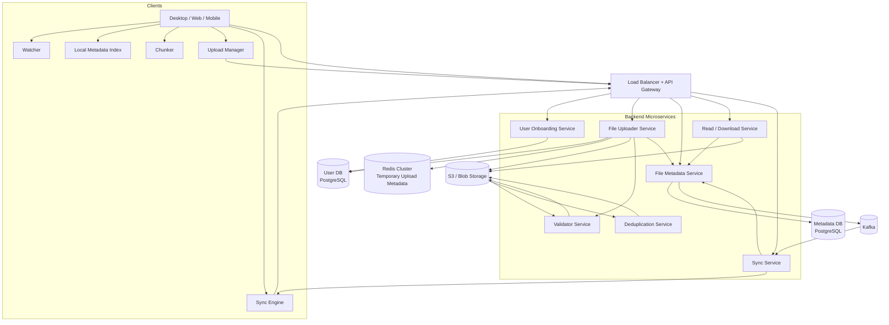
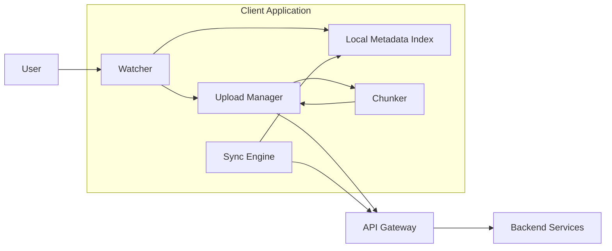
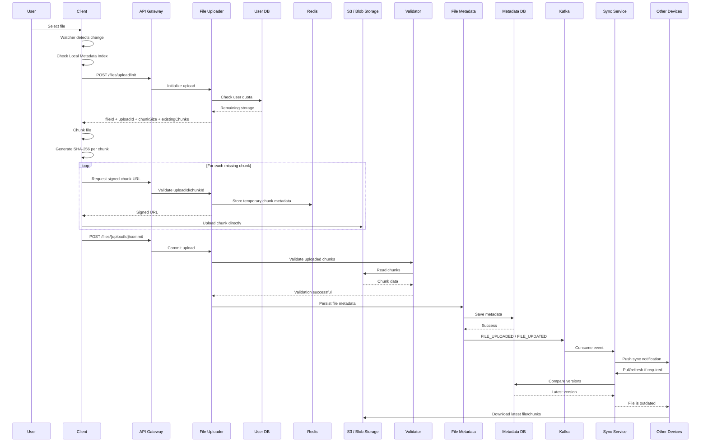

# Design Distributed Storage System — Google Drive / Dropbox

## 1. Functional Requirements

We are designing a globally distributed cloud storage platform similar to **Google Drive / Dropbox**, where users can store, download, organize, synchronize, and share files.

### 1. User Account / Onboarding

The user should be able to create an account and sign in to the application. The **User Onboarding Service** will handle signup/signin and persist user information in the User DB. The transcript uses a relational database such as PostgreSQL because user information is relational/structured data.

### 2. Upload and Download Files

Users should be able to upload files and folders of different sizes and download them whenever required.

For large files, the system must support **chunk-based and resumable uploads**, so if the connection drops during an upload, the user does not have to restart the entire upload.

The actual file bytes are stored in **Blob/Object Storage such as S3**, rather than inside the metadata database.

### 3. Automatic Synchronization

If the same account is connected to multiple devices, changes made on one device should eventually appear on the other connected devices.

For example:

```text
Laptop → uploads photo.jpg

        ↓

Cloud Storage

        ↓

Phone
Tablet
Desktop
```

The transcript uses an event-driven approach with **Kafka + Sync Service**, with eventual consistency being acceptable for synchronization.

### 4. File and Folder Sharing

Users should be able to share files and folders with other users and assign permissions such as read/write access.

Permission information is treated as metadata and stored in the metadata database.

### 5. File and Folder Organization

Users should be able to:

* Create folders
* Create subfolders
* Rename folders/files
* Delete folders/files
* Move files between folders
* View the contents of a folder

An important idea from the transcript is that a cloud folder is primarily represented through **metadata**. Creating or renaming a folder does not mean creating or renaming a physical directory in S3; the system changes the corresponding metadata representation.

### 6. Storage Quota

Each user has a storage quota.

For example:

```text
User Quota      = 15 GB
Used Storage    = 10 GB
Remaining       = 5 GB
```

If the user tries to upload a 7 GB file, the upload should be rejected because the remaining quota is insufficient.

The quota is checked during the upload-initiation stage.

# 2. Non-Functional Requirements

## 2.1 Scalability

The system should support:

```text
Millions of users
Billions of files
Huge amounts of storage
Large number of concurrent uploads/downloads
```

The scale is important because it determines architectural decisions such as whether we need a distributed/microservice architecture, how much traffic we need to handle, and how storage should be distributed.

## 2.2 High Availability

The system should prioritize **availability**, particularly for file uploading and synchronization.

If a user wants to upload a file, the service should be available to accept the request.

The transcript considers eventual consistency acceptable for synchronization because a small delay between devices is acceptable.

Therefore:

```text
File Upload / Sync
        ↓
Availability > Immediate Consistency
```

However, metadata operations require stronger consistency semantics because file names, locations, permissions, versions, etc. are authoritative system information.

> Note: The transcript's discussion of strong consistency specifically refers to metadata/document-related correctness; real-time collaborative document editing itself is explicitly out of scope for this design.

## 2.3 Large File Support

The system must support very large files, potentially several GB or more.

Therefore, a large file should not be uploaded as one enormous request.

Instead:

```text
Large File
    ↓
Chunk
Chunk
Chunk
Chunk
    ↓
Parallel Upload
```

The transcript describes fixed chunk sizes such as 4 MB, 5 MB, or 8 MB, with the backend determining the chunk size.

## 2.4 Low Latency

The system should minimize:

1. Upload latency
2. Synchronization latency

Upload latency is affected by network bandwidth, while synchronization latency should remain small through the event-driven synchronization mechanism.

## 2.5 Reliability, Durability and Security

Once a file is uploaded successfully, it should not be lost because of a server failure.

The storage layer therefore needs durable storage and redundancy so that backend failures do not result in file loss.

The transcript explicitly identifies durability, security, and zero data loss as critical requirements.

# 3. Core Entities

The primary entities identified from the requirements are:

## 3.1 User

```text
User
----
user_id
email
password
created_at
name
storage_limit
storage_used
other_metadata
```

The User DB contains user-related metadata and storage information. The transcript uses PostgreSQL/MySQL as examples for this relational data.

## 3.2 File Metadata

The file itself and its metadata are two different things.

The actual bytes go to:

```text
S3 / Blob Storage
```

while metadata goes to:

```text
Metadata DB
```

Metadata can contain:

```text
file_id
file_name
parent_folder_id
owner_id
size
type
version
created_at
updated_at
permissions
```

The transcript emphasizes that file name, size, type, owner, permissions, etc. are metadata and form a core entity of the system.

## 3.3 Files and Folders

A folder/file is represented through metadata.

For example:

```text
Root
│
├── Documents
│   ├── Resume.pdf
│   └── Notes.txt
│
└── Photos
    ├── photo1.jpg
    └── photo2.jpg
```

The important attribute for representing hierarchy is:

```text
parent_folder_id
```

Therefore, moving a file from one folder to another can be represented by changing its parent-folder metadata.

# 4. Major Backend Services

## 4.1 API Gateway + Load Balancer

All client API requests first enter through the Load Balancer/API Gateway.

Responsibilities:

* Distribute requests across backend instances
* Route requests to appropriate microservices
* Provide a common entry point
* Help scale backend services horizontally

The transcript places the Load Balancer and API Gateway between clients and the backend microservices.

## 4.2 User Onboarding Service

Responsible for:

```text
Signup
Signin
User metadata
Authentication-related operations
```

It stores user information in the User DB.

```text
Client
  ↓
API Gateway
  ↓
User Onboarding Service
  ↓
User DB
```

## 4.3 File Uploader Service

This is the main service responsible for managing file-upload operations.

It handles:

* Upload initialization
* Quota validation
* Upload session creation
* Upload ID generation
* Chunk URL generation
* Upload commit
* Coordination with Blob Storage
* Coordination with Validator
* Passing final metadata to File Metadata Service

Large file bytes do not need to flow through this service after signed URLs are generated.

## 4.4 File Metadata Service

Responsible for metadata operations such as:

```text
Create folder
Rename folder
Delete folder
Move file
Rename file
Update permissions
Store file metadata
Store version information
```

The service persists metadata in the Metadata DB.

## 4.5 Read / Download Service

Responsible for downloading files.

It first asks the metadata/permission layer:

```text
Does this user have permission?
Does this file exist?
```

If authorized, it generates a signed URL so the client can download directly from object storage.

## 4.6 Sync Service

Responsible for synchronizing changes across devices.

It consumes events from Kafka and can operate using:

```text
Push / Fan-out
Pull / Refresh
```

The transcript explicitly describes both mechanisms.

## 4.7 Validator Service

The Validator Service validates uploaded chunks after the upload is committed.

The transcript later clarifies an important optimization: **do not validate every chunk synchronously immediately after every upload**. Instead, validation can be triggered after the final commit and performed asynchronously.

## 4.8 Deduplication Service

This service can identify duplicate chunks using the chunk hash.

If two chunks have the same size and same SHA-256 hash, they can potentially refer to the same underlying stored chunk rather than storing duplicate bytes.

This helps optimize storage.

## 4.9 Other Post-Processing Services

The transcript also mentions asynchronous services such as:

```text
Virus scanning
Sanitization
Thumbnail generation
Validation
Deduplication
```

These can process objects after they reach S3/Blob Storage.

# 5. Client-Side Components

A very important part of this design is that the client itself contains several components.

## 5.1 Chunker

The Chunker splits a large file into smaller pieces.

For example:

```text
20 MB file
        ↓
5 MB + 5 MB + 5 MB + 5 MB
```

It also generates a hash for each chunk.

The transcript specifically places the Chunker inside the client application.

## 5.2 Upload Manager

The Upload Manager controls the upload process.

It:

```text
Initiates upload
Requests signed URLs
Uploads chunks
Retries failed chunks
Commits upload
```

For small files, the Chunker may not be required; the Upload Manager can directly upload them.

## 5.3 Local Metadata Index

The client maintains a local metadata index containing information about files already synchronized with the backend.

It helps determine:

```text
Which version do I have locally?
Which file is outdated?
Which chunks already exist?
```

It is also an important component for cross-device synchronization.

## 5.4 Watcher

The Watcher monitors the local filesystem/application for changes.

For example:

```text
User modifies Resume.pdf
        ↓
Watcher detects change
        ↓
Upload Manager
        ↓
Upload changed chunks
```

It can detect both newly added files and modifications to existing files.

## 5.5 Sync Engine

The Sync Engine keeps the local device synchronized with the backend.

It can:

```text
Pull latest changes
Receive push notifications
Compare versions
Download missing/outdated files
Update Local Metadata Index
```

The transcript describes the Sync Engine as the client-side component responsible for keeping local data synchronized.

# 6. API Designing

## Folder APIs

### Create Folder

```http
POST /api/v1/folders
```

Request:

```json
{
  "name": "Documents",
  "parentFolderId": "root"
}
```

This primarily creates metadata representing the folder.

### Get Folder Metadata

```http
GET /api/v1/folders/{folderId}
```

Returns metadata for the folder.

### Get Folder Contents

```http
GET /api/v1/folders/{folderId}/contents
```

Returns the files and subfolders contained inside the folder.

The transcript explicitly describes these folder endpoints and explains that folder manipulation primarily means manipulating metadata.

### Other Folder Operations

```http
PUT    /api/v1/folders/{folderId}
DELETE /api/v1/folders/{folderId}
```

These support rename/update and delete operations.

---

# 7. File Upload APIs

## Step 1 — Initialize Upload

```http
POST /api/v1/files/upload/init
```

Request:

```json
{
  "fileName": "video.mp4",
  "fileSize": 52428800,
  "parentFolderId": "root"
}
```

Response:

```json
{
  "fileId": "file_789",
  "uploadId": "upload_123",
  "chunkSize": "5MB",
  "existingChunks": []
}
```

The initialization request contains the file name, file size and parent folder. The service checks the user's available quota and returns the file ID, upload ID, chunk size and existing chunks.

---

# 8. Resume Upload API

If the network connection breaks:

```text
Chunk 1 ✓
Chunk 2 ✓
Chunk 3 ✓
Chunk 4 ✓
Chunk 5 ✓
Network disconnected
```

The client sends the previous upload ID:

```http
POST /api/v1/files/upload/init
```

```json
{
  "fileName": "video.mp4",
  "fileSize": 52428800,
  "resumeUploadId": "upload_123"
}
```

Response:

```json
{
  "fileId": "file_789",
  "uploadId": "upload_123",
  "existingChunks": [1, 2, 3, 4, 5]
}
```

The client therefore starts from chunk 6 rather than uploading chunks 1–5 again.

# 9. Generate Chunk Upload URL

```http
POST /api/v1/files/{uploadId}/chunk-url
```

Request:

```json
{
  "chunkId": 6,
  "chunkHash": "sha256_hash"
}
```

Response:

```json
{
  "signedUrl": "https://s3...."
}
```

The File Uploader Service validates the upload ID and chunk ID and then generates a pre-signed URL.

# 10. Upload Chunk

The client uses the signed URL to upload the chunk **directly to S3/Blob Storage**.

```text
Client
   │
   │ PUT chunk
   ▼
S3 / Blob Storage
```

The application servers do not need to proxy the entire large file.

The transcript recommends parallel chunk uploads, such as approximately three chunks at a time depending on available bandwidth, to reduce upload latency.

# 11. Commit Upload

```http
POST /api/v1/files/{uploadId}/commit
```

This tells the backend:

```text
All required chunks have been uploaded.
Please finalize this upload.
```

After this request, validation and metadata persistence take place.

# 12. File APIs

```http
GET    /api/v1/files/{fileId}
PUT    /api/v1/files/{fileId}
DELETE /api/v1/files/{fileId}
```

These can be used for retrieving/updating/deleting file metadata.

For download:

```http
GET /api/v1/files/{fileId}/download
```

The exact download endpoint is not explicitly shown in the transcript's API list, but the transcript explicitly describes a Read/Download Service that validates permission and generates a signed URL for downloading.

# 13. Sharing / Permission APIs

The transcript identifies permissions as metadata and includes a permission model containing:

```text
permission_id
resource_type
resource_id
user_id
role
created_at
```

Therefore, the API can conceptually be:

```http
POST   /api/v1/files/{fileId}/permissions
GET    /api/v1/files/{fileId}/permissions
PUT    /api/v1/files/{fileId}/permissions/{userId}
DELETE /api/v1/files/{fileId}/permissions/{userId}
```

The transcript does not explicitly provide these exact public endpoint names, so they should be treated as the logical API mapping of the sharing requirement rather than a verbatim transcript endpoint.

# 14. High-Level Architecture



The major architecture follows the transcript: clients communicate through the Load Balancer/API Gateway; User Onboarding handles user data; File Uploader handles uploads to Blob/S3; File Metadata Service handles metadata; and synchronization is driven through Kafka and Sync Service.

# 15. Deep-Dive Client Architecture



The client is important because chunking, upload management, local metadata tracking, watching for file changes, and synchronization are all partly handled on the client side.

# 16. Complete File Upload Flow

## Step 1 — User selects a file

The user drops a file into the application. The client first checks its **Local Metadata Index** to determine whether the file already exists locally and whether it corresponds to a previously synchronized version. This local metadata index stores information about existing files and their versions and is also important for synchronization between devices.

## Step 2 — Watcher detects the file

The Watcher component monitors changes in the local client. When a new file appears or an existing file is modified, the Watcher triggers the Upload Manager. This means the system can automatically detect changes instead of requiring the user to manually upload every modification.

## Step 3 — Upload Manager initializes the upload

The Upload Manager calls the File Uploader Service through the API Gateway using the upload-init API. It sends the file name, file size and parent folder ID. The File Uploader Service checks the user's storage quota by consulting the User DB. If the remaining storage is smaller than the file size, the upload is rejected. Otherwise, the service creates a file ID, an upload ID and determines the chunk size.

## Step 4 — Resume handling

If this is a fresh upload, there are no existing chunks. If the connection had previously failed, the client sends the previous upload ID. The backend uses this upload ID to identify the previous upload session and returns the chunks that have already been uploaded. The client then skips those chunks and continues from the missing chunk. This gives us **resumable uploads** and prevents wasting bandwidth by re-uploading already stored chunks.

## Step 5 — Chunking

The Chunker receives the chunk size from the backend and divides the large file into fixed-size chunks. For example, if the backend chooses 5 MB:

```text
20 MB File

Chunk 1 → 5 MB
Chunk 2 → 5 MB
Chunk 3 → 5 MB
Chunk 4 → 5 MB
```

The Chunker also calculates a hash such as SHA-256 for every chunk. The hash allows the backend to later verify that the uploaded chunk corresponds to the original client-side chunk.

## Step 6 — Request signed URL

The client does not send every large chunk through the File Uploader Service. Instead, the Upload Manager requests a signed URL for a particular chunk. The File Uploader Service validates the upload ID and chunk ID and generates a pre-signed URL for the object storage.

## Step 7 — Store temporary upload metadata in Redis

During signed-URL generation, the File Uploader Service stores temporary information such as:

```text
uploadId
chunkId
chunkHash
chunk bitmap
retry count
```

in a Redis cluster. This information is temporary and only needs to exist during the upload process, so the transcript uses Redis with TTL rather than repeatedly writing this temporary information to the persistent metadata database.

## Step 8 — Direct chunk upload to S3

The client uses the signed URL to upload the chunk directly to S3/Blob Storage.

```text
Client
   │
   │ PUT Chunk
   ▼
S3 / Blob Storage
```

This is one of the most important scalability decisions because the backend application servers do not have to receive and forward every byte of a huge file. The transcript also describes uploading several chunks concurrently to reduce latency.

## Step 9 — Commit

After all required chunks have been uploaded, the client sends:

```http
POST /api/v1/files/{uploadId}/commit
```

The commit tells the backend that the upload is complete and that the backend can now validate and finalize the file.

## Step 10 — Validate chunks

The Validator Service verifies the uploaded chunks against the expected information. The important optimization from the transcript is that validation should **not consume processing capacity after every individual chunk upload**. Instead, after the final commit, the Validator can asynchronously inspect the uploaded chunks in S3 and verify their hashes.

## Step 11 — Persist metadata

After successful validation, the File Uploader Service passes the collected information to the File Metadata Service. The File Metadata Service persists the permanent metadata in the Metadata DB.

The persistent metadata includes information such as:

```text
file
folder
owner
parent folder
size
version
chunk information
chunk location
checksum
permissions
```

The Redis data is temporary, whereas the Metadata DB contains the persistent representation required for future downloads, synchronization, permissions, and version management.

## Step 12 — Publish synchronization event

Once the metadata has been successfully persisted, the system publishes a synchronization event to Kafka.

For example:

```text
FILE_UPLOADED
fileId = F123
version = V2
ownerId = U100
```

Kafka decouples the upload path from synchronization and allows the Sync Service to process the change asynchronously. This introduces a small delay, which is why synchronization follows eventual consistency.

## Step 13 — Push / Fan-out synchronization

The Sync Service consumes the Kafka event and identifies the connected clients that are relevant to that user/file. It can then push the change to connected clients. The client receives information that a new version exists and can download the updated file.

## Step 14 — Pull / Refresh synchronization

Synchronization is not dependent only on push.

If a device was offline when the event occurred, when it reconnects its Sync Engine can send a pull/refresh request. The Sync Service compares the versions available locally with the latest versions in the Metadata DB. If the local version is older, the Sync Service tells the client that the file is outdated and needs to be downloaded.

Therefore:

```text
Online Device
     ↓
Push / Fan-out

Offline Device
     ↓
Reconnect
     ↓
Pull / Refresh
     ↓
Version Comparison
     ↓
Download Missing Version
```

# 17. Modified File / Incremental Upload Flow

Suppose the user originally uploaded:

```text
File Version V1

Chunk 1 → Hash A
Chunk 2 → Hash B
Chunk 3 → Hash C
Chunk 4 → Hash D
```

Later, the user modifies only the content corresponding to Chunk 3:

```text
New File

Chunk 1 → Hash A
Chunk 2 → Hash B
Chunk 3 → Hash X  ← changed
Chunk 4 → Hash D
```

The Watcher detects the modification. The client compares the new file/chunks against the information stored in its Local Metadata Index. Instead of uploading the complete file again, it identifies the chunk whose hash has changed and uploads only that changed chunk.

The backend then creates the new file/version metadata while the unchanged chunks can continue to be referenced from the existing version. The transcript describes this as an optimization where only the changed chunk receives the new version information.

This is extremely important because:

```text
10 GB file
        ↓
Only 20 MB changed
        ↓
Upload 20 MB
NOT 10 GB
```

# 18. Download Flow

When a user wants to download a file, the request first reaches the Read/Download Service.

The Download Service asks the File Metadata Service to verify:

```text
Does the file exist?
Does the user have permission?
Does the user have read access?
```

If the user is authorized, the service generates a signed URL for the object stored in S3/Blob Storage. The client then downloads the file directly from object storage rather than forcing the application server to proxy the entire file.

The flow is therefore:

```text
Client
   ↓
API Gateway
   ↓
Read / Download Service
   ↓
File Metadata Service
   ↓
Permission Check
   ↓
Generate Signed URL
   ↓
Client
   ↓
S3 / Blob Storage
```

# 19. Folder Creation Flow

Creating a folder is much simpler than uploading a file.

The client sends:

```http
POST /api/v1/folders
```

with metadata such as:

```json
{
  "name": "Documents",
  "parentFolderId": "root"
}
```

The File Metadata Service stores the folder information in the Metadata DB. No physical directory needs to be created in S3. The folder hierarchy is represented through metadata such as `folder_id` and `parent_folder_id`.

# 20. Sharing Flow

When a user shares a file or folder, the system does not need to duplicate the actual file.

Instead, it creates a permission metadata entry:

```text
Resource → File/Folder
User     → U200
Role     → READ
```

For example:

```text
File F100
   │
   ├── Ayush → OWNER
   ├── User2 → READ
   └── User3 → WRITE
```

When User2 requests a download, the Read/Download Service checks this permission metadata before generating the signed URL. Permissions are therefore part of the metadata layer rather than the actual file storage layer.

# 21. Metadata Database Schema

The transcript identifies the following major metadata structures.

### Folder

```text
Folder
------
folder_id
parent_folder_id
owner_id
name
created_at
other_metadata
```

### File

```text
File
----
file_id
parent_folder_id
owner_id
name
size_bytes
current_version_id
created_at
is_deleted
metadata
```

### File Version

```text
FileVersion
-----------
version_id
file_id
created_at
created_by
```

### File Version Chunk

```text
FileVersionChunk
----------------
version_id
chunk_id
chunk_index
```

### Chunk

```text
Chunk
-----
chunk_id
object_key
size_bytes
checksum
created_at
```

### Permission

```text
Permission
----------
permission_id
resource_type
resource_id
user_id
role
created_at
```

The transcript specifically identifies folder, file, chunk/version and permission information as the important metadata structures.

# 22. Complete End-to-End Architecture Flow



# 23. One-Line Interview Explanation

If the interviewer asks you to explain the architecture quickly, you can say:

> **"We have a client-driven distributed storage architecture where the client contains a Watcher, Local Metadata Index, Chunker, Upload Manager and Sync Engine. Requests enter through a Load Balancer/API Gateway and are routed to services such as User Onboarding, File Uploader, File Metadata, Read/Download and Sync Service. User and metadata information are stored in relational databases, while actual file chunks are stored in S3/Blob Storage. Large files are divided into fixed-size chunks and uploaded directly to object storage using pre-signed URLs, making uploads scalable and resumable. Redis stores temporary upload-session metadata, while Kafka is used to propagate file-change events to the Sync Service. Synchronization uses push/fan-out for connected devices and pull/refresh for devices that reconnect later. Metadata contains file, folder, version, chunk and permission information, while asynchronous validation and deduplication services improve reliability and storage efficiency."**

# 24. The Most Important Mental Model

The entire system can finally be remembered as:

```text
                    DISTRIBUTED STORAGE
                           │
        ┌──────────────────┼──────────────────┐
        │                  │                  │
        ▼                  ▼                  ▼
    METADATA             FILE DATA          SYNC
        │                  │                  │
        ▼                  ▼                  ▼
   PostgreSQL             S3                Kafka
        │                  │                  │
        │                  │                  ▼
        │                  │             Sync Service
        │                  │                  │
        ▼                  │                  ▼
 File/Folder/              │             Other Devices
 Version/                   │
 Permission                │
                           │
                           ▼
                      File Chunks
```

### In simple words:

**Metadata DB tells us WHAT the file is.**

```text
Name
Owner
Folder
Version
Permission
Chunk mapping
```

**S3/Blob Storage tells us WHERE the actual bytes are.**

```text
Chunk 1
Chunk 2
Chunk 3
...
```

**Kafka + Sync Service tells us WHO needs to know about a change.**

```text
Device A changes file
        ↓
Metadata updated
        ↓
Kafka event
        ↓
Sync Service
        ↓
Device B / C / D
```

**Redis temporarily remembers WHAT is happening during an upload.**

```text
Upload ID
Chunk IDs
Chunk hashes
Retry information
TTL
```

That separation is the core of the entire Google Drive/Dropbox system design.
