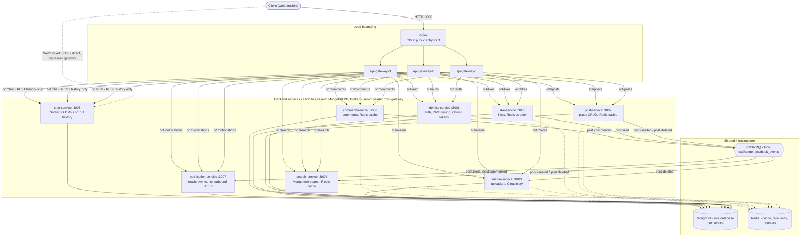

# Node.js Social Media Microservices

A social-media backend built as independently deployable microservices behind a load-balanced API gateway — auth, posts, media uploads, search, likes, comments, real-time notifications, and direct-message chat over WebSockets. Built as a learning project to demonstrate real distributed-systems patterns (event-driven decoupling, distributed rate limiting/caching, edge authentication, load balancing) rather than a toy CRUD app.

## System design



**Why this shape:**
- **Nginx + 3 gateway replicas** instead of one gateway process — no single point of failure, and Nginx's passive health checks (`max_fails`/`fail_timeout`) route around a dead replica automatically. See `nginx/nginx.conf`.
- **JWT verified once, at the edge.** The gateway is the only place that checks a JWT signature; every downstream service just trusts an `x-user-id` header the gateway attaches after verifying — cheaper than re-verifying at every hop, and downstream services never need the JWT secret at all. `chat-service` is the one deliberate exception: its live WebSocket connection bypasses the gateway entirely (Socket.IO doesn't proxy cleanly through a plain HTTP proxy), so it verifies the JWT itself on the socket handshake.
- **RabbitMQ decouples services that shouldn't know about each other.** `post-service` has no idea `search-service` or `media-service` exist — it just publishes `post.created`/`post.deleted` to a topic exchange, and whoever cares subscribes. `like-service`/`comment-service` publish `post.liked`/`post.commented` the same way, and `notification-service` is built entirely around consuming those two — it never makes an outbound HTTP call to anything.
- **Redis does three different jobs** across this system, each a different pattern worth knowing apart: response caching (post/search/comment listings, cache-aside with TTL + invalidation), distributed rate limiting (`INCR`+`EXPIRE`, shared across all 3 gateway replicas — a per-process counter would be wrong the moment you have more than one replica), and a live counter (`like-service`'s like count, an eventually-consistent `INCR`/`DECR` rather than a query on every read). Redis-backed OTPs and sessions are a different project's pattern — see `14. NodeJS-Redis-Kafka/2. Redis` — this project's auth uses JWTs + MongoDB-stored refresh tokens instead.

## Services

| Service | Port | Responsibility | Depends on |
|---|---|---|---|
| `nginx` | 3000 (public) | Load balancer / reverse proxy in front of the gateway replicas | — |
| `api-gateway` ×3 | internal only | Single entrypoint for all HTTP traffic: JWT verification, per-client rate limiting, request-ID generation, proxying to services | Redis, RabbitMQ |
| `identity-service` | 3001 | Registration, login, JWT + refresh-token issuing/rotation | MongoDB, Redis |
| `post-service` | 3002 | Post CRUD, publishes `post.created`/`post.deleted` | MongoDB, Redis, RabbitMQ |
| `media-service` | 3003 | File upload to Cloudinary, deletes media when its post is deleted | MongoDB, Redis, RabbitMQ |
| `search-service` | 3004 | Full-text post search, keeps its own index in sync via events | MongoDB, Redis, RabbitMQ |
| `like-service` | 3005 | Toggle like/unlike, publishes `post.liked` | MongoDB, Redis, RabbitMQ |
| `comment-service` | 3006 | Create/list/delete comments, publishes `post.commented` | MongoDB, Redis, RabbitMQ |
| `notification-service` | 3007 | Consumes `post.liked`/`post.commented`, stores notifications | MongoDB, RabbitMQ |
| `chat-service` | 3008 (public) | 1:1 direct messages over Socket.IO (direct connect) + REST history (via gateway) | MongoDB |

## API reference (via the gateway, `http://localhost:3000/v1/...`)

| Method | Path | Auth | Service |
|---|---|---|---|
| POST | `/v1/auth/register` | — | identity |
| POST | `/v1/auth/login` | — | identity |
| POST | `/v1/auth/refresh-token` | — | identity |
| POST | `/v1/auth/logout` | — | identity |
| GET | `/v1/posts/all-posts` | — | post |
| GET | `/v1/posts/:id` | — | post |
| POST | `/v1/posts/create-post` | ✓ | post |
| DELETE | `/v1/posts/:id` | ✓ | post |
| POST | `/v1/media/upload` | ✓ | media |
| GET | `/v1/media/get` | ✓ | media |
| GET | `/v1/search/posts?query=` | ✓ | search |
| POST | `/v1/likes/:postId` | ✓ | like (toggle) |
| GET | `/v1/likes/:postId/count` | ✓ | like |
| GET | `/v1/likes/:postId/mine` | ✓ | like |
| POST | `/v1/comments/:postId` | ✓ | comment |
| GET | `/v1/comments/:postId` | ✓ | comment |
| DELETE | `/v1/comments/:commentId` | ✓ | comment |
| GET | `/v1/notifications` | ✓ | notification |
| PATCH | `/v1/notifications/:id/read` | ✓ | notification |
| GET | `/v1/chat/conversations` | ✓ | chat |
| GET | `/v1/chat/messages/:otherUserId` | ✓ | chat |
| WS | `ws://localhost:3008` (`auth: { token }`) | ✓ | chat — **direct connection, not through the gateway** |

## Tech stack

- **Runtime**: Node.js 18, Express
- **Data**: MongoDB (Mongoose, one database per service), Redis (`ioredis`)
- **Messaging**: RabbitMQ (`amqplib`), one topic exchange (`facebook_events`)
- **Realtime**: Socket.IO (`chat-service`)
- **Auth**: JWT (`jsonwebtoken`), Argon2 password hashing
- **Gateway**: `express-http-proxy`, `express-rate-limit` + `rate-limit-redis`
- **Observability**: `winston` structured logging, request-correlation IDs propagated end-to-end via `AsyncLocalStorage`, `/health` + `/health/ready` on every service
- **Testing**: Jest (+ `supertest`, `mongodb-memory-server` where a real Mongoose hook needs exercising), mocked Redis/RabbitMQ/HTTP dependencies
- **Infra**: Docker Compose, Nginx, GitHub Actions CI (`.github/workflows/deploy.yml` — tests every service before build/deploy)

## Running it

```bash
# each service needs its own .env - copy every .env.example to .env first
docker compose up -d --build
```

`http://localhost:3000` is the entrypoint for all REST traffic. `chat-service`'s WebSocket is the one exception — connect directly to `ws://localhost:3008`.

## Running tests

Every service has its own Jest suite with mocked external dependencies (no live infra needed):

```bash
cd <service-name> && npm install && npm test
```

CI (`.github/workflows/deploy.yml`) runs this for all 9 services on every push before building/deploying.

## Known limitations

Deliberate scope boundaries, not oversights:

- **No RabbitMQ reconnect-on-drop logic.** If the broker blips, a service's publisher/consumer doesn't automatically recover without a restart.
- **`chat-service` is single-instance only.** Its live delivery is Socket.IO rooms within one process; scaling it horizontally would need a shared adapter (e.g. `@socket.io/redis-adapter`) so a message from a user on instance A reaches a recipient on instance B.
- **Chat is 1:1 only**, no group conversations.
- **Like counts are eventually consistent** — a Redis `INCR`/`DECR` counter, not a live query, so a failed write mid-toggle could in theory drift it from the real `Like` document count (a reconciliation job would fix this in production; not built here).
- **No circuit breaker on the gateway's proxy calls** — a fully dead downstream service means hanging requests rather than a fast failure.
