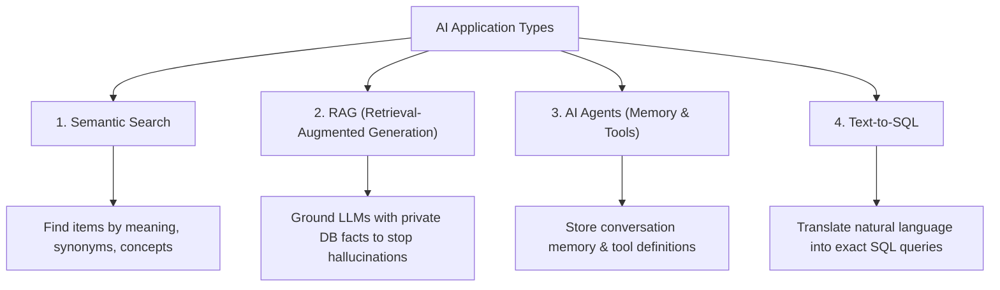

# 17. PostgreSQL with pgvector (AI Engineering Masterclass)

Welcome to **17. pgvector** — a complete guide and runnable Node.js application demonstrating how to build modern AI applications (RAG, Semantic Search, AI Agents, and Text-to-SQL) using **PostgreSQL**, **pgvector**, **pgvectorscale**, and **pgai**.

---

## 📑 Table of Contents
1. [Foundations of AI with PostgreSQL & The Rise of the AI Engineer](#1-foundations-of-ai-with-postgresql)
2. [Vector Database Concepts](#2-vector-database-concepts)
3. [The 4 Major AI Application Types](#3-the-4-major-ai-application-types)
4. [The PostgreSQL AI Extension Trifecta (pgvector, pgvectorscale, pgai)](#4-the-postgresql-ai-extension-trifecta)
5. [Vector Search Indexes: IVFFlat vs HNSW vs StreamingDiskANN](#5-vector-search-indexes-comparison)
6. [Vector Distance Operators (`<=>`, `<->`, `<#>`, `<+>`)](#6-vector-distance-operators)
7. [Running the Demo Application](#7-running-the-demo-application)

---

## 1. Foundations of AI with PostgreSQL

### The Old World vs The New World
- **Previously**: Building AI required training custom machine learning models, deploying dedicated ML infrastructure, and hiring specialized data science teams.
- **Today**: Foundational LLMs (OpenAI, Gemini, Claude, Ollama, Llama 3) and embedding models are available off-the-shelf via APIs.

### The Rise of the "AI Engineer"
An **AI Engineer** is a modern software/backend developer who builds intelligent applications by orchestrating:
1. **Foundational AI APIs** (for reasoning and embeddings).
2. **PostgreSQL with pgvector** (as the single source of truth for relational state, auth, and vector embeddings).
3. **Retrieval-Augmented Generation (RAG)** (to eliminate hallucinations and ground models with proprietary data).

You **do not need a specialized vector database** (like Pinecone or Qdrant) when PostgreSQL can natively store, index, and query vectors alongside your existing relational tables with ACID guarantees.

---

## 2. Vector Database Concepts

### What is Vector Data?
Unstructured data (PDF documents, customer chats, product catalogs, images, codebases) cannot be searched with traditional `WHERE title = '...'` or regex queries.

An **Embedding Model** compresses the semantic meaning of that data into a multi-dimensional array of floating-point numbers:
```text
"PostgreSQL microservices architecture"  ==>  [0.0124, -0.9120, 0.4431, ... 1536 floats]
```
Concepts with similar meanings reside mathematically close to each other in vector space.

### Why a Vector Database?
A vector database (or PostgreSQL + pgvector) indexes these vectors so you can perform **Approximate Nearest Neighbor (ANN)** search in sub-5ms to find the most conceptually relevant records.

---

## 3. The 4 Major AI Application Types



1. **Semantic Search**: Searches by concept and intent rather than exact keyword matches (e.g. searching *"fast web backend"* finds *"Express & Hono"*).
2. **Retrieval-Augmented Generation (RAG)**: Connects LLMs to your private database facts. When a user asks a question, PostgreSQL retrieves the top-K relevant chunks, injects them into the prompt, and the LLM responds with 100% factual accuracy.
3. **AI Agents**: Stores past agent interactions, conversation memory, and tool descriptions in vectors for real-time memory retrieval.
4. **Text-to-SQL**: Indexes database table schemas and column comments as vectors. When a user types *"Show me top 5 revenue jobs"*, pgvector finds the matching tables and helps the LLM generate valid SQL.

---

## 4. The PostgreSQL AI Extension Trifecta

| Extension | Core Role | Key Capabilities |
| :--- | :--- | :--- |
| **`pgvector`** | **Core Vector DB Functionality** | `vector(n)` type, `<=>` (Cosine), `<->` (L2), `<#>` (Inner Product), HNSW and IVFFlat indexes. |
| **`pgvectorscale`** | **Performance & Massive Scale** | Written in Rust (by Timescale). Adds **StreamingDiskANN** (NVMe SSD storage for 1B+ vectors) and **Statistical Binary Quantization (SBQ)** for 32x memory compression. Solves HNSW filtered search limitations. |
| **`pgai`** | **AI Workflow Integration** | Call OpenAI, Anthropic, Gemini, Cohere, and Ollama directly inside SQL queries and triggers. Auto-generate embeddings on `INSERT`/`UPDATE`. |

---

## 5. Vector Search Indexes Comparison

Below is the definitive index comparison for PostgreSQL vector workloads:

| Vector Index | Best For | Pros | Cons |
| :--- | :--- | :--- | :--- |
| **IVFFLAT** | Medium workloads (100k - 1M vectors) | • Low memory usage<br>• Faster than linear scan | • Updates require rebuilding the index every time<br>• Lower accuracy vs HNSW, StreamingDiskANN |
| **HNSW** *(Recommended Default)* | Real-time search on medium workloads (100k - 1M vectors) | • Good balance between speed and accuracy (>98% recall)<br>• Handles updates without rebuild<br>• Quantization (`halfvec`, PQ, BQ)<br>• Fast (parallel) index build | • Problems with filtered search accuracy<br>• High memory usage (must fit in RAM)<br>• Cost scales with RAM<br>• Scale limitations |
| **StreamingDiskANN** *(pgvectorscale)* | • Real-time search<br>• Filtered search use cases<br>• Large scale workloads (10M+ to 1B+ vectors) | • High accuracy filtered search<br>• Scales to 1B+ vectors<br>• Statistical Binary Quantization on by default<br>• Cost scales with NVMe disk and RAM (75% cheaper)<br>• Handles updates without rebuild | • Longer build times than HNSW |

---

## 6. Vector Distance Operators

```sql
-- 1. Cosine Distance (<=>) - Measures angle (Standard for Text / RAG)
SELECT * FROM documents ORDER BY embedding <=> $1 LIMIT 5;

-- 2. Euclidean / L2 Distance (<->) - Straight-line distance (Images / Spatial)
SELECT * FROM images ORDER BY embedding <-> $1 LIMIT 5;

-- 3. Inner Product (<#>) - Dot product (Normalized vectors, ultra-fast)
SELECT * FROM products ORDER BY embedding <#> $1 LIMIT 5;
```

---

## 7. Running the Demo Application

### Step 1: Start PostgreSQL with pgvector (via Docker)
```bash
docker run --name pgvector-demo -e POSTGRES_PASSWORD=postgres -e POSTGRES_DB=pgvector_demo_db -p 5432:5432 -d pgvector/pgvector:pg16
```

### Step 2: Install dependencies & run
```bash
cd "2. Backend/17. pgvector"
npm install
npm start
```
